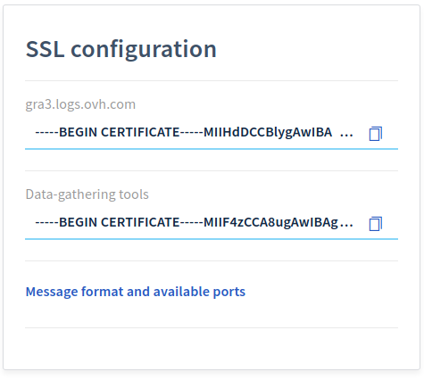
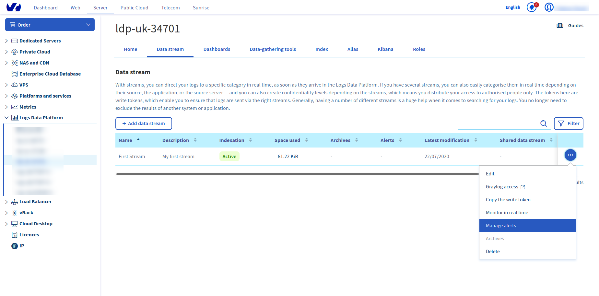
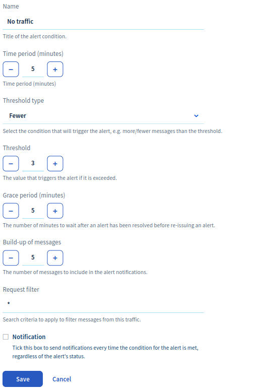
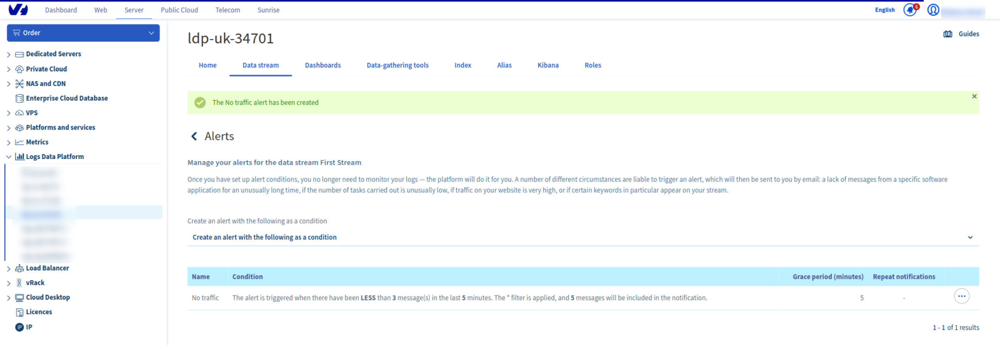
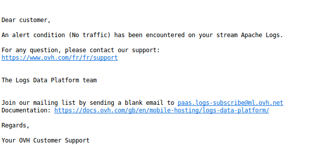
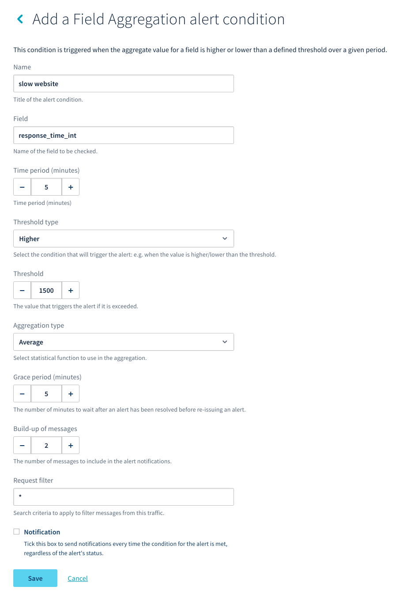
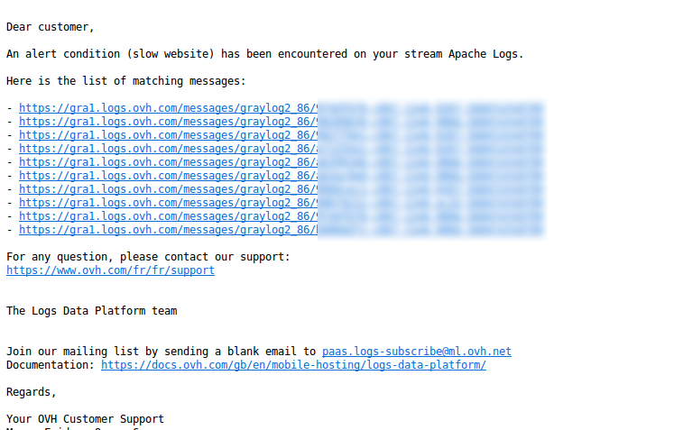
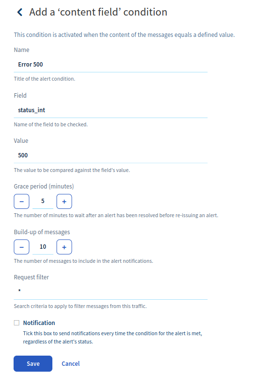
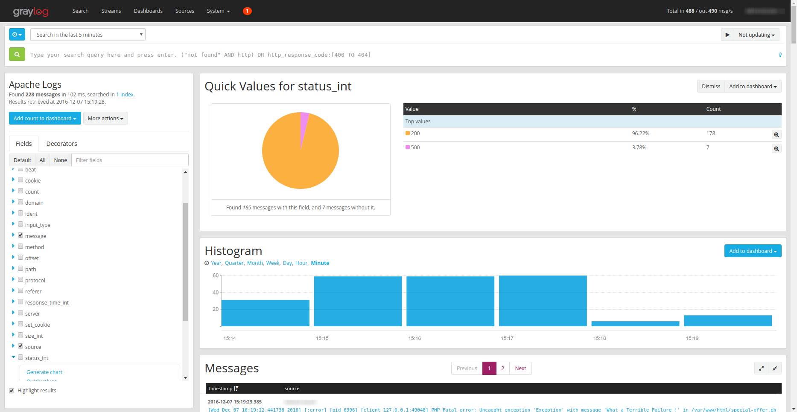

**Last updated July 28th, 2022**

## Objective

Alerting is one of the most powerful features of the Logs Data Platform. It allows you to stop worrying about your logs and be prepared for a lot of situations: When you don't have any logs of a software for an unexpected long time, when the number of tasks completed is too low, when the traffic on your website is too high, or even when one specific keyword appears in any of your information feeds: all of these use cases can trigger an alert that will send you a message immediately.

This guide will help you to configure and use alerts on a particular field. We will provide an example with Apache logs.

## Requirements

In order to understand this guide you should read the following tutorials:

- [Quick start of Logs Data Platform](/pages/platform/logs-data-platform/getting_started_quick_start).
- [Logstash collector on Logs Data Platform](/pages/platform/logs-data-platform/ingestion_logstash_dedicated_input).
- [The Filebeat tutorial](/pages/platform/logs-data-platform/ingestion_filebeat).

## Instructions

### Why configuring an alert on the Logs Data Platform ?

The Logs Data Platform provides many ways to watch your logs in real time:

- The **follow stream** functionality in the OVHcloud Manager.
- The **Live Tail** functionality in Graylog.
- The **Graylog dashboards** that refresh themselves in real-time.
- Any software that can query the Graylog or ES APIs (OpenSearch Dashboards  or Grafana for example).

The goal of the Alerting feature is to give you the freedom to not watch your logs. The Logs Data Platform can automatically inform you when something happens. There are 3 types of alert:

- **Counter alert**, like its name suggests, the counter alert can warn you when the number of logs is above or below a certain threshold.
- **Numeric value alert** is triggered when a certain numeric field has an abnormal value. The value can be the mean value, the sum, the minimum, maximum, and even the standard deviation or the median.
- **Text content alert** is the alert triggered when a field has some exact value.

For the 3 types of alert, you can configure a **grace period**. The **grace period** is a period of time during which the alert won't be triggered again so that you won't get spammed by the same alert over and over again. You can also configure how many last messages you want to include in your alert. This is useful to quickly identify the root causes of your alerts.

Don't hesitate to jump to the alert configuration part if you only need to know how to configure alerts.

### Use case&#58; Alerts for a website powered by an Apache Server

For this tutorial, we will configure the 3 alerts that we can use for a website. These 3 alerts can help you to react immediately in the case of a failure, detect unexpected problems or verify that all your websites are working correctly. But before going into the alerting feature itself, we need to configure our Apache Logging format to include all the information we need. We will also use [Filebeat](/pages/platform/logs-data-platform/ingestion_filebeat) to send our logs to Logs Data Platform.

#### Apache Server Configuration

We will use the [Filebeat Apache format](https://www.elastic.co/guide/en/beats/filebeat/current/filebeat-module-apache.html#_virtual_host){.external} to send logs, this format allow the filebeat module to parse the relevant informations. Here is a configuration file sample:

```ApacheConf
<VirtualHost *:80>

    ServerAdmin webmaster@localhost
    DocumentRoot /var/www/html

    ErrorLog ${APACHE_LOG_DIR}/error.log
    CustomLog ${APACHE_LOG_DIR}/access.log "%v %h %l %u %t \"%r\" %>s %b \"%{Referer}i\" \"%{User-Agent}i\""

</VirtualHost>
```

The configuration is inspired by the one you can find in [this tutorial](/pages/platform/logs-data-platform/ingestion_apache).

#### Filebeat configuration

The Filebeat configuration will enable the apache module and allow you to send your logs directly to Logs Data Platform.

```yaml
#=========================== Filebeat inputs =============================

filebeat.inputs:

# Each - is an input. Most options can be set at the input level, so
# you can use different inputs for various configurations.
# Below are the input specific configurations.

- type: log

  # Change to true to enable this input configuration.
  enabled: false

  # Paths that should be crawled and fetched. Glob based paths.
  paths:
    - /var/log/*.log


#============================= Filebeat modules ===============================

filebeat.config.modules:
  # Glob pattern for configuration loading
  path: ${path.config}/modules.d/*.yml

  # Set to true to enable config reloading
  reload.enabled: false

#----------------------------- Logstash output --------------------------------
output.logstash:
  # The Logstash hosts
  hosts: ["<your-cluster>.logs.ovh.com:5044"]

  ssl.enabled: true

  # Optional SSL. By default is off.
  # List of root certificates for HTTPS server verifications
  ssl.certificate_authorities: ["/etc/ssl/certs/ldp.pem"]
```

Fill the value of **/etc/ssl/certs/ldp.pem** with the "Data-gathering tools" certificate you will find in the **Home** page of your service.

{.thumbnail}

Ensure to enable [Apache support on Filebeat](https://www.elastic.co/guide/en/beats/filebeat/7.x/filebeat-module-apache.html#_virtual_host){.external} by running:

```shell-session
$ ldp@ubuntu:~$ sudo filebeat modules enable apache
```

It will generate a new module file: **/etc/filebeat/modules.d/apache.yml**, please change it to include all your apache2 access/error path files:

```yaml hl_lines="8 16"
- module: apache
  # Access logs
  access:
    enabled: true

    # Set custom paths for the log files. If left empty,
    # Filebeat will choose the paths depending on your OS.
    var.paths: ["/var/log/apache2/access.log*","/var/log/apache2/ssl_access.log*"]

  # Error logs
  error:
    enabled: true

    # Set custom paths for the log files. If left empty,
    # Filebeat will choose the paths depending on your OS.
    var.paths: ["/var/apache2/httpd/error_log*","/var/log/apache2/ssl_error_log*"]
```

Launch Filebeat

```shell-session
$ ldp@ubuntu:~$ sudo systemctl restart filebeat.service
```

or

```shell-session
$ ldp@ubuntu:~$ sudo /etc/init.d/filebeat restart
```

### Configuring a Message Count alert condition

For this alert we will tackle the following question: How to get alerted when my website is not working anymore?

One of the signs of a non-working website on a dedicated server is the number of access logs from the website. Except in special cases like maintenance, a website should have a steady number of visits during a day. If you want to configure an alert when no traffic is detected, you can for example configure a counter alert on the number of logs.

For this, go to the stream page and use the menu at the right to navigate to the **Manage alerts** menu.

{.thumbnail}

On this interface, select **Message count** in the `Create an alert`{.action} drop box. Configuring alerts is as easy as filling in the terms describing the behavior of your alerts. For example you can do the following:

Trigger an alert named **No Traffic** when there are less than **3** messages in the last **5** minutes and then wait at  least **5** minutes before triggering a new alert (grace period).

{.thumbnail}

The sentence above contains the terms that you have to use to create your alerts. Click on `Save`{.action} and your alert will be up and running immediately.

{.thumbnail}

You can remove the alert by clicking on the `Delete`{.action} button.

As soon as the alert is fired you will receive a mail, detailing the alert condition that triggered the alert.

{.thumbnail}

### Configuring an Field Aggregation alert condition

A slow website is a poor experience for your users and can make you lose customers. There are many possible causes for a slowdown : too many connections, a misbehaving web application or an network problem. Fortunately, your Apache logs give you the response time of your server that you can use to trigger an alert when your website is too slow.

To configure an alert based on your website's response time, Select the **Field aggregation** condition under the `Create an alert`{.action} drop box on the Alerting page. As with the Counter Alert, you have to fill the different fields to create your alert:

{.thumbnail}

Here, we have configured an alert to be sent when the minimum value of **response_time_int**  is higher than **1500** in the **last 5 minutes**. That means an alert will be triggered every time you have a web request that took more than 1500 milliseconds (1.5 seconds) to complete. The triggered alert will send you an email similar to the previous one, with a link to the last message included so that you can directly see what pages are too slow.

{.thumbnail}

### Configuring a Field Content alert condition

For this alert, we want to be alerted when there is any error 500 on our website. The **Field content** is the one that you must use when you want some value to be detected in your field. This alert type is located under the Text Content tab in the alerting panel.

Like the previous alert, you have to describe your alert to configure it. Here, the sentence states that the alert must be triggered when the field **status_int** is set to **500**.

{.thumbnail}

You will then receive an email with the messages included. You can then directly navigate to your Graylog stream for further investigations:

{.thumbnail}

## Go further

- Getting Started: [Quick Start](/pages/platform/logs-data-platform/getting_started_quick_start)
- Documentation: [Guides](https://docs.ovh.com/ca/en/logs-data-platform/)
- Community hub: [https://community.ovh.com](https://community.ovh.com/en/c/Platform/data-platforms){.external}
- Create an account: [Try it!](https://www.ovh.com/fr/order/express/#/express/review?products=~(~(planCode~'logs-account~productId~'logs))){.external}
