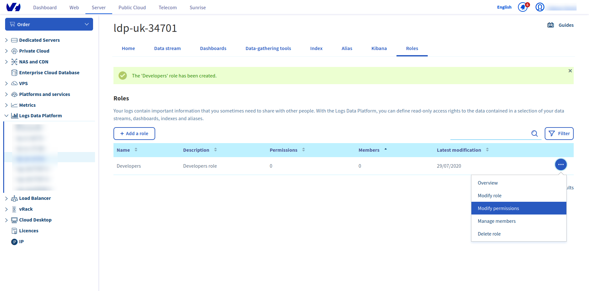
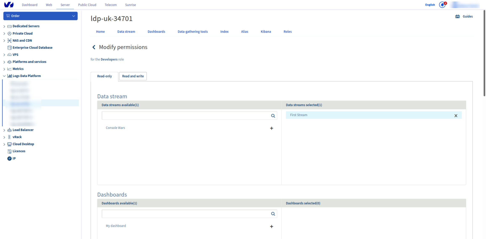

**Last updated July 28th, 2022**

## Overview

Logs policies are often decisions taken by an entire team, not individuals. Collaboration remains an utmost priority for Logs Data Platform, following this strategy it shall enable everyone share data in a easy and secure manner.
Log policies also affect several teams regarding access rights, for instance the Product managers can access some data but be denied to access security logs. That's why we decided to provide a [Role Based Access Control](https://en.wikipedia.org/wiki/Role-based_access_control){.external} to users to configure access rights. This document will expose you how you can use this system to configure access rights.

## Creating a Role

Head to the **Roles** pages on the manager and create a role with its name and its description.

{.thumbnail}

Once created you will be able to configure the role details: the permissions and the members.

## Managing Permissions

Click on the `...`{.action} button on the right to display the menu and head to manage permissions

{.thumbnail}

On the permission page, you will see two tabs **Read-Only** and **Read-Write**.

Some items can be shared in read-only whereas others can be shared with a write (or modification) right.

|Items|Read-Only|Read-Write|
|---|---|---|
|Stream|Yes|No|
|Dashboard|Yes|Yes|
|Index|Yes|Yes|
|Alias|Yes|No|
|OpenSearch Dashboards|Yes|Yes|

- **Data Stream**: Graylog Data Streams can only be shared **read-only** since logs are fully immutable.
- **Dashboards**: Graylog Dashboards can be shared **read-only or read-write**. With the read-write access, the users in the role can add, modify and remove widgets of a dashboard.
- **Index **: OpenSearch indices can be shared **read-only or read-write**. With the read-write access, users in the role can add, modify and delete documents in the index. They can also alter the mapping.
- **Aliases**: OpenSearch Aliases are **read-only**. They can only be used to read the data attached to them.
- **OpenSearch Dashboards**: OpenSearch Dashboards can be shared **read-only or read-write**. If OpenSearch Dashboards is read-only, users have access to the OpenSearch Dashboards but cannot modify it. If OpenSearch Dashboards is read-write, they can modify the dashboards or the visualizations or any other OpenSearch Dashboards feature or setting.

> [!primary]
> Note that to give access to data (index or aliases) explored through OpenSearch Dashboards to a user, you need to give at least **read** rights to **both** the instance and to the data explored.

Select the items you want to share in the role and they will switch from the **avalaible** column to the **selected** column. Go back to the **roles** page to manage the users in the defined role.

{.thumbnail}

## Managing members

To manage the members of a role, use the same `...`{.action} menu to navigate to the **Manage members** page. Click on `Add a member`{.action} to add a new member for this role.
 In the username box you must add a **Logs Data Platform username**. The ldp username can be found in the **Home** panel of your manager int the **General** section. Any person who have a Logs Data Platform service can be added to the role even if their primary cluster is different from yours.

Once a member has been added, he will see the relevant page the item that have been shared to him with an indication on the **Shared** column. The available actions will be displayed to him in the `...`{.action} menu.

{.thumbnail}

A user can access the shared items with his usual credentials whatever the cluster is. If one has access to items on another cluster, it shall be possible to create tokens for this new cluster access. As a reminder, creating an account on Logs Data Platform is free, any OVHcloud nic-handle can create one or several accounts and they don't have to pay for data that have been shared to them.

## Using API

Role management can be automated by using the [OVHcloud API](https://api.ovh.com/console/#/dbaas/logs){.external}.

Here are a few exemples of the role API calls you can use:

### Listing available services

> [!api]
>
> @api {GET} /dbaas/logs
>

### Returning the list of roles associated with the service

> [!api]
>
> @api {GET} /dbaas/logs/{serviceName}/role
>

**Parameters:**

- `serviceName`: The internal ID of your Logs Data Platform service (string)

### Returning the specified role

> [!api]
>
> @api {GET} /dbaas/logs/{serviceName}/role/{roleId}
>

**Parameters:**

- `serviceName`: The internal ID of your Logs Data Platform service (string)
- `roleId`: UUID of your role (string)

### Granting a given LDP user

> [!api]
>
> @api {POST} /dbaas/logs/{serviceName}/role/{roleId}/member
>

**Parameters:**

- `serviceName`: The internal ID of your Logs Data Platform service (string)
- `roleId`: UUID of your role (string)
- `RoleMemberCreation`: A JSON object containing the field {username} (string), the username of the member and a {note}, the description of this member

### Allowing access on a given alias

> [!api]
>
> @api {POST} /dbaas/logs/{serviceName}/role/{roleId}/permissions/alias
>

**Parameters:**

- `serviceName`: The internal ID of your Logs Data Platform service (string)
- `roleId`: UUID of your role (string)

**RequestBody:**

- `RolePermissionAliasCreation`: A JSON object containing the field {aliasId} (string), the UUID of the alias you want to share.

Don't hesitate to [explore the API](https://api.ovh.com/console/#/dbaas/logs){.external}, and try it with the provided console.

## Go further

- Getting Started: [Quick Start](/pages/platform/logs-data-platform/getting_started_quick_start)
- Documentation: [Guides](https://docs.ovh.com/it/logs-data-platform/)
- Community hub: [https://community.ovh.com](https://community.ovh.com/en/c/Platform/data-platforms){.external}
- Create an account: [Try it!](https://www.ovh.com/fr/order/express/#/express/review?products=~(~(planCode~'logs-account~productId~'logs))){.external}
