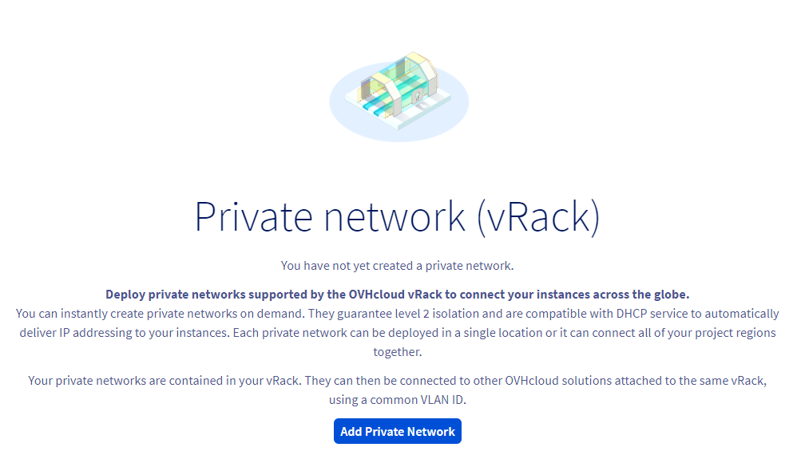
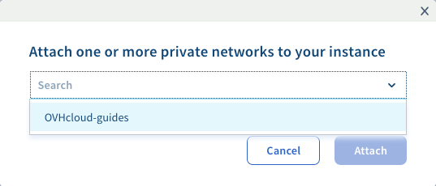
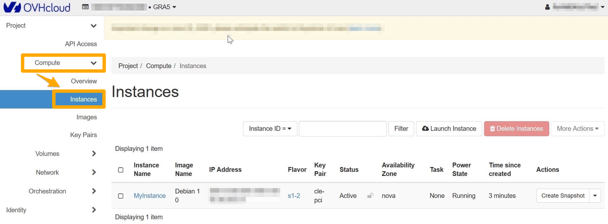
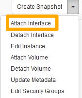

**Last updated 3rd March 2023**

## Objective

The OVHcloud [vRack](https://www.ovh.com/asia/solutions/vrack/) is a private network solution that enables our customers to route traffic between OVHcloud dedicated servers as well as other OVHcloud services. At the same time, it allows you to add [Public Cloud instances](https://www.ovhcloud.com/asia/public-cloud/) to your private network to create an infrastructure of physical and virtual resources.

**This guide explains how to configure Public Cloud instances within your vRack.**

## Requirements

- A [Public Cloud project](https://www.ovhcloud.com/asia/public-cloud/) in your OVHcloud account
- Access to the [OVHcloud Control Panel](https://ca.ovh.com/auth/?action=gotomanager&from=https://www.ovh.com/asia/&ovhSubsidiary=asia){.external}
- An [OpenStack user](https://docs.ovh.com/asia/en/public-cloud/creation-and-deletion-of-openstack-user/) (optional)
- Basic networking knowledge

## Interfaces

Creating a vRack or adding an instance into the network can be done using the OVHcloud Control Panel, the OVHcloud APIv6, the OpenStack API, the Horizon interface or Terraform.

Depending on your technical profile and needs, it is mostly up to you which interface or method to use. For each option, the guide instructions below describe the necessary steps.

**To begin with, the following provides a brief description of the possible actions according to the chosen method/interface.**

### OVHcloud Control Panel

The [OVHcloud Control Panel](https://ca.ovh.com/auth/?action=gotomanager&from=https://www.ovh.com/asia/&ovhSubsidiary=asia) is a fully visual interface, ideally suited for managing only one VLAN. You will not be able to customise the private IP range, which will be in 10.x.x.x/16.

The VLAN will be deployed by default to all zones. You will only have the option of activating the gateways or not.

You can also manage billing for your services in the OVHcloud Control Panel.

### Horizon

The [Horizon](https://horizon.cloud.ovh.net/auth/login/) interface (independent from OVHcloud) is the original implementation of the OpenStack dashboard, which provides a web user interface to OpenStack services, including Nova, Swift, Keystone, etc.

This multifunctional, technical interface allows you to manage almost all OpenStack actions. It is one of the necessary interfaces if you need to manage more than two VLANS, add private network interfaces to your instances, manage custom images, etc.

Please refer to [this guide](https://docs.ovh.com/asia/en/public-cloud/horizon/) to familiarise yourself with Horizon.

> [!primary]
> Horizon functions zone-specific, therefore you need to remember to choose your logical (geographic) work zone at the top left of your interface (GRA5, SBG3, BHS1, etc.).
>

### OVHcloud APIv6

Every action you take in your OVHcloud Control Panel can be called with the [OVHcloud APIv6](https://ca.api.ovh.com/). It even offers more possibilities than the graphical interface.

The API interface is less visual than the OVHcloud Control Panel but will allow you to perform a large number of actions. You can manage and customise your VLAN, add interfaces to your instances, or create highly customised servers.

You can simply access it from [our web page](https://ca.api.ovh.com/) but also use it to create your PHP or Python scripts. This way, you can freely automate basic tasks with scripts, optimise your own functions and much more.

You may need to retrieve various information before using some API calls because a specific input is required.

Please refer to [this guide](https://docs.ovh.com/asia/en/api/first-steps-with-ovh-api/) to get started with the OVHcloud APIv6.

### OpenStack API

Public Cloud services can be adminstrated using Linux or Windows command lines after downloading and installing OpenStack tools.

This method requires a good knowledge of Linux or Windows to take advantage of it, but it allows you to leverage all the power of OpenStack.

Depending on the layer you want to manage, you will need to use the Nova (compute), Neutron (network), Glance (image) or Swift (object storage) client. The latest addition to this assortment, the OpenStack client, makes it possible to manage almost all OpenStack layers directly.

With the OpenStack API, you can also easily automate this management through your scripts.

To know more about the usage of the OpenStack API, please consult these guides:

- [Preparing an environment for using the OpenStack API](https://docs.ovh.com/asia/en/public-cloud/prepare_the_environment_for_using_the_openstack_api/)
- [Setting OpenStack environment variables](https://docs.ovh.com/asia/en/public-cloud/set-openstack-environment-variables/)

You will then be able to use the APIs dedicated to OpenStack as needed:

- Nova (compute)
- Glance (image)
- Cinder (image)
- Neutron (network)

> [!primary]
> In some cases, it will be easier to use the OpenStack APIs and in others, Nova, Neutron, etc.
>
> Moreover, some features may be missing from the OpenStack API depending on the version of your client and operating system.
> For the purpose of making this guide more accessible, it presents the simplest and most intuitive options.
> You may consult the [official OpenStack documentation](https://docs.openstack.org/){.external} if you wish to go further in learning about its use.
>

### Terraform

Terraform can also be used to manage OVHcloud infrastructures.

For that you need to cherry-pick the correct terraform provider & resource. Find more information in our guide on [using Terraform with OVHcloud](https://docs.ovh.com/asia/en/api/terraform-at-ovhcloud/).

## Instructions

### Step 1: Activating and managing a vRack <a name="activation"></a>

Using the vRack itself is free of charge and it can be delivered within a few minutes. However, to create a vRack service, it is necessary to generate and validate an order form first.

Once the service is active, you will find it in your Control Panel in the `Bare Metal Cloud`{.action} section, labelled "pn-xxxxxx".

#### In the OVHcloud Control Panel

Log in to the [OVHcloud Control Panel](https://ca.ovh.com/auth/?action=gotomanager&from=https://www.ovh.com/asia/&ovhSubsidiary=asia) and open your `Public Cloud`{.action} project.

Click on `Private Network`{.action} in left-hand navigation bar.

{.thumbnail}

Click on the button `To get started, create a vRack`{.action}. You will then have to choose to create a new vRack or to use an existing vRack. In our example, we will create a new vRack. Once you have made your choice, click `Create`{.action}.

{.thumbnail}

To continue the configuration of your vRack in the OVHcloud Control Panel, skip to the section [Creating a VLAN in the OVHcloud Control Panel](./#creating-a-vlan-in-the-ovhcloud-control-panel) of this guide.

#### With the OVHcloud APIv6

To activate and manage a vRack using the OVHcloud APIv6, please refer to [this section](https://docs.ovh.com/asia/en/publiccloud/network-services/public-cloud-vrack-apiv6/#step-1-activating-and-managing-a-vrack) of the corresponding guide.

### Step 2: Creating a private network in the vRack

It is necessary to create a private network so that the connected instances can communicate with each other.

With the Public Cloud service, you can create up to 4,000 VLANs within one vRack. This means that you can use each private IP address up to 4,000 times.
Thus, for example, 192.168.0.10 of VLAN 2 is different from IP 192.168.0.10 of VLAN 42.
This can be useful in order to segment your vRack between multiple virtual networks.

In the OVHcloud Control Panel, you will be able to assign the VLAN of your choice, but you will not be able to customise the IP range. The vRack will be active in all zones.

Using the OVHcloud APIv6, you can customise all settings: IP range (10.0.0.0/16 for example), deployment zone, DHCP, Gateway, etc.

> [!primary]
> On dedicated servers, you are using VLAN 0 by default. The OpenStack infrastructure requires to specify your VLAN ID directly at the infrastructure level.
>
> Unlike dedicated servers, there is no need to tag a VLAN directly on a Public Cloud instance.
>
> To learn more about this topic, please refer to the guide [Creating multiple vLANs in a vRack](https://docs.ovh.com/asia/en/dedicated/multiple-vlans/)

> [!warning]
> vRack is managed at the OVHcloud infrastructure level, meaning you can only administrate it in the OVHcloud Control Panel and the OVHcloud APIv6.
>
> Because OpenStack is not located at the same level, you will not be able to customise VLANs through the Horizon interface or OpenStack APIs.
>

#### Creating a private network in the OVHcloud Control Panel

Once a vRack exists, click on `Private Network`{.action} in the left-hand menu under **Network**.

{.thumbnail}

Click on the button `Add Private Network`{.action}. The following page allows you to customise multiple settings.

In step 1, select the region in which you want the private network to be located.

{.thumbnail}

In the next step, a number of options are presented to you:

{.thumbnail}

In the **Private Network Name** field, set a name for your private network.

**Create a Gateway and connect to the private network**

Select this option if you intend to create instances with a private network only. For more information, please consult the following guides: [Creating a private network with Gateway](https://docs.ovh.com/asia/en/publiccloud/network-services/creating-private-network-with-gateway/) and [Creating and connecting to your first Public Cloud instance](https://docs.ovh.com/asia/en/public-cloud/public-cloud-first-steps/#step-3-creating-an-instance).

> [!warning]
> If the option is greyed out, it means the region selected does not support it. For more information, please refer to our [regions availability](https://www.ovhcloud.com/asia/public-cloud/regions-availability/) page. 
> 

**Layer 2 network options**

If you tick the `Set a VLAN ID` box, you will need to choose a VLAN ID number between 2 and 4,000.

If you do not tick the box, the system will assign a random VLAN ID number.

If you wish to set the VLAN ID number to 0, you will need to go through the [OVHcloud APIv6](#vlansetup).

Please note that if you have an existing private network with VLAN ID 0, this option will be ticked by default and greyed out.

In case you need to be able to communicate with dedicated servers in this VLAN, please consult the guide [Creating multiple vLANs in a vRack](https://docs.ovh.com/asia/en/dedicated/multiple-vlans/).

**DHCP address distribution options**

The default DHCP range is 10.0.0.0/16. To change this IP range, you will need to configure it through the OVHcloud APIv6.

Once done, click on `Create`{.action} to start the process.

> [!primary]
> Creating the private network may take several minutes.
>

#### Creating a private network with the OVHcloud APIv6 <a name="vlansetup"></a>

To create a private network using the OVHcloud APIv6, please refer to [this section](https://docs.ovh.com/asia/en/publiccloud/network-services/public-cloud-vrack-apiv6/#step-3-creating-a-vlan-in-the-vrack) of the corresponding guide.

#### Creating a private network with the OpenStack CLI

In order to create the same private network, we need to create 2 OpenStack objects : network and subnet.

In the following example we specify the `VLAN_ID` to which we want the network to be part of through `--provider-network-type` and `--provider-segment`.

You can remove those parameters. In that case, an available `VLAN_ID` will be used.

```bash 
openstack network create --provider-network-type vrack --provider-segment 42 OS_CLI_private_network
openstack subnet create --dhcp --network OS_CLI_private_network OS_CLI_subnet --subnet-range 10.0.0.0/16
```

#### Creating a private network with Terraform

In Terraform, you will need to use the openstack provider. You can download an example of a complete terraform script in [this repository](https://github.com/yomovh/tf-at-ovhcloud/tree/main/private_network).

The OVHcloud specific part for vRack integration is the `value_specs` parameter.

```hcl
resource "openstack_networking_network_v2" "tf_network" {
  name = "tf_network"
  admin_state_up = "true"
  value_specs = {
    "provider:network_type"    = "vrack"
    "provider:segmentation_id" = var.vlan_id
  }
}
resource "openstack_networking_subnet_v2" "tf_subnet"{
  name       = "tf_subnet"
  network_id = openstack_networking_network_v2.tf_network.id
  cidr       = "10.0.0.0/16"
  enable_dhcp       = true
}
```

### Step 3: Integrating an instance into vRack <a name="instance-integration"></a>

There are two possible scenarios:

- The instance to be integrated does not exist yet.
- An existing instance needs to be added to the vRack.

#### In case of a new instance

##### **In the OVHcloud Control Panel**

If you need assistance, follow this guide first: [Creating an instance in the OVHcloud Control Panel](https://docs.ovh.com/asia/en/public-cloud/public-cloud-first-steps/#create-instance). When creating an instance, you can choose, in Step 5, a network mode, followed by a private network to integrate your instance into. 

{.thumbnail}

> [!warning]
> You will be able to connect your instance to **only one** vRack from the OVHcloud Control Panel.
> To add multiple interfaces, you will need to go through the OpenStack or Horizon APIs.
>

##### **With the OVHcloud APIv6**

Please refer to [this section](https://docs.ovh.com/asia/en/publiccloud/network-services/public-cloud-vrack-apiv6/#step-4-integrating-an-instance-into-the-vrack) of the corresponding guide.

##### **With the OpenStack API**

To use OpenStack APIs, if you have not already done so, consider preparing your work environment as described in the [first part of this guide](./#openstack-api).

The following steps are necessary to create an instance directly in the vRack.

###### Retrieving the required information

Public and private networks:

```bash
openstack network list
 
+--------------------------------------+------------+-------------------------------------+
| ID                                   | Name       | Subnets                             |
+--------------------------------------+------------+-------------------------------------+
| 12345678-90ab-cdef-xxxx-xxxxxxxxxxxx | MyVLAN-42  | xxxxxxxx-yyyy-xxxx-yyyy-xxxxxxxxxxxx|
| 34567890-12ab-cdef-xxxx-xxxxxxxxxxxx | Ext-Net    | zzzzzzzz-yyyy-xxxx-yyyy-xxxxxxxxxxxx|
| 67890123-4abc-ef12-xxxx-xxxxxxxxxxxx | MyVLAN_0   | yyyyyyyy-xxxx-xxxx-yyyy-xxxxxxxxxxxx|
+--------------------------------------+------------+-------------------------------------+
```

or

```bash
nova net-list
 
+--------------------------------------+------------+------+
| ID                                   | Label      | CIDR |
+--------------------------------------+------------+------+
| 12345678-90ab-cdef-xxxx-xxxxxxxxxxxx | MyVLAN-42  | None |
| 34567890-12ab-cdef-xxxx-xxxxxxxxxxxx | Ext-Net    | None |
| 67890123-4abc-ef12-xxxx-xxxxxxxxxxxx | MyVLAN_0   | None |
+--------------------------------------+------------+------+
```

> [!primary]
> You will need to note the network IDs of interest:
><br> - Ext-Net for a public IP address
><br> - The VLAN(s) required for your configuration
>

Also, note the information explicated in [this guide](https://docs.ovh.com/asia/en/public-cloud/starting-with-nova-api/):

- ID or name of the OpenStack SSH key
- ID of the instance type (flavor)
- ID of the desired image (operating system, snapshot, etc.)

###### Deploying the instance

With the previously retrieved items, an instance can be created, including it directly in the vRack:

```bash
nova boot --key-name SSHKEY --flavor [ID-flavor] --image [ID-Image] --nic net-id=[ID-Network 1] --nic net-id=[ID-Network 2] [instance name]

Example:
nova boot --key-name my-ssh-key --flavor xxxxxx-xxxx-xxxx-xxxx-xxxxxxxxxxxx --image yyyy-yyyy-yyyy-yyyy-yyyyyyyyyyyy --nic net-id=[id_Ext-Net] --nic net-id=[id_VLAN] NameOfInstance

+--------------------------------------+------------------------------------------------------+
| Property                             | Value                                                |
+--------------------------------------+------------------------------------------------------+
| OS-DCF:diskConfig                    | MANUAL                                               |
| OS-EXT-AZ:availability_zone          |                                                      |
| OS-EXT-STS:power_state               | 0                                                    |
| OS-EXT-STS:task_state                | scheduling                                           |
| OS-EXT-STS:vm_state                  | building                                             |
| OS-SRV-USG:launched_at               | -                                                    |
| OS-SRV-USG:terminated_at             | -                                                    |
| accessIPv4                           |                                                      |
| accessIPv6                           |                                                      |
| adminPass                            | xxxxxxxxxxxx                                         |
| config_drive                         |                                                      |
| created                              | YYYY-MM-DDTHH:MM:SSZ                                 |
| flavor                               | [Flavor type] (xxxxxx-xxxx-xxxx-xxxx-xxxxxxxxxxxx)   |
| hostId                               |                                                      |
| id                                   | xxxxxx-xxxx-xxxx-xxxx-xxxxxxxxxxxx                   |
| image                                | [Image type] (xxxxxx-xxxx-xxxx-xxxx-xxxxxxxxxxxx)    |
| key_name                             | [Name of key]                                        |
| metadata                             | {}                                                   |
| name                                 | [Name of instance]                                   |
| os-extended-volumes:volumes_attached | []                                                   |
| progress                             | 0                                                    |
| security_groups                      | default                                              |
| status                               | BUILD                                                |
| tenant_id                            | zzzzzzzzzzzzzzzzzzzzzzzzzzzzzzzz                     |
| updated                              | YYYY-MM-DDTHH:MM:SSZ                                 |
| user_id                              | zzzzzzzzzzzzzzzzzzzzzzzzzzzzzzzz                     |
+--------------------------------------+------------------------------------------------------+
```
or

```bash
openstack server create --key-name SSHKEY --flavor [ID-flavor] --image [ID-Image] --nic net-id=[ID-Network 1] --nic net-id=[ID-Network 2] [instance name]

Ex :
openstack server create --key-name my-ssh-key --flavor xxxxxx-xxxx-xxxx-xxxx-xxxxxxxxxxxx --image yyyy-yyyy-yyyy-yyyy-yyyyyyyyyyyy --nic net-id=[id_Ext-Net] --nic net-id=[id_VLAN] NameOfInstance

+--------------------------------------+------------------------------------------------------+
| Property                             | Value                                                |
+--------------------------------------+------------------------------------------------------+
| OS-DCF:diskConfig                    | MANUAL                                               |
| OS-EXT-AZ:availability_zone          |                                                      |
| OS-EXT-STS:power_state               | 0                                                    |
| OS-EXT-STS:task_state                | scheduling                                           |
| OS-EXT-STS:vm_state                  | building                                             |
| OS-SRV-USG:launched_at               | -                                                    |
| OS-SRV-USG:terminated_at             | -                                                    |
| accessIPv4                           |                                                      |
| accessIPv6                           |                                                      |
| adminPass                            | xxxxxxxxxxxx                                         |
| config_drive                         |                                                      |
| created                              | YYYY-MM-DDTHH:MM:SSZ                                 |
| flavor                               | [Flavor type] (xxxxxx-xxxx-xxxx-xxxx-xxxxxxxxxxxx)   |
| hostId                               |                                                      |
| id                                   | xxxxxx-xxxx-xxxx-xxxx-xxxxxxxxxxxx                   |
| image                                | [Image type] (xxxxxx-xxxx-xxxx-xxxx-xxxxxxxxxxxx)    |
| key_name                             | [Name of key]                                        |
| metadata                             | {}                                                   |
| name                                 | [Name of instance]                                   |
| os-extended-volumes:volumes_attached | []                                                   |
| progress                             | 0                                                    |
| security_groups                      | default                                              |
| status                               | BUILD                                                |
| tenant_id                            | zzzzzzzzzzzzzzzzzzzzzzzzzzzzzzzz                     |
| updated                              | YYYY-MM-DDTHH:MM:SSZ                                 |
| user_id                              | zzzzzzzzzzzzzzzzzzzzzzzzzzzzzzzz                     |
+--------------------------------------+------------------------------------------------------+
```

You can set the IP address of the instance of your vRack interface at the OpenStack level.

To do this, you can add a single argument to the function "--nic":

`--nic net-id=[ID-Network],v4-fixed-ip=[IP_static_vRack]`

Example:

`--nic net-id=[ID-vRack],v4-fixed-ip=192.168.0.42`

###### Verifying the instance

After a few moments you can check the list of existing instances to find the server you created:

```bash
openstack server list
+--------------------------------------+---------------------+--------+--------------------------------------------------+--------------------+
| ID                                   |       Name          | Status | Networks                                         |     Image Name     |
+--------------------------------------+---------------------+--------+--------------------------------------------------+--------------------+
| xxxxxx-xxxx-xxxx-xxxx-xxxxxxxxxxxxxx | [Name of instance] | ACTIVE | Ext-Net=[IP_V4], [IP_V6]; MyVrack=[IP_V4_vRack] | [Name-of-instance]|
+--------------------------------------+---------------------+--------+--------------------------------------------------+--------------------+
```

```bash
nova list
+--------------------------------------+--------------------+--------+------------+-------------+--------------------------------------------------+
| ID                                   | Name               | Status | Task State | Power State | Networks                                         |
+--------------------------------------+--------------------+--------+------------+-------------+--------------------------------------------------+
| xxxxxx-xxxx-xxxx-xxxx-xxxxxxxxxxxx   | [Name of instance]| ACTIVE | -          | Running     | Ext-Net=[IP_V4], [IP_V6]; MyVrack=[IP_V4_vRack] |
+--------------------------------------+--------------------+--------+------------+-------------+--------------------------------------------------+
```


#### In case of an existing instance

The OVHcloud Control Panel allows you to attach an instance to one or more private networks but does not offer advanced network interface configuration. If you want to customise further, you will need to manage them either through the OVHcloud APIv6, through the OpenStack APIs or via Horizon.

The required action is simply to add a new network interface to your server, in addition to the existing one.

For example, if you have a public interface *eth0*, you will add the interface *eth1*.

> [!warning]
> The configuration of this new interface is rarely automatic.
> You will therefore need to set a static IP or configure DHCP, depending on your infrastructure.
>


##### **In the OVHcloud Control Panel** 

Log in to the [OVHcloud Control Panel](https://ca.ovh.com/auth/?action=gotomanager&from=https://www.ovh.com/asia/&ovhSubsidiary=asia), go to the `Public Cloud`{.action} section and select the Public Cloud project concerned.

Click on `Instances`{.action} in the left-hand navigation bar and then on `...`{.action} to the right of the instance. Select `Instance details`{.action}.

{.thumbnail}

This will open the instance dashboard. Click on the `...`{.action} button in the box "Networks", next to "Private networks", and select `Attach a network`{.action}.

{.thumbnail}

In the popup window that appears, select the private network(s) to attach to your instance and click `Attach`{.action}.

{.thumbnail}

##### **Managing network interfaces with the OVHcloud APIv6**

Please refer to [this section](https://docs.ovh.com/asia/en/publiccloud/network-services/public-cloud-vrack-apiv6/#in-case-of-an-existing-instance) of the corresponding guide.

##### **Managing network interfaces with OpenStack Horizon**

Log in to the [Horizon interface](https://horizon.cloud.ovh.net/auth/login/){.external} as mentioned [above](./#horizon).

Choose the proper work zone.

{.thumbnail}

Select `Compute` and then `Instances` from the menu.

{.thumbnail}

###### Adding a private interface

To add an interface, click on the arrow in the "Actions" column to access the possible actions on the instance. Select `Attach Interface`{.action}.

{.thumbnail}

Select your interface and confirm.

{.thumbnail}

> [!primary]
> Your OVHcloud instance will have a new network interface in addition to the public interface (Ext-Net).
><br>In the instance summary, you can see the private IP address that is automatically assigned to your interface.
><br>It is your responsibility to correctly configure the interface through DHCP or by using the proper IP addresses through a static IP configuration.
>

###### Removing a private interface

> [!warning]
> Deleting an interface is permanent.
>
> If you remove the "Ext-Net" interface (public IP), this address will be released and put back into circulation. It is not possible to just reassign it.
><br>This action is only necessary if you want to isolate your server in the vRack (Ext-Net interface) or remove it from a VLAN.
>

To delete an interface, click on the arrow in the "Actions" column to access the possible actions on the instance. Select `Detach Interface`{.action}.

{.thumbnail}

Select your interface and confirm.

{.thumbnail}

##### **Managing network interfaces with the OpenStack API**

To use OpenStack APIs, if you have not already done so, consider preparing your work environment as described in the [first part of this guide](./#openstack-api).

The following steps are necessary to integrate an existing instance into the vRack.

###### Retrieving the required information

Identify your instances:

```bash
openstack server list
 
+--------------------------------------+--------------+--------+------------------------------------------------------------------------+------------+
| ID                                   | Name         | Status | Networks                                                               | Image Name |
+--------------------------------------+--------------+--------+------------------------------------------------------------------------+------------+
| 12345678-90ab-cdef-xxxx-xxxxxxxxxxxx | My-Instance | ACTIVE | Ext-Net=xx.xx.xx.xx, 2001:41d0:yyyy:yyyy::yyyy; MyVrack=192.168.0.124 | Debian 9   |
+--------------------------------------+--------------+--------+------------------------------------------------------------------------+------------+
```

or

```bash
nova list
 
+--------------------------------------+--------------+--------+------------+-------------+----------------------------------------------------------------------+
| ID                                   | Name         | Status | Task State | Power State | Networks                                                             |
+--------------------------------------+--------------+--------+------------+-------------+----------------------------------------------------------------------+
| 12345678-90ab-cdef-xxxx-xxxxxxxxxxxx | My-Instance | ACTIVE | -          | Running     | Ext-Net=xx.xx.xx.xx,2001:41d0:yyyy:yyyy::yyyy;MyVrack=192.168.0.124 |
+--------------------------------------+--------------+--------+------------+-------------+----------------------------------------------------------------------+
```

Public and private networks:

```bash
openstack network list
 
+--------------------------------------+------------+-------------------------------------+
| ID                                   | Name       | Subnets                             |
+--------------------------------------+------------+-------------------------------------+
| 12345678-90ab-cdef-xxxx-xxxxxxxxxxxx | MyVLAN-42  | xxxxxxxx-yyyy-xxxx-yyyy-xxxxxxxxxxxx|
| 34567890-12ab-cdef-xxxx-xxxxxxxxxxxx | Ext-Net    | zzzzzzzz-yyyy-xxxx-yyyy-xxxxxxxxxxxx|
| 67890123-4abc-ef12-xxxx-xxxxxxxxxxxx | MyVLAN-0   | yyyyyyyy-xxxx-xxxx-yyyy-xxxxxxxxxxxx|
+--------------------------------------+------------+-------------------------------------+
```

or

```bash
nova net-list
 
+--------------------------------------+------------+------+
| ID                                   | Label      | CIDR |
+--------------------------------------+------------+------+
| 12345678-90ab-cdef-xxxx-xxxxxxxxxxxx | MyVLAN-42  | None |
| 34567890-12ab-cdef-xxxx-xxxxxxxxxxxx | Ext-Net    | None |
| 67890123-4abc-ef12-xxxx-xxxxxxxxxxxx | MyVLAN-0   | None |
+--------------------------------------+------------+------+
```

> [!primary]
> You will need to note the network IDs of interest:
><br> - Ext-Net for a public IP address
><br> - The VLAN(s) required for your configuration
>

###### Adding a private interface

In order to attach a new interface, execute the following command:

```bash
nova interface-attach --net-id <ID-VLAN> <ID-instance>
```

Example:

```bash
nova interface-attach --net-id 12345678-90ab-cdef-xxxx-xxxxxxxxxxxx 12345678-90ab-cdef-xxxx-xxxxxxxxxxxx
```

You can verify that the action has been performed:

```bash
nova show <ID-instance>
 
+--------------------------------------+----------------------------------------------------------+
| Property                             | Value                                                    |
+--------------------------------------+----------------------------------------------------------+
| Ext-Net network                      | xx.xx.xx.xx, 2001:41d0:xxx:xxxx::xxxx                    | => your public IP
| MyVLAN-42 network                    | 192.168.0.x                                              | => your private IP
[...]
```

or

```bash
openstack server show <ID-instance>
+--------------------------------------+-------------------------------------------------------------------------+
| Field                                | Value                                                                   |
+--------------------------------------+-------------------------------------------------------------------------+
[...]
| addresses                            | Ext-Net=xx.xx.xx.xx, 2001:41d0:xxx:xxxx::xxxx ; MyVLAN-42=192.168.0.x  | => your public IP ; your private IP                                                                     
[...]
```

###### Removing a private interface

> [!warning]
> Deleting an interface is permanent.
>
> If you remove the "Ext-Net" interface (public IP), this address will be released and put back into circulation. It is not possible to just reassign it.
><br>This action is only necessary if you want to isolate your server in the vRack (Ext-Net interface) or remove it from a VLAN.
>

In order to detach an interface, you will first need to identify the Neutron port that has been created.

You can do this by using the following commands:

```bash
neutron port-list
+--------------------------------------+------+-------------------+---------------------------------------------------------------------------------------------------+
| id                                   | name | mac_address       | fixed_ips                                                                                         |
+--------------------------------------+------+-------------------+---------------------------------------------------------------------------------------------------+
| 12345678-abcd-ef01-2345-678910abcdef |      | fa:xx:xx:xx:xx:xx | {"subnet_id": "01234567-8901-abscdef12345678910abcd", "ip_address": "192.168.0.x"}                |
| 09876543-210a-bcde-f098-76543210abcd |      | fa:yy:yy:yy:yy:yy | {"subnet_id": "65432109-abcd-ef09-8765-43210abcdef1", "ip_address": "2001:41d0:xxx:xxxx::xxxx"}   |
|                                      |      |                   | {"subnet_id": "abcdef12-3456-7890-abcd-ef1234567890", "ip_address": "YY.YY.YY.YY"}                |
+--------------------------------------+------+-------------------+---------------------------------------------------------------------------------------------------+
```

or

```bash
openstack port list
+--------------------------------------+------+-------------------+-------------------------------------------------------------------------------------------+
| ID                                   | Name | MAC Address       | Fixed IP Addresses                                                                        |
+--------------------------------------+------+-------------------+-------------------------------------------------------------------------------------------+
| 12345678-abcd-ef01-2345-678910abcdef |      | fa:xx:xx:xx:xx:xx | ip_address='192.168.0.xx', subnet_id='301234567-8901-abscdef12345678910abcd'              |
| 09876543-210a-bcde-f098-76543210abcd |      | fa:yy:yy:yy:yy:yy | ip_address='2001:41d0:xxx:xxxx::xxxx', subnet_id='65432109-abcd-ef09-8765-43210abcdef1'   |
|                                      |      |                   | ip_address='YY.YY.YY.YY', subnet_id='abcdef12-3456-7890-abcd-ef1234567890'                |
+--------------------------------------+------+-------------------+-------------------------------------------------------------------------------------------+
```

Once you have identified the port to remove, you can execute the following command:

```bash
nova interface-detach <ID_instance> <port_id>
```

Example:

```bash
nova interface-detach 12345678-90ab-cdef-xxxx-xxxxxxxxxxxx 12345678-abcd-ef01-2345-678910abcdef
```

## Go further

[Configuring vRack for Public Cloud using OVHcloud APIv6](https://docs.ovh.com/asia/en/publiccloud/network-services/public-cloud-vrack-apiv6/)

[Creating multiple vLANs in a vRack](https://docs.ovh.com/asia/en/dedicated/multiple-vlans/)

If you need training or technical assistance to implement our solutions, contact your sales representative or click on [this link](https://www.ovhcloud.com/asia/professional-services/) to get a quote and ask our Professional Services experts for assisting you on your specific use case of your project.

Join our community of users on <https://community.ovh.com/en/>.