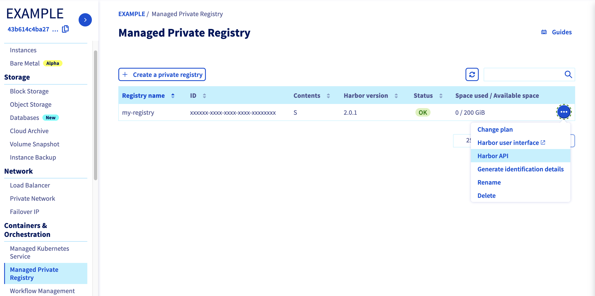
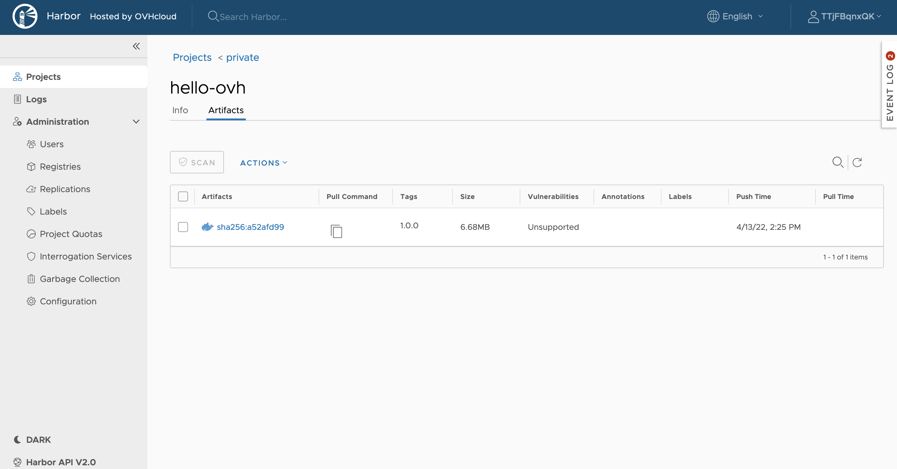

**Last updated 13th April, 2022.**

<style>
 pre {
     font-size: 14px;
 }
 pre.console {
   background-color: #300A24; 
   color: #ccc;
   font-family: monospace;
   padding: 5px;
   margin-bottom: 5px;
 }
 pre.console code {
   border: solid 0px transparent;
   color: #ccc;
   font-family: monospace !important;
   font-size: 0.75em;
 }
 .small {
     font-size: 0.75em;
 }
</style>


## Objective

OVHcloud Managed Private Registry service provides you a managed, authenticated Docker registry where you can privately store your Docker images. This guide will explain how to create a Docker image, store it in the OVHcloud Managed Private Registry service and using it from a Docker client.


## Requirements

- An OVHcloud Managed Private Registry (see the [creating a private registry](../creating-a-private-registry/) guide for more information)
- An access to the Harbor UI to operate the private registry (see the [connecting to the UI](../connecting-to-the-ui/) guide for more information)
- A private project and an user with the right to read and write on the project (see the [managing users and projects](../managing-users-and-projects/) guide for more information)


## Instructions

### Get your OVHcloud Managed Private Registry API URL

Go to your private registry section on the OVHcloud Public Cloud Manager, and in the *more options* (*...*) button at the right, click on Harbor API.

{.thumbnail}

Copy the URL of the API Harbor, it's the URL of your private registry and we are going to use it several times in this guide.

{.thumbnail}

> In fact, when you click the copy button as indicated by a hand icon in the image, the copied string starts with `https://`. Please remove the `https://` part.

### Creating a Docker image

You're going to create a Docker image using a very simple Dockerfile and some resource files.

Create a `hello-ovh/` folder and inside create:

- A `Dockerfile` file:

```  
FROM nginx:1.15-alpine

COPY index.html /usr/share/nginx/html/index.html
COPY ovh.svg /usr/share/nginx/html/ovh.svg
```

- A `index.html` file:

```
<!doctype html>
<html>
  <head>
    <title>OVHcloud K8S</title>
    <style>
      .title {
      font-size: 3em;
      padding: 2em;
      text-align: center;
      }
    </style>
  </head>
  <body>
    <div class="title">
      <p>Hello from Private Registry!</p>
      
    </div>
  </body>
</html>
```

- A `ovh.svg` file (right click and save it):

    <img src="" alt="ovh.svg">


You should have these files in your `hello-ovh` directory:

```bash
├── Dockerfile
├── index.html
└── ovh.svg
```

1. Go into the `hello-ovh` folder, containing the three files, and do a `docker build`.
  You will need to tag your build using your private registry URL, the project within the registry (*private* if you followed the [managing users and projects](../managing-users-and-projects/) guide), and the image name (*hello-ovh*):

```bash
docker build --tag [YOUR_PRIVATE_REGISTRY_URL]/[YOUR_PROJECT]/hello-ovh:1.0.0 .
```

  Here is the result of running the command for my private registry in the `private` project:

<pre class="console"><code>$ docker build --tag 8093ff7x.gra5.container-registry.ovh.net/private/hello-ovh:1.0.0 .
Sending build context to Docker daemon  14.34kB
Step 1/3 : FROM nginx:1.15-alpine
1.15-alpine: Pulling from library/nginx
e7c96db7181b: Pull complete 
264026bbe255: Pull complete 
a71634c55d29: Pull complete 
5595887beb81: Pull complete 
Digest: sha256:57a226fb6ab6823027c0704a9346a890ffb0cacde06bc19bbc234c8720673555
Status: Downloaded newer image for nginx:1.15-alpine
---> dd025cdfe837
Step 2/3 : COPY index.html /usr/share/nginx/html/index.html
---> f1f2487532bc
Step 3/3 : COPY ovh.svg /usr/share/nginx/html/ovh.svg
---> 3f803b45da18
Successfully built 3f803b45da18
Successfully tagged 8093ff7x.gra5.container-registry.ovh.net/private/hello-ovh:1.0.0
</code></pre>

1. Login to your private registry, using a user with write rights to the project (*private-user* if you followed the [managing users and projects](../managing-users-and-projects/) guide)

```bash
docker login [YOUR_PRIVATE_REGISTRY_URL]
```

  In my private registry:

<pre class="console"><code>$ docker login 8093ff7x.gra5.container-registry.ovh.net
Username: private-user
Password: 
Login Succeeded
</code></pre>

1. Upload the image to the private registry

```bash
docker push [YOUR_PRIVATE_REGISTRY_URL]/[YOUR_PROJECT]/hello-ovh:1.0.0
```

  In my private registry example:

<pre class="console"><code>$ docker push 8093ff7x.gra5.container-registry.ovh.net/private/hello-ovh:1.0.0
The push refers to repository [8093ff7x.gra5.container-registry.ovh.net/private/hello-ovh]
369ed87ef8b1: Pushed 
d2220a0eb85b: Pushed 
a521e1bbddf5: Pushed 
bf381a670956: Pushed 
a61993362baf: Pushed 
f1b5933fe4b5: Pushed 
1.0.0: digest: sha256:f5a6a8f0d7c95cf3926b504a7949c8575e478106b59d8913ab947729aa5bd075 size: 1568
</code></pre>

If you go to your Harbor UI, you will see that a `hello-ovh` repository in the  *private* project:

{.thumbnail}

This repository will store all the versions of the `hello-ovh` image (right now only the *1.0.0*):

{.thumbnail}


### Deploy the private image

Now you can use `docker pull` (preceded by a `docker login` on your private registry if you're doing it from a different computer) to deploy the image from the OVHcloud Managed Private Registry.

```bash
docker pull [YOUR_PRIVATE_REGISTRY_URL]/[YOUR_PROJECT]/hello-ovh:1.0.0 
```

In my private registry example:

<pre class="console"><code>$ docker pull 8093ff7x.gra5.container-registry.ovh.net/private/hello-ovh:1.0.0
1.0.0: Pulling from private/hello-ovh
e7c96db7181b: Already exists 
264026bbe255: Already exists 
a71634c55d29: Already exists 
5595887beb81: Already exists 
4c1b9819c67d: Pull complete 
5df2876c6416: Pull complete 
Digest: sha256:f5a6a8f0d7c95cf3926b504a7949c8575e478106b59d8913ab947729aa5bd075
Status: Downloaded newer image for 8093ff7x.gra5.container-registry.ovh.net/private/hello-ovh:1.0.0
</code></pre>

And then you can run it:

```bash
docker run -d -p 80:80 [YOUR_PRIVATE_REGISTRY_URL]/[YOUR_PROJECT]/hello-ovh:1.0.0 
```


In my private registry example:

<pre class="console"><code>$ docker run -d -p 8080:80 8093ff7x.gra5.container-registry.ovh.net/private/hello-ovh:1.0.0
c18f071c3c8c10ca636ed9be84878c12f3a270b6def131eb756f69435b978da1
</code></pre>

And now you can test it with the `curl` command:

```bash
$ curl localhost:8080
<!doctype html>

<html>
<head>
<title>OVH K8S</title>
</head>
<style>
.title {
font-size: 3em;
padding: 2em;
text-align: center;
}
</style>
<body>
<div class="title">
<p>Hello from Private Registry!</p>

</div>
</body>
</html>
```

Or in your browser:

{.thumbnail}

### Go further

To go further you can look at our guide on [Using your private registry with Kubernetes](../using-private-registry-with-kubernetes/).