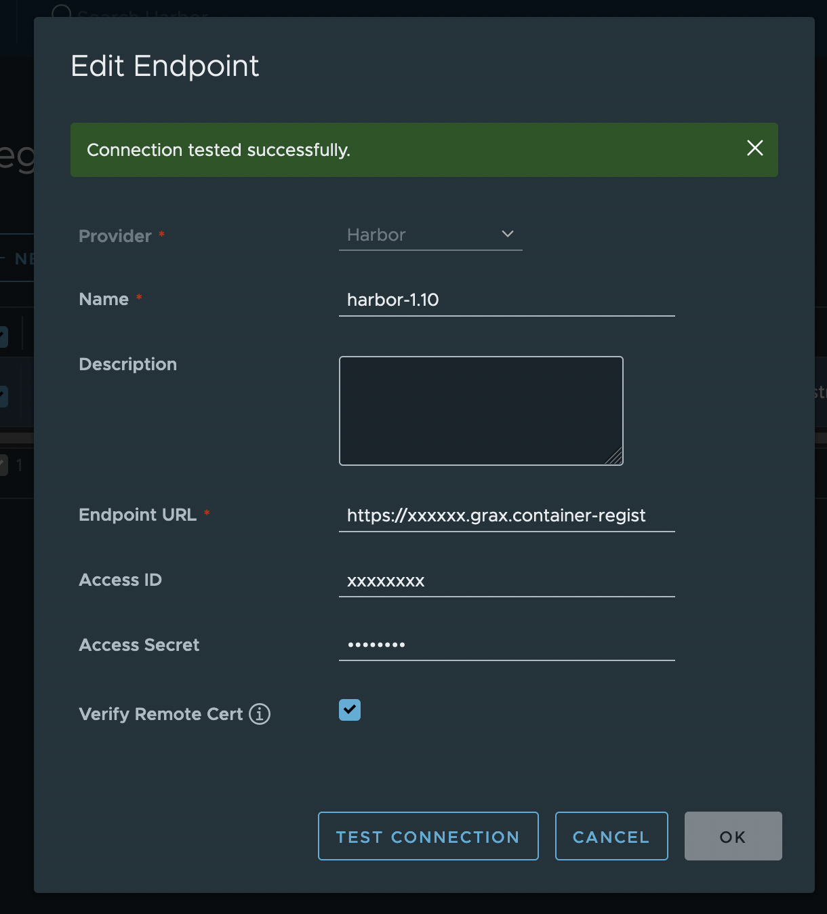
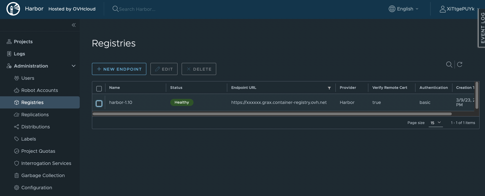
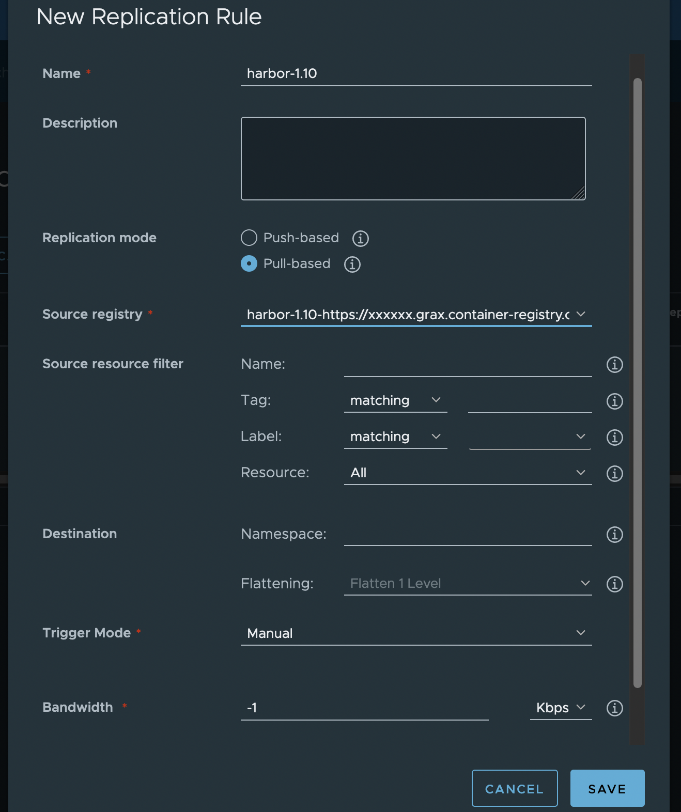
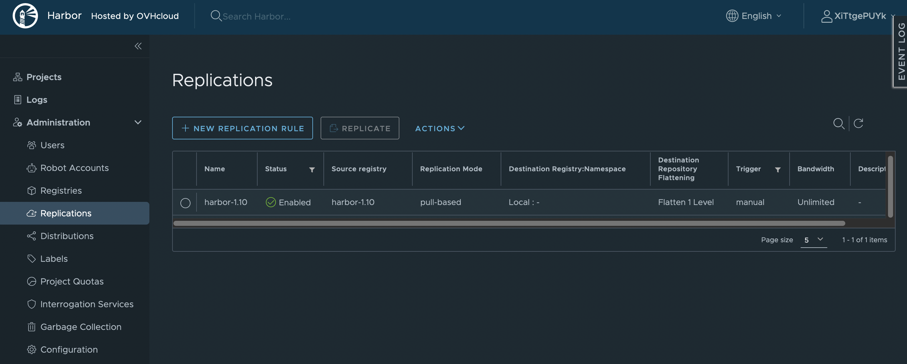
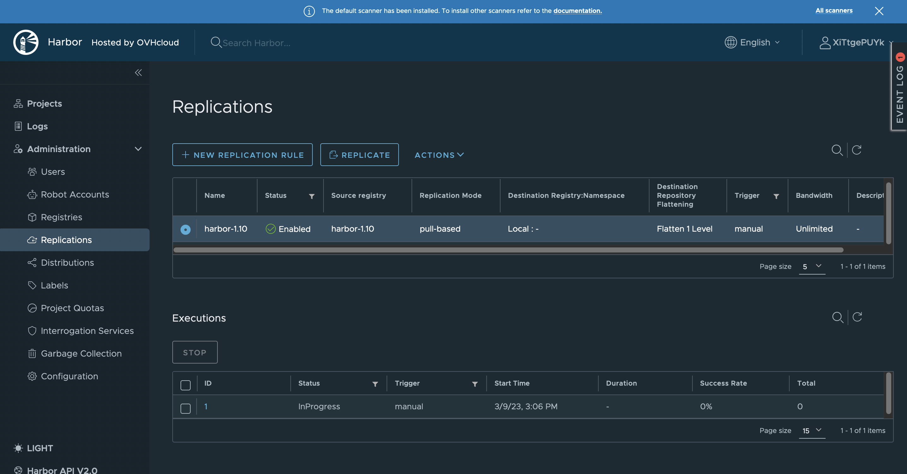

**Last updated 09th March, 2023.**

## Objective

OVHcloud Managed Private Registry service provides you a managed, authenticated Docker registry where you can privately store your Docker images. 

Managed Private Registry is built on Open Source solutions, such as Docker, and the CNCF Harbor project, to guarantee its interoperability. 

The Managed Private Registries based on Harbor 1.x will terminate on August, 1st 2023. So the aim of this guide is to show you how to create a new private registry (based on Harbor 2.x) and migrate your data from your 1.x private registry to this new one.

## Instructions

First, follow the [Creating a private registry](../creating-a-private-registry/) guide to create a new private registry named `my-new-registry` for example, with the latest version of Harbor.

Follow the [Connecting to the UI](../connecting-to-the-ui/) guide to connect to your new private registry. 

Now you will configure a replication between your old private registry (in Harbor 1.x) and the new one.

In the `Administration` menu, click on `Registries`{.action}.

{.thumbnail}

Click on `New endpoint`{.action} button to create a replication endpoint.

Now fill the form with the following information:

- Provider: `Harbor`
- Name: `harbor-1.10`
- Endpoint URL: `<your Harbor 1.10 URL (https://xxxxxxxx.grax.container-registry.ovh.net/)>`
- Access ID: `<Harbor 1.10 username>`
- Access secret: `<Harbor 1.10 password>`

{.thumbnail}

Click on `Test connection`{.action} button to ping the private registry and test your information.

{.thumbnail}

Click on `OK` button to save your information.

{.thumbnail}

In the `Administration` menu, click on `Replications`{.action}.

{.thumbnail}

Click on `New replication rule`{.action} button to create a new rule.

Now fill the form with the following information:

- Name: `harbor-1.10`
- Replication mode: `Pull based`
- Source registry: Select your registry started with `harbor-1.10-*`
- Trigger mode: `Manual` or `Scheduled`

> [!primary]
>
> **Manual**: Replicate the resources manually when needed. Note: Deletion operations are not replicated.
>
> **Scheduled**: Replicate the resources periodically by defining a cron job. Note: Deletion operations are not replicated.

{.thumbnail}

Click on `Save`{.action} button to save your information.

{.thumbnail}

To run manually a replication rule, select your replication rule and click on `Replicate` button.

{.thumbnail}

Then, click on `Replicate`{.action} button to run the replication.

{.thumbnail}

You should see, in the `Executions` section, the status of the replication.

First your replication should be in `InProgress` status and then, after waiting several seconds, the status should change to `Succeeded`.

{.thumbnail}
{.thumbnail}

> [!primary]
>
> If you run several times the same replications and you have Helm charts, the replication can fail the second time, but it will work.

Finally, you must reconfigure your Harbor instance (users, robot accounts, garbage collection, retention rules...).
Once your registry is replicated, change both the Harbor URL and credentials in your CI/CD and deployment platform if not already done.