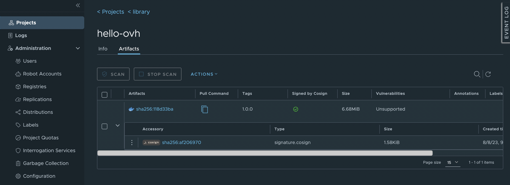

**Last updated 08th August 2023**

<style>
 pre {
     font-size: 14px;
 }
 pre.console {
   background-color: #300A24; 
   color: #ccc;
   font-family: monospace;
   padding: 5px;
   margin-bottom: 5px;
 }
 pre.console code {
   border: solid 0px transparent;
   color: #ccc;
   font-family: monospace !important;
   font-size: 0.75em;
 }
 .small {
     font-size: 0.75em;
 }
</style>

OVHcloud Managed Private Registry service, a cloud-native registry, built on Harbor, allows you to store, manage and access your container images (OCI artifacts) and Helm charts.

Security is an important topic and through artifact signing and signature verification you can increase the security of your OVHcloud Managed Private Registries by verifying the integrity of an artifact.

Since v2.5+ Harbor supports [Cosign](https://github.com/sigstore/cosign), a OCI (Open Container Initiative) artifact signing and verification solution that is part of the [Sigstore project](https://github.com/sigstore).

> [!primary]
>
> Harbor has started the deprecation of Notary in Harbor 2.6, it will be removed in Harbor v2.8, so you must use Cosign to sign container images and Helm charts.

Compared to Notary, Cosign is really easy to use and one advantage to use it is the ability using Harbor’s replication capabilities to replicate signatures with their associated signed artifact.

**This guide will explain how to sign artifacts with Cosign in an OVHcloud Managed Private Registry service.**

## Requirements

* An OVHcloud Managed Private Registry (version 2.5+)
* The URL and login/password of your private registry
* an image stored in your registry

This tutorial presupposes that you already have a working OVHcloud Managed Private Registry and you have followed the guides on [creating a private registry](/pages/platform/private-registry/creating-a-private-registry), [connecting to the UI](/pages/platform/private-registry/connecting-to-the-ui), [managing users and projects](/pages/platform/private-registry/managing-users-and-projects) and [creating and using private images](/pages/platform/private-registry/creating-and-using-a-private-image).

At this time you should have a running Private Registry in version 2.5 minimum, with a stored image and you can access to your private registry.


## Instructions

### Installing Cosign CLI

You can install [Cosign](https://docs.sigstore.dev/cosign/installation/) CLI on your computer from the binaries, a rpm package, HomeBrew and even use it directly in a Github Action.

For this tutorial you will install it via HomeBrew:

```bash
brew install cosign
```

Verify Cosign is successfully installed in your machine:

```bash
cosign version
```

The output should be like this:

<pre class="console"><code>$ cosign version
  ______   ______        _______. __    _______ .__   __.
 /      | /  __  \      /       ||  |  /  _____||  \ |  |
|  ,----'|  |  |  |    |   (----`|  | |  |  __  |   \|  |
|  |     |  |  |  |     \   \    |  | |  | |_ | |  . `  |
|  `----.|  `--'  | .----)   |   |  | |  |__| | |  |\   |
 \______| \______/  |_______/    |__|  \______| |__| \__|
cosign: A tool for Container Signing, Verification and Storage in an OCI registry.

GitVersion:    2.1.1
GitCommit:     baf97ccb4926ed09c8f204b537dc0ee77b60d043
GitTreeState:  "clean"
BuildDate:     2023-06-27T06:57:11Z
GoVersion:     go1.20.5
Compiler:      gc
Platform:      darwin/arm64
</code></pre>

### Generate a private key

Cosign allows to generate a private key that you can use later to sign your images. You'll be interactively prompted to provide a password.

Generate a private key:

```bash
cosign generate-key-pair
```

The output should be like this:

<pre class="console"><code>$ cosign generate-key-pair
Enter password for private key: 
Enter password for private key again: 
Private key written to cosign.key
Public key written to cosign.pub
</code></pre>

> [!primary]
> In this guide we generated a private key locally but in production environment you can, obviously, generate the private key and store it in a key management storage like a Vault or KMS.

### Sign your OCI artifact (container image)

Sign your image and push the signature to your OVHcloud Managed Private Registry instance.

```bash
cosign sign --key cosign.key <harbor-instance>/<project>/<image/path>:<image-tag>
```

The output should be like this:

<pre class="console"><code>$ cosign sign --key cosign.key xxxxxx.c1.gra9.container-registry.ovh.net/library/hello-ovh:1.0.0
Enter password for private key: 
WARNING: Image reference xxxxxx.c1.gra9.container-registry.ovh.net/library/hello-ovh:1.0.0 uses a tag, not a digest, to identify the image to sign.
    This can lead you to sign a different image than the intended one. Please use a
    digest (example.com/ubuntu@sha256:abc123...) rather than tag
    (example.com/ubuntu:latest) for the input to cosign. The ability to refer to
    images by tag will be removed in a future release.


        The sigstore service, hosted by sigstore a Series of LF Projects, LLC, is provided pursuant to the Hosted Project Tools Terms of Use, available at https://lfprojects.org/policies/hosted-project-tools-terms-of-use/.
        Note that if your submission includes personal data associated with this signed artifact, it will be part of an immutable record.
        This may include the email address associated with the account with which you authenticate your contractual Agreement.
        This information will be used for signing this artifact and will be stored in public transparency logs and cannot be removed later, and is subject to the Immutable Record notice at https://lfprojects.org/policies/hosted-project-tools-immutable-records/.

By typing 'y', you attest that (1) you are not submitting the personal data of any other person; and (2) you understand and agree to the statement and the Agreement terms at the URLs listed above.
Are you sure you would like to continue? [y/N] y
tlog entry created with index: 30480064
Pushing signature to: xxxxxx.c1.gra9.container-registry.ovh.net/library/hello-ovh
</code></pre>

### Verify the image is signed with Cosign

In order to verify if your image is well signed, login in your private registry (in the Harbor UI), click in **Projects**, your project, your image and then you will see a new green check mark:


Clicking in the ">" icon display the associated cosign signature information:



## Go further

To have an overview of OVHcloud Managed Private Registry service, you can consult the [OVHcloud Managed Private Registry site](/products/public-cloud-containers-orchestration-managed-private-registry).

Join our community of users on <https://community.ovh.com/en/>.