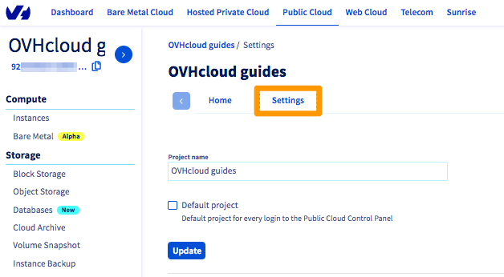
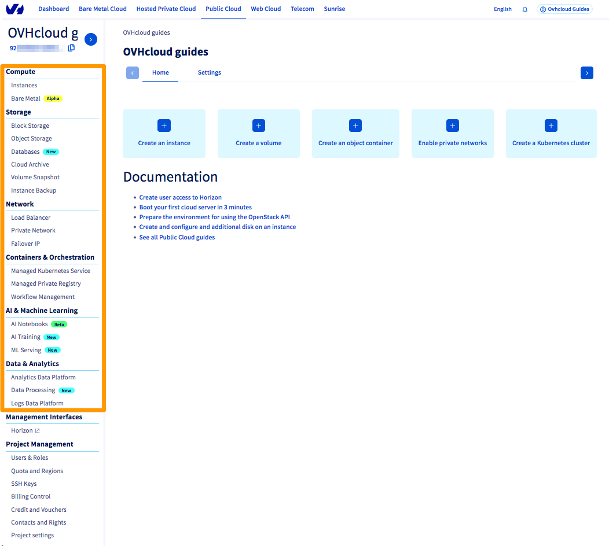
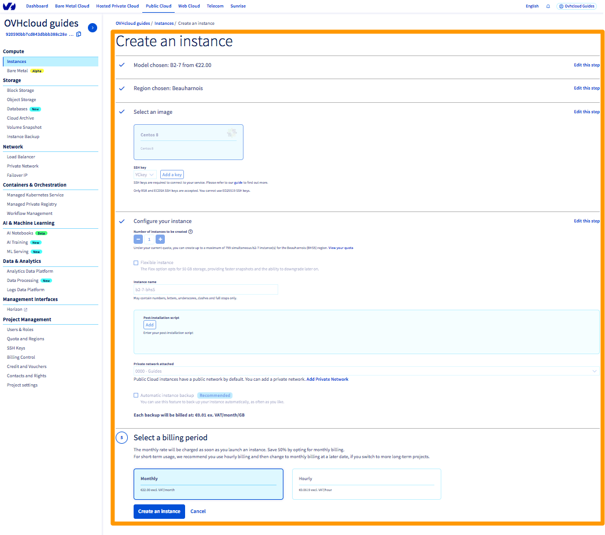

**Last updated 6th December 2021**

## Objective

You have just created your Public Cloud project, and you would like to find out more about the user interface in the OVHcloud Control Panel.

**Explore the main sections of the Public Cloud interface in the OVHcloud Control Panel.**

## Requirements

- access to the [OVHcloud Control Panel](https://ca.ovh.com/auth/?action=gotomanager&from=https://www.ovh.com/asia/&ovhSubsidiary=asia){.external}.
- You need to have created your [first Public Cloud project](https://docs.ovh.com/asia/en/public-cloud/create_a_public_cloud_project/).

## Instructions

Once you have created your first Public Cloud project, you will be redirected to the main Public Cloud interface.

{.thumbnail}

### Access to your OVHcloud account information

Your OVHcloud account settings are accessible at any time, as are notifications or a change of language in the OVHcloud Control Panel.

{.thumbnail}

### Your Public Cloud project

Because you can use multiple projects (depending on your quotas), the project name and ID are always displayed, regardless of which screen you are visiting, so you know what environment you are acting on.

{.thumbnail}

The ID may be required when using the CLI, for certain support requests or otherwise. You can copy it by clicking on the icon to the right of it.

You can change the project name via the `Settings`{.action} tab. Enter a new name, then click on `Update`{.action}.

{.thumbnail}

### The Public Cloud main menu

{.thumbnail}

|Section|Options description|
|---|---|
|**Compute**|This section allows you to start instances, these are cloud servers available on demand.|
|**Storage**|In this section, you will find different storage solutions and databases, each corresponding to a specific need and use.|
|**Network**|In this section, you will find everything you need to interconnect your Public Cloud resources, and how to connect them to other OVHcloud products.|
|**Containers and Orchestration**|This section offers you various tools to automate your architectures and gain flexibility.|
|**AI & Machine Learning**|In this section, you will find the OVHcloud artificial intelligence tools.|
|**Data & Analytics**|These services will help you solve your Big Data and Data Analytics problems.|

### Shortcuts

The center of the screen provides shortcuts for quick access to the most useful configuration wizards and guides.

{.thumbnail}

#### Assistance for the creation of resources

For each resource you want to create, you will be accompanied by a configuration wizard which, step by step, allows you to set up the resource according to your needs. 
 Most of the time, you will have to choose the location of the resource, the model, some customisable settings and, in some cases, the billing method.

{.thumbnail}

### Management tools

There are several management tools available in your Public Cloud project, they are located at the bottom of the left-side menu bar.

{.thumbnail}

|Menu entry|Description|
|---|---|
|**Horizon**|This is the [graphical interface](https://docs.ovh.com/asia/en/public-cloud/horizon/) usually available on OpenStack. It is not altered, which allows users who are used to this interface to easily navigate it.|
|**Users and Roles**|Allows you to [create users](https://docs.ovh.com/asia/en/public-cloud/creation-and-deletion-of-openstack-user/) and assign them a role. These users can also access the APIs or the Horizon interface directly. For example, you can create a user for your standard maintenance operations, and a user for your automation tools, such as Terraform.|
|**Quota and Regions**|This tool allows you to control the locations and resource limits available on your project.  **Quotas**: Based on certain criteria (number of bills already paid, use of other OVHcloud products), our system sets quotas (limits) on the number of resources you can create, in order to avoid any outstanding amounts. By default, the system increases your quotas automatically when certain criteria are met. However, you can [manually increase a quota](https://docs.ovh.com/asia/en/public-cloud/increase-public-cloud-quota/#increasing-your-resources-quota-manually) from this tool.  **Regions**: Public Cloud is available in several locations around the world. Furthermore, each location can contain several “regions” (a concept unique to OpenStack). For example, for a European customer, the APAC (Asia Pacific) zone is disabled by default. If it suits your needs, you can activate new regions from this menu.|
|**SSH Keys**|A tool that allows you to [manage your SSH keys](https://docs.ovh.com/asia/en/public-cloud/public-cloud-first-steps/#step-1-creating-ssh-keys) in a centralised way.|
|**Billing Control**|Since the Public Cloud is based on *pay as you go*, invoices are issued at the end of the month. In [this menu](https://docs.ovh.com/asia/en/public-cloud/information-on-cloud-billing-options/), you can track your current usage, see a forecast for the next invoice, and of course see your previous invoices.|
|**Credit and Vouchers**|This menu allows you to view the consumption of a voucher, add a voucher, or [add credit](https://docs.ovh.com/asia/en/public-cloud/add-cloud-credit/) directly to your Public Cloud project.|
|**Contacts and Rights**|In this menu, you can add users (OVHcloud account) in read-only and read-write mode.|
|**Project settings**|With this tool, you can configure the project’s general settings, such as its name, its configuration as a "default project for the account", HDS compatibility, or [delete your Public Cloud project](https://docs.ovh.com/asia/en/public-cloud/delete_a_project/).|

## Go further

[Creating and connecting to your first Public Cloud instance](https://docs.ovh.com/asia/en/public-cloud/public-cloud-first-steps/)

Join our community of users on <https://community.ovh.com/en/>.
