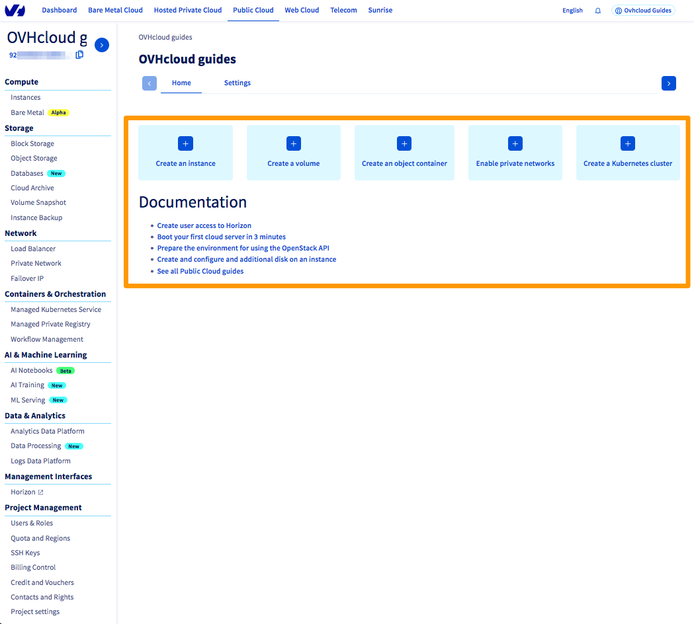

> [!primary]
> Esta traducción ha sido generada de forma automática por nuestro partner SYSTRAN. En algunos casos puede contener términos imprecisos, como en las etiquetas de los botones o los detalles técnicos. En caso de duda, le recomendamos que consulte la versión inglesa o francesa de la guía. Si quiere ayudarnos a mejorar esta traducción, por favor, utilice el botón «Contribuir» de esta página.
> 

**Última actualización: 06/12/2021**

## Objetivo

Usted acaba de crear su proyecto de Public Cloud y quiere saber más sobre la interfaz de usuario en el área de cliente de OVHcloud.

**Descubra las principales secciones de la interfaz de Public Cloud desde el área de cliente de OVHcloud.**

## Requisitos

- Estar conectado al [área de cliente de OVHcloud](https://ca.ovh.com/auth/?action=gotomanager&from=https://www.ovh.com/world/&ovhSubsidiary=ws){.external}.
- Haber creado su [primer proyecto de Public Cloud](https://docs.ovh.com/us/es/public-cloud/crear_su_primer_proyecto_de_public_cloud/).

## Procedimiento

Una vez creado el primer proyecto de Public Cloud, será redirigido a la interfaz principal de Public Cloud.

{.thumbnail}

### Acceso a sus datos de cuenta de OVHcloud

Los parámetros de su cuenta de OVHcloud permanecen accesibles en cualquier momento, al igual que las notificaciones o el cambio de idioma del área de cliente.

{.thumbnail}

### Su proyecto de Public Cloud

Como es posible utilizar varios proyectos (en función de sus cuotas), el nombre y el ID del proyecto siempre se muestran, independientemente de la pantalla que visite, para saber en qué entorno está actuando.

{.thumbnail}

El ID puede ser necesario al utilizar la CLI, determinadas solicitudes de soporte u otras. Puede copiarlo haciendo clic en el icono situado a la derecha.

Puede cambiar el nombre del proyecto en la pestaña `Ajustes`{.action}. Introduzca un nuevo nombre y haga clic en `Actualizar`{.action}.

{.thumbnail}

### El menú principal de Public Cloud

{.thumbnail}

|Sección|Descripción de las opciones|
|---|---|
|**Compute**|Esta sección permite iniciar instancias, ya que estos servidores cloud están disponibles bajo demanda.|
|**Storage**|En esta sección encontrará diferentes soluciones de almacenamiento y bases de datos, cada una de las cuales se adapta a una necesidad y un uso particular.|
|**Network**|En esta sección podrá conectar sus recursos de Public Cloud y conectarlos con otros productos de OVHcloud.|
|**Containers and Orchestration**|Esta sección ofrece diversas herramientas para automatizar sus arquitecturas y aumentar la flexibilidad.|
|**AI & Machine Learning**|En esta sección encontrará las herramientas de OVHcloud para la inteligencia artificial.|
|**Data & Analytics**|Estos servicios le ayudarán a resolver sus problemas de Big Data y de Data Analytics.|

### Atajos rápidos

En el centro de la pantalla encontrará atajos que le permitirán acceder rápidamente a los asistentes de configuración y a las guías más útiles.

{.thumbnail}

#### Ayudas a la creación de recursos

Para cada recurso que quiera crear, le guiará un asistente de configuración que, paso a paso, le permitirá configurar los recursos según sus necesidades.
 En la mayoría de los casos, deberá elegir la localización del recurso, el modelo, algunos parámetros personalizables y, en algunos casos, el modo de facturación.

{.thumbnail}

### Herramientas de gestión

El proyecto de Public Cloud incluye diversas herramientas de gestión, que se encuentran en la parte inferior de la barra de menú, a la izquierda.

{.thumbnail}

|Entrada del menú|Descripción|
|---|---|
|**Horizon**|Es la [interfaz gráfica](https://docs.ovh.com/us/es/public-cloud/horizon/) que usualmente se encuentra disponible en OpenStack. No se modifica, lo que permite a los usuarios que están acostumbrados a esta interfaz recuperar sus reflejos.|
|**Users and Roles**|Permite [crear usuarios](https://docs.ovh.com/us/es/public-cloud/crear-y-eliminar-un-usuario-de-openstack/) y asignarles un rol. Estos usuarios permiten acceder directamente a las API o al panel Horizon. Por ejemplo, puede crear un usuario para las operaciones de mantenimiento habituales y un usuario para las herramientas de automatización, como Terraform.|
|**Quota and Regions**|Esta herramienta le permite controlar las localizaciones y los límites de recursos disponibles para su proyecto.  **Cuotas**: Nuestro sistema, que respeta determinados criterios (número de facturas ya pagadas, uso de otros productos de OVHcloud), establece límites al número de recursos que puede crear para evitar problemas de impago. Por defecto, el sistema aumenta los límites automáticamente cuando se cumplen determinados criterios. Sin embargo, puede [aumentar manualmente una cuota](https://docs.ovh.com/us/es/public-cloud/increase-public-cloud-quota/#aumentar-manualmente-la-cuota-de-recursos) desde esta herramienta.  **Localizaciones**: Public Cloud está disponible en varias localizaciones del mundo. Además, cada localización puede tener varias "regiones" (concepto propio de OpenStack). Por ejemplo, para un cliente europeo, la zona APAC (Asia-Pacífico) está desactivada por defecto. Si esto se ajusta a sus necesidades, puede activar nuevas regiones desde este menú.|
|**SSH Keys**|Una herramienta que le permite [gestionar sus llaves SSH](https://docs.ovh.com/us/es/public-cloud/public-cloud-primeros-pasos/#1-crear-claves-ssh) de forma centralizada.|
|**Billing Control**|Las facturas de Public Cloud funcionan en base al principio de pago por uso (en inglés, *pay-as-you-go*). En [este menú](https://docs.ovh.com/us/es/public-cloud/informacion-sobre-el-tipo-de-facturacion-cloud/) podrá consultar su consumo actual, ver un pronóstico de la siguiente factura y, por supuesto, recuperar sus facturas anteriores.|
|**Credit and Vouchers**|Este menú le permite consultar el consumo de un cupón, añadir uno o [añadir crédito](https://docs.ovh.com/us/es/public-cloud/anadir_credito_cloud/) directamente en su proyecto de Public Cloud.|
|**Contacts and Rights**|Este menú le permite añadir otros contactos (cuenta de OVHcloud) para administrar técnicamente su proyecto. También puede añadir usuarios para consultar únicamente *read-only*.|
|**Project settings**|Esta última herramienta le permite configurar los parámetros generales del proyecto como su nombre, su configuración como "proyecto por defecto de la cuenta", la compatibilidad HDS o incluso [eliminar su proyecto de Public Cloud.](https://docs.ovh.com/us/es/public-cloud/delete_a_project/)|

## Más información

[Crear y conectarse a una instancia de Public Cloud](https://docs.ovh.com/us/es/public-cloud/public-cloud-primeros-pasos/)

Si necesita formación o asistencia técnica para implantar nuestras soluciones, póngase en contacto con su representante de ventas o haga clic en [este enlace](https://www.ovhcloud.com/es/professional-services/) para obtener un presupuesto y solicitar un análisis personalizado de su proyecto a nuestros expertos del equipo de Servicios Profesionales.

Interactúe con nuestra comunidad de usuarios en <https://community.ovh.com/en/>.