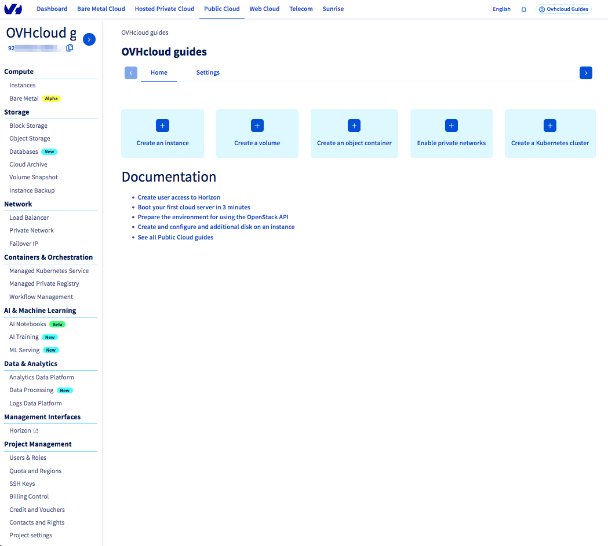

> [!primary]
> Tłumaczenie zostało wygenerowane automatycznie przez system naszego partnera SYSTRAN. W niektórych przypadkach mogą wystąpić nieprecyzyjne sformułowania, na przykład w tłumaczeniu nazw przycisków lub szczegółów technicznych. W przypadku jakichkolwiek wątpliwości zalecamy zapoznanie się z angielską/francuską wersją przewodnika. Jeśli chcesz przyczynić się do ulepszenia tłumaczenia, kliknij przycisk „Zaproponuj zmianę” na tej stronie.
>

**Ostatnia aktualizacja z dnia 06-12-2021**

## Wprowadzenie

Właśnie utworzyłeś Twój projekt Public Cloud i chcesz dowiedzieć się więcej o interfejsie użytkownika w Panelu klienta OVHcloud.

**Poznaj główne sekcje interfejsu Public Cloud w Panelu klienta OVHcloud.**

## Wymagania początkowe

- Dostęp do [Panelu klienta OVHcloud](https://www.ovh.com/auth/?action=gotomanager&from=https://www.ovh.pl/&ovhSubsidiary=pl){.external}.
- Utworzenie [pierwszego projekt Public Cloud](https://docs.ovh.com/pl/public-cloud/utworz_projekt_public_cloud/).

## W praktyce

Po utworzeniu pierwszego projektu Public Cloud zostaniesz przekierowany do głównego interfejsu Public Cloud.

{.thumbnail}

### Dostęp do danych konta OVHcloud

Parametry konta OVHcloud pozostają dostępne w każdej chwili, podobnie jak powiadomienia lub zmiana języka w Panelu klienta.

{.thumbnail}

### Twój projekt Public Cloud

Ponieważ możliwe jest użycie kilku projektów (w zależności od rozmiaru projektu), nazwa i ID projektu są zawsze wyświetlane, niezależnie od wyświetlanego ekranu, aby dowiedzieć się, w jakim środowisku działa.

{.thumbnail}

ID może być konieczne podczas korzystania z CLI, niektórych zgłoszeń dotyczących wsparcia lub innych. Możesz go skopiować klikając ikonę znajdującą się po prawej stronie.

Możesz zmienić nazwę projektu w zakładce `Ustawienia`{.action}. Wpisz nową nazwę i kliknij na `Aktualizuj`{.action}.

{.thumbnail}

### Menu główne Public Cloud

{.thumbnail}

|Sekcja|Opis opcji|
|---|---|
|**Compute**|W tej sekcji możesz uruchomić instancje, które są dostępne na żądanie.|
|**Storage**|W tej sekcji znajdziesz rozwiązania do przechowywania danych i baz danych, z których każda odpowiada konkretnym potrzebom i wykorzystaniu.|
|**Network**|W tej sekcji znajdziesz informacje, jak połączyć Twoje zasoby Public Cloud, a także co łączyć je z innymi produktami OVHcloud.|
|**Containers and Orchestration**|W tej sekcji możesz korzystać z różnych narzędzi do automatyzacji architektury.|
|**AI & Machine Learning**|W tej sekcji znajdziesz narzędzia OVHcloud do sztucznej inteligencji.|
|**Data & Analytics**|Usługi te pomogą Ci rozwiązać problem Big Data i Data Analytics.|

### Skróty

W centrum ekranu znajdują się skróty umożliwiające szybki dostęp do asystentów konfiguracji i do najbardziej przydatnych przewodników.

{.thumbnail}

#### Pomoc na tworzenie zasobów

Dla każdego zasobu, który chcesz utworzyć, towarzyszą Ci asystent konfiguracji, który, krok po kroku, pozwala na ustawienie zasobów zgodnie z Twoimi potrzebami.
 W większości przypadków będziesz musiał wybrać lokalizację zasobu, model, kilka ustawień, które można spersonalizować, a w niektórych przypadkach również sposób płatności.

{.thumbnail}

### Narzędzia do zarządzania

W projekcie Public Cloud dostępnych jest kilka narzędzi do zarządzania. Są one na dole paska menu po lewej stronie.

{.thumbnail}

|Wejście do menu|Opis|
|---|---|
|**Horizon**|Jest to [interfejs graficzny](https://docs.ovh.com/pl/public-cloud/horizon/) zazwyczaj dostępny na OpenStack. Nie została zmodyfikowana, co pozwala użytkownikom, którzy przywykli do korzystania z tego interfejsu, na odnalezienie własnego odruchu.|
|**Users and Roles**|Umożliwia [tworzenie użytkowników](https://docs.ovh.com/pl/public-cloud/tworzenie-i-usuwanie-uzytkownika-openstack/) i przypisywanie im roli. Użytkownicy ci umożliwiają między innymi bezpośredni dostęp do API lub do interfejsu Horizon. Możesz na przykład utworzyć użytkownika do Twoich klasycznych prac konserwacyjnych oraz użytkownika do narzędzi automatyzacji, takich jak Terraform.|
|**Quota and Regions**|Narzędzie to pozwala na zarządzanie lokalizacjami i limitami zasobów dostępnymi dla Twojego projektu.  **Limity**: Zgodnie z określonymi kryteriami (liczba faktur już opłaconych, korzystanie z innych produktów OVHcloud) nasz system ustala kwoty (limity) dla liczby zasobów, które możesz utworzyć, aby uniknąć problemów z brakiem płatności. Domyślnie system automatycznie zwiększa limity, gdy spełnione są określone kryteria. Można jednak [ręcznie zwiększyć kwotę](https://docs.ovh.com/pl/public-cloud/zwiekszenie_limitow_public_cloud/#reczne-zwiekszanie-limitu-zasobow) za pomocą tego narzędzia.  **Lokalizacje**: Public Cloud jest dostępny w kilku lokalizacjach na świecie. Dodatkowo każda lokalizacja może zawierać kilka "regionów" (pojęcie specyficzne dla OpenStack). Na przykład dla klienta europejskiego strefa APAC (Azja-Pacyfik) jest domyślnie wyłączona. Jeśli Twoje potrzeby są spełnione, możesz aktywować nowe regiony z tego menu.|
|**SSH Keys**|Narzędzie do zarządzania [kluczami SSH](https://docs.ovh.com/pl/public-cloud/public-cloud-pierwsze-kroki/#krok-1-utworzenie-kluczy-ssh).|
|**Billing Control**|Public Cloud działający w trybie *pay as you go*, faktury są publikowane pod koniec miesiąca. W [tym menu](https://docs.ovh.com/pl/public-cloud/analizowanie_platnosci_i_zarzadzanie_nimi/) będziesz mógł śledzić bieżące zużycie zasobów, zobaczyć prognozę kolejnej faktury i oczywiście wyświetlić Twoje poprzednie faktury.|
|**Credit and Vouchers**|W tym menu możesz sprawdzić wykorzystanie kuponu, dodać kupon lub [dodać zasilenie](https://docs.ovh.com/pl/public-cloud/korzystanie-z-vouchera/) bezpośrednio do Twojego projektu Public Cloud.|
|**Contacts and Rights**|Oprócz możliwości zmiany kontaktu technicznego lub kontaktu księgowego Twojego projektu, będziesz mógł [dodać kolejne kontakty](https://docs.ovh.com/pl/public-cloud/zmiana_kontaktow_projektu/) (konto OVHcloud), aby zarządzać Twoim projektem. Możesz również dodawać użytkowników tylko do wglądu *read-only*.|
|**Project settings**|To ostatnie narzędzie pozwala na skonfigurowanie ogólnych parametrów projektu, takich jak nazwa, konfiguracja jako "domyślny projekt konta", kompatybilność HDS, czy też na [usunięcie projektu Public Cloud](https://docs.ovh.com/pl/public-cloud/usuwanie_projektu/).|

## Sprawdź również

[Tworzenie pierwszej instancji Public Cloud i łączenie się z nią](https://docs.ovh.com/pl/public-cloud/public-cloud-pierwsze-kroki/)

Dołącz do społeczności naszych użytkowników na stronie <https://community.ovh.com/en/>.