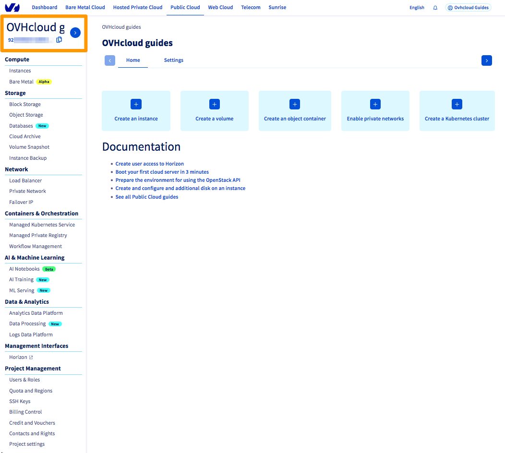
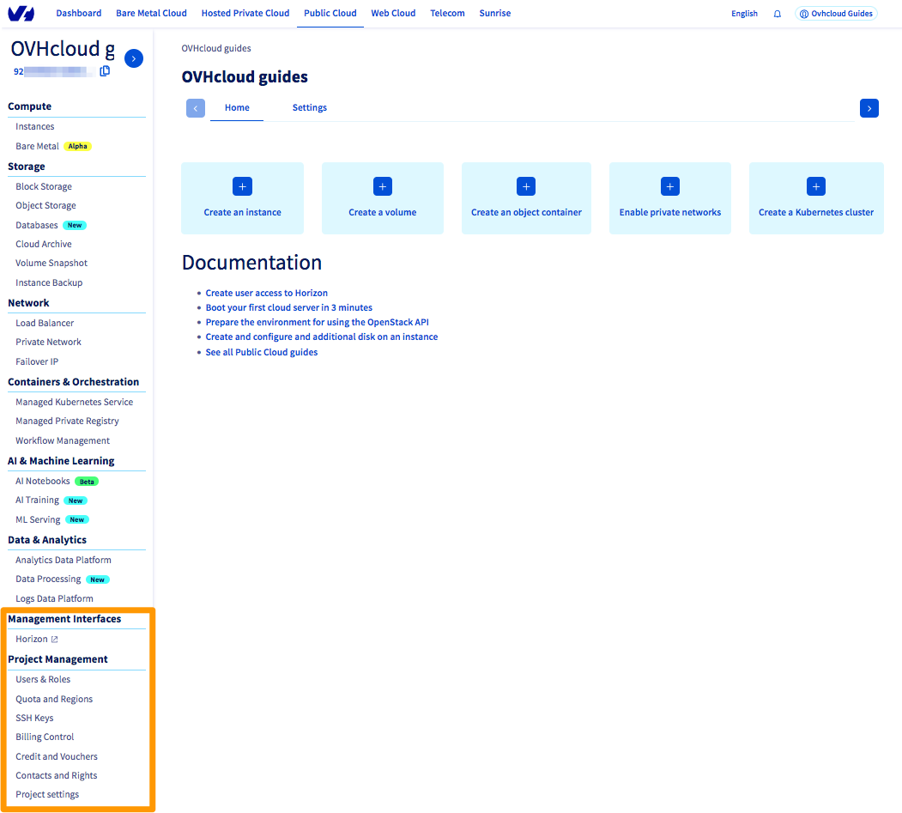

> [!primary]
> Esta tradução foi automaticamente gerada pelo nosso parceiro SYSTRAN. Em certos casos, poderão ocorrer formulações imprecisas, como por exemplo nomes de botões ou detalhes técnicos. Recomendamos que consulte a versão inglesa ou francesa do manual, caso tenha alguma dúvida. Se nos quiser ajudar a melhorar esta tradução, clique em "Contribuir" nesta página.
>

**Última atualização: 10/11/2021**

## Objetivo

Acaba de criar o seu projeto Public Cloud e deseja saber um pouco mais sobre a interface de utilizador no seio do Espaço Cliente OVHcloud.

**Descubra as principais secções da interface Public Cloud na Área de Cliente OVHcloud**

## Requisitos

- Ter acesso à [Área de Cliente OVHcloud](https://www.ovh.com/auth/?action=gotomanager&from=https://www.ovh.pt/&ovhSubsidiary=pt){.external}.
- Ter criado um [primeiro projeto Public Cloud](https://docs.ovh.com/pt/public-cloud/criar_seu_primeiro_projeto_public_cloud/).

## Instruções

Depois de criar o seu primeiro projeto Public Cloud, será redirecionado para a interface Public Cloud principal.

{.thumbnail}

### O acesso às suas informações de conta OVHcloud

Os parâmetros da sua conta OVHcloud ficam acessíveis a qualquer momento, assim como as notificações ou a alteração de língua do Espaço Cliente.

{.thumbnail}

### O seu projeto Public Cloud

Uma vez que é possível utilizar vários projetos (dependendo dos seus limites), o nome e o ID do projeto são sempre apresentados, independentemente do ecrã que visita, para saber em que ambiente está a agir.

{.thumbnail}

A ID pode ser necessária aquando da utilização da CLI, de certos pedidos de suporte ou outros. Pode copiá-lo clicando no ícone à direita.

Pode alterar o nome do projeto através do separador `Parâmetros`{.action}. Introduza um novo nome e clique em `Atualizar`{.action}.

{.thumbnail}

### O menu principal Public Cloud

{.thumbnail}

|Secção|Descrição das opções|
|---|---|
|**Compute**|Esta secção permite-lhe iniciar instâncias, aqueles servidores de nuvem disponíveis a pedido.|
|**Storage**|Nesta secção, encontrará diferentes soluções de armazenamento e bases de dados, cada uma correspondente a uma necessidade e utilização específicas.|
|**Network**|Nesta secção, poderá consultar os recursos Public Cloud, assim como a forma de os ligar a outros produtos da OVHcloud.|
|**Containers and Orchestration**|Esta secção propõe-lhe diferentes ferramentas para automatizar as suas arquiteturas e ganhar em flexibilidade.|
|**AI & Machine Learning**|Nesta secção, encontrará as ferramentas da OVHcloud para a inteligência artificial.|
|**Data & Analytics**|Estes serviços irão ajudá-lo a resolver os seus problemas de Big Data e Data Analytics.|

### Atalhos

O centro do ecrã propõe-lhe atalhos que permitem aceder rapidamente aos assistentes de configuração e aos guias mais úteis.

{.thumbnail}

#### Auxílios à criação de recursos

Para cada recurso que deseja criar, será acompanhado por um assistente de configuração que, etapa após etapa, lhe permite parametrizar o recurso de acordo com as suas necessidades.
 Na maioria dos casos, deverá escolher a localização do recurso, o modelo, alguns parâmetros personalizáveis e, em certos casos, o modo de faturação.

{.thumbnail}

### Ferramentas de gestão

Encontram-se disponíveis várias ferramentas de gestão no seu projeto Public Cloud, na parte inferior da barra de menu à esquerda.

{.thumbnail}

|Entrada do menu|Descrição|
|---|---|
|**Horizon**|Esta é a [interface gráfica](https://docs.ovh.com/pt/public-cloud/horizon/) geralmente disponível no OpenStack. Não é alterada, o que permite aos utilizadores habituados a esta interface encontrar os seus reflexos.|
|**Users and Roles**|Permite [criar utilizadores](https://docs.ovh.com/pt/public-cloud/criar-e-eliminar-um-utilizador-openstack/) e atribuir-lhes um papel. Estes utilizadores permitem, nomeadamente, aceder diretamente às API ou à interface Horizon. Por exemplo, pode criar um utilizador para as suas operações de manutenção clássicas e um utilizador para as suas ferramentas de automatização, como por exemplo o Terraform.|
|**Quota and regions**|Esta ferramenta permite-lhe controlar as localizações e os limites de recursos disponíveis no seu projeto.  **Limites**: De acordo com certos critérios (número de faturas já pagas, utilização de outros produtos da OVHcloud), o nosso sistema implementa quotas (limites) no número de recursos que pode criar, com o objetivo de evitar qualquer problema de pagamentos em atraso. Por predefinição, o sistema aumenta os seus limites automaticamente quando determinados critérios são atingidos. No entanto, pode [aumentar manualmente uma quota](https://docs.ovh.com/pt/public-cloud/aumentar_a_quota_public_cloud/#aumentando-manualmente-a-cota-de-recursos) a partir desta ferramenta.  **Localizações**: O Public Cloud está disponível em várias localizações em todo o mundo. Além disso, cada localização pode incluir várias « regiões » (conceito específico de OpenStack). Por exemplo, para um cliente europeu, a zona APAC (Ásia-Pacífico) é desativada por predefinição. Se isso corresponder às suas necessidades, pode ativar novas regiões a partir deste menu.|
|**SSH Keys**|Uma ferramenta que lhe permite gerir as suas chaves SSH de forma centralizada.|
|**Billing Control**|Uma vez que o Public Cloud baseia-se na faturação « *pay as you go* », ou seja, as faturas são editadas no final do mês. [Neste menu](https://docs.ovh.com/pt/public-cloud/informacoes-sobre-o-metodo-de-faturacao-cloud/), poderá seguir o seu consumo atual, ver uma previsão da próxima fatura e, claro, encontrar as suas faturas anteriores.|
|**Credit and Vouchers**|Este menu permite-lhe consultar o consumo de um cupão, adicionar um ou [adicionar crédito](https://docs.ovh.com/pt/public-cloud/adicionar-um-credito-cloud/) diretamente no seu projeto Public Cloud.|
|**Contacts and Rights**|Além da possibilidade de alterar o contacto técnico ou o contacto de faturação do seu projeto, terá a possibilidade de [adicionar outros contactos](hhttps://docs.ovh.com/pt/public-cloud/alterar_os_contactos_de_um_projeto/) (conta OVHcloud) para administrar tecnicamente o seu projeto. Também pode adicionar utilizadores apenas em consulta (« *read-only* »).|
|**Project settings**|Esta última ferramenta permite-lhe configurar os parâmetros gerais do projeto como o seu nome, a sua configuração enquanto "projeto predefinido da conta", a compatibilidade HDS, ou ainda [eliminar o seu projeto Public Cloud](https://docs.ovh.com/pt/public-cloud/delete_a_project/).|

## Quer saber mais?

[Criação e conexão a uma primeira instância Public Cloud](https://docs.ovh.com/pt/public-cloud/public-cloud-primeiros-passos/)

Fale com a nossa comunidade de utilizadores em <https://community.ovh.com/en/>.
