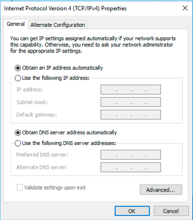
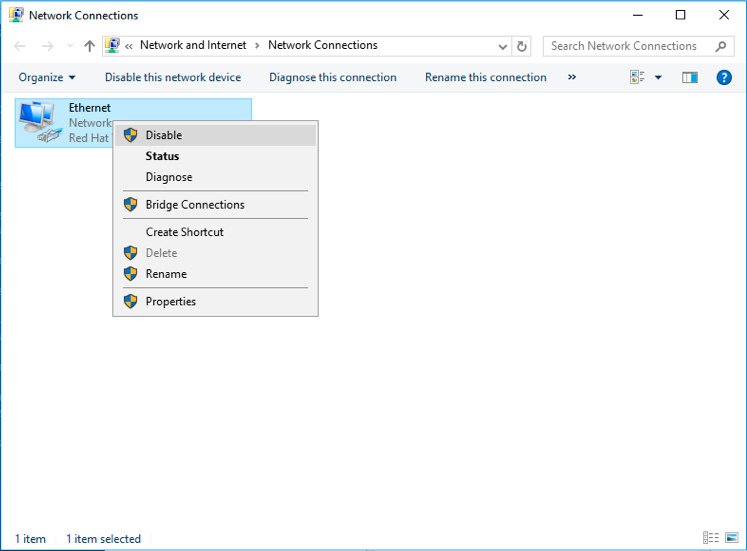

> [!primary]
> Tłumaczenie zostało wygenerowane automatycznie przez system naszego partnera SYSTRAN. W niektórych przypadkach mogą wystąpić nieprecyzyjne sformułowania, na przykład w tłumaczeniu nazw przycisków lub szczegółów technicznych. W przypadku jakichkolwiek wątpliwości zalecamy zapoznanie się z angielską/francuską wersją przewodnika. Jeśli chcesz przyczynić się do ulepszenia tłumaczenia, kliknij przycisk „Zaproponuj zmianę” na tej stronie.
> 

**Ostatnia aktualizacja z dnia 27-04-2021**

## Wprowadzenie

Być może będziesz musiał skonfigurować adresy IP Failover na Twoich instancjach, na przykład, jeśli hostujesz dużą liczbę stron WWW na Twojej instancji lub hostujesz projekty międzynarodowe. Adresy IP Failover OVHcloud umożliwiają przypisanie kilku adresów IP do jednego interfejsu sieciowego.

**Niniejszy przewodnik wyjaśnia, jak dodawać adresy IP Failover do Twojej konfiguracji sieci.**

> [!warning]
>OVHcloud świadczy usługi, za które jesteś odpowiedzialny w związku z ich konfiguracją i zarządzaniem. Jesteś więc odpowiedzialny za ich prawidłowe funkcjonowanie.
>
>Niniejszy przewodnik ma na celu pomoc w wykonywaniu bieżących zadań. W przypadku trudności lub wątpliwości związanych z administrowaniem, użytkowaniem lub wdrażaniem usług na serwerze zalecamy kontakt z wyspecjalizowanym dostawcą usług.
>

## Wymagania początkowe

- instancji [Public Cloud](https://www.ovhcloud.com/pl/public-cloud/) na Twoim koncie OVHcloud
- adresu [IP Failover](https://www.ovhcloud.com/pl/bare-metal/ip/) lub bloku IP Failover
- dostęp administratora (root) przez SSH lub GUI do Twojej instancji
- podstawowa wiedza o sieciach i ich administrowaniu

## W praktyce

Niniejszy przewodnik zawiera najpopularniejsze konfiguracje dystrybucji/systemów operacyjnych. Pierwszy etap polega zawsze na logowaniu się do Twojej instancji przez SSH lub poprzez sesję logowania do interfejsu graficznego użytkownika (RDP dla instancji Windows). Poniższe przykłady zakładają, że jesteś zalogowany jako użytkownik z dużymi uprawnieniami (administrator/sudo).

> [!primary]
>
Jeśli chodzi o różne wersje dystrybucji, należy pamiętać, że można zmodyfikować odpowiednią procedurę konfiguracji Twojego interfejsu sieciowego oraz nazw plików. W przypadku trudności zalecamy zapoznanie się z dokumentacją dotyczącą systemu operacyjnego.
>

**Należy wziąć pod uwagę następującą terminologię, która zostanie użyta w przykładach kodu i instrukcjach zawartych w tym przewodniku:**

|Nazwa|Opis|Przykłady|
|---|---|---|
|IP_FAILOVER|Adres IP Failover przypisany do Twojej usługi|169.254.10.254|
|NETWORK_INTERFACE|Nazwa interfejsu sieciowego|*eth0*, *ens3*|
|ID|ID aliasu IP, zaczynające się od *0* (w zależności od liczby dodatkowych adresów IP do skonfigurowania)|*0*, *1*|

### Debian 10

#### Etap 1: wyłącz automatyczną konfigurację sieci

Otwórz ścieżkę dostępu do następującego pliku z edytorem tekstu:

```bash
sudo nano /etc/cloud/cloud.cfg.d/99-disable-network-config.cfg
```

Wprowadź następującą linię, następnie zapisz i wyjdź z edytora.

```bash
network: {config: disabled}
```

Utworzenie tego pliku konfiguracyjnego zapobiega automatycznemu wprowadzaniu zmian w konfiguracji Twojej sieci.

#### Etap 2: zmień plik konfiguracyjny sieci

Nazwy interfejsu sieciowego możesz sprawdzić za pomocą polecenia:

```bash
ip a
```

Otwórz plik konfiguracyjny sieci, aby go zmienić za pomocą następującego polecenia:

```bash
sudo nano /etc/network/interfaces.d/50-cloud-init
```

Następnie dodaj następujące wiersze:

```bash
auto NETWORK_INTERFACE:ID
iface NETWORK_INTERFACE:ID inet static
address IP_FAILOVER
netmask 255.255.255.255
```

#### Etap 3: uruchom ponownie interfejs

Zastosuj zmiany za pomocą polecenia:

```bash
sudo systemctl restart networking
```

### Ubuntu 20.04

Plik konfiguracyjny adresów IP Failover znajduje się w katalogu `/etc/netplan/`. W tym przykładzie nosi nazwę "50-cloud-init.yaml". Zanim wprowadzisz zmiany, sprawdź w tym folderze nazwę rzeczywistego pliku. Każdy adres IP Failover wymaga własnej linii w pliku.

#### Etap 1: wyłącz automatyczną konfigurację sieci

Otwórz ścieżkę dostępu do następującego pliku z edytorem tekstu:

```bash
sudo nano /etc/cloud/cloud.cfg.d/99-disable-network-config.cfg
```

Wprowadź następującą linię, następnie zapisz i wyjdź z edytora.

```bash
network: {config: disabled}
```

Utworzenie tego pliku konfiguracyjnego zapobiega automatycznemu wprowadzaniu zmian w konfiguracji Twojej sieci.

#### Etap 2: zmień plik konfiguracyjny

Nazwy interfejsu sieciowego możesz sprawdzić za pomocą polecenia:

```bash
ip a
```

Otwórz plik konfiguracyjny sieci, aby go zmienić za pomocą następującego polecenia:

```bash
sudo nano /etc/netplan/50-cloud-init.yaml
```

Nie zmieniaj istniejących linii w pliku. Dodaj adres IP Failover, postępując zgodnie z poniższym przykładem:

```yaml
network:
    version: 2
    ethernets:
        NETWORK_INTERFACE:
            dhcp4: true
            match:
                macaddress: fa:xx:xx:xx:xx:63
            set-name: NETWORK_INTERFACE
            addresses:
            - IP_FAILOVER/32
```

> [!warning]
>
> Ważne jest przestrzeganie wyrównania każdego elementu tego pliku, jak pokazano w powyższym przykładzie. Nie używaj przycisku tabulacji do tworzenia odstępów.
>

Zapisz i zamknij plik.

#### Etap 3: zastosować nową konfigurację sieci

Możesz przetestować konfigurację za pomocą polecenia:

```bash
sudo netplan try
```

Jeśli jest poprawna, zastosuj ją za pomocą następującego polecenia:

```bash
sudo netplan apply
```

Powtórz tę procedurę dla każdego adresu IP Failover.

### Windows Server 2012

#### Etap 1: sprawdź konfigurację sieci

Kliknij prawym przyciskiem myszy przycisk `Menu Start`{.action} i otwórz `Uruchom`{.action}.

Wpisz `cmd` i kliknij `OK`{.action}, aby otworzyć aplikację wiersza poleceń.

{.thumbnail}

Aby pobrać aktualną konfigurację IP, wprowadź `ipconfig` w wierszu poleceń.

{.thumbnail}

#### Etap 2: zmień właściwości IPv4

Teraz zmodyfikuj właściwości IP w konfigurację statyczną.

Otwórz parametry adaptera w Panelu konfiguracyjnym Windows, a następnie otwórz `Właściwości`{.action} protokołu `Internet Protocol Version 4 (TCP/IPv4)`{.action}.

{.thumbnail}

W oknie Właściwości IPv4 wybierz `Użyj następującego`{.action} adresu IP. Wpisz adres IP, który otrzymałeś w pierwszym etapie, po czym kliknij `Zaawansowane`{.action}.

#### Etap 3: dodać adres IP Failover do zaawansowanych ustawień TCP/IP

W nowym oknie kliknij `Dodaj...`{.action} pod "Adresy IP". Wpisz adres IP Failover i maskę podsieci (255.255.255.255).

{.thumbnail}

Potwierdź klikając `Dodaj`{.action}.

{.thumbnail}

#### Etap 4: uruchom ponownie interfejs sieciowy

Wróć do panelu konfiguracyjnego (`Połączenia sieciowe`{.action}), kliknij prawym przyciskiem myszy interfejs sieciowy, a następnie wybierz `Wyłącz`{.action}.

{.thumbnail}

Aby go ponownie uruchomić, kliknij prawym przyciskiem myszy, a następnie wybierz `Aktywuj`{.action}.

{.thumbnail}

#### Etap 5: sprawdź nową konfigurację sieci

Otwórz wiersz poleceń (cmd) i wprowadź `ipconfig`. Konfiguracja musi teraz zawierać nowy adres IP Failover.

{.thumbnail}

### cPanel (CentOS 7) / pochodne Red Hat

#### Etap 1: zmień plik konfiguracyjny sieci

Nazwy interfejsu sieciowego możesz sprawdzić za pomocą polecenia:

```bash
ip a
```

Otwórz plik konfiguracyjny sieci, aby go zmienić:

```bash
sudo nano /etc/sysconfig/network-scripts/ifcfg-NETWORK_INTERFACE:ID
```

Dodaj te linie:

```bash
DEVICE=NETWORK_INTERFACE:ID
BOOTPROTO=static
IPADDR=IP_FAILOVER
NETMASK=255.255.255.255
BROADCAST=IP_FAILOVER
ONBOOT=yes
```

#### Etap 2: uruchom ponownie interfejs

Zastosuj zmiany za pomocą polecenia:

```bash
sudo systemctl restart networking
```

### Plesk

#### Etap 1: dostęp do interfejsu zarządzania adresami IP Plesk

W panelu konfiguracyjnym Plesk wybierz `Tools & Settings`{.action} na pasku bocznym po lewej stronie.

{.thumbnail}

Kliknij `IP Addresses`{.action} w **Tools & Settings**.

#### Etap 2: dodaj dodatkowe informacje IP

W tej sekcji kliknij przycisk `Add IP Address`{.action}.

{.thumbnail}

Wprowadź adres IP Failover w formie `xxx.xxx.xxx.xxx/32` w polu "IP address and subnet mask", a następnie kliknij `OK`{.action}.

{.thumbnail}

#### Etap 3: sprawdź aktualną konfigurację IP

W sekcji "IP Addresses" sprawdź, czy adres IP Failover został poprawnie dodany.

{.thumbnail}

### Diagnostyka

Po pierwsze, zrestartuj Twoją instancję za pomocą systemu operacyjnego instancji lub [Panelu client OVHcloud](https://www.ovh.com/auth/?action=gotomanager&from=https://www.ovh.pl/&ovhSubsidiary=pl). Jeśli nadal nie możesz utworzyć połączenia między siecią publiczną a IP Failover i podejrzewasz problem z siecią, zrestartuj instancję w [trybie rescue](../przelaczenie_instancji_w_tryb_rescue/). Następnie możesz skonfigurować adres IP Failover bezpośrednio na instancji.

Po zalogowaniu się do trybu Rescue przez SSH wprowadź następującą komendę:

```bash
ifconfig ens3:0 IP_FAILOVER netmask 255.255.255.255 broadcast IP_FAILOVER up
```

Aby przetestować połączenie, wystarczy wysłać ping na adres IP Failover z zewnątrz. Jeśli odpowiada w trybie Rescue, prawdopodobnie oznacza to, że wystąpił błąd w konfiguracji. Jeśli jednak adres IP nadal nie działa, poinformuj o tym zespół pomocy technicznej OVHcloud, wysyłając zgłoszenie serwisowe w [Panelu client OVHcloud](https://www.ovh.com/auth/?action=gotomanager&from=https://www.ovh.pl/&ovhSubsidiary=pl).

## Sprawdź również

[Importuj IP Failover](../importowanie_adresu_ip_fail_over/)

[Przenieś IP Failover](../przeniesienie_adresu_ip_fail_over/)

Przyłącz się do społeczności naszych użytkowników na stronie <https://community.ovh.com/en/>.
