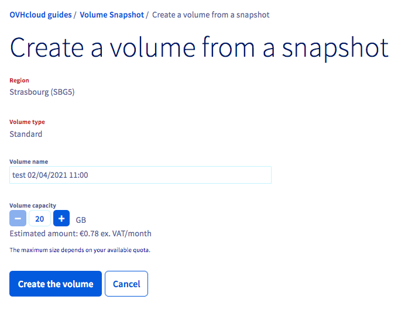

> [!primary]
> Diese Übersetzung wurde durch unseren Partner SYSTRAN automatisch erstellt. In manchen Fällen können ungenaue Formulierungen verwendet worden sein, z.B. bei der Beschriftung von Schaltflächen oder technischen Details. Bitte ziehen Sie beim geringsten Zweifel die englische oder französische Fassung der Anleitung zu Rate. Möchten Sie mithelfen, diese Übersetzung zu verbessern? Dann nutzen Sie dazu bitte den Button «Mitmachen» auf dieser Seite.
>

**Stand 02.04.2021**

## Ziel

Sie können über das Backup einer zusätzlichen Festplatte zusätzliche Festplatten für Ihre Public Cloud Instanzen erstellen.

Dies kann in folgenden Fällen nützlich sein:

- Wenn Sie die zusätzlichen Festplattendaten wiederherstellen möchten.
- Wenn Sie einen hochverfügbaren und leistungsfähigen Speicherplatz für Ihre Daten benötigen.
- Wenn Sie Ihre Daten auf eine andere Instanz übertragen möchten.

**So erstellen und konfigurieren Sie über das Backup einer Festplatte eine zusätzliche Festplatte auf einer Ihrer Instanzen**

## Voraussetzungen

- Sie sind in Ihrem [OVHcloud Kundencenter eingeloggt](https://www.ovh.com/auth/?action=gotomanager&from=https://www.ovh.de/&ovhSubsidiary=de){.external}.
- Sie haben [eine Public Cloud](https://www.ovhcloud.com/de/public-cloud/){.external} Instanz in Ihrem OVHcloud Account.
- Sie haben ein Festplattenbackup in der gleichen OpenStack-Region.
- Sie haben als Administrator (Root) via SSH Zugriff auf Ihre Instanz.

## In der praktischen Anwendung

### Festplatte aus einem Backup erstellen

Verbinden Sie sich mit dem [OVHcloud Kundencenter](https://www.ovh.com/auth/?action=gotomanager&from=https://www.ovh.de/&ovhSubsidiary=de), gehen Sie in den Bereich `Public Cloud`{.action} und wählen Sie das betreffende Public Cloud Projekt aus. Klicken Sie dann im linken Menü auf `Volume Snapshot`{.action} unter `Storage`.

Klicken Sie rechts neben dem Backup Ihrer Wahl auf den Button `...`{.action} und dann auf `Volume erstellen`{.action}.

{.thumbnail}

Legen Sie dann den Namen und die Kapazität dieser neuen Festplatte fest und klicken Sie auf `Volume erstellen`{.action}.

{.thumbnail}

Die Erstellung der Festplatte kann abhängig von deren Größe einige Minuten in Anspruch nehmen.

### Festplatte mit einer Instanz verbinden

Sobald die Festplatte erstellt ist, können Sie sie mit einer Instanz verbinden. Klicken Sie hierzu auf `Block Storage`{.action} in der linken Navigationsleiste unter `Storage`.

Klicken Sie rechts neben dem Volume Ihrer Wahl auf den Button `...`{.action} und dann auf `Mit der Instanz verbinden`{.action}.

{.thumbnail}

Wählen Sie nun die Instanz aus und klicken Sie auf `Bestätigen`{.action}, um die Festplatte anzuhängen.

{.thumbnail}

Der Vorgang zur Anbindung der Festplatte an Ihre Instanz beginnt und kann einige Minuten dauern.

{.thumbnail}

> [!warning]
Sie müssen die Navigation außerhalb des laufenden Tabs während der Festplattenbindung vermeiden. Dadurch kann der Prozess unterbrochen werden.
>

Wenn die Verbindung abgeschlossen ist, können Sie die folgenden Schritte unter [Linux](../erstellen_zustzliche_festplatte_public_cloud/#unter-linux) oder [Windows ausführen](../erstellen_zustzliche_festplatte_public_cloud/#unter-windows).

## Weiterführende Informationen

Für den Austausch mit unserer User Community gehen Sie auf <https://community.ovh.com/en/>.
