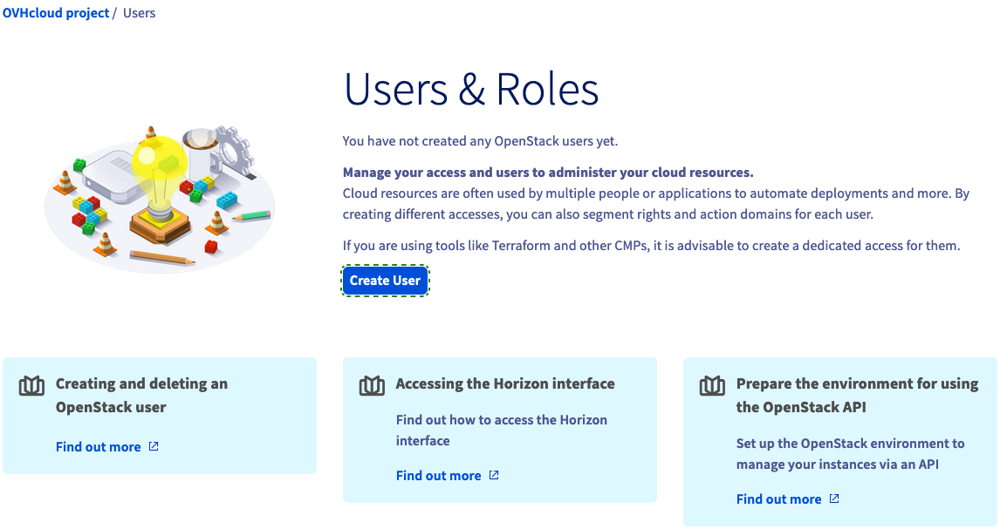

> [!primary]
> Questa traduzione è stata generata automaticamente dal nostro partner SYSTRAN. I contenuti potrebbero presentare imprecisioni, ad esempio la nomenclatura dei pulsanti o alcuni dettagli tecnici. In caso di dubbi consigliamo di fare riferimento alla versione inglese o francese della guida. Per aiutarci a migliorare questa traduzione, utilizza il pulsante "Modifica" di questa pagina.
>

**Ultimo aggiornamento: 17/03/2022**

## Obiettivo

L'accesso a Horizon e alle API OpenStack avviene tramite combinazioni identificativo/password chiamate "*OpenStack Users*". È possibile creare tutti gli utenti OpenStack necessari e attribuire loro diversi diritti di accesso.

**Questa guida ti mostra come gestire gli utenti OpenStack dallo Spazio Cliente OVHcloud.**

<iframe width="560" height="315" src="https://www.youtube.com/embed/NC69nrb6QlA" title="YouTube video player" frameborder="0" allow="accelerometer; autoplay; clipboard-write; encrypted-media; gyroscope; picture-in-picture" allowfullscreen></iframe>

## Prerequisiti

- Un progetto [Public Cloud](https://www.ovhcloud.com/it/public-cloud/) nel tuo account OVHcloud
- Avere accesso allo [Spazio Cliente OVHcloud](https://www.ovh.com/auth/?action=gotomanager&from=https://www.ovh.it/&ovhSubsidiary=it)

> [!primary]
>
> Se il progetto Public Cloud in questione è il **primo progetto** creato nel tuo Spazio Cliente, la creazione di utenti OpenStack sarà possibile solo dopo 7 giorni dalla data di creazione del progetto.
>
> È possibile richiedere l'eliminazione di questa misura di sicurezza creando un ticket di assistenza nel tuo Spazio Cliente.
>

## Procedura

### Crea un utente OpenStack

Accedi allo Spazio Cliente OVHcloud e apri il tuo progetto `Public Cloud`{.action}. Clicca su `Users & Roles`{.action} nel menu a sinistra sotto "Project management". 

Clicca sul pulsante `Crea un utente`{.action}.

{.thumbnail}

La descrizione dell'utente non è il nome utente OpenStack ma una descrizione da inserire per aiutarti a organizzare gli utenti e i loro diritti. Inserisci una descrizione e clicca su `Seguente`{.action}.

{.thumbnail}

Adesso puoi selezionare ruoli che rappresentano le autorizzazioni che l'utente otterrà. Per ogni casella selezionata, l'utente otterrà privilegi di accesso in base alla tabella qui sotto.

{.thumbnail}

Clicca su `Conferma`{.action} per creare l'utente OpenStack. L'identificativo e la password vengono generati automaticamente e visualizzati nello Spazio Cliente.

{.thumbnail}

Salva la password, solo visualizzata in verde in quel momento, su un gestore di password. La password non potrà essere recuperata in seguito. Tuttavia, è sempre possibile creare una nuova password cliccando su `...`{.action} e selezionando `Rigenerare una password`{.action}.

{.thumbnail}

Una volta creato l'utente OpenStack, puoi utilizzare le credenziali per accedere all'[interfaccia Horizon](https://docs.ovh.com/it/public-cloud/horizon/) cliccando sul link `Horizon`{.action} nel menu di sinistra.

### Elimina l'utente OpenStack

L'utente OpenStack viene eliminato dallo [Spazio Cliente OVHcloud](https://www.ovh.com/auth/?action=gotomanager&from=https://www.ovh.it/&ovhSubsidiary=it). Clicca su `Users & Roles`{.action} nel menu a sinistra sotto "Project management". 

{.thumbnail}

Clicca su `...`{.action} e seleziona `Elimina`{.action}.

> [!warning]
>
> L'eliminazione di un utente è definitiva e invaliderà tutti i token associati, inclusi quelli la cui data di scadenza non è ancora stata superata.
> 

## Per saperne di più

[Introduzione a Horizon](https://docs.ovh.com/it/public-cloud/horizon/)

Contatta la nostra Community di utenti all’indirizzo <https://community.ovh.com/en/>.