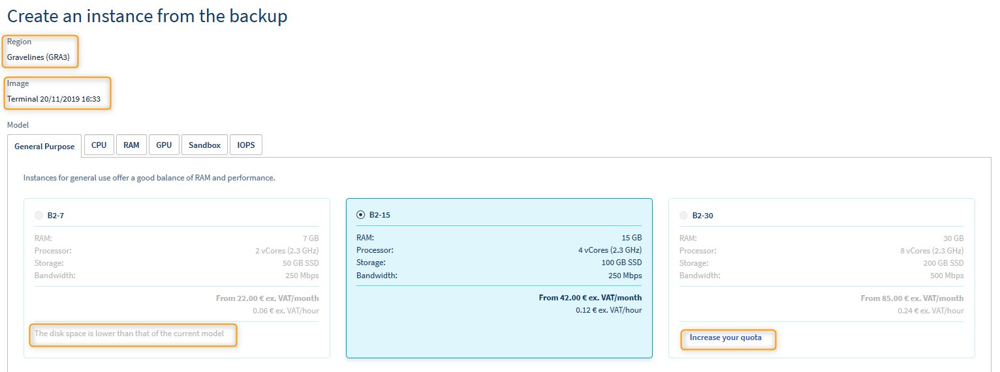

**Última actualización: 22/11/2019**

## Objetivo
Quizá necesite, en algún momento, restaurar su instancia utilizando un snapshot, por ejemplo, por haber configurado de manera incorrecta su instancia. 

Este mismo snapshot también podría servirle para crear una nueva instancia, para duplicar la primera y efectuar la distribución de carga, o incluso, para contar con alta disponibilidad.

En esta guía, explicaremos cómo utilizar sus snapshots para volver a crear, duplicar o, incluso, restaurar sus instancias.

## Requisitos
- Disponer de un snapshot de una instancia de Public Cloud. Para ello, consulte [la guía dedicada a la creación de un snapshot](../guardar_copia_de_seguridad_de_una_instancia/).
- Estar conectado al área de cliente de OVHcloud.

## Procedimiento

### Crear una instancia a partir de un snapshot

Conéctese a su [área de cliente de OVHcloud](https://ca.ovh.com/auth/?action=gotomanager&from=https://www.ovh.com/world/&ovhSubsidiary=ws){.external} y seleccione `Public Cloud`{.action}. Luego, seleccione la sección `Instancia de backup`{.action}.

Haga clic en los `...`{.action} a la derecha del snapshot seleccionado y por último, en `Crear una instancia`{.action}.

{.thumbnail}

Se abrirá la página de creación de instancia.

{.thumbnail}

Algunos elementos están predefinidos:

* La localización: su instancia se creará en el mismo datacenter de su snapshot.
* La imagen: corresponderá a su snapshot.
* Los modelos: solo estarán disponibles aquellos que puedan alojar su imagen, en función de su capacidad.

Para más información sobre la creación de una instancia, consulte [la presente guía](../crear_una_instancia_desde_el_area_de_cliente_de_ovh/).

Para crear una instancia en un datacenter diferente al del snapshot, habrá que transferirla a la zona correspondiente. Remítase entonces a la [guía que explica sobre cómo transferir un snapshot de una instancia entre datacenters](../transferir-backup-de-instancia-entre-datacenters/).

### Restaurar una instancia a partir de un snapshot

Para restaurar una instancia a partir de un snapshot, seleccione esta vez el menú `Instancia,`{.action} luego haga clic en el botón `...`{.action} a la derecha de la instancia que desea restaurar y por último, en `Editar`{.action}.

{.thumbnail}

Se abrirá la página de edición de instancia. Allí, podrá modificar:

* El nombre de la instancia
* La imagen de la instancia
* El modelo de la instancia
* La facturación de la instancia (solo desde el modelo «Horario» y el modelo «Mensual»).

En la sección `Imagen`{.action}, seleccione la del snapshot que va a restaurar.

{.thumbnail}

> [!alert]
>
>Tal como se indica en el recuadro amarillo, no podrá recuperarse ningún dato que se haya añadido después de la creación de este snapshot.
>

## Más información

Interactúe con nuestra comunidad de usuarios en <https://community.ovh.com/en/>.
