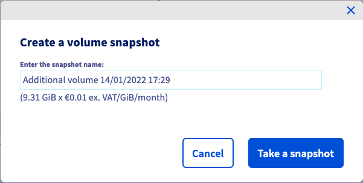

> [!primary]
> Questa traduzione è stata generata automaticamente dal nostro partner SYSTRAN. I contenuti potrebbero presentare imprecisioni, ad esempio la nomenclatura dei pulsanti o alcuni dettagli tecnici. In caso di dubbi consigliamo di fare riferimento alla versione inglese o francese della guida. Per aiutarci a migliorare questa traduzione, utilizza il pulsante "Modifica" di questa pagina.
>

**Ultimo aggiornamento: 18/01/2022**

## Obiettivo

Creare uno Snapshot di un volume aggiuntivo corrisponde generalmente a due obiettivi:

- effettuare backup in pochi click e conservarli per il tempo necessario;
- utilizzare lo snapshot come modello per lo stesso volume

**Questa guida ti mostra come creare uno Snapshot di un volume dallo Spazio Cliente OVHcloud.**

## Prerequisiti

- Avere accesso allo [Spazio Cliente OVHcloud](https://www.ovh.com/auth/?action=gotomanager&from=https://www.ovh.it/&ovhSubsidiary=it)
- Un volume [Block Storage](../crea_e_configura_un_disco_aggiuntivo_sulla_tua_istanza/) creato nel tuo progetto [Public Cloud](https://www.ovhcloud.com/it/public-cloud/)

## Procedura

Accedi allo [Spazio Cliente OVHcloud](https://www.ovh.com/auth/?action=gotomanager&from=https://www.ovh.it/&ovhSubsidiary=it), accedi alla sezione `Public Cloud`{.action} e seleziona il tuo progetto. Poi apri `Block Storage`{.action} nel menu a sinistra.

{.thumbnail}

A destra del volume interessato, clicca sui tre puntini `...`{.action} e poi su `Crea uno Snapshot`{.action} (non è necessario scollegare prima il volume dell'istanza).

{.thumbnail}

Nella nuova finestra, è possibile assegnare un nome diverso allo Snapshot. Leggi le tariffe e clicca su `Crea uno Snapshot`{.action}.

Il tempo di creazione dello Snapshot dipende dalla quantità di dati presenti sul volume.

Dato che uno Snapshot di volume è un clone su tutto il disco, avrà la dimensione massima del volume iniziale, indipendentemente dall'allocazione effettiva di spazio disco.

{.thumbnail}

Apri la sezione `Volume Snapshot`{.action} nella barra di navigazione a sinistra. Una volta creato lo Snapshot, verrà aggiunto a questa tabella.

Clicca sul pulsante `...`{.action} per eliminare uno Snapshot o `Creare un volume`{.action} a partire dallo Snapshot corrispondente. Per maggiori informazioni, consulta [questa guida](../creare-volume-da-backup/).

## Per saperne di più

[Creare un volume a partire da un backup](../creare-volume-da-backup/)

[Crea e configura un disco aggiuntivo sulla tua istanza](../crea_e_configura_un_disco_aggiuntivo_sulla_tua_istanza/)

[Aumenta la spazio del tuo disco aggiuntivo](../aumenta_la_spazio_del_tuo_disco_aggiuntivo/)

Contatta la nostra Community di utenti all’indirizzo <https://community.ovh.com/en/>.