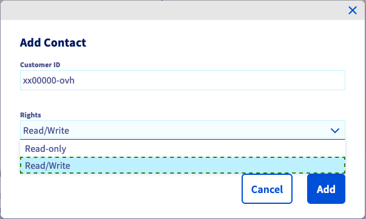

**Dernière mise à jour le 25/02/2022**

## Objectif

En fonction de votre cas d'utilisation, vous pouvez être amené à devoir donner accès à votre projet à d'autres utilisateurs, sans pour autant leur donner un accès total à vos services.
À cette fin, vous pouvez déléguer des droits de lecture seule ou de lecture / écriture pour vos projets à d'autres comptes client OVHcloud.

**Ce guide vous explique comment déléguer des droits d'accès à un projet Public Cloud dans votre espace client.**

### Prérequis

- Avoir une instance [Public Cloud](https://www.ovhcloud.com/en-gb/public-cloud/) dans votre compte OVHcloud.
- Être connecté à votre espace client [OVHcloud](https://www.ovh.com/auth/?action=gotomanager&from=https://www.ovh.com/fr/&ovhSubsidiary=fr)

## En pratique 

Connectez-vous à votre espace client [OVHcloud](https://www.ovh.com/auth/?action=gotomanager&from=https://www.ovh.com/fr/&ovhSubsidiary=fr) et ouvrez votre projet `Public Cloud`{.action}. Cliquez sur `Contacts and Rights`{.action} dans la section **Project Management**.

Cette page vous permet de voir les contacts associés à votre projet.

{.thumbnail}

### Configuration des contacts du projet

Vous pouvez cliquer sur les boutons `Modifier`{.action} pour changer les contacts actuels. Cela ouvrira la **rubrique Gestion** des contacts de votre espace client. Suivez les instructions décrites dans notre guide "[Gérer les contacts de ses servicesEN-GB update Delegating projects for Public Cloud](https://docs.ovh.com/fr/customer/gestion-des-contacts/)" afin de finaliser cette manipulation.

### Ajout de contacts et droits

Cliquez sur le bouton `Ajouter`{.action} pour ajouter un utilisateur et lui attribuer des droits. Sur la fenêtre qui apparaît, renseignez l'identifiant de l'utilisateur (de la forme xx00000-ovh) puis sélectionnez `Lecture seule` ou `Lecture/Écriture` dans le menu.

{.thumbnail}

> [!primary]
>
Notez que les droits de `lecture/écriture` autorisent des modifications sur le projet qui pourraient avoir une incidence sur la facturation future.
>
 
Cliquez sur `Ajouter`{.action} pour valider la délégation d'accès. Un e-mail de confirmation va vous être envoyé ainsi qu'au nouvel utilisateur qui pourra maintenant ouvrir le projet dans la section Public Cloud de son espace client.

Une fois la page rechargée, les comptes clients OVHcloud ajoutés ainsi que leurs droits respectifs sont listés dans le tableau.

{.thumbnail}

Pour révoquer un accès, cliquez sur le bouton `...`{.action} puis sélectionnez `Supprimer`{.action}.

## Aller plus loin

[Démarrer avec une instance Public Cloud](https://docs.ovh.com/fr/public-cloud/premiers-pas-instance-public-cloud/)

[Informations concernant le mode de facturation Public Cloud](https://docs.ovh.com/fr/public-cloud/information-concernant-le-mode-de-facturation-cloud/)

[Paramètres d’accès et de sécurité dans Horizon](https://docs.ovh.com/fr/public-cloud/acces-et-securite-dans-horizon/)

Échangez avec notre communauté d'utilisateurs sur <https://community.ovh.com/>.
