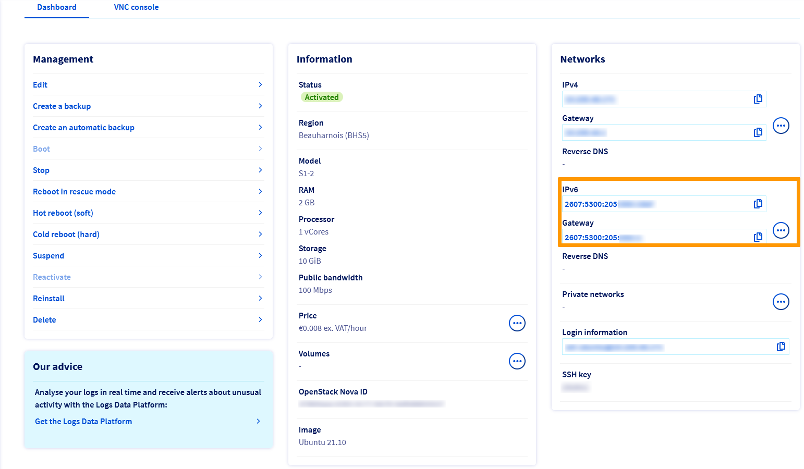

**Ostatnia aktualizacja z dnia 25-11-2019**

## Wprowadzenie
Internet Protocol version 6 (IPv6) to najnowsza wersja protokołu internetowego (IP – Internet Protocol). Został on zaprojektowany, by rozwiązać od dawna przewidywany problem wyczerpywania się puli adresów IPv4 dzięki wykorzystaniu adresów 128-bitowych zamiast tradycyjnie stosowanych 32-bitowych adresów IPv4.

Każda instancja Public Cloud jest dostarczana z jednym adresem IPv4 i jednym adresem IPv6.

Domyślnie skonfigurowany jest tylko adres IPv4.

W tym tutorialu dowiesz się, jak skonfigurować adres IPv6 dla instancji Public Cloud.

## Wymagania początkowe

* Dowolny model instancji Public Cloud.
* Znajomość SSH.
* Posiadanie podstawowej wiedzy w zakresie sieci informatycznych.

## W praktyce

### Słowniczek

Oto krótki słowniczek terminów stosowanych w tym tutorialu:

|Słowniczek|Opis|
|---|---|
|IPV6_BLOCK|Blok IPv6 przydzielony do Twojej usługi|
|YOUR_IPV6|Adres IPv6 przypisany do Twojej usługi|
|IPv6_PREFIX|Prefiks Twojego bloku IPv6 (np. 2607:5300:60:62ac::/128 -> netmask = 128)|
|IPv6_GATEWAY|Brama sieciowa Twojego bloku IPv6|


### Pobranie danych sieciowych

Zaloguj się do panelu klienta, kliknij menu sekcji `Public Cloud`{.action}, wybierz projekt Public Cloud i kliknij pozycję `Instances`{.action} w menu bocznym po lewej stronie. Następnie kliknij na `...`{.action} obok odpowiadającej instancji i kliknij na `Szczegóły instancji`{.action}.

{.thumbnail}

Wszystkie niezbędne informacje będą widoczne w sekcji **Sieci**.

{.thumbnail}

### Przykłady konfiguracji stałych

> [!primary] **Przykłady**
> 
>Poniższe przykłady mają jedynie charakter poglądowy.
>
>Twoim obowiązkiem jako administratora usługi jest dostosowanie ich do posiadanej dystrybucji.
>

Najpierw połącz się ze swoją instancją przez SSH.

#### **W systemie Debian / Ubuntu**

Zakładając, że Twój interfejs sieciowy to eth0 i że korzystasz z systemu operacyjnego Debian, należy dodać konfigurację wyglądającą mniej więcej w ten sposób:

Plik do edycji (z uprawnieniami sudo): /etc/network/interfaces

```
iface eth0 inet6 static
address YOUR_IPV6
netmask IPV6_PREFIX
post-up /sbin/ip -6 route add IPV6_GATEWAY dev eth0
post-up /sbin/ip -6 route add default via IPV6_GATEWAY dev eth0
pre-down /sbin/ip -6 route del default via IPV6_GATEWAY dev eth0
pre-down /sbin/ip -6 route del IPV6_GATEWAY dev eth0
```

Oto konkretny przykład:

```
iface eth0 inet6 static
address 2001:41d0:xxx:xxxx::999
netmask 128
post-up /sbin/ip -6 route add 2001:41d0:xxx:xxxx::111 dev eth0
post-up /sbin/ip -6 route add default via 2001:41d0:xxx:xxxx::111 dev eth0
pre-down /sbin/ip -6 route del default via 2001:41d0:xxx:xxxx::111 dev eth0
pre-down /sbin/ip -6 route del 2001:41d0:xxx:xxxx::111 dev eth0
```
#### **W systemie RedHat / CentOS**

Zakładając, że Twój interfejs to eth0, konfiguracja powinna wyglądać mniej więcej tak:

Plik do edycji (z uprawnieniami sudo): /etc/sysconfig/network-scripts/ifcfg-eth0

```
IPV6INIT=yes
IPV6ADDR=YOUR_IPV6/IPV6_PREFIX
IPV6_DEFAULTGW=IPV6_GATEWAY
```

Oto konkretny przykład:

```
IPV6INIT=yes
IPV6ADDR=2001:41d0:xxx:xxxx::999
IPV6_DEFAULTGW=2001:41d0:xxx:xxxx::111
```

#### **W systemie Windows**

Przejdź do sekcji `Połączenia sieciowe`{.action} w systemie Windows.

{.thumbnail}

Następnie kliknij prawym przyciskiem kartę sieciową, by przejść do jej `Właściwości`{.action}.

{.thumbnail}

Kliknij `IPv6`{.action}, a następnie `Właściwości`{.action}.

{.thumbnail}

Teraz wprowadź dane Twojego adresu IPv6.

{.thumbnail}

## Diagnostyka

Skonfigurowałeś IPv6, ale nic nie działa? 

Prosta operacja pozwala ustalić, czy usterka jest związana z przeprowadzoną konfiguracją, czy też z siecią OVHcloud.

Najpierw należy [przełączyć instancję na tryb awaryjny rescue-pro](https://docs.ovh.com/pl/public-cloud/przelaczenie_instancji_w_tryb_rescue/).

Następnie skonfiguruj tymczasowy adres IP w oparciu o poniższe przykładowe polecenia:

```
ip addr add YOUR_IPV6/IPV6_PREFIX dev eth0
ip -6 route add IPV6_GATEWAY dev eth0
ip -6 route add default via IPV6_GATEWAY dev eth0
```

Przetestuj ponownie sieć, np. za pomocą polecenia ping6:

```
ping6 ipv6.google.com
```
Jeśli Twoja instancja odpowiada, istnieje duże prawdopodobieństwo, że jeden z etapów konfiguracji początkowej nie został prawidłowo przeprowadzony.

W każdym przypadku warto skontaktować się z działem pomocy technicznej, podając powyższe wyniki powyższych testów, aby uzyskać analizę z naszej strony.

## Sprawdź również

Dołącz do społeczności naszych użytkowników na stronie <https://community.ovh.com/en/>