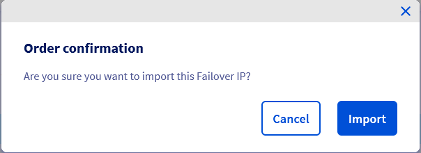

**Last updated 7th April 2020**

## Objective

You might need to configure a failover IP address on your instances because:

- You have multiple websites on your instance.
- You host international projects.
- You want to migrate from a Dedicated Server to a Public Cloud instance.

Instead oy buying additional ones, you can import a failover IP address that is linked to a different OVHcloud service.

**This guide explains how to import this failover IP into your OVHcloud Public Cloud project.**

## Requirements

- A [Public Cloud project](https://www.ovhcloud.com/en/public-cloud/) in your OVHcloud account
- Access to the [OVHcloud Control Panel](https://ca.ovh.com/auth/?action=gotomanager&from=https://www.ovh.com/world/&ovhSubsidiary=we){.external}
- A [failover IP address](https://www.ovhcloud.com/en/bare-metal/ip/){.external}

## Instructions

Log in to the [OVHcloud Control Panel](https://ca.ovh.com/auth/?action=gotomanager&from=https://www.ovh.com/world/&ovhSubsidiary=we), go to the `Public Cloud`{.action} section and select the Public Cloud service concerned. Then, select `Failover IP`{.action} in the "Network" section.

{.thumbnail}

Click on `Import a failover IP`{.action} to display all the IP addresses that can be imported into your Public Cloud project.

{.thumbnail}

Click on `...`{.action} next to the IP address you would like to import and click `Import this failover IP`{.action}.

{.thumbnail}

Confirm by clicking on `Import`{.action}.

{.thumbnail}

The page will refresh and the information that the IP address was migrated successfully will appear.

When the failover IP has been successfully imported, click on `...`{.action} on the right and select `Modify the associated instance`{.action}.

{.thumbnail}

A pop-up will appear to choose the instance to which your IP address should be attached.

{.thumbnail}

Click on `Attach`{.action} to confirm. The page will display a modification message.

{.thumbnail}

The IP address is now associated with your instance.
The next step will be the IP configuration in your OS; please refer to our [guide](../configure_a_failover_ip).

## Go further

Join our community of users on <https://community.ovh.com/en/>.
