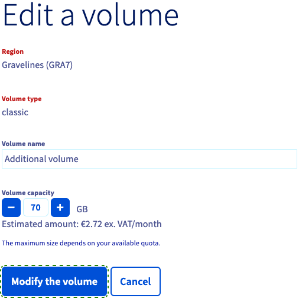
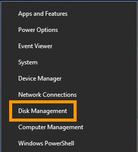

> [!primary]
> Diese Übersetzung wurde durch unseren Partner SYSTRAN automatisch erstellt. In manchen Fällen können ungenaue Formulierungen verwendet worden sein, z.B. bei der Beschriftung von Schaltflächen oder technischen Details. Bitte ziehen Sie beim geringsten Zweifel die englische oder französische Fassung der Anleitung zu Rate. Möchten Sie mithelfen, diese Übersetzung zu verbessern? Dann nutzen Sie dazu bitte den Button «Mitmachen» auf dieser Seite.
>

**Letzte Aktualisierung am 29.03.2022**

## Ziel

Wenn Sie die maximale Kapazität Ihrer zusätzlichen Disk erreicht haben, können Sie Speicherplatz hinzufügen, indem Sie deren Größe erweitern. 

**Diese Anleitung erklärt, wie Sie die Größe einer zusätzlichen Disk erweitern und die Hauptpartition entsprechend erweitern.**

## Voraussetzungen

- Sie verfügen über eine [Public Cloud Instanz](https://www.ovhcloud.com/de/public-cloud) in Ihrem Public Cloud Projekt.
- Sie haben eine [zusätzliche Disk](../erstellen_zustzliche_festplatte_public_cloud/) in Ihrem Projekt erstellt.
- Sie haben Zugriff auf Ihr [OVHcloud Kundencenter](https://www.ovh.com/auth/?action=gotomanager&from=https://www.ovh.de/&ovhSubsidiary=de).
- Sie haben administrativen Zugriff auf Ihre Instanz über SSH (Linux) oder RDP (Windows).

## In der praktischen Anwendung

In den folgenden Schritten wird vorausgesetzt, dass Sie bereits eine zusätzliche Disk erstellt haben, wie [in unserer Anleitung beschrieben](../erstellen_zustzliche_festplatte_public_cloud/).

### Größe der Disk ändern

Loggen Sie sich in Ihr [OVHcloud Kundencenter](https://www.ovh.com/auth/?action=gotomanager&from=https://www.ovh.de/&ovhSubsidiary=de) ein und wählen Sie Ihr `Public Cloud`{.action} Projekt aus. Klicken Sie dann im linken Menü auf `Block Storage`{.action}.

Wenn das Volume mit einer **Windows-Instanz** verbunden ist, klicken Sie auf `...`{.action} rechts neben dem betreffenden Volume und wählen Sie `Instanz trennen`{.action} aus.

Klicken Sie auf den Button `...`{.action} rechts neben dem betreffenden Volume und wählen Sie `Bearbeiten`{.action}.

{.thumbnail}

Geben Sie im neuen Fenster die gewünschte Größe des Volumes ein und klicken Sie auf `Volume bearbeiten`{.action}.

{.thumbnail}

Vergewissern Sie sich, dass das Volume an Ihre Instanz angehängt ist, bevor Sie fortfahren. Ist das nicht der Fall, klicken Sie auf `...`{.action} in der Zeile des Volumes und wählen Sie `Mit Instanz verbinden`{.action}.

### Partition erweitern (Linux-Instanz)

Stellen Sie eine SSH-Verbindung zu Ihrer Instanz her, um die Partition an die skalierte Disk anzupassen.

Hängen Sie zuerst die Disk mit folgendem Befehl aus:

```bash
admin@server~$ sudo umount /mnt/disk
```

Die Partition neu erstellen:

```bash
admin@server:~$ sudo fdisk /dev/vdb
```
```console
Welcome to fdisk (util-linux 2.25.2).
Changes will remain in memory only, until you decide to write them.
Be careful before using the write command
```
```console
Command (m for help): d

Selected partition 1
Partition 1 has been deleted.
```
```console
Command (m for help): n

Partition type
p primary (0 primary, 0 extended, 4 free)
e extended (container for logical partitions)
Select (default p):
Using default response p.
Partition number (1-4, default 1):
First sector (2048-146800639, default 2048):
Last sector, +sectors or +size{K,M,G,T,P} (2048-146800639, default 146800639):

Created a new partition 1 of type 'Linux' and of size 70 GiB.
```
```console
Command (m for help): w

The partition table has been altered.
Calling ioctl() to re-read partition table.
Syncing disks.
```

Die Partition überprüfen:

```bash
admin@server:~$ sudo e2fsck -f /dev/vdb1

e2fsck 1.42.12 (29-Aug-2014)
Pass 1: Checking inodes, blocks, and sizes
Pass 2: Checking directory structure
Pass 3: Checking directory connectivity
Pass 4: Checking reference counts
Pass 5: Checking group summary information
/dev/vdb: 12/3276800 files (0.0% non-contiguous), 251700/13107200 blocks
```

```bash
admin@server:~$ sudo resize2fs /dev/vdb1

resize2fs 1.42.12 (29-Aug-2014)
Resizing the filesystem on /dev/vdb to 18350080 (4k) blocks.
The filesystem on /dev/vdb is now 18350080 (4k) blocks long.
```

Abschließend mounten Sie die Disk und überprüfen Sie sie:

```bash
admin@server:~$ sudo mount /dev/vdb1 /mnt/disk/
```

```bash
admin@server~$ df -h
Filesystem Size Used Avail Use% Mounted on
/dev/vda1 9.8G 840M 8.6G 9% /
udev 10M 0 10M 0% /dev
393M 5,2M 388M 2% /run
tmpfs 982M 0 982M 0% /dev/shm
tmpfs 5.0M 0 5.0M 0% /run/lock
982M 0 982M 0% /sys/fs/cgroup
/dev/vdb1 69G 52M 66G 1% /mnt/disk
```

### Partition erweitern (Windows-Instanz)

Stellen Sie eine RDP-Verbindung (Remote Desktop) zu Ihrer Windows-Instanz her.

Wenn Sie eingeloggt sind, klicken Sie mit der rechten Maustaste auf das `Startmenü`{.action} und öffnen Sie `Disk Management`{.action}.

{.thumbnail}

Die erweiterte Disk zeigt nun die zusätzliche Kapazität als nicht zugewiesenen Speicherplatz an.

{.thumbnail}

Klicken Sie mit der rechten Maustaste auf das Volume und wählen Sie `Extend Volume`{.action} im Kontextmenü aus.

{.thumbnail}

Klicken Sie im "Extend Volume Wizard" auf `Next`{.action}, um fortzufahren.

Sie können in diesem Schritt den Speicherplatz ändern, wenn Sie weniger als die Gesamtkapazität zur Partition hinzufügen möchten.

Klicken Sie auf `Next`{.action}.

{.thumbnail}

Klicken Sie auf `Finish`{.action}, um den Vorgang abzuschließen.

Das skalierte Volume beinhaltet nun den zusätzlichen Speicherplatz.

{.thumbnail}

## Weiterführende Informationen

[Zusätzliches Volume auf einer Instanz erstellen und konfigurieren](../erstellen_zustzliche_festplatte_public_cloud/)

Für den Austausch mit unserer Community gehen Sie auf <https://community.ovh.com/en/>.