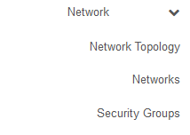

> [!primary]
> Diese Übersetzung wurde durch unseren Partner SYSTRAN automatisch erstellt. In manchen Fällen können ungenaue Formulierungen verwendet worden sein, z.B. bei der Beschriftung von Schaltflächen oder technischen Details. Bitte ziehen Sie beim geringsten Zweifel die englische oder französische Fassung der Anleitung zu Rate. Möchten Sie mithelfen, diese Übersetzung zu verbessern? Dann nutzen Sie dazu bitte den Button «Mitmachen» auf dieser Seite.
>

**Letzte Aktualisierung am 11.11.2021**

## Ziel

Das nativ mit OpenStack angebotene Horizon-Interface wurde von OVHcloud angepasst, um zusätzliche Funktionen zu den im OVHcloud Kundencenter verfügbaren Funktionen zu bieten.

**Entdecken Sie die wichtigsten Abschnitte des Horizon-Interface.**

## Voraussetzungen

- Sie haben ein [Public Cloud Projekt](https://docs.ovh.com/de/public-cloud/erstellung_public_cloud_projekt/){.external} in Ihrem Kunden-Account.
- [Erstellung eines zugangs zu horizon](https://docs.ovh.com/de/public-cloud/erstellung_eines_zugangs_zu_horizon/).

## In der praktischen Anwendung

### Wahl der Region des Datacenters

Anders als im OVHcloud Kundencenter unterscheidet Horizon Ihre Dienste je nach Region. Sie können die Region im Menü oben links auswählen:

{.thumbnail}

### Seitenmenü links

Dieses Menü erlaubt es Ihnen, schnell durch das Projekt und die verschiedenen zugehörigen Funktionen zu navigieren.

{.thumbnail}

#### Compute

##### **Übersicht (*Overview*)**

- **Zusammenfassung der Quoten (*Limit Summary*)**

Horizon bietet eine Zusammenfassung der Quotas, damit Sie die für Ihre Projekte genutzten und verfügbaren Ressourcen sehen können:

{.thumbnail}

- **Nutzungsübersicht (*Usage Summary*)**

Hier finden Sie eine Zusammenfassung der Verwendung der Instanzen Ihres Projekts. Der Suchzeitraum kann personalisiert werden, um die Zusammenfassung auf einen gewünschten Zeitraum zu beschränken.

{.thumbnail}

- **Nutzung (*Usage*)**

Eine Zusammenfassung Ihrer "Einsatzzwecke" ist ebenfalls verfügbar. Es handelt sich dabei um eine Zusammenfassung der verschiedenen Dienste, die mit dem Projekt verbunden sind, wie zum Beispiel die Liste der Instanzen.

{.thumbnail}

Die Zusammenfassung kann im CSV-Format heruntergeladen werden, sodass die Informationen extrahiert werden können, um sie dann über andere Tools analysieren zu können. Klicken Sie einfach auf `Download CSV Summary`{.action}.

{.thumbnail}

- **Instances**

Auf dieser Seite können Sie die Instanzen auflisten und verwalten. Hier können zum Beispiel neue Instanzen erstellt, unterbrochen, auf die Konsole der Instanz zugegriffen werden...

- **Images**

Lesen und verwalten Sie über dieses Menü die Images, d. h. die Templates und Snapshots Ihres Projekts.

- **Key Pairs**

Hier können Sie Ihre SSH-Schlüssel für die Verbindung zu Ihren Instanzen auflisten und erstellen.

##### **Volumes**

Dieses Menü erlaubt es Ihnen, die Volumes sowie die Backups und Volume-Snapshots aufzulisten und zu verwalten.

{.thumbnail}

##### **Network**

Lesen und verwalten Sie hier Ihre Netzwerke und die verschiedenen Sicherheitsgruppen. 

{.thumbnail}

##### **Orchestration**

Dieses Menü erlaubt es Ihnen, mehrere zusammengesetzte Cloud-Anwendungen zu orchestrieren. 
Weitere Informationen finden Sie in der [OpenStack Dokumentation](https://docs.openstack.org/horizon/pike/user/stacks.html){.external}.

{.thumbnail}

#### Identity

In diesem Menü finden Sie die Informationen zu Ihren Projekten.

### Benutzermenü

Oben rechts neben dem Horizon-Interface können Sie in einem Benutzermenü unter anderem: 

- Die Anzeigeeinstellungen der Schnittstelle ändern.
- Eine « OpenRC » Datei mit Ihren Benutzerkennungen herunterladen.
- Sie vom Horizon-Interface trennen.

{.thumbnail}

## Weiterführende Informationen

[Einführung in das Public Cloud Interface](https://docs.ovh.com/de/public-cloud/public-cloud-interface/)
 
Für den Austausch mit unserer Community gehen Sie auf <https://community.ovh.com/en/>.