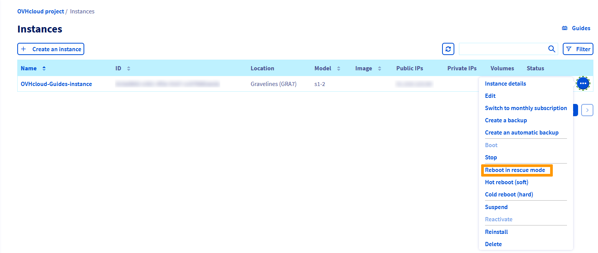

**Dernière mise à jour le 26/07/2021**

## Objectif

En cas de mauvaises configurations, ou de perte de clé SSH, votre instance peut être inaccessible.

Dans de telles circonstances, vous pouvez utiliser le mode rescue pour reconfigurer votre instance ou récupérer vos données. 

**Ce guide vous explique comment mettre votre instance en mode rescue et accéder à vos données.**

## Prérequis

* Une [instance Public Cloud](https://www.ovh.com/ca/fr/public-cloud/){.external} dans votre compte OVHcloud
* Avoir accès à votre [espace client OVHcloud](https://ca.ovh.com/auth/?action=gotomanager&from=https://www.ovh.com/ca/fr/&ovhSubsidiary=qc){.external}
* Avoir accès à votre instance via SSH en tant qu'administrateur (root)

## En pratique

### Activer le mode rescue

Tout d’abord, connectez-vous à [l’espace client d’OVHcloud](https://ca.ovh.com/auth/?action=gotomanager&from=https://www.ovh.com/ca/fr/&ovhSubsidiary=qc){.external}, accédez à la section `Public Cloud`{.action} et sélectionnez le projet Public Cloud concerné.

Cliquez ensuite sur l'onglet `Instances`{.action} dans la barre de navigation à gauche.

Cliquez ensuite sur `...`{.action} à droite de l'instance et sélectionnez `Redémarrer en mode rescue`{.action}.

{.thumbnail}

Vous allez maintenant voir la boîte de dialogue « Démarrer en mode rescue ». Cliquez sur la liste déroulante pour sélectionner la distribution Linux que vous souhaitez utiliser en mode rescue, puis cliquez sur le bouton `Redémarrer`{.action}.

{.thumbnail}

Une fois l’instance redémarrée en mode rescue, une boîte d’information affiche les méthodes d’accès disponibles. Votre **mot de passe du mode rescue** temporaire sera uniquement affiché dans la console VNC. Cliquez sur votre instance dans le tableau, puis accédez à l'onglet `Console VNC`{.action} pour le récupérer.

{.thumbnail}

### Accéder à vos données

Une fois le mode rescue activé, les données de votre instance seront attachées en tant que disque supplémentaire. Il suffit donc de le monter, en suivant les étapes suivantes.

En premier lieu, ouvrez une connexion SSH avec votre instance. Une fois connecté, vérifiez les disques disponibles avec cette commande :

```
root@instance:/home/admin# lsblk

NAME MAJ:MIN RM SIZE RO TYPE MOUNTPOINT
vda 253:0 0 1G 0 disk
└─vda1 253:1 0 1023M 0 part /
vdb 253:16 0 10G 0 disk
└─vdb1 253:17 0 10G 0 part
```

Ensuite, montez la partition :

```
root@instance:/home/admin# mount /dev/vdb1 /mnt
```

Vos données seront maintenant accessibles depuis le dossier /mnt.

### Désactiver le mode rescue

Une fois vos tâches terminées, vous pouvez désactiver le mode rescue en redémarrant votre instance depuis l'espace client. Pour cela, cliquez sur `...`{.action} et sélectionnez `Sortir du mode rescue`{.action}.

{.thumbnail}

### Activer le mode rescue avec les API OpenStack

Vous pouvez activer le mode rescue via les API OpenStack en utilisant la commande suivante :

```
# root@server:~# nova rescue INSTANCE_ID
```

Pour sortir du mode rescue, utilisez la commande suivante :

```
# root@server:~# nova unrescue INSTANCE_ID
```

## Aller plus loin

Échangez avec notre communauté d'utilisateurs sur <https://community.ovh.com/>.
