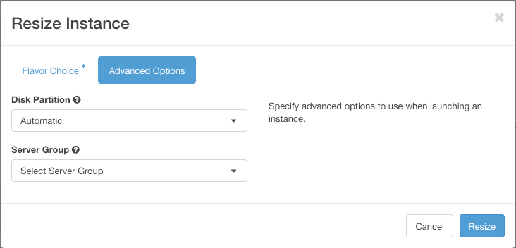

**Última actualización: 10/12/2021**

## Objetivo

Una instancia *flex* es una instancia de disco único (50 GB) que ofrece un proceso más rápido para los snapshots. Permite redimensionar a los modelos superior o inferior con un espacio de almacenamiento fijo, mientras que los modelos clásicos solo pueden redimensionarse hacia los modelos superiores.  Con una infraestructura en constante evolución, puede necesitar aumentar el espacio de almacenamiento de su instancia. En ese caso, deberá cambiar su instancia *flex* a un modelo clásico. Esta acción solo es posible desde Horizon.

**Esta guía explica cómo cambiar de un modelo *flex* a un modelo clásico y redimensionar su instancia *flex* desde la interfaz OpenStack Horizon.**

## Requisitos

- Tener una [instancia de Public Cloud de OVHcloud](../public-cloud-primeros-pasos/#3-crear-una-instancia) de tipo *flex*.
- [Crear un acceso a Horizon](https://docs.ovh.com/us/es/public-cloud/crear_un_acceso_a_horizon/)

## Procedimiento

Conéctese a la [interfaz Horizon](https://horizon.cloud.ovh.net/auth/login/) y asegúrese de estar en la zona adecuada. Puede comprobarlo en la parte superior izquierda. 

{.thumbnail}

En el menú `Compute`{.action}, haga clic en el botón `Instances`{.action}. Seleccione `Resize Instance` {.action} en el menú desplegable situado a la derecha de la instancia correspondiente.

{.thumbnail}

**Elección del plantilla (*Flavor Choice*)** 

Esta sección explica la plantilla actual (*old flavor*) y le permite seleccionar una nueva plantilla (*new flavor*) para el recurso de la instancia.

En nuestro ejemplo, la plantilla es « b2-15-flex ». Podemos volver a una plantilla clásica « b2-15 » o actualizar la instancia hacia la plantilla « b2-30 » para tener más espacio de almacenamiento. En nuestro caso, queremos actualizar nuestra instancia hacia el modelo clásico « b2-30 » para aumentar nuestro espacio de almacenamiento.

{.thumbnail}

> [!warning]
> - Sólo puede pasar de un modelo Linux a otro Linux y de un modelo Windows a otro Windows.
>
> - La opción *flex* no está disponible para todos los modelos.
>

**Opciones avanzadas (*Advanced Options*)**

Esta sección permite gestionar la partición del disco (*Disk Partition*) y el grupo de servidores (*Server Group*).

{.thumbnail}

Para continuar, haga clic en el botón `Resize`{.action}.

Una vez finalizado el proceso, su instancia se migrará a un modelo clásico, con más espacio de almacenamiento.

{.thumbnail}

Si quiere cambiar a un modelo *flex*, puede hacerlo realizando los mismos pasos [anteriores](#flavorchoice) seleccionando una plantilla *flex* en lugar de la clásica. 

También puede [editar la configuración de una instancia](https://docs.ovh.com/us/es/public-cloud/empezar-con-una-instancia-public-cloud/#editar-la-configuracion-de-una-instancia) desde el área de cliente.

## Más información

Interactúe con nuestra comunidad de usuarios en <https://community.ovh.com/en/>.