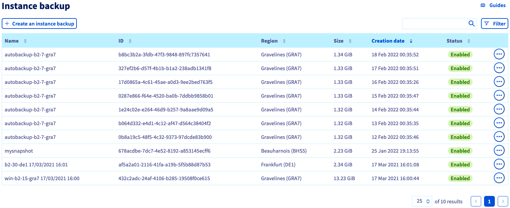

> [!primary]
> Esta traducción ha sido generada de forma automática por nuestro partner SYSTRAN. En algunos casos puede contener términos imprecisos, como en las etiquetas de los botones o los detalles técnicos. En caso de duda, le recomendamos que consulte la versión inglesa o francesa de la guía. Si quiere ayudarnos a mejorar esta traducción, por favor, utilice el botón «Contribuir» de esta página.
> 

**Última actualización: 17/11/2022**

## Objetivo

Puede crear una copia de seguridad única de una instancia o configurar una planificación para automatizar las copias de seguridad de sus instancias. Las copias de seguridad pueden utilizarse para restaurar su instancia a un estado anterior o para crear una nueva instancia idéntica.

**Esta guía explica cómo crear copias de seguridad manuales y automáticas de una instancia de Public Cloud.**

## Requisitos

- Tener una instancia de [Public Cloud](https://www.ovhcloud.com/es/public-cloud/) en su cuenta de OVHcloud.
- Tienes acceso a tu [Panel de configuración de OVHcloud](https://ca.ovh.com/auth/?action=gotomanager&from=https://www.ovh.com/world/&ovhSubsidiary=ws).

## Procedimiento

### Crear una copia de seguridad de una instancia

> [!warning]
> Esta opción solo está disponible a través de un **Cold Snapshot* para las instancias Metal. La instancia Metal pasará a modo de rescate y, una vez realizada la copia de seguridad, la instancia se reiniciará en modo normal.
>

Conéctese al [Panel de configuración de OVHcloud](https://ca.ovh.com/auth/?action=gotomanager&from=https://www.ovh.com/world/&ovhSubsidiary=ws) y abra su proyecto de `Public Cloud`{.action}. En el menú de la izquierda, haga clic en `Instances`{.action}.

Haga clic en el botón `...`{.action} a la derecha de la instancia y seleccione `Crear un backup`{.action}.

{.thumbnail}

Introduzca un nombre para la copia de seguridad en la página siguiente. Lea la información sobre los precios y haga clic en `Confirmar`{.action}.

{.thumbnail}

Una vez completada la copia de seguridad, esta estará disponible en la sección `Instance Backup`{.action} .

{.thumbnail}

### Crear una copia de seguridad automatizada de una instancia

Haga clic en el botón `...`{.action} a la derecha de la instancia y seleccione `Crear una copia de seguridad automatizada`{.action}.

{.thumbnail}

Podrá configurar los siguientes parámetros de backup:

#### **El workflow (flujo de trabajo)** 

Actualmente solo existe un flujo de trabajo. Creará una copia de seguridad para la instancia y su volumen principal.

{.thumbnail}

#### **El recurso** 

Puede seleccionar la instancia a la que quiere realizar el backup.

{.thumbnail}

#### **Planificación** 

Puede definir una planificación de backup personalizada o elegir una de las frecuencias predeterminadas:

- Backup diario con retención de las 7 últimas copias de seguridad
- Backup diario con retención de las 14 últimas copias de seguridad

{.thumbnail}

#### **El nombre** 

Escriba un nombre para la planificación de la copia de seguridad automática. Lea la información sobre los precios y cree la planificación haciendo clic en el botón `Crear`{.action}.
 
{.thumbnail}

### Gestión de las copias de seguridad y los planes

Las planificaciones pueden crearse y eliminarse en la sección `Workflow Management`{.action} de su área de cliente de Public Cloud.

{.thumbnail}

Las copias de seguridad de sus instancias se gestionan en la sección `Instance Backup`{.action} del área de cliente de Public Cloud.

{.thumbnail}

Esta guía explica cómo utilizar las copias de seguridad para clonar o restaurar instancias en [esta guía](https://docs.ovh.com/us/es/public-cloud/crear_o_restaurar_un_servidor_virtual_a_partir_de_un_snapshot/).

## Más información

[Crear o restaurar un servidor virtual a partir de un snapshot](https://docs.ovh.com/us/es/public-cloud/crear_o_restaurar_un_servidor_virtual_a_partir_de_un_snapshot/)

Interactúe con nuestra comunidad de usuarios en <https://community.ovh.com/en/>.