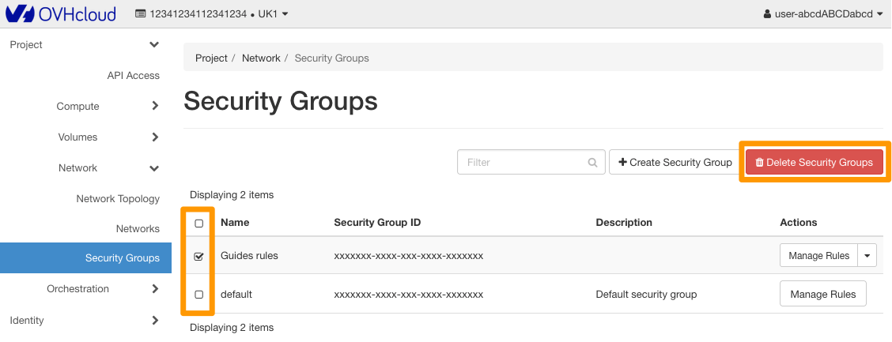

> [!primary]
> Diese Übersetzung wurde durch unseren Partner SYSTRAN automatisch erstellt. In manchen Fällen können ungenaue Formulierungen verwendet worden sein, z.B. bei der Beschriftung von Schaltflächen oder technischen Details. Bitte ziehen Sie im Zweifelsfall die englische oder französische Fassung der Anleitung zu Rate. Möchten Sie mithelfen, diese Übersetzung zu verbessern? Dann nutzen Sie dazu bitte den Button "Beitragen" auf dieser Seite.
>

**Letzte Aktualisierung am 24.08.2021**

## Ziel

Zur Erhöhung der Sicherheit können Filterregeln konfiguriert und verwendet werden, die den Zugriff auf Ihre Instanzen definieren. Sie können mittels Sicherheitsgruppen (*Security Group*) ein- oder ausgehende Verbindungen erlauben oder blockieren. Diese Regeln können für Traffic von bestimmten IP-Adressen oder gar für Instanzen angewendet werden, die in Sicherheitsgruppen eingerichtet sind.

**Diese Anleitung erklärt, wie Sie eine Sicherheitsgruppe erstellen und auf einer Public Cloud Instanz konfigurieren.**

## Voraussetzungen

- Sie haben ein [Public Cloud Projekt](https://www.ovhcloud.com/de/public-cloud) in Ihrem Kunden-Account.
- Sie haben Zugriff auf das [Horizon-Interface](https://docs.ovh.com/de/public-cloud/openstack-user-erstellen-loeschen/).

## In der praktischen Anwendung

### Schritt 1: Eine Sicherheitsgruppe erstellen

Greifen Sie auf das [Horizon-Interface](https://docs.ovh.com/de/public-cloud/openstack-user-erstellen-loeschen/) zu. Wählen Sie dann die Region aus, in der Sie eine Sicherheitsgruppe erstellen möchten, indem Sie oben links klicken.

{.thumbnail}

> [!primary]
>
> Wenn eine Sicherheitsgruppe in mehreren Regionen verwendet werden soll, erstellen Sie diese für jede Region.
>

Wählen Sie jetzt das Menü `Network`{.action} aus und klicken Sie auf `Security Groups`{.action}. Eine Tabelle listet die vorhandenen Sicherheitsgruppen auf. Die Gruppe "Default" ist bereits erstellt; damit wird der gesamte ein- und ausgehende Traffic durchgelassen.

Um eine neue Sicherheitsgruppe hinzuzufügen, klicken Sie auf den Button `+ Create Security Group`{.action}.

{.thumbnail}

Geben Sie der Gruppe, die Sie erstellen möchten, einen Namen und eine Beschreibung. Wenn Sie fertig sind, klicken Sie auf den Button `Create Security Group`{.action}.

{.thumbnail}

Zurück im Tab `Security Groups`{.action} zeigt die Tabelle die neu erstellte Gruppe an. Dort sind standardmäßig Regeln konfiguriert. Diese lassen nur den ausgehenden Traffic passieren. Wenn Sie daran Änderungen vornehmen möchten, gehen Sie zum nächsten Schritt über.

Wenn Sie mit diesen Regeln einverstanden sind, fahren Sie stattdessen fort mit Schritt 3, "[Eine Sicherheitsgruppe auf einer Instanz konfigurieren](#instance-security-group)".

### Schritt 2: Regeln einer Sicherheitsgruppe konfigurieren

Um die Standardregeln anzupassen, klicken Sie auf den Button `Manage Rules`{.action}.

{.thumbnail}

Wenn Sie die Standardregeln für Ihre Sicherheitsgruppe beibehalten haben, lassen diese nur den ausgehenden Traffic durch.

```bash
root@server:~$ ssh admin@149.xxx.xxx.177

ssh connect to host 149.xxx.xxx.177 port 22: Connection timed out
```

Auf der Verwaltungsseite der Regeln können Sie:

- eine bestehende Regel löschen: Verwenden Sie hierzu den Button `Delete Rule`{.action}.
- eine neue Regel hinzufügen: Verwenden Sie hierfür den Button `+ Add Rule`{.action}.

Wenn Sie eine Regel hinzufügen, ergänzen Sie die angeforderten Informationen und klicken Sie dann auf `Add`{.action}.

In diesem Beispiel wird die SSH-Verbindung mit der Instanz erlaubt.

{.thumbnail}

Nachdem Sie die neue Regel hinzugefügt haben, warten Sie einige Minuten ab, bis diese umgesetzt ist.

```bash
root@server:~$ ssh admin@149.xxx.xxx.177

Last login: Tue Oct 13 13:56:30 2015 from proxy-109-190-254-35.ovh.net
admin@server1:~$
```

### Eine Sicherheitsgruppe auf einer Instanz konfigurieren <a name="instance-security-group"></a>

Erweitern Sie im Horizon-Interface das Menü `Compute`{.action} und wählen Sie `Instances`{.action} aus. Erstellen Sie auf dieser Seite eine neue Instanz über den Button `Launch Instance`{.action}.

Bei der Erstellung Ihrer Instanz können Sie über das Menü `Security Groups`{.action} die im vorherigen Schritt erstellte neue Sicherheitsgruppe auswählen.

{.thumbnail}

Sie können eine neue Sicherheitsgruppe auf eine bereits erstellte Instanz anwenden, indem Sie auf `Edit Security Groups`{.action} rechts neben der Instanz klicken.

{.thumbnail}

### Sicherheitsgruppe löschen

Um eine Sicherheitsgruppe zu löschen, setzen Sie links den Haken und klicken Sie dann auf `Delete Security Groups`{.action}.

{.thumbnail}

## Weiterführende Informationen

Für den Austausch mit unserer User Community gehen Sie auf <https://community.ovh.com/en/>.
