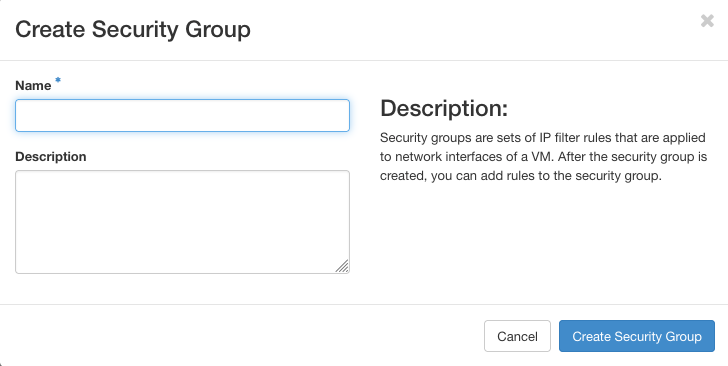
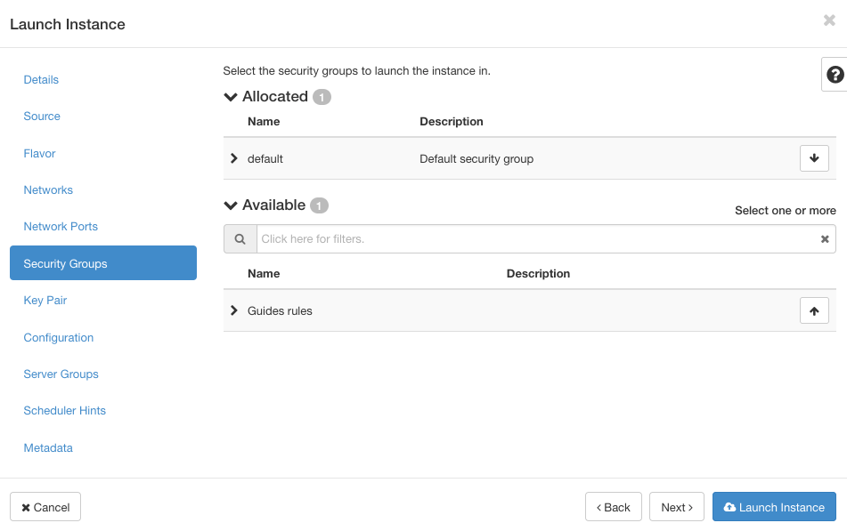

## Objective

For security reasons, you can configure and use filtering rules that will define access to your instances. You can allow or block certain incoming or outgoing connections using security groups. These rules can be applied for traffic from certain IP addresses, or even for instances configured on particular security groups.

**Find out how to create a security group, and configure it on a Public Cloud instance.**

## Requirements

- A [Public Cloud project](https://www.ovhcloud.com/en-ie/public-cloud/).
- Access to the [Horizon interface](/pages/platform/public-cloud/create_and_delete_a_user)

## Instructions

### Step 1: creating a security group

Access the [Horizon interface](/pages/platform/public-cloud/create_and_delete_a_user). Then choose the region in which you want to create a security group, via the button in the top left-hand corner.

{.thumbnail}

> [!primary]
>
> If a security group is to be used in several regions, you must create it for each region.
>

Now expand the `Network`{.action} menu and click `Security Groups`{.action}. 

A table lists the security groups created. The default group is already listed here. This will allow all incoming and outgoing traffic to pass through.

> [!alert]
>
> **Please do not modify or delete the "default" group. You will need to create a new security group and configure your rules in it.**
>
> Automated tasks on the infrastructure can reset the default security group, so it is important not to change it.
>
> OpenStack closes all access to instances by default. If you delete the "default" security group, you will need to create your own group, which will open access to your instances, and apply it every time you create an instance. In addition, the default group will be created again later by the automated tasks on the infrastructure.
>

To add a new security group, click the `+ Create Security Group`{.action} button.

{.thumbnail}

On the page that appears, give a name and description to the group you are about to create. Once you have done this, click the `Create Security Group`{.action} button.

{.thumbnail}

Returning to the `Security Groups`{.action} tab, the table now displays the newly created group. Rules are configured by default. These allow only outgoing traffic to pass.

If you would like to modify these, go to the next step.

If you are satisfied with these rules, go to Step 3: [Configure a security group on your instance](#instance-security-group).

### Step 2: configuring security group rules

Click the `Manage Rules`{.action} button.

{.thumbnail}

If you have left the default rules on your security group, they will only let outgoing traffic pass through.

```bash
root@server:~$ ssh admin@149.xxx.xxx.177

ssh connect to host 149.xxx.xxx.177 port 22: Connection timed out
```

On the rules management page, you can:

- delete an existing rule: Use the `Delete Rule`{.action} button.
- add a new rule: use the `+ Add Rule`{.action} button.

When you add a rule, you will need to fill in the information requested, then click `Add`{.action}.

In our example, we will authorise the SSH connection to the instance.

{.thumbnail}

Once you have added the new rule, wait a few minutes for it to take effect.

```bash
root@server:~$ ssh admin@149.xxx.xxx.177

Last login: Tue Oct 13 13:56:30 2015 from proxy-109-190-254-35.ovh.net
admin@server1:~$
```

### Configuring a security group on an instance <a name="instance-security-group"></a>

From the Horizon interface, expand the `Compute`{.action} menu and select `Instances`{.action}. From this page, create a new instance via the `Launch Instance`{.action} button.

When you create your instance, you can choose the new security group created in the previous step via the `Security Groups`{.action} menu.

{.thumbnail}

You can apply a new security group to an instance that has already been created by clicking `Edit Security Groups`{.action} to the right of the instance.

{.thumbnail}

### Deleting a security group

To delete a security group, select it by ticking the corresponding box on the left, then click `Delete Security Groups`{.action}.

{.thumbnail}

## Go further

Join our community of users on <https://community.ovh.com/en/>.
