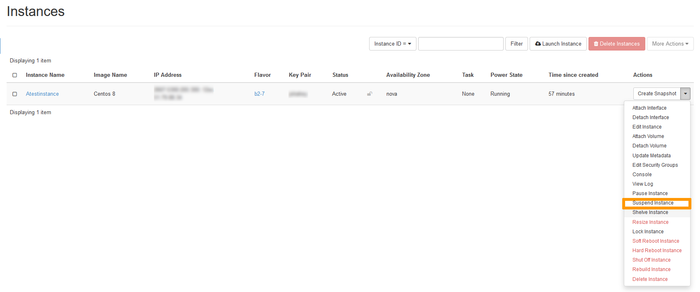
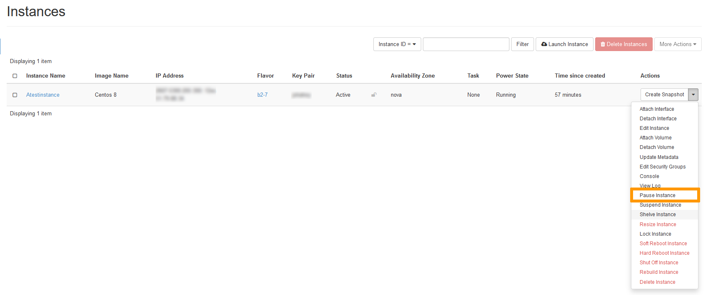

> [!primary]
> Diese Übersetzung wurde durch unseren Partner SYSTRAN automatisch erstellt. In manchen Fällen können ungenaue Formulierungen verwendet worden sein, z.B. bei der Beschriftung von Schaltflächen oder technischen Details. Bitte ziehen Sie beim geringsten Zweifel die englische oder französische Fassung der Anleitung zu Rate. Möchten Sie mithelfen, diese Übersetzung zu verbessern? Dann nutzen Sie dazu bitte den Button “Mitmachen“ auf dieser Seite.
>

**Letzte Aktualisierung am 22.09.2021**

## Ziel

 Bei der Konfiguration einer hochverfügbaren Infrastruktur müssen Sie möglicherweise den Zugriff auf Ihre Instanzen reduzieren, um verschiedene Tests durchzuführen. Mit OpenStack können Sie Ihre Instanz aussetzen, pausieren oder anhalten. In jedem Fall bleibt Ihre IP-Adresse erhalten.

> [!warning]
> Der Name dieser Optionen im OVHcloud Kundencenter unterscheidet sich vom Namen in Openstack/Horizon. Wenn Sie diese Operation über das OVHcloud Kundencenter durchführen, wählen Sie die entsprechende Option aus.
>

**Diese Anleitung erklärt, wie Sie eine Instanz aussetzen, anhalten oder pausieren können.**

## Voraussetzungen

- Sie verfügen über eine [Public Cloud Instanz](https://docs.ovh.com/de/public-cloud/public-cloud-erste-schritte/#schritt-3-instanz-erstellen) zur stundenweisen Abrechnung
- Sie haben Zugriff auf Ihr [OVHcloud Kundencenter](https://www.ovh.com/auth/?action=gotomanager&from=https://www.ovh.de/&ovhSubsidiary=de) oder [Horizon Interface](https://docs.ovh.com/de/public-cloud/erstellung_eines_zugangs_zu_horizon/)
- Kenntnis der [OpenStack API](https://docs.ovh.com/de/public-cloud/vorbereitung_der_umgebung_fur_die_verwendung_der_openstack_api/) und der [OpenStack Variablen](https://docs.ovh.com/de/public-cloud/die-variablen-der-umgebung-openstack-laden/)

## In der praktischen Anwendung

> [!alert]
>
> Diese Operation zieht eine weitere Abrechnung der Instanz nach sich, solange diese nicht terminiert wurde.
>

In der folgenden Tabelle können Sie die auf Ihren Instanzen verfügbaren Optionen unterscheiden. Klicken Sie auf die Option Ihrer Wahl, um die Anleitung zu lesen.

|Begriff|Beschreibung|Abrechnung|
|---|---|---|
|[Aussetzen (*shelve*)](#shelve-instance)|Speichert die Ressourcen und Daten Ihrer Festplatte, indem Sie einen Snapshot erstellen. Alle anderen Ressourcen werden freigegeben.|Sie werden nur für die Momentaufnahme berechnet.|
|[Anhalten (*suspend*)](#stop-suspend-instance)|Speichert den Zustand der virtuellen Maschine auf der Festplatte, die der Instanz zugewiesenen Ressourcen sind immer reserviert.|Für Ihre Instanz wird Ihnen immer der gleiche Preis in Rechnung gestellt.|
|[Pauserien](#pause-instance)|Speichert den Zustand der virtuellen Maschine im RAM, wird eine hängende Instanz eingefroren.|Für Ihre Instanz wird Ihnen immer der gleiche Preis in Rechnung gestellt.|

### Aussetzen (shelve) einer Instanz <a name="shelve-instance"></a>

Diese Option erlaubt es Ihnen, die dedizierten Ressourcen Ihrer Public Cloud Instanz freizugeben, die IP-Adresse bleibt jedoch bestehen. Die Daten Ihrer lokalen Festplatte werden in einem automatisch erstellten Snapshot gespeichert, sobald die Instanz reserviert ist. Die im Arbeitsspeicher und anderswo gespeicherten Daten werden nicht gespeichert.

#### Vom OVHcloud Kundencenter

Loggen Sie sich in Ihr OVHcloud Kundencenter ein. Klicken Sie oben auf der Seite auf `Public Cloud`{.action} und wählen Sie anschließend Ihr Projekt aus. Klicken Sie im linken Menü auf `Instances`{.action}.

Klicken Sie im Interface für die Instanzen auf `...`{.action} rechts neben der Instanz und wählen Sie `Aussetzen`{.action}.

{.thumbnail}

Notieren Sie sich die Meldung im Dialogfenster und klicken Sie auf `Bestätigen`{.action}.

{.thumbnail}

Sobald der Vorgang abgeschlossen ist, erscheint die Instanz als *Ausgesetzt*.

{.thumbnail}

Um den Snapshot anzuzeigen, gehen Sie auf das linke Menü und klicken Sie auf `Instance Backup`{.action}. Ein Snapshot namens *xxxxx-shelved* ist jetzt sichtbar:

{.thumbnail}

#### Horizon-Interface

Um fortzufahren, [erstellung eines zugangs zu Horizon](../erstellung_eines_zugangs_zu_horizon/) und [loggen Sie sich in das Horizon-interface](https://horizon.cloud.ovh.net/auth/login/) .

Wenn Sie Instanzen in verschiedenen Regionen eingerichtet haben, stellen Sie sicher, dass Sie sich in der entsprechenden Region befinden. Überprüfen Sie es in der oberen linken Ecke des Horizon-Interface.

{.thumbnail}

Klicken Sie auf das Menü `Compute`{.action} auf der linken Seite und wählen Sie `Instances`{.action} aus. Wählen Sie `Shelve Instance`{.action} Drop-down-Liste für die entsprechende Instanz aus.

{.thumbnail}

Sobald der Vorgang abgeschlossen ist, erscheint Ihre Instanz nun als *Shelved Offloaded*.

{.thumbnail}

Um die Momentaufnahme anzuzeigen, klicken Sie im Menü `Compute`{.action} auf `Images`{.action}.

{.thumbnail}

#### Verwendung der OpenStack/Nova API

Bevor Sie fortfahren, empfehlen wir Ihnen folgende Anleitungen:

- [Vorbereitung der umgebung fur die verwendung der OpenStack API](https://docs.ovh.com/de/public-cloud/vorbereitung_der_umgebung_fur_die_verwendung_der_openstack_api/)
- [Die variablen der umgebung OpenStack laden](https://docs.ovh.com/de/public-cloud/die-variablen-der-umgebung-openstack-laden/)

Sobald Ihre Umgebung fertig ist, geben Sie auf der Kommandozeile Folgendes ein:

```bash
~$ openstack server shelve <UUID server>
 
=====================================

~$ nova shelve <UUID server> 
```

### Reaktivieren (unshelve) einer Instanz 

Mit dieser Option können Sie Ihre Instanz neu konfigurieren, damit Sie sie weiterhin verwenden können. Bitte beachten Sie, dass die Abrechnung nach Abschluss der Operation normalerweise wieder erfolgt.

> [!alert] **Aktionen auf dem Snapshot**
>
> Jede Aktion auf dem Snapshot außer der Reaktivierung (*unshelve*), kann für Ihre Infrastruktur sehr gefährlich sein, wenn sie missbraucht wird. Wenn Sie eine Instanz reaktivieren (*unshelved*), der Snapshot wird automatisch gelöscht. Es wird nicht empfohlen, eine neue Instanz aus einem Snapshot bereitzustellen, der erstellt wurde, nachdem eine Instanz angehalten wurde.
>
> OVHcloud stellt Ihnen Dienstleistungen zur Verfügung, für die Sie die alleinige Verantwortung tragen. Da wir keinen Zugriff auf diese Maschinen haben, können wir hierfür keinerlei Administrator-Aufgaben übernehmen oder sonstige Hilfeleistung anbieten. Wir empfehlen Ihnen jedoch, sich an einen spezialisierten Dienstleister zu wenden, wenn Sie Schwierigkeiten oder Zweifel hinsichtlich der Verwaltung, Nutzung oder Sicherheit eines Servers haben. Sie können sich auch jederzeit an unsere Community wenden, um sich mit anderen Benutzern auszutauschen.
>

#### Vom OVHcloud Kundencenter

Loggen Sie sich in Ihr OVHcloud Kundencenter ein. Klicken Sie oben auf der Seite auf `Public Cloud`{.action} und wählen Sie anschließend Ihr Projekt aus. Klicken Sie im linken Menü auf `Instances`{.action}.

Klicken Sie im Interface für die Instanzen auf `...`{.action} rechts neben der Instanz und wählen Sie `Reaktivieren`{.action}.

{.thumbnail}

Notieren Sie sich die Meldung im Dialogfenster und klicken Sie auf `Bestätigen`{.action}.

Sobald der Vorgang abgeschlossen ist, erscheint Ihre Instanz als *Aktiviert*.

#### Horizon-Interface

Klicken Sie auf das Menü `Compute`{.action} auf der linken Seite und wählen Sie `Instances`{.action} aus. Wählen Sie `Unshelve Instance`{.action} Drop-down-Liste für die entsprechende Instanz aus.

{.thumbnail}

Sobald der Vorgang abgeschlossen ist, erscheint Ihre Instanz als *Active*.

#### Verwendung der OpenStack/Nova APIs

Sobald Ihre Umgebung fertig ist, geben Sie auf der Kommandozeile Folgendes ein:

```bash
~$ openstack server unshelve <UUID server>

=========================================

~$ nova unshelve <UUID server>
```

### Anhalten (suspend) einer Instanz <a name="stop-suspend-instance"></a>

Mit dieser Option können Sie Ihre Instanz anhalten und den Zustand der virtuellen Maschine auf der Festplatte speichern. Der Speicher wird ebenfalls auf die Festplatte geschrieben.

#### Vom OVHcloud Kundencenter

Loggen Sie sich in Ihr OVHcloud Kundencenter ein. Klicken Sie oben auf der Seite auf `Public Cloud`{.action} und wählen Sie anschließend Ihr Projekt aus. Klicken Sie im linken Menü auf `Instances`{.action}.

Klicken Sie im Interface für die Instanzen auf `...`{.action} rechts neben der Instanz und wählen Sie `Anhalten`{.action}.

{.thumbnail}

Notieren Sie sich die Meldung im Dialogfenster und klicken Sie auf `Bestätigen`{.action}.

Sobald der Vorgang abgeschlossen ist, erscheint die Instanz als *Ausgeschaltet*.

Um mit der Instanz fortzufahren, folgen Sie den oben genannten Schritten. Klicken Sie im Interface für die Instanzen auf `...`{.action} rechts neben der Instanz wählen Sie `Starten`{.action}. In einigen Fällen müssen Sie möglicherweise einen Neustart durchführen.

#### Horizon-Interface 

Klicken Sie auf das Menü `Compute`{.action} auf der linken Seite und wählen Sie `Instances`{.action} aus. Wählen Sie `Suspend Instance`{.action} Drop-down-Liste für die entsprechende Instanz aus.

{.thumbnail}

Die Bestätigungsmeldung wird angezeigt, aus der hervorgeht, dass die Instanz suspendiert wurde.

Um die Instanz neu zu starten, führen Sie die gleichen Schritte wie oben beschrieben durch. Wählen Sie in der Dropdown-Liste für die entsprechende Instanz `Resume Instance`{.action}.

#### Verwendung der OpenStack/Nova API

Sobald Ihre Umgebung fertig ist, geben Sie auf der Kommandozeile Folgendes ein:

```bash
~$ openstack server suspend <UUID server>

=========================================

~$ nova suspend <UUID server>
```

Um die Aussetzung der Instanz aufzuheben, geben Sie auf der Kommandozeile Folgendes ein:

```bash
~$ openstack server unsuspend <UUID server>

=========================================

~$ nova unsuspend <UUID server>
```

### Pause einer Instanz <a name="pause-instance"></a>

Diese Aktion ist nur im Horizon-Interface oder über die Openstack/Nova-API möglich. Damit können Sie *Ihre* Instanz einfrieren.

#### Horizon-Interface

Klicken Sie auf das Menü `Compute`{.action} auf der linken Seite und wählen Sie `Instances`{.action} aus. Wählen Sie `Pause Instance`{.action} Drop-down-Liste für die entsprechende Instanz aus.

{.thumbnail}

Die Bestätigungsmeldung wird angezeigt, aus der hervorgeht, dass die Instanz suspendiert wurde.

Um die Pause der Instanz abzubrechen, folgen Sie den oben genannten Schritten. Wählen Sie in der Dropdown-Liste der entsprechenden Instanz `Resume Instance`{.action}.

#### Verwendung der OpenStack/Nova API

Sobald Ihre Umgebung fertig ist, geben Sie auf der Kommandozeile Folgendes ein:

```bash
~$ openstack server pause <UUID server>

=========================================

~$ nova pause <UUID server>
```

Um die Pause der Instanz abzubrechen, geben Sie auf der Kommandozeile Folgendes ein:

```bash
~$ openstack server unpause <UUID server>

=========================================

~$ nova unpause <UUID server>
```

## Weiterführende Informationen

[OpenStack Dokumentation](https://docs.openstack.org/mitaka/user-guide/cli_stop_and_start_an_instance.html)

Für den Austausch mit unserer Community gehen Sie auf <https://community.ovh.com/en/>.
