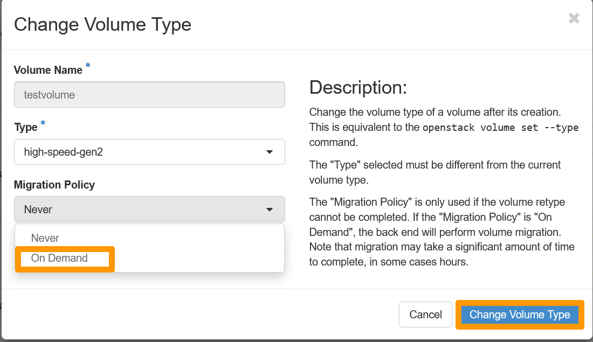

> [!primary]
> Diese Übersetzung wurde durch unseren Partner SYSTRAN automatisch erstellt. In manchen Fällen können ungenaue Formulierungen verwendet worden sein, z.B. bei der Beschriftung von Schaltflächen oder technischen Details. Bitte ziehen Sie im Zweifelsfall die englische oder französische Fassung der Anleitung zu Rate. Möchten Sie mithelfen, diese Übersetzung zu verbessern? Dann nutzen Sie dazu bitte den Button "Beitragen" auf dieser Seite.
>

## Ziel

Ziel dieser Anleitung ist es, Ihnen zu zeigen, wie Sie einen Block Storage-Volume-Typ von Classic oder High Speed auf High Speed gen2 ändern können.

## Voraussetzungen

- [Auf das Horizon-Interface zugreifen](/pages/platform/public-cloud/introducing_horizon)
- Ein [Block Storage](/pages/platform/public-cloud/create_and_configure_an_additional_disk_on_an_instance) Volume, das in Ihrem [Public Cloud Projekt erstellt wird](https://www.ovhcloud.com/de/public-cloud/)

## In der praktischen Anwendung

Wenn Sie einen Block Storage-Volume-Typ in ein "High Speed gen2"-Volume ändern, muss die Migrationsrichtlinie von `Never` in `On Demand` geändert werden.

Standardmäßig ist die Migrationsrichtlinie auf `Never` eingestellt, da das Volume auf demselben CEPH Cluster verbleibt. Für das "High Speed gen2" muss das Volume jedoch auf einen neuen Cluster migriert werden.

Diese Änderung kann über Horizon oder die OpenStack-Befehlszeilenschnittstelle vorgenommen werden.

### Über das Horizon-Interface

Loggen Sie sich ins [Horizon Interface](https://horizon.cloud.ovh.net/auth/login/) ein wählen Sie oben links die korrekte Region aus.

{.thumbnail}

Klicken Sie links im Menü `Volumes`{.action} auf `Volumes`{.action}.

Klicken Sie auf den Dropdownpfeil neben `Volume`{.action} bearbeiten, und wählen Sie `Volume Type`{.action} ändern aus.

{.thumbnail}

Klicken Sie im angezeigten Fenster auf das Dropdown-Menü unter `Type` und wählen Sie `high-speed-gen-2`{.action}. Klicken Sie dann auf den Dropdownpfeil unter `Migration Policy` und wählen Sie `On Demand`{.action}.

Wenn Sie diese Aktionen ausgeführt haben, klicken Sie auf `Change Volume Type`{.action}, um die Änderung zu bestätigen..

{.thumbnail}

### Über die OpenStack CLI

Bevor Sie fortfahren, empfehlen wir Ihnen folgende Anleitungen:

- [Vorbereitung Ihrer Umgebung zur Verwendung der OpenStack API](/pages/platform/public-cloud/prepare_the_environment_for_using_the_openstack_api)
- [Konfigurieren der OpenStack-Umgebungsvariablen](/pages/platform/public-cloud/loading_openstack_environment_variables)

Zunächst können Sie die in Ihrer Region verfügbaren Volume-Typen mit folgendem Befehl auflisten:

```bash
#~$ openstack image list
+--------------------------------------+-----------------------------------------------+----------+
| ID                                   | Name                                          | Is Public |
+--------------------------------------+-----------------------------------------------+----------+
| 27844ef7-1a9a-4944-be59-6e4eb19a71f6 | high-speed-gen2                                    | True |
| 23f75fef-d4f6-416a-a884-95aa3fd45695 | classic                                            | True |
| 2f78e8af-93c9-4e5c-b177-83c4a7ec456a | high-speed                                         | True |
----------------------------------------------------------------------------------------------------
```

> [!warning]
> Bitte beachten Sie: Wenn der Volume-Typ "high-speed-gen2" nicht in der Liste angezeigt wird, ist er in dieser Region nicht verfügbar.
>

Ändern Sie anschließend den Volume-Typ mit folgendem Befehl:

```bash
$ openstack volume set --type high-speed-gen2 --retype-policy on-demand VOLUME_NAME_OR_ID
```

## Weiterführende Informationen

Wenn Sie Schulungen oder technische Unterstützung bei der Implementierung unserer Lösungen benötigen, wenden Sie sich an Ihren Vertriebsmitarbeiter oder klicken Sie auf [diesen Link](https://www.ovhcloud.com/de/professional-services/), um einen Kostenvoranschlag zu erhalten und eine persönliche Analyse Ihres Projekts durch unsere Experten des Professional Services Teams anzufordern.

Für den Austausch mit unserer User Community gehen Sie auf <https://community.ovh.com/en/>.