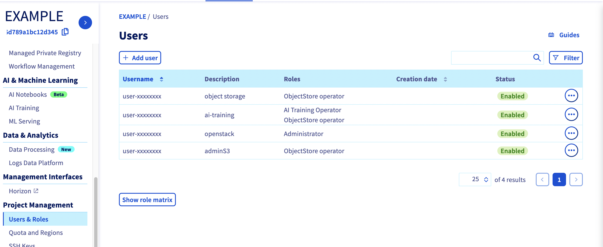
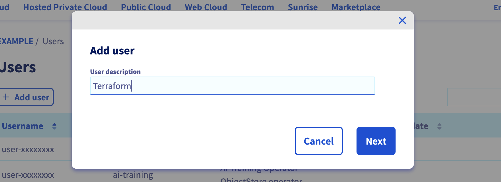
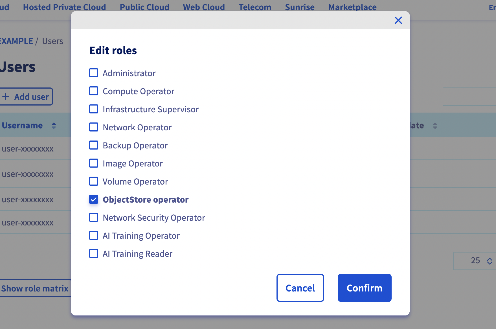

**Last updated 4th April 2022**

## Objective

It is possible to store Terraform state on a remote data store/backend like a AWS S3 bucket, a Google Cloud STorage (GCS)... but do you know that you can also store your Terraform states on an OVHcloud Object Storage container?

In this tutorial you will:

- TODO: xxx
- xxx
- xxx

## Requirements

- Access to the [OVHcloud Control Panel](https://www.ovh.com/auth/?action=gotomanager&from=https://www.ovh.co.uk/&ovhSubsidiary=GB)
- A [Public Cloud Instance](https://www.ovhcloud.com/en-gb/public-cloud/) in your OVHcloud account

## Terraform

[Terraform](https://www.terraform.io/), a tool created by Hashicorp in 2014, written in Go, aims to build, change and version control your infrastructure. This tool has a powerful and very intuitive Command Line Interface.


At OVHcloud we created a [Terraform provider](https://registry.terraform.io/providers/ovh/ovh/latest) that you can use to interact with and manage OVHCloud resources.

### Terraform states and backend

Terraform have several concepts, one of them is the `state`.

A Terraform state is a snapshot of your infrastructure from when you last ran `terraform apply` command.
By default, the state file is stored locally in a `terraform.tfstate` file.
But the common usage, in production environment, is to store it remotely.

TODO: a refaire avec du Object Storage dedans ...


You can for example store your Terraform state on an OVHcloud Object Storage.

In order to do that you need to configure a `backend` in your Terraform HCL configuration files.

## Instructions

### Creating an Object Storage container/bucket

First, you need to have an Object Storage container, if you don't already had one, you can follow the [Creating an Object Storage container](../../storage/pcs/create-container/) guide.

For this guide, our Object Storage container is named `terraform-state` and its region is `GRA`.

### Initializing Terraform configuration

Create a `backend.tf` file with the following content:

```
terraform {
    backend "swift" {
        container = "terraform-state"
        region_name = "GRA"
        cloud = "tfstate"
        archive_container = "terraform-state-archive"
    }
}
```

> [!primary]
>
> In this file you define a [Swift Terraform backend](https://www.terraform.io/language/settings/backends/swift) in the `GRA` region. Don't hesitate to change this parameter if you created an Object Storage container in another region.
> We tell also to use an OpenStack `clouds.yaml` file.

### Creating an OpenStack user with Object Storage rights

In order to store your Terraform states on an Object Storage, and generally if you want to interact with the Object Storage, you need to retrieve have the rights to manage an Object Storage.

In order to do that you will create an OpenStack user.

Log in to the [OVHcloud Control Panel](https://www.ovh.com/auth/?action=gotomanager&from=https://www.ovh.co.uk/&ovhSubsidiary=GB), go to the Public Cloud section and select the Public Cloud project concerned.

Access the administration UI for your OVHcloud Managed Kubernetes clusters by clicking on `Users & Roles`{.action} in the left-hand menu and click on `+ Add user`{.action}.



Enter a description for the user you want to create, for example `Terraform` and click on `Next`{.action}.



Check the `ObjectStore operator` role and click on `Confirm`{.action}.



Your user will be creating.
Username and password will be automatically generated and displayed in your Control Panel.


Be sure to save the password shown in the green message box to a password manager at this time. The password cannot be recovered afterwards. However, you can always create a new password by clicking on `...`{.action} and selecting `Generate a password`{.action}.


### Retrieve OpenStack credentials 

Now click on `...`{.action} and select `Launch OpenStack Horizon`.

Enter the user and password informations you saved before then click on `Connect`{.action}.


In the side bar, click on `API Access`{.action}.


Click on `Download OpenStack RC File`{.action} button and then on `OpenStack clouds.yaml File`{.action}.


Save the `clouds.yaml` file in your local machine.

TODO: xxx

You need to edit the generated `clouds.yaml` file in order to give every informations needed by Terraform.

Edit this `clouds.yaml` file like bellow:

```
clouds:
  tfstate:
    auth:
      auth_url: https://auth.cloud.ovh.net/v3/
      domain_name: default
      username: "user-xxxxxx"
      password: xxxxx
      project_domain_name: default
      project_name: "xxxxx"
      user_domain_name: default
    region_name: GRA
```

> [!primary]
>
> If the `password` line is missing, please add it with the password you copied/pasted earlier.

### Create


### Terraform Init

TODO: xxx


terraform init
This CLI, eventually, initialize the backend (remote or local state)


puis un terarform init ... montrer que cela fonctionne ...


$ terraform init -reconfigure

Initializing the backend...

Successfully configured the backend "swift"! Terraform will automatically
use this backend unless the backend configuration changes.

Initializing provider plugins...

The following providers do not have any version constraints in configuration,
so the latest version was installed.

To prevent automatic upgrades to new major versions that may contain breaking
changes, it is recommended to add version = "..." constraints to the
corresponding provider blocks in configuration, with the constraint strings
suggested below.

* provider.local: version = "~> 2.1"
* provider.ovh: version = "~> 0.16"

Terraform has been successfully initialized!

You may now begin working with Terraform. Try running "terraform plan" to see
any changes that are required for your infrastructure. All Terraform commands
should now work.

If you ever set or change modules or backend configuration for Terraform,
rerun this command to reinitialize your working directory. If you forget, other
commands will detect it and remind you to do so if necessary.

--> You have initialized your repository 
--> so now you can 


—> exemple d’un petit script qui créé un cluster kube ? Ou autre chose du public cloud ?

Un terraform plan

Un apply

Et hop on va dans l’objet storage et voit bien notre tf state


les trucs a savoir:
- les states ne sont pas chiffres dans le container (donc attention)
- il est important de parametrer un archive container (pour le versioning me semble a confirmer)


—> puis create a clouds.yaml file

```
clouds:
  tfstate:
    auth:
      auth_url: https://auth.cloud.ovh.net/v3/
      domain_name: default
      username: user-QuuxDZSyrfdj #CHANGEME
      password: x4PJE6c2B28DZBy3krXzy3Qve8tzx9qB #CHANGEME
      project_domain_name: default
      project_name: '4442521083919223' #CHANGEME
      user_domain_name: default
    region_name: GRA
```

#TODO: change the username, password and project name according to opener file …

Create …


TODO: xxx


TODO: xxx


#TODO: retrieve your OpenStack credentials

If you never retrieve the OpenStack RC file, follow this step, else go to next step.

You need to [get your `openrc.sh` file](https://docs.ovh.com/gb/en/public-cloud/access_and_security_in_horizon/) from your OVHcloud platform. 

TODO: refaire cette etape et tester de bout en bout si OK ...

At this step, you should have a `<user_name>-openrc.sh` file like this:

```
cat 4442521083919223-openrc.sh
```

<pre class="console"><code>$ cat 4442521083919223-openrc.sh
#!/usr/bin/env bash
# To use an OpenStack cloud you need to authenticate against the Identity
# service named keystone, which returns a **Token** and **Service Catalog**.
# The catalog contains the endpoints for all services the user/tenant has
# access to - such as Compute, Image Service, Identity, Object Storage, Block
# Storage, and Networking (code-named nova, glance, keystone, swift,
# cinder, and neutron).
#
# *NOTE*: Using the 3 *Identity API* does not necessarily mean any other
# OpenStack API is version 3. For example, your cloud provider may implement
# Image API v1.1, Block Storage API v2, and Compute API v2.0. OS_AUTH_URL is
# only for the Identity API served through keystone.
export OS_AUTH_URL=https://auth.cloud.ovh.net/v3
# With the addition of Keystone we have standardized on the term **project**
# as the entity that owns the resources.
export OS_PROJECT_ID=a123b456c789d901
export OS_PROJECT_NAME="11111111111"
export OS_USER_DOMAIN_NAME="Default"
if [ -z "$OS_USER_DOMAIN_NAME" ]; then unset OS_USER_DOMAIN_NAME; fi
export OS_PROJECT_DOMAIN_ID="default"
if [ -z "$OS_PROJECT_DOMAIN_ID" ]; then unset OS_PROJECT_DOMAIN_ID; fi
# unset v2.0 items in case set
unset OS_TENANT_ID
unset OS_TENANT_NAME
# In addition to the owning entity (tenant), OpenStack stores the entity
# performing the action as the **user**.
export OS_USERNAME="user-myuser"
# With Keystone you pass the keystone password.
echo "Please enter your OpenStack Password for project $OS_PROJECT_NAME as user $OS_USERNAME: "
read -sr OS_PASSWORD_INPUT
export OS_PASSWORD=$OS_PASSWORD_INPUT
# If your configuration has multiple regions, we set that information here.
# OS_REGION_NAME is optional and only valid in certain environments.
export OS_REGION_NAME="UK1"
# Don't leave a blank variable, unset it if it was empty
if [ -z "$OS_REGION_NAME" ]; then unset OS_REGION_NAME; fi
export OS_INTERFACE=public
export OS_IDENTITY_API_VERSION=3%
</code></pre>

In this file, several informations will interest you:

- xx
- xx (le password que vous avez eu quand vs avez créé l'user sur horizon ...)
- xx

Please keep them in mind, you will use them in the next step of this guide.

### ...

On va créer un fichier provider.tf -> vers le provider ovhcloud

```
# Configure the OVHcloud Provider
provider "ovh" {
  version            = "~> 0.16"
  endpoint           = "ovh-eu"
  application_key    = "ylqBhqYrFmhZ5Cgu"
  application_secret = "lhD43AUyyOdzsZAwHpo9cEUM2nCe1VXY"
  consumer_key       = "sQtH9k0eDqwWbQaILUaEksixORtIBNiR"
  # timeout            = "30m"
}
```


TODO: XXX puis backend.tf


```
terraform {
    backend "swift" {
        container = "terraform-state"
        region_name = "GRA"
        cloud = "tfstate"
        archive_container = "terraform-state-archive"
    }
}
```

—> puis create a clouds.yaml file

```
clouds:
  tfstate:
    auth:
      auth_url: https://auth.cloud.ovh.net/v3/
      domain_name: default
      username: user-QuuxDZSyrfdj #CHANGEME
      password: x4PJE6c2B28DZBy3krXzy3Qve8tzx9qB #CHANGEME
      project_domain_name: default
      project_name: '4442521083919223' #CHANGEME
      user_domain_name: default
    region_name: GRA
```

#TODO: change the username, password and project name according to opener file …

Create …


TODO: xxx


terraform init
This CLI, eventually, initialize the backend (remote or local state)


puis un terarform init ... montrer que cela fonctionne ...


$ terraform init -reconfigure

Initializing the backend...

Successfully configured the backend "swift"! Terraform will automatically
use this backend unless the backend configuration changes.

Initializing provider plugins...

The following providers do not have any version constraints in configuration,
so the latest version was installed.

To prevent automatic upgrades to new major versions that may contain breaking
changes, it is recommended to add version = "..." constraints to the
corresponding provider blocks in configuration, with the constraint strings
suggested below.

* provider.local: version = "~> 2.1"
* provider.ovh: version = "~> 0.16"

Terraform has been successfully initialized!

You may now begin working with Terraform. Try running "terraform plan" to see
any changes that are required for your infrastructure. All Terraform commands
should now work.

If you ever set or change modules or backend configuration for Terraform,
rerun this command to reinitialize your working directory. If you forget, other
commands will detect it and remind you to do so if necessary.

--> You have initialized your repository 
--> so now you can 


—> exemple d’un petit script qui créé un cluster kube ? Ou autre chose du public cloud ?

Un terraform plan

Un apply

Et hop on va dans l’objet storage et voit bien notre tf state


les trucs a savoir:
- les states ne sont pas chiffres dans le container (donc attention)
- il est important de parametrer un archive container (pour le versioning me semble a confirmer)

TODO: xxxx


## Go further

Join our community of users on <https://community.ovh.com/en/>.
