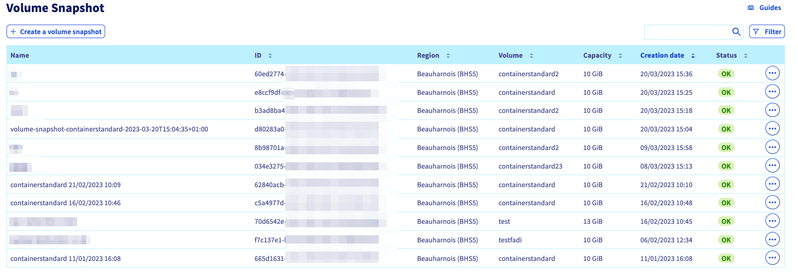

> [!primary]
> Diese Übersetzung wurde durch unseren Partner SYSTRAN automatisch erstellt. In manchen Fällen können ungenaue Formulierungen verwendet worden sein, z.B. bei der Beschriftung von Schaltflächen oder technischen Details. Bitte ziehen Sie beim geringsten Zweifel die englische oder französische Fassung der Anleitung zu Rate. Möchten Sie mithelfen, diese Übersetzung zu verbessern? Dann nutzen Sie dazu bitte den Button «Mitmachen» auf dieser Seite.
>

***Letzte Aktualisierung am 21.03.2023**

## Ziel

Wenn Sie den in Ihren Block Storage Volumes gespeicherten Daten Bedeutung beimessen, ist es sinnvoll, deren Backup zu organisieren, um die möglichen Auswirkungen von Problemen auf diese Daten zu begrenzen, egal ob es sich um einen menschlichen Fehler oder eine Störung auf Cluster-Ebene handelt.

Ein **Volume Snapshot** ist ein Wiederherstellungspunkt, der im selben Speichercluster gespeichert ist wie das ursprüngliche Volume. Die Erstellung und Wiederherstellung sind schnell, aber im Falle einer Störung im Cluster können Volume und Snapshot nicht verfügbar sein. 
Die Erstellung eines Volume Snapshots erfordert nicht, dass das Volume von der Instanz getrennt wird.

Ein **Volume Backup** ist ein Bild, das von Ihrem Volume aus erstellt wird. Dieses wird im Object Storage Cluster der Lokalisierung des ursprünglichen Volumes gespeichert.
Dieses Maß an Resilienz ist ideal und erlaubt es Ihnen, schnell auf Störungen auf Ihrem Volume zu reagieren, indem Sie aus dem Backup ein anderes Volume erstellen. 
Um ein Volume Backup zu erstellen, muss das Volume von der Instanz getrennt werden.

Das Volume Snapshot und das Volume Backup erlauben Ihnen:

- Backups Ihres Volumes mit nur wenigen Klicks erstellen und so lange wie nötig aufbewahren;
- Backups verwenden, um den Zustand Ihres Volumes wiederherzustellen.
- Backups als Modell verwenden, um identische Volumes zu erstellen.

**In dieser Anleitung erfahren Sie, wie Sie ein Backup Ihres Block Storage Volumes über Ihr OVHcloud Kundencenter erstellen.**

## Voraussetzungen

- Sie sind in Ihrem [OVHcloud Kundencenter](https://www.ovh.com/auth/?action=gotomanager&from=https://www.ovh.de/&ovhSubsidiary=de) angemeldet.
- Ein [Block Storage Volume](https://docs.ovh.com/de/public-cloud/erstellen_zustzliche_festplatte_public_cloud/) erstellt in Ihrem [Public Cloud Projekt](https://www.ovhcloud.com/de/public-cloud/)

## In der praktischen Anwendung

Loggen Sie sich in Ihr [OVHcloud Kundencenter](https://www.ovh.com/auth/?action=gotomanager&from=https://www.ovh.de/&ovhSubsidiary=de) ein, gehen Sie in den Bereich `Public Cloud`{.action} und wählen Sie das betreffende Public Cloud Projekt aus.

Öffnen Sie anschließend das Menü `Block Storage`{.action} im linken Menü unter **Storage**.

Klicken Sie rechts neben dem betreffenden Volume auf den Button `...`{.action} und dann auf `Backup erstellen`{.action}. Es ist nicht notwendig, zuerst das Volume von seiner Instanz zu trennen. Wenn Sie Ihr Volume jedoch von Ihrer Instanz trennen möchten, lesen Sie [den](https://docs.ovh.com/de/public-cloud/erstellen_zustzliche_festplatte_public_cloud/#unter-linux) Abschnitt der entsprechenden Linux-Anleitung und den [Abschnitt](https://docs.ovh.com/de/public-cloud/erstellen_zustzliche_festplatte_public_cloud/#unter-windows) für Windows.

{.thumbnail}

Wenn Sie aus dem Block Storage kommen, wird das betreffende Volume angegeben. Wenn nicht, wählen Sie das Volume aus, das Sie sichern möchten.

Wählen Sie dann den Backup-Typ aus, den Sie erstellen möchten: **Volume Snapshot** oder **Volume Backup**.

- Wenn Sie **Volume Snapshot** auswählen, können Sie den Namen des zu erstellenden Volume Snapshots ändern, bevor Sie über den Button `Backup erstellen bestätigen`{.action}.
- Wenn Sie **Volume Backup** auswählen, werden Sie aufgefordert, Ihr Volume von der Instanz zu trennen, um fortfahren zu können. Sie können dann den Namen des zu erstellenden Volume Backup ändern, bevor Sie die Sicherung `erstellen`{.action}.

{.thumbnail}

Die Zeit bis zur Erstellung des Backups, ob Volume Snapshot oder Volume Backup, kann abhängig von der Datenmenge auf dem Volume, der Verwendung der Ressourcen der Instanz für das Volume Snapshot sowie anderen hostspezifischen Faktoren mehrere Stunden in Anspruch nehmen.

> [!primary]

> **Best Practices:**
>
> - Führen Sie Volume Backups außerhalb Ihrer Produktionsstunden durch.
> - vermeiden Sie die Erstellung von Snapshots zu Spitzenzeiten (04:00 - 22:00 Uhr Pariser Zeit).
> - installieren Sie das Mittel qemu-guest, falls dies nicht erfolgt ist, oder versuchen Sie es gegebenenfalls zu deaktivieren;
> - Versuchen Sie, den Server während der Erstellung des Snapshots (Begrenzung der I/O, RAM-Verbrauch usw.) nicht zu "veranlassen"
> - Auch wenn dies nicht zwingend vorgeschrieben ist, ist es besser, Ihr Volume bei der Erstellung eines Snapshot Volumes abzutrennen.
> - Überprüfen Sie regelmäßig, ob Sie Ihre Daten über Ihr Volume Snapshot oder Volume Backup abrufen können.
>

Da ein Volume Snapshot oder ein Volume Backup ein Klon der gesamten Festplatte ist, hat es unabhängig von der tatsächlichen Zuweisung von Speicherplatz die maximale Größe des ursprünglichen Volumes.

Die Liste Ihrer Snapshots finden Sie im Bereich `Volume Snapshot`{.action} im linken Menü.
Sobald das Volume Snapshot erstellt wurde, erscheint es in dieser Liste.

{.thumbnail}

Die Liste Ihrer Backups finden Sie im Bereich `Volume Backup`{.action} im linken Menü.
Sobald die Erstellung des Volumes eines Backups angefordert wurde, wird es zur Liste hinzugefügt.

{.thumbnail}

Klicken Sie auf den Button `...`{.action}, um `ein Volume`{.action} aus dem` `{.action} Snapshot Volume oder dem zugehörigen Backup Volume zu löschen oder zu erstellen.

Weitere Informationen zu diesem Thema finden Sie [in unserer Anleitung zur Erstellung eines Volumes über ein Backup](https://docs.ovh.com/de/public-cloud/create-volume-from-backup/).

{.thumbnail}

## Weiterführende Informationen

[Volume von einem Backup aus erstellen](https://docs.ovh.com/de/public-cloud/create-volume-from-backup/)

[Zusätzliches Volume auf einer Instanz erstellen und konfigurieren](https://docs.ovh.com/de/public-cloud/erstellen_zustzliche_festplatte_public_cloud/)

[Die Größe einer zusätzlichen Disk erweitern](https://docs.ovh.com/de/public-cloud/ihre_zusatzliche_festplatte_vergroern/)

Für den Austausch mit unserer User Community gehen Sie auf <https://community.ovh.com/en/>.
