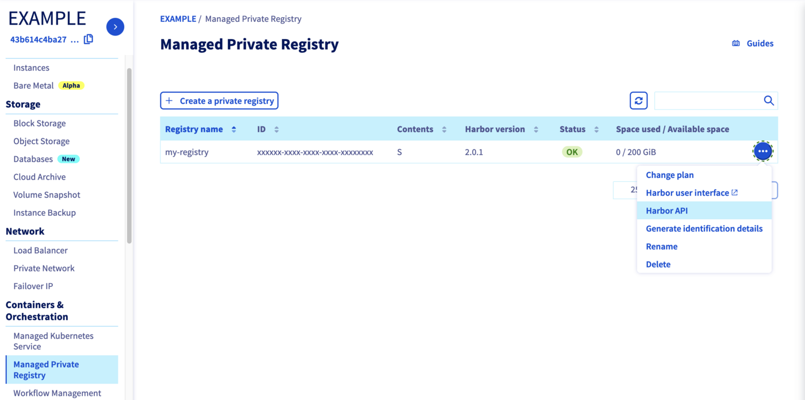
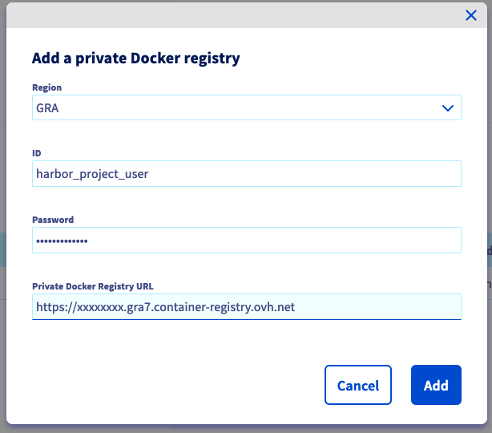
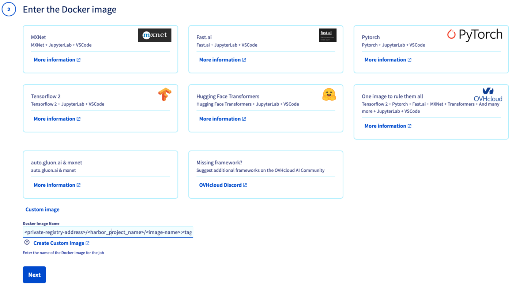
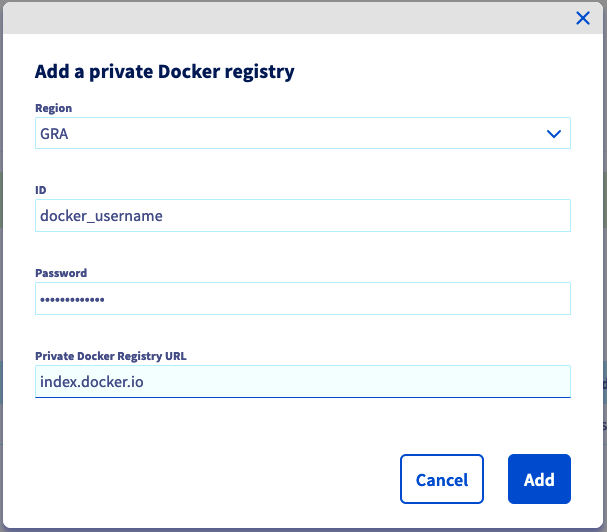
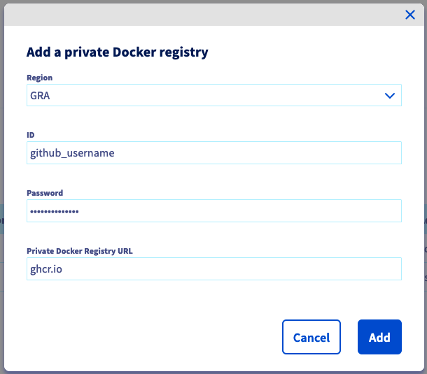

## Objective

This guide is intended to help you to **use and manage your public and private registries** through `ovhai` command line interface ([AI CLI](/pages/public_cloud/ai_machine_learning/cli_10_howto_install_cli)), API and [OVHcloud Control Panel](https://ca.ovh.com/auth/?action=gotomanager&from=https://www.ovh.com/ca/fr/&ovhSubsidiary=qc). This will help you when working with **OVHcloud AI Tools**, especially with **AI Training** and **AI Deploy**.

## Requirements

- A **Public Cloud** project
- Access to the [OVHcloud Control Panel](https://ca.ovh.com/auth/?action=gotomanager&from=https://www.ovh.com/ca/fr/&ovhSubsidiary=qc)

## Instructions

This documentation is divided into the following parts:

- Manage existing registries through
    - OVHcloud Control Panel (UI)
    - OVHcloud AI CLI `ovhai`
- Create, configure and use new registries
    - Private Harbor registry
    - Private Docker registry
    - GitHub registry (packages)

## Manage existing registries

The Public Cloud provides a default registry called `shared registry`, where users of a same Public Cloud project are able to push their custom images, and use them through our AI Tools.

> [!warning]
>
>This `shared registry` can help you perform your tests, but **should not be used in production**, as we reserve the right to delete its content if deemed necessary. The images pushed to this registry are for AI Tools workloads only, and will not be accessible for external uses.
>

This is why it can be interesting to add and manage other registries. We can either do this by using the OVHcloud Control Panel (UI) or the `ovhai` CLI.

### Manage existing registries through UI

First, log in to the [OVHcloud Control Panel](https://ca.ovh.com/auth/?action=gotomanager&from=https://www.ovh.com/ca/fr/&ovhSubsidiary=qc) and go to the `Public Cloud`{.action} section. Then go to the `AI Training` section, which is located under `AI & Machine Learning`.

{.thumbnail}

By clicking the `Private Docker Registry`{.action} button, you should be able to see and manage (add, delete) your different private registries.

{.thumbnail}

Note that the `shared registry` will not appear here. This one is displayed in the **Home** panel of AI Training.

### Manage existing registries through CLI

If you prefer, you can also use the OVHcloud `ovhai` CLI:

List all your available registries with:
``` {.console}
ovhai registry list
```

Add a registry by using:
``` {.console}
ovhai registry add <registry-url>
```

Update one of your registries with the following command:
``` {.console}
ovhai registry update <id>
```

Delete a registry by using:
``` {.console}
ovhai registry delete <id>
```

*If you do not have our `ovhai` CLI yet, learn how to install it [here](/pages/public_cloud/ai_machine_learning/cli_10_howto_install_cli).*

## Create, configure and use new registries

Using your own and private registries is the best way to use your images without exposing them to everyone. We distinguish 3 main possibilities:

- Private Harbor registry
- Private Docker registry
- GitHub registry / packages

We will see how to implement each of these registries and use them through AI Tools.

> [!primary]
>
>In any case, note that the default `shared registry` will remain available even if you add new registries.
>

### Harbor private registry

OVHcloud Managed Private Registry service allows you to spawn your own authenticated Docker registry where you can privately store your Docker images. This registry is an instance of [Harbor](https://goharbor.io/), an open source trusted cloud native registry project that stores, signs, and scans Docker images.

#### Creation

To create your new private registry, we advise you to read and follow the steps mentioned in the [Creating a private registry documentation](/pages/public_cloud/containers_orchestration/managed_private_registry/creating-a-private-registry).

At the end of this step, you should have your **registry identification details**.

#### Configuration

Then, you will need to use these credentials to **connect to the Harbor UI**. This will allow you to manage this private registry. This simple step is explained in the [Connecting to the UI documentation](/pages/public_cloud/containers_orchestration/managed_private_registry/connecting-to-the-ui).

To finish setting up your private Harbor registry, you will need to **create a project on Harbor**, and associate a user to it (Administrator user is added by default, but you can create a new one for this project). You will find all needed information in this [documentation](/pages/public_cloud/containers_orchestration/managed_private_registry/managing-users-and-projects).

#### Get your OVHcloud Managed Private Registry API URL

In order to add this registry to AI Tools, you will need to retrieve its URL. To do this, go to the Managed Private Registry section on the OVHcloud Public Cloud Manager, and in the "more options" button (...) at the right, click on `Harbor API`:
{.thumbnail}

Then, copy the URL of the Harbor API, which is the URL of your private registry:
{.thumbnail}

#### Add the Harbor registry

To add your registry, you can either use the OVHcloud Control Panel (UI) or the `ovhai` CLI.

During this step, you will be asked your user's credentials (user ID and password). You can use the default user (administrator) credentials, which were obtained at the first part of the `Create and configure a new private registry` step, or those of another user if you have created one.

##### Using UI

To add your private registry via UI, log in to the [OVHcloud Control Panel](https://ca.ovh.com/auth/?action=gotomanager&from=https://www.ovh.com/ca/fr/&ovhSubsidiary=qc), go to the `Public Cloud`{.action} section, then to the `AI Training` section which is located under `AI & Machine Learning`.

{.thumbnail}

From the dashboard you can add your private Harbor registry by clicking `Private Docker Registry`{.action} > `Add`{.action}.

Here, you will need to provide the credentials of your registry along with its URL.

{.thumbnail}

When you have finished filling in the form, click `Add`{.action}.

##### Using CLI

To add your private Harbor registry via CLI, use:

``` {.console}
ovhai registry add <registry-url>
```

Once your registry is added, you should see it in your registries list. You can then use any images pushed on this registry for your AI Training jobs and AI Deploy apps.

#### Push an image to your registry

> [!warning]
>
>Be careful for the following, we will use the displayed URL. This version does not contain the `https://` part, which is present in the URL given by the Public Cloud.
>

Log in to your private registry, using a user with write rights to your registry project, with the following command:

```console
docker login -u <user> -p <password> <private-registry-address>
```

Once connected, all you have to do is build, tag, and push your image. Here is an example:

Build the image from the current directory's Dockerfile:
```console
docker build . -t <image-name>:<tag-name>
```

Tag the compiled image:
```console
docker tag <image-name>:<tag-name> <private-registry-address>/<harbor_project_name>/<image-name>:<tag-name>
```

Push the image to your private registry's project:
```console
docker push <private-registry-address>/<harbor_project_name>/<image-name>:<tag-name>
```

#### Use your private registry images with OVHcloud AI Tools

Now that your private registry has been created, added to your Public Cloud account, you can use its image(s) in AI Training and AI Deploy.

Here is a basic example with AI Training, when using the CLI:

```console
ovhai job run <private-registry-address>/<harbor_project_name>/<image-name>:<tag-name>
```

If you prefer to use the OVHcloud Control Panel, this is also possible. In this case, you will have to indicate your custom Docker image during Step 2 of your job/app creation. This path will be `<private-registry-address>/<harbor_project_name>/<image-name>:<tag-name>`.

{.thumbnail}

### Docker private registry
If you prefer to use a private registry from your Docker account, it is also possible.

Let's say we have created a private repository on our Docker account.

We build, tag and push our Docker image in this private repository:

```console
docker build . -t <image-name>:<tag-name>
docker tag <image-name>:<tag-name> <docker_hub_username>/<private_repository_name>:<tag-name>
docker push <docker_hub_username>/<private_repository_name>:<tag-name>
```

#### Add the private Docker registry

Once your image is pushed to your Docker account, you will need to add your private Docker registry to the registries of your Public Cloud project.

As with Harbor, this can either be done with UI or CLI. This time, your private registry's URL will be `index.docker.io` and the requested username and password correspond to those of your Docker account.

During this step, you will be asked your Docker credentials.

##### Using UI

Log in to the [OVHcloud Control Panel](https://ca.ovh.com/auth/?action=gotomanager&from=https://www.ovh.com/ca/fr/&ovhSubsidiary=qc), go to the `Public Cloud`{.action} section, then to the `AI Training` section which is located under `AI & Machine Learning`.

{.thumbnail}

From the dashboard you can add your private Docker registry by clicking `Private Docker Registry`{.action} > `Add`{.action} button.

Here, you will need to provide your Docker credentials along with its URL.

{.thumbnail}

When you have finished filling in the form, click `Add`{.action}.

##### Using CLI

To add your private Docker registry via CLI, use:

```console
ovhai registry add index.docker.io
```

Once your registry is added, you should see it in your registries list.

#### Use your private registry images with OVHcloud AI Tools

You can now use the images contained in this private Docker registry in AI Tools by specifying `index.docker.io`. Here is an example to deploy a Streamlit application on AI Deploy:

```console
ovhai app run index.docker.io/<docker_hub_username>/<private_repository_name>:<tag-name> \
--default-http-port 8501
```

You can also use the Control Panel to deploy a job or an app from your private Docker registry. You will just need to specify your Docker image path, during step 2 of your job/app creation. This path will be `index.docker.io/<docker_hub_username>/<private_repository_name>:<tag-name>`.

### GitHub registry

You can also use a GitHub registry, also known as [GitHub Packages](https://github.com/features/packages).

As indicated on their documentation, you can build and push a package image by using the following commands:

```console
docker login ghcr.io --username <your_username> --password <your_token>
docker tag app ghcr.io/<your_username>/<repo-name>:<tag-name>
docker push ghcr.io/<your_username>/<repo-name>:<tag-name>
```

#### Add a GitHub registry

Once your image is pushed on your GitHub account, you will need to add your GitHub registry to the registries of your Public Cloud project. As with Harbor and Docker, this can either be done with UI or CLI. This time, your registry's URL will be `ghcr.io`.

You will be asked your GitHub credentials.

##### Using UI

Log in to the [OVHcloud Control Panel](https://ca.ovh.com/auth/?action=gotomanager&from=https://www.ovh.com/ca/fr/&ovhSubsidiary=qc), go to the `Public Cloud`{.action} section, then to the `AI Training` section which is located under `AI & Machine Learning`.

{.thumbnail}

From the dashboard you can add the GitHub registry by clicking `Private Docker Registry`{.action} > `Add`{.action}.

Here, you will need to provide your GitHub credentials along with the registry URL.

{.thumbnail}

When you have finished filling in the form, click `Add`{.action}.

##### Using CLI

```console
ovhai registry add ghcr.io
```

Once your registry is added, you should see it in your registries list.

#### Use your GitHub registry images with OVHcloud AI Tools

You can now use the packages/images contained in this GitHub registry in AI Tools by specifying `ghcr.io`. Here is an example to deploy a Streamlit application on AI Deploy:

```console
ovhai app run ghcr.io/<your_username>/<repo-name>:<tag-name> \
--default-http-port 8501
```

You can also use the Control Panel to deploy a job or an app from a GitHub registry. You will just need to specify your GitHub image path, during step 2 of your job/app creation. This path will be `ghcr.io/<your_username>/<repo-name>:<tag-name>`.

## Go further

- You can check the official documentation about [how to submit a **job**](/pages/public_cloud/ai_machine_learning/training_guide_02_howto_submit_job).
- Learn [how to deploy an **app**](/pages/public_cloud/ai_machine_learning/deploy_guide_02_getting_started).
- You can check out the documentation about the [ovhai CLI](/pages/public_cloud/ai_machine_learning/cli_15_commands_reference).

If you need training or technical assistance to implement our solutions, contact your sales representative or click on [this link](https://www.ovhcloud.com/fr-ca/professional-services/) to get a quote and ask our Professional Services experts for a custom analysis of your project.

## Feedback

Please send us your questions, feedback and suggestions to improve the service:

- On the OVHcloud [Discord server](https://discord.com/invite/vXVurFfwe9)
