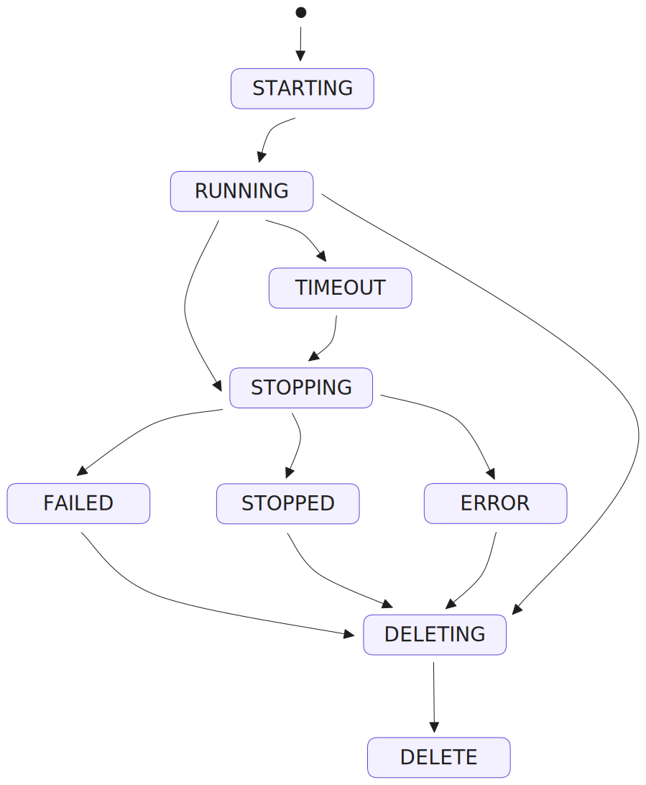

## Definition

An **AI Notebook** is the workload unit submitted to the cluster. **AI notebooks** are managed Jupyter or VSCode notebooks, with prepackaged Machine Learning frameworks linked to computing resources (CPU or GPU) and storage space. They are running within the OVHcloud infrastructure.

Each AI Notebook is linked to a **Public Cloud** project and specifies the following:

- A type and quantity of computing resources
- A code editor
- A preconfigured Machine Learning framework

## Considerations

> [!warning]
>
> An **AI Notebook** runs continuously until manually interrupted by the user, unless it exceeds **7 days of running**. It will then be automatically stopped. You can choose to automatically restart it using the `auto-restart` option (set this parameter to `True`). The notebook will then restart as is.
>

- [Data](/pages/public_cloud/ai_machine_learning/gi_02_concepts_data) can be attached to a notebook to serve either/both as input for your notebook (e.g. code) or output (e.g. model weights).
- If you do not customize your resource request, the default requested is 1 GPU (Tesla V100S). Memory is not customizable.
- [Billing](/pages/public_cloud/ai_machine_learning/notebook_guide_billing_concept) for **notebooks** is minute-based and starts from the beginning to the end of the notebook's `RUNNING` status. Each commenced minute is billed completely.
- You can read further on notebook limitations [here](/pages/public_cloud/ai_machine_learning/notebook_guide_capabilities).

## Under the hood

**AI Notebooks** are Docker containers created, deployed and maintained by OVHcloud's AI teams.
They include a managed code editor and the Machine Learning framework prepackaged for users according to their needs (computing resources, library versions, etc.).

## Notebook lifecycle

During its lifetime, the notebook will transit between the following states:

> [!primary]
>
> Only the `RUNNING` time of the notebook **is billed**. For more information about notebooks billing, refer to this [documentation](/pages/public_cloud/ai_machine_learning/notebook_guide_billing_concept).
>

- `STARTING`: The notebook is being started and, if any, the remote data is synchronized. To learn more about data synchronization.
- `RUNNING`: The notebook is running, you can connect to it and use it.
- `STOPPING`: The notebook is stopping, your compute resources are freed, your status is saved and, if any, the data is synchronized back.
- `STOPPED`: The notebook ended normally and you can restart it whenever you want or delete it.
- `FAILED`: The notebook ended in error, e.g. the process in the notebook finished with an exit code that is not 0.
- `ERROR`: The notebook ended due to a backend error, you may contact our support.
- `DELETING`: The notebook is being removed.
- `DELETE`: The notebook and its [workspace](/pages/public_cloud/ai_machine_learning/notebook_guide_workspace) are fully deleted.

{.thumbnail}

## Go further

- You can check the [OVHcloud documentation on how to create a data container](/pages/storage_and_backup/object_storage/pcs_create_container).
- You can check the [OVHcloud documentation on how to create a notebook](/pages/public_cloud/ai_machine_learning/notebook_tuto_01_first_ml_model_miniconda).

If you need training or technical assistance to implement our solutions, contact your sales representative or click on [this link](https://www.ovhcloud.com/en-gb/professional-services/) to get a quote and ask our Professional Services experts for a custom analysis of your project.

## Feedback

Please send us your questions, feedback and suggestions to improve the service:

- On the OVHcloud [Discord server](https://discord.com/invite/vXVurFfwe9)
