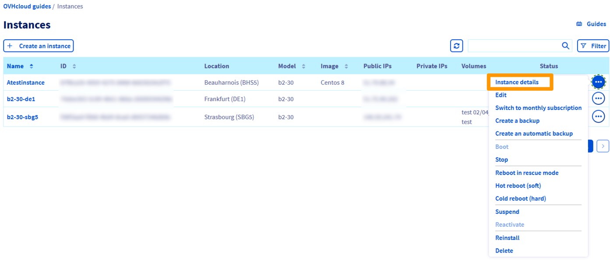
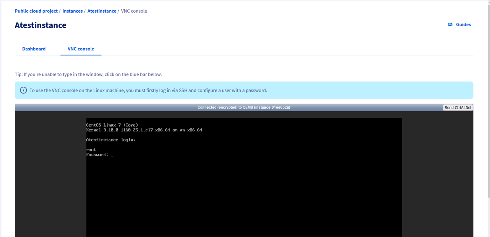

## Objectif

Pour exécuter certaines fonctions administratives sur votre serveur (l’installation de paquets, par exemple), vous devez disposer d'un niveau élevé d'accès utilisateur. Pour les serveurs Linux, ce niveau est appelé « root ».

**Apprenez à vous servir de l'utilisateur root et à créer un mot de passe pour celui-ci.**

## Prérequis

* [Avoir créé une instance Public Cloud dans votre compte](/pages/public_cloud/compute/public-cloud-first-steps#etape-3-creer-une-instance)
* Être connecté à votre [espace client OVHcloud](https://www.ovh.com/auth/?action=gotomanager&from=https://www.ovh.com/fr/&ovhSubsidiary=fr){.external}

## En pratique

### Définir le mot de passe root <a name="settingtherootpassword"></a>

Pour commencer, établissez une [connexion SSH](/pages/public_cloud/compute/public-cloud-first-steps#etape-4-connexion-a-votre-instance) à votre serveur avec votre utilisateur par défaut.

Utilisez la commande ci-dessous pour définir un mot de passe pour l’utilisateur root (pour des raisons de sécurité, celui-ci ne sera pas affiché lors de la saisie) :

```bash
~$ sudo passwd root
Enter new UNIX password:
Retype new UNIX password:
passwd: password updated successfully 
successfully
```

### Mettre à jour le système (Debian et Ubuntu)

Pour mettre à jour les *packages* logiciels installés sur votre serveur, entrez la commande suivante :

```bash
~$ sudo apt update && sudo apt upgrade -y
```

### Mettre à jour le système (CentOS et Fedora)

Pour mettre à jour le système d'exploitation de votre serveur, entrez la commande suivante :

```bash
~$ sudo yum update
```

### Passer à root

Pour devenir l'utilisateur root, tapez la commande suivante :

```bash
~$ sudo su -
~#
```

Entrez ensuite le mot de passe root.

### Autoriser l'authentification par root avec mot de passe

#### Pour les connexions via la console VNC intégrée dans votre espace client OVHcloud

Pour commencer, [définissez le mot de passe root](#settingtherootpassword).

Ensuite, connectez-vous à votre espace client OVHcloud dans la partie 'Public Cloud'{.action], puis dans la rubrique 'Instances'{.action], et accédez à la console VNC :

Cliquez sur les `...`{.action} à droite de l’instance correspondante puis cliquez sur `Détail de l'instance`{.action}. 

{.thumbnail}

Rendez-vous dans l’onglet `console VNC`{.action}. A l'invite de commande, renseignez votre login comme **root**, puis entrez votre mot de passe.

{.thumbnail}

#### Pour les connexions utilisant des terminaux Linux

Pour commencer, [définissez le mot de passe root](#settingtherootpassword).

Activez ensuite l'authentification root et le mot de passe dans votre fichier **sshd_config** :

```bash
~$ sudo sed -i 's/#PermitRootLogin prohibit-password/PermitRootLogin yes/g' /etc/ssh/sshd_config

~$ sudo sed -i 's/PasswordAuthentication no/PasswordAuthentication yes/g' /etc/ssh/sshd_config
```

Redémarrez le service SSH :

```bash
~$ service sshd restart
```

Une fois cette étape effectuée, vous devriez pouvoir accéder à votre serveur avec l'utilisateur root et le mot de passe défini.

#### Pour les connexions utilisant Putty

Pour commencer, [définissez le mot de passe root](#settingtherootpassword)

Activez ensuite l'authentification root et le mot de passe dans votre fichier **sshd_config** :

```bash
~$ sudo sed -i 's/#PermitRootLogin prohibit-password/PermitRootLogin yes/g' /etc/ssh/sshd_config

~$ sudo sed -i 's/PasswordAuthentication no/PasswordAuthentication yes/g' /etc/ssh/sshd_config
```

Redémarrez le service SSH :

```bash
~$ service sshd restart
```

Dans l'agent d'authentification Putty (*pageant key list*), retirez votre clé SSH privée.

{.thumbnail}

Une fois cette étape effectuée, vous devriez pouvoir accéder à votre serveur avec l'utilisateur root et le mot de passe défini.

## Aller plus loin

Si vous avez besoin d'une formation ou d'une assistance technique pour la mise en oeuvre de nos solutions, contactez votre commercial ou cliquez sur [ce lien](https://www.ovhcloud.com/fr/professional-services/) pour obtenir un devis et demander une analyse personnalisée de votre projet à nos experts de l’équipe Professional Services. 

Échangez avec notre communauté d'utilisateurs sur <https://community.ovh.com/>.
