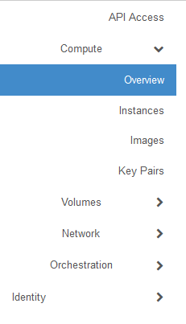
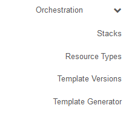

## Objective

The Horizon interface, natively offered with OpenStack, has been adapted by OVHcloud to offer additional features than those available in the OVHcloud Control Panel.

**Discover the main sections of the Horizon interface.**

## Requirements

- A [Public Cloud project](/pages/public_cloud/compute/create_a_public_cloud_project) in your OVHcloud account
- **[Optional since September 2023]** An [OpenStack user](/pages/public_cloud/compute/create_and_delete_a_user) created in your project. This step is optional because we have deployed a Single Sign On between the OVHcloud Control Panel and Horizon.

## Instructions

### Logging in to OpenStack Horizon

* To log in with the OVHcloud Single Sign on: use the `Horizon`{.action} link in the left-hand menu under "Management Interfaces" after opening your `Public Cloud`{.action} project in the [OVHcloud Control Panel](https://ca.ovh.com/auth/?action=gotomanager&from=https://www.ovh.com/world/&ovhSubsidiary=we).

* To login with a specific OpenStack user: open the [Horizon login page](https://horizon.cloud.ovh.net/auth/login/) and enter the [OpenStack user credentials](/pages/public_cloud/compute/create_and_delete_a_user) previously created, then click on `Connect`{.action}.

### Data centre region selection

Unlike the OVHcloud Control Panel, Horizon separates your services according to their region. You can choose the region from the menu in the top left-hand corner:

{.thumbnail}

### Left side menu

This menu allows you to quickly navigate through the project and its various features.

{.thumbnail}

#### Compute

##### **Overview**

- **Quota Summary**

Horizon provides a summary of quotas, which allows you to see the used and available resources for your projects:

{.thumbnail}

- **Usage Summary**

Next is a summary of the use of your project instances. The search period can be customized to restrict this summary to a desired period.

{.thumbnail}

- **Usage**

A summary of your usage is also available. This is a summary of the various services associated with the project, such as the list of instances.

{.thumbnail}

The summary is downloadable in CSV format, which allows you to extract the information so that you can analyse it via other tools. Simply click on `Download CSV Summary`{.action}.

{.thumbnail}

- **Instances**

Use this page to list and manage instances. Here, for example, you can create new instances, pause them, access the instance console, and much more.

- **Images**

Use this menu to list and manage images, i.e. templates and snapshots associated with your project.

- **Key Pairs**

Here you can list and create your SSH keys for connecting to your instances.

##### **Volumes**

Use this menu to list and manage volumes, as well as volume backups and snapshots.

{.thumbnail}

##### **Network**

List and manage your networks and security groups here. 

{.thumbnail}

##### **Orchestration**

This menu allows you to orchestrate multiple composite cloud applications. 
For more information, please refer to the [OpenStack documentation](https://docs.openstack.org/horizon/pike/user/stacks.html){.external}.

{.thumbnail}

#### Identity

Use this menu to list information about your projects.

### User menu

In the top right-hand corner of the Horizon interface, a user menu allows you to: 

- Change interface display settings.
- Download an OpenRC file containing your user IDs.
- Log out of the Horizon interface.

{.thumbnail}

## Go further

[Familiarise yourself with the Public Cloud interface](/pages/public_cloud/compute/03-public-cloud-interface-walk-me)
 
Join our community of users on <https://community.ovh.com/en/>.