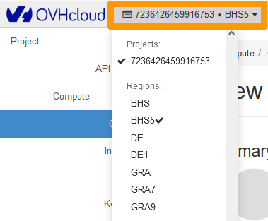
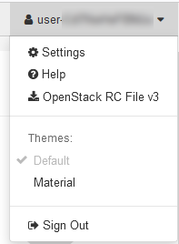

> [!primary]
> Esta traducción ha sido generada de forma automática por nuestro partner SYSTRAN. En algunos casos puede contener términos imprecisos, como en las etiquetas de los botones o los detalles técnicos. En caso de duda, le recomendamos que consulte la versión inglesa o francesa de la guía. Si quiere ayudarnos a mejorar esta traducción, por favor, utilice el botón «Contribuir» de esta página.
>

## Objetivo

La interfaz Horizon, que nativamente se ofrece con OpenStack, ha sido adaptada por OVHcloud para ofrecer características adicionales a las disponibles en el área de cliente de OVHcloud.

**Descubra las secciones principales de la interfaz de Horizon.**

## Requisitos

- Un [proyecto Public Cloud](/pages/public_cloud/compute/create_a_public_cloud_project) en su cuenta de OVHcloud.
- **[Opcional desde septiembre de 2023]** Un usuario [OpenStack](/pages/public_cloud/compute/create_and_delete_a_user) creado en su proyecto. Este paso es opcional, ya que hemos desplegado un inicio de sesión único entre el área de cliente de OVHcloud y Horizon.

## Procedimiento

### Conectarse a OpenStack Horizon

* Para conectarse con el inicio de sesión único de OVHcloud, utilice el enlace `Horizon`{.action} del menú de la izquierda, bajo "Management Interfaces", después de haber abierto su proyecto de `Public Cloud`{.action} en su [área de cliente de OVHcloud](https://www.ovh.com/auth/?action=gotomanager&from=https://www.ovh.es/&ovhSubsidiary=es).

* Para conectarse con un usuario específico de OpenStack, abra la página de conexión a [Horizon](https://horizon.cloud.ovh.net/auth/login/) e introduzca las [claves de OpenStack](/pages/public_cloud/compute/create_and_delete_a_user) previamente creadas y haga clic en `Connect`{.action}.

### Selección de área del centro de datos

A diferencia del área de cliente de OVHcloud, Horizon separa sus servicios según su región. Puede elegir la región en el menú de la esquina superior izquierda:

{.thumbnail}

### Menú lateral izquierdo

Este menú le permite navegar rápidamente por el proyecto y sus diversas funciones.

{.thumbnail}

#### Compute

##### **Resumen (*Overview*)**

- **Resumen de cuotas (*Limit Summary*)**

Horizon proporciona un resumen de las cuotas, que le permite ver los recursos utilizados y disponibles para sus proyectos:

{.thumbnail}

- **Resumen de uso (*Usage Summary*)**

A continuación se muestra un resumen del uso de las instancias del proyecto. El período de búsqueda se puede personalizar para restringir este resumen a un período deseado.

{.thumbnail}

- **Uso (*Usage*)** 

También está disponible un resumen de su uso. Este es un resumen de los diversos servicios asociados con el proyecto, como la lista de instancias.

{.thumbnail}

El resumen se puede descargar en formato CSV, lo que le permite extraer la información para que pueda analizarla a través de otras herramientas. Simplemente haga clic en `Download CSV Summary`{.action}.

{.thumbnail}

- **Instances**

Utilice esta página para mostrar y administrar instancias. Aquí, por ejemplo, puede crear nuevas instancias, pausarlas, tener acceso a la consola de instancias y mucho más.

- **Images**

Utilice este menú para mostrar y administrar imágenes, es decir, plantillas e instantáneas (*snapshots*) asociadas al proyecto.

- **Key Pairs**

Aquí puede enumerar y crear las claves SSH para conectarse a sus instancias.

##### **Volumes**

Utilice este menú para listar y administrar volúmenes, así como copias de seguridad de volúmenes e instantáneas (*snapshots*).

{.thumbnail}

##### **Network**

Enumere y administre sus redes y grupos de seguridad aquí. 

{.thumbnail}

##### **Orchestration**

Este menú le permite orquestar varias aplicaciones de cloud compuesta. 
Para obtener más información, consulte la [documentación de OpenStack](https://docs.openstack.org/horizon/pike/user/stacks.html){.external}.

{.thumbnail}

#### Identity

Utilice este menú para mostrar información sobre sus proyectos.

### Menú de usuario

En la esquina superior derecha de la interfaz de Horizon, un menú de usuario permite: 

- Cambiar la configuración de la pantalla de la interfaz.
- Descargue un archivo « OpenRC » que contenga sus ID de usuario.
- Cerrar sesión de la interfaz de Horizon.

{.thumbnail}

## Más información

[Conocer la interfaz de Public Cloud](/pages/public_cloud/compute/03-public-cloud-interface-walk-me)
 
Interactúe con nuestra comunidad de usuarios en <https://community.ovh.com/en/>.