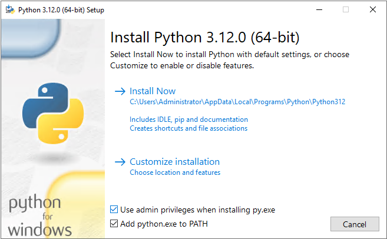
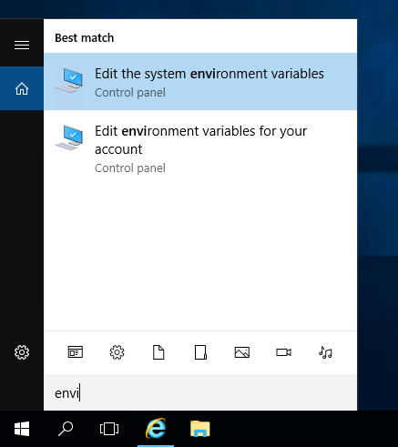

## Objetivo

Después de descargar e instalar los componentes de OpenStack, es posible utilizar la consola del sistema para administrar los servicios de Public Cloud mediante comandos.

Con la API de OpenStack puede generar scripts para automatizar la administración.

> [!primary]
>
> OpenStack requiere Python >=3.8.
>

**Esta guía explica cómo instalar estas herramientas de OpenStack.**

## Requisitos

- Tener acceso *root* al entorno que quiera configurar.

## Procedimiento

Para configurar el Load Balancer Public Cloud, deberá instalar el cliente Python Octavia:

```console
pip3 install python-octaviaclient
```

### En Debian

Abra el terminal o conéctese por SSH al entorno que quiera preparar.

Actualice la caché de los paquetes con el siguiente comando:

```sh
apt update
```

Utilice el siguiente comando para instalar los clientes OpenStack:

```sh
$ apt install python3-pip python3-venv -y
$ python3 -m venv env
$ source env/bin/activate
(env)$ pip3 install --upgrade pip
(env)$ pip3 install python-openstackclient
```

Una vez hecho esto, le recomendamos que cree un usuario específico para no utilizar el usuario *root*.

Para acceder a las herramientas de ayuda, ejecute el siguiente comando:

```sh
openstack --help
```

> [!primary]
> 
> En [esta página](https://docs.openstack.org/python-openstackclient/latest/){.external} encontrará la documentación relativa a la API de OpenStack.
> 

### En CentOS

Abra el terminal o conéctese por SSH al entorno que quiera preparar.

Actualice la caché de los paquetes mediante el siguiente comando:

```sh
yum update -y
```

Utilice el siguiente comando para instalar los clientes OpenStack:

```sh
yum install python3-pip -y
$ python3 -m venv env
$ source env/bin/activate
(env)$ pip3 install --upgrade pip
(env)$ pip3 install python-openstackclient
```

Una vez hecho esto, le recomendamos que cree un usuario específico para no utilizar el usuario *root*.

Para acceder a las herramientas de ayuda, ejecute el siguiente comando:

```sh
openstack --help
```

> [!primary]
> 
> En [esta página](https://docs.openstack.org/python-openstackclient/latest/){.external} encontrará la documentación relativa a la API de OpenStack.
> 

### En Windows

Descargue e instale la versión 3.12.0 de Python. Puede añadir automáticamente el lenguaje de programación Python a Path seleccionando la opción correspondiente en el configurador de la instalación.

{.thumbnail}

Alternativamente, también puede realizar la instalación usted mismo. Para ello, siga las indicaciones que se ofrecen a continuación.

#### 1. Editar las variables de entorno del sistema

Comience a introducir «Editar las variables de entorno del sistema» en el campo de búsqueda y seleccione el menú cuando aparezca. Se abrirá la ventana **Propiedades del sistema**.

{.thumbnail}

#### 2. Editar la configuración del sistema

En la pestaña `Opciones avanzadas`{.action}, haga clic en el botón `Variables de entorno`{.action} para editar su configuración.

{.thumbnail}

#### 3. Configurar las variables de entorno 

En el apartado **Variables del sistema**, haga clic en  `Nueva...`{.action}, asígnele el nombre `PYTHON_HOME` y añada la ruta hacia Python.

{.thumbnail}

#### 4. Introducir la ruta de las variables

Una vez que haya añadido Python, seleccione `Path`{.action} (ruta) en las variables del sistema y haga clic en el botón `Editar...`{.action}. Añada lo siguiente al final de la ruta:

`...;%PYTHON_HOME%\;%PYTHON_HOME%\Script`

#### 5. Reiniciar Windows

Es necesario reiniciar el sistema para que se apliquen los cambios.

#### 6. Instalar el cliente OpenStack

Estando conectado como administrador, escriba «cmd» en el campo de búsqueda y seleccione el símbolo del sistema cuando aparezca. Instale el cliente OpenStack utilizando el siguiente comando:

```sh
pip install python-openstackclient
```

Si la operación se ha realizado correctamente, se mostrará un resumen.

{.thumbnail}

En el símbolo del sistema puede comprobar la versión instalada introduciendo `python-V` (no importa en qué directorio se encuentre).

{.thumbnail}

### En MacOS

Puede utilizar [HomeBrew](https://brew.sh), un gestor de paquetes para MacOS.

Abra el terminal e ejecute el siguiente comando:

```bash
brew install openstackclient
```

Para acceder a las herramientas de ayuda, ejecute el siguiente comando:

```sh
openstack —-help
nova help
```

## Más información

[Cargar las variables de entorno necesarias para OpenStack](/pages/public_cloud/compute/loading_openstack_environment_variables).

Únase a nuestra comunidad de usuarios en <https://community.ovh.com/en/>.