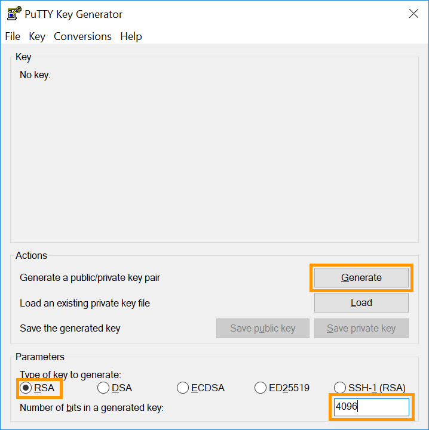
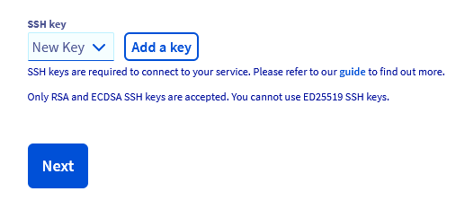
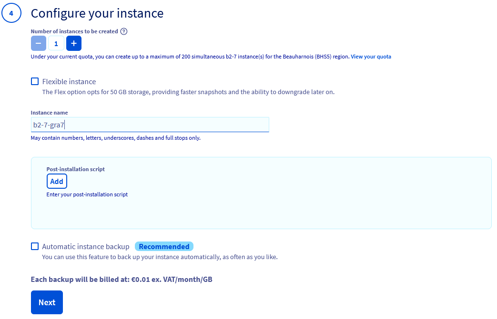
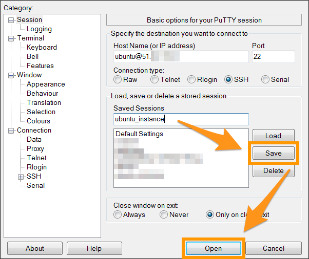
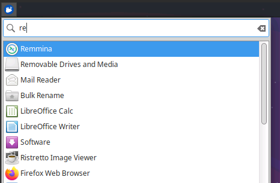
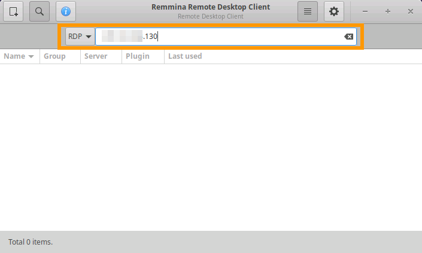

## Objectif

Les instances Public Cloud OVHcloud nécessitent une approche différente de celle d'une solution de serveur dédiée ou VPS.

**Ce guide vous présente les premières étapes de la création et de la connexion à une instance Public Cloud.**

## Prérequis

- Un [projet Public Cloud](https://www.ovhcloud.com/fr-ca/public-cloud/).
- Être connecté à votre [espace client OVHcloud](https://ca.ovh.com/auth/?action=gotomanager&from=https://www.ovh.com/ca/fr/&ovhSubsidiary=qc){.external}.

## En pratique

### Étape 1 :  Créer des clés SSH

Le protocole SSH assure une communication client-serveur chiffrée. L'utilisation des clés SSH améliore encore la sécurité en empêchant toute connexion à partir d'un périphérique qui ne possède pas la clé correspondante. La création d'un jeu de clés SSH vous fournit une clé publique et une clé privée.

- La **clé publique** sera ajoutée à votre instance Public Cloud lors de son installation.

- La **clé privée**, stockée sur votre périphérique client, permet ensuite d'accéder à votre instance sans nécessiter le mot de passe utilisateur. 

> [!primary]
>
Notez qu'une connexion SSH basée sur des clés est obligatoire pour les connexions aux instances Public Cloud, à l'exception de celles qui exécutent des systèmes d'exploitation Windows. Les clés SSH publiques ajoutées à votre Panneau de configuration OVHcloud seront disponibles pour les services Public Cloud de toutes les régions et de tous les data centres. Vous pouvez stocker des clés cryptées **RSA**, **ECDSA** et **ED25519**.
>
L'authentification de connexion sur les instances Windows nécessite uniquement le nom d'utilisateur et le mot de passe.
>

#### Création d'une clé SSH sous Linux ou Mac

À partir d'un ordinateur Mac ou d'un poste de travail sur lequel un système d'exploitation Linux est installé, ouvrez d'abord l'application de ligne de commande (Terminal). Vérifiez que votre répertoire $HOME contient un dossier « .ssh ». Si le dossier n'existe pas, créez-le :

```bash
$ mkdir ~/.ssh
$ chmod 700 ~/.ssh
```

Utilisez la commande suivante pour créer une clé RSA 4096 bits :

```bash
$ ssh-keygen -b 4096
```

L'utilisation de l'option « -t » avec cette commande vous permet de spécifier une autre méthode de chiffrement, par exemple :

```bash
$ ssh-keygen -t ecdsa -a 256
```
ou

```bash
$ ssh-keygen -t ed25519
```

La commande vous invite à enregistrer la nouvelle clé dans le fichier standard :

```console
Generating public/private rsa key pair.
Enter file in which to save the key (/home/user/.ssh/id_rsa):
```

Vous pouvez accepter le fichier par défaut en appuyant sur « ↩ ». Vous pouvez maintenant entrer une phrase secrète ( passphrase ) pour protéger votre clé SSH par un mot de passe. Cette option est recommandée pour renforcer la sécurité. Étant donné que seule la clé privée correspondante sera requise pour accéder à votre instance Public Cloud à partir de votre poste de travail, des mesures de sécurité appropriées doivent être appliquées à ce stade. La passphrase doit être entrée lorsqu'une connexion à l'instance est établie.

Vos clés SSH doivent être stockées dans le répertoire « .ssh ». L'extension « .pub » sera ajoutée au nom du fichier de clé publique.

```console
Your identification has been saved in /home/user/.ssh/id_rsa.
Your public key has been saved in /home/user/.ssh/id_rsa.pub.
The key fingerprint is:
SHA256:MRk+Y0zCOoOkferhkTvMpcMsYspj212lK7sEauNap user@hostname
The key's randomart image is:
+---[RSA 4096]----+
|     .. o        |
|    . .= o       |
|   o o  X        |
|. . . .          |
|. .=.o .S.       |
| =o.o.  .   .    |
|o +   .  . o ..  |
|.. .  .   oEoo . |
|o.        .o+oo  |
+----[SHA256]-----+
```

> [!warning]
>
> La clé privée doit toujours être conservée de manière sécurisée et l'accès à cette clé strictement limité aux personnes autorisées uniquement.
>

Pour afficher et exporter votre clé publique, utilisez la commande « cat » sur votre fichier de clé « .pub » et copiez le résultat :

```bash
$ cat ~/.ssh/id_rsa.pub
ssh-rsa AAAAB3NzaC1yc2EAAAADAQABAAABAQC8teh2NJ42qYZV98gTNhumO1b6rMYIkAfRVazl
k6dSS3xf2MXJ4YHsDacdjtJ+evXCFBy/IWgdkFtcvsGAMZ2N1RdvhDyQYcy6NDaJCBYw1K6Gv5fJ
SHCiFXvMF0MRRUSMneYlidxUJg9eDvdygny4xOdC6c1JrPrSgOc2nQuKeMpOoOWLINIswg1IIFVk
kFMPrFivP8Z6tidzVpAtbr1sXmJGZazYWrU3FoK2a1sF1zEWrmlMOzX81zEWrmlMOzX8CpZW8Rae
i4ANmLy7NULWK36yU0Rp9bFJ4o0/4PTkZiDCsK0QyHhAJXdLN7ZHpfJtHIPCnexmwIMLfIhCWhO5
 user@hostname
```
> [!primary]
>
Dans un terminal Mac OS, vous pouvez également utiliser les commandes « pbcopy » et « pbcoller » pour gérer les chaînes de touches. Par exemple, utilisez cette commande pour copier la clé du fichier « id_rsa.pub » dans le presse-papiers:
>

```bash
$ pbcopy < ~/.ssh/id_rsa.pub
```

#### Création d'une clé SSH depuis Windows

[PuTTY](https://putty.org/){.external} est un logiciel client SSH Open Source doté d'une interface utilisateur graphique, disponible sous Windows et d'autres OS. Vous pouvez l'utiliser pour vous connecter à distance à un serveur Linux. Son logiciel compagnon, PuTTY Key Generator (PuTTYgen), peut être utilisé pour créer des clés SSH.

Tout d'abord, téléchargez PuTTY depuis le [site Web officiel](https://www.chiark.greenend.org.uk/~sgtatham/putty/latest.html), s'il n'est pas déjà installé. Le package d'installation standard recommandé inclut PuTTYgen, mais il est également disponible en tant que fichier standalone. Pour déterminer si PuTTY est déjà disponible sur votre poste de travail, consultez le menu « Programmes » ou utilisez la recherche Windows.

Ouvrez PuTTYgen et sélectionnez un algorithme de chiffrement pris en charge. L'exemple ci-dessous utilise RSA. Entrez 4096 comme nombre de bits, puis cliquez sur le bouton `Generate`{.action}.

{.thumbnail}

Déplacez ensuite le curseur de la souris de manière aléatoire autour de la zone située sous la barre de progression:

{.thumbnail}

La clé est prête lorsque la barre de progression est pleine. 

{.thumbnail}

Vous pouvez sélectionner et copier la clé publique à partir de cette fenêtre pour l'enregistrer dans votre espace client OVHcloud à [l'étape 2](./#etape-2-stocker-les-cles-publiques-dans-lespace-client-ovhcloud).

Enregistrez les deux clés dans des fichiers et utilisez l'option pour entrer une phrase secrète (passphrase). Étant donné que seule la clé privée correspondante sera requise pour accéder à votre instance Public Cloud depuis votre poste de travail, des mesures de sécurité appropriées doivent être appliquées à ce stade. La passphrase doit être entrée lorsqu'une connexion à l'instance est établie.

### Étape 2 : Stocker les clés publiques dans l'espace client OVHcloud

Quelle que soit la méthode utilisée pour créer les clés SSH, vous disposez maintenant d'une clé publique prête à être ajoutée à une instance de cloud public. Vous pouvez stocker des clés publiques dans la section Public Cloud de l'espace client OVHcloud, afin de les rendre facilement disponibles lors de la création d'une instance.

> [!primary]
>
Les clés SSH stockées sont utiles pour accélérer la création de vos instances. Pour modifier les paires de clés et ajouter des utilisateurs ultérieurement, reportez-vous au guide [Configurer des clés SSH supplémentaires](/pages/public_cloud/compute/configuring_additional_ssh_keys).
>

Connectez-vous à [l'espace client OVHcloud](https://ca.ovh.com/auth/?action=gotomanager&from=https://www.ovh.com/ca/fr/&ovhSubsidiary=qc), accédez à la section `Public Cloud`{.action} et sélectionnez le projet Public Cloud concerné. Cliquez ensuite sur `SSH Keys`{.action} dans la barre de navigation de gauche sous `Project Management`.

Cliquez sur le bouton `Ajouter une clé SSH`{.action}. Dans la nouvelle fenêtre, entrez un nom pour la clé et collez votre clé (copiée dans [Étape 1](./#etape-1-creer-des-cles-ssh) à partir du fichier de clé publique ou de la fenêtre PuTTYgen) dans le champ « Clé ». Confirmez en cliquant sur `Ajouter`{.action}.

{.thumbnail}

### Étape 3 : Créer une instance  <a name="create-instance"></a>

<iframe width="560" height="315" src="https://www.youtube-nocookie.com/embed/YP92y1rAVdQ" title="YouTube video player" frameborder="0" allow="accelerometer; autoplay; clipboard-write; encrypted-media; gyroscope; picture-in-picture" allowfullscreen></iframe>

> [!success]
>
Il est préférable de créer un réseau privé avant de procéder à la création d'une instance. Pour plus d'informations sur la création d'un réseau privé, consultez le guide [Configuration du vRack Public Cloud](/pages/public_cloud/public_cloud_network_services/getting-started-07-creating-vrack).
> 

Connectez-vous à l'espace client [OVHcloud](https://ca.ovh.com/auth/?action=gotomanager&from=https://www.ovh.com/ca/fr/&ovhSubsidiary=qc), accédez à la section `Public Cloud`{.action} et sélectionnez le projet Public Cloud concerné. Sur la page d'accueil, cliquez sur `Créer une instance`{.action}. (Vous pouvez trouver la même fonctionnalité en cliquant sur `Instances`{.action} dans la barre de navigation de gauche sous `Compute`.)

{.thumbnail}

**Local Zones :**

Les Local Zones sont une extension des régions qui rapprochent les services OVHcloud de lieux spécifiques, offrant une latence réduite et des performances améliorées pour les applications. Elles sont stratégiquement placées à proximité de zones à forte demande des utilisateurs. Leur objectif principal est de minimiser le temps nécessaire au transfert des données entre l'utilisateur et le cloud, afin de rendre les services plus rapides et plus réactifs, et de répondre aux exigences de résidence des données. Pour plus d'informations sur les Local Zones, consultez les liens suivants : [Local Zone Compute](https://www.ovhcloud.com/fr-ca/public-cloud/local-zone-compute/) et [Local Zone Compute - Fonctionnalités, capacités et limites](/pages/public_cloud/compute/local-zones-capabilities-limitations).


**Régions Globales :**

Il s’agit de régions supportées par un ou plusieurs datacenters gérés par OVHcloud. Chaque région est située dans une zone géographique différente. Chaque région globales fournit une ou plusieurs Availibility Zone, par exemple GRA11, GRA7, BHS5, DE1 etc.

Commencez par choisir un modèle de serveur en fonction de vos besoins. L'assistant fournit une description des différents cas d'usage et de la disponibilité du modèle de serveur. Vous avez le choix entre les catégories personnalisées suivantes:

| Type de serveur | Ressources garanties | Utilisation |
| :---         |     :---:      |          ---: |
| General Purpose   | ✓     | Serveurs de développement, applications web ou commerciales    |
| Compute Optimized     | ✓       | Encodage vidéo ou autres calculs haute performance      |
| Memory Optimized   | ✓     | Base de données, analyse et calculs en mémoire   |
| GPU     | ✓       | Calcul accéléré pour des applications spécifiques (rendering, transcodage vidéo, bio-informatique, Big Data, deep learning, etc.)      |
| Discovery    | -       | Tests, recettes et environnements de développement.     |
| Storage Optimized   | ✓     | Optimisé pour les transactions disque les plus rapides    |
 Metal | ✓ | Ressources dédiées avec accès direct aux ressources de calcul, de stockage et de réseau|

> [!primary]
>
Le total de vos ressources du Cloud public sera initialement limité pour des raisons de sécurité. Vous pouvez vérifier les quotas et demander une augmentation dans votre espace client OVHcloud en cliquant sur `Quota and Regions`{.action} dans la barre de navigation de gauche sous `Gestion de projets`.
>
Notez que vous pouvez mettre à niveau votre instance ultérieurement, mais vous ne pourrez pas passer à un modèle plus petit, à moins que vous ne choisissiez l'option « Instance flexible » à l'étape 4 de la création. Pour plus d'informations à ce sujet, reportez-vous à la section ci-dessous.
>

À l'étape suivante, choisissez un data centre pour votre instance Public Cloud.

À l'étape 3, sélectionnez un système d'exploitation pour l'instance. Les images disponibles dépendent des choix effectués dans les étapes précédentes, c'est-à-dire la compatibilité avec le type de serveur et la région. Des systèmes d'exploitation avec des applications préinstallées sont également disponibles.

{.thumbnail}

> [!primary]
>
Si vous choisissez un système d'exploitation nécessitant une licence payante, son coût sera automatiquement inclus dans la facturation mensuelle ou horaire.
>

Cette étape nécessite également l'ajout d'une clé SSH (sauf instances Windows), soit en ajoutant la clé directement via `Ajouter une clé`{.action}, soit en la sélectionnant dans la liste, à condition que vous l'ayez stockée dans votre espace client OVHcloud à [l'étape 2](./#etape-2-stocker-les-cles-publiques-dans-lespace-client-ovhcloud).

{.thumbnail}

L'étape 4 permet de configurer des options supplémentaires.

{.thumbnail}

- Vous pouvez déployer plusieurs instances avec la configuration choisie (dans le quota initial mentionné ci-dessus).
- Vous pouvez choisir de créer une instance flexible qui vous permet de descendre vers un modèle inférieur (même en changeant de catégorie du modèles de serveur), mais elle limite l'instance à 50 Go de stockage **inclus** , indépendamment des mises à niveau inférieur ou supérieur.
- Vous pouvez modifier le nom d'affichage de votre instance.
- Vous pouvez ajouter un script de post-installation.
- Vous pouvez activer les sauvegardes automatiques pour vos instances. Tenez compte des informations relatives aux prix et aux options de rotation.

Lorsque vous avez terminé, cliquez sur `Suivant`{.action} pour configurer votre réseau.

{.thumbnail}

En fonction de l'utilisation envisagée de vos instances, vous pouvez sélectionner le **Mode Public** ou **Mode Privé**. 

Le mode Public est le modèle de réseau classique, il permet à vos instances d'avoir un port réseau public rattaché. Associée au vrack, chaque instance possède une IP publique et une IP privée.

Le mode Privé vous offre la possibilité d'affecter vos instances uniquement à un réseau privé. Les instances de ce mode ne peuvent être exposées au réseau public qu'à l'aide d'un service Gateway ou Load Balancer avec des Floating IPs. Pour plus d'informations, consultez notre documentation sur les [solutions réseau pour le Public Cloud OVHcloud](/products/public-cloud-network).

Une fois votre mode choisi, sélectionnez un réseau privé auquel attacher votre instance ou cliquez sur `Créer un nouveau réseau privé`{.action} pour en créer un nouveau.

Lorsque vous avez terminé, cliquez sur `Suivant`{.action} pour passer à la dernière étape et définir votre mode de facturation.

{.thumbnail}

Nous recommandons de choisir la facturation horaire en cas de doute sur la période d'utilisation, car il n'est pas possible de la choisir après la livraison du service. Vous aurez la possibilité de passer à un abonnement mensuel dès que l'instance sera disponible sur la page « Instances ».

> [!primary]
>
>Veuillez noter que si vous choisissez l'une de nos instances *Compute* actuelles, seule l'option de facturation **à l'heure** sera disponible pour des raisons techniques.
>

> [!warning]
>
>Si vous choisissez d'être facturé à l'heure, vous continuerez à être facturé tant que l'instance n'est pas supprimée. Même si l'instance n'est pas utilisée.
>

Après vérification de votre configuration, cliquez sur `Créer une instance`{.action} pour terminer la création de votre nouvelle instance. L'opération peut prendre quelques minutes jusqu'à la livraison de votre service.

### Étape 4: Connexion à votre instance <a name="connect-to-instance"></a>

Connectez-vous à votre [espace client OVHcloud](https://ca.ovh.com/auth/?action=gotomanager&from=https://www.ovh.com/ca/fr/&ovhSubsidiary=qc), allez dans la section `Public Cloud`{.action}  et sélectionnez le projet Cloud public concerné. Cliquez sur `Instances`{.action} dans la barre de services à gauche en-dessous de **Compute**. Votre instance est prête lorsque la colonne « Statut » du tableau indique  « Activée ». Pour vérifier, vous pouvez cliquer sur le bouton  « Actualiser » à droite de `Créer une instance`{.action}.

{.thumbnail}

Un utilisateur disposant d'autorisations élevées est automatiquement créé sur l'instance. Le nom d'utilisateur reflète l'image choisie, par exemple « ubuntu », « debian », « fedora », « arch », etc. Vous pouvez vérifier cela, ainsi que toutes les autres spécifications sur le  « Tableau de bord » de l'instance en cliquant sur `...`{.action}, puis sur `Détail de l'instance`{.action}.

> [!primary]
>
Si vous rencontrez des problèmes avec votre connexion, c'est-à-dire des erreurs concernant vos clés SSH, consultez le guide [Changer sa clé SSH en cas de perte](/pages/public_cloud/compute/replacing_lost_ssh_key).
>

> [!primary]
>
Si vous avez créé une instance sans clé SSH, via l’API OVHcloud ou l’interface Openstack Horizon, vous ne pourrez ajouter une clé SSH à votre instance qu'à travers le [mode rescue](/pages/public_cloud/compute/put_an_instance_in_rescue_mode), en suivant les instructions décrites dans [cette section du guide approprié](/pages/public_cloud/compute/replacing_lost_ssh_key#en-pratique).
>

#### Connexion à une instance Linux à partir de Linux / Mac

Vous pouvez maintenant accéder à votre instance en ligne de commande (Terminal) via SSH. Remplacez  « username » dans les exemples suivants par votre utilisateur par défaut, comme expliqué ci-dessus. Vous pouvez également copier simplement la commande de connexion complète à partir de [l'espace client OVHcloud](https://ca.ovh.com/auth/?action=gotomanager&from=https://www.ovh.com/ca/fr/&ovhSubsidiary=qc) en cliquant sur votre instance dans le tableau, puis sur le bouton à droite de « Informations de connexion » dans le cadre **Réseaux**. Il ne vous reste plus qu'à le coller  dans votre terminal.

{.thumbnail}

Tapez la passphrase de votre clé privée lorsque vous y êtes invité.

```bash
ssh username@IPv4_of_your_instance
Enter passphrase for key '/Users/username/.ssh/id_rsa':
```
Vous êtes maintenant connecté avec les privilèges root (« sudo user »). Il est conseillé de changer d'abord votre mot de passe :

```bash
$ sudo passwd username
New password:
Retype new password:
passwd: password updated successfully
```

Vous pouvez maintenant utiliser ces informations d'identification pour vous connecter via l'onglet `Console VNC`{.action} de votre instance sur votre [espace client OVHcloud](https://ca.ovh.com/auth/?action=gotomanager&from=https://www.ovh.com/ca/fr/&ovhSubsidiary=qc). Passez ensuite à l'utilisateur « root » et définissez un mot de passe sécurisé, puis revenez à l'utilisateur précédent:

```bash
$ sudo su -
# passwd
New password:
Retype new password:
passwd: password updated successfully
# su - username
```
Note that switching to the  « root » user is rarely necessary; as a best practice for administration tasks that require root privileges, log in and execute commands as a user who is included in the  « sudo » group.

Notez que passer par l'utilisateur  « root » est rarement nécessaire ; pour les tâches d'administration qui nécessitent le privilège root, connectez-vous et exécutez les commandes en tant qu'utilisateur inclus dans le groupe « sudo ».

#### Connexion à une instance Linux à partir de Windows

Après avoir créé et enregistré vos clés SSH à [l'étape 1](./#etape-1-creer-des-cles-ssh) et installé votre instance avec la clé publique à [l'étape 3](./#etape-3-creer-une-instance), vous pouvez utiliser [PuTTY](https://www.chiark.greenend.org.uk/~sgtatham/putty/latest.html) et votre clé privée pour vous connecter à votre instance.

Ouvrez PuTTY et développez « SSH » dans le menu de gauche, puis cliquez sur « Auth » pour voir les options d'authentification.

{.thumbnail}

Cliquez sur le bouton `Browse` pour accéder au dossier où se trouve votre fichier de clé privée (.ppk) et l'ouvrir. Ensuite, passez sur « Session » via le menu de gauche et entrez vos informations d'identification (username@IPv4_address). Remplacez  « ubuntu » dans l'exemple de captures d'écran par l'utilisateur par défaut approprié selon le  « Tableau de bord » de l'instance dans votre [espace client OVHcloud](https://ca.ovh.com/auth/?action=gotomanager&from=https://www.ovh.com/ca/fr/&ovhSubsidiary=qc). (Cliquez sur `Instances`{.action} dans la barre de navigation de gauche, puis cliquez sur le nom de l'instance.)

Pour les connexions futures, vous pouvez maintenant enregistrer cette session pour la rendre disponible dans la liste de cette interface. Entrez un nom descriptif sous « Saved Sessions » et cliquez sur `Save` pour l'ajouter.

{.thumbnail}

Ensuite, cliquez sur `Open`{.action} et vous serez invité à entrer la passphrase de la clé.

{.thumbnail}

> [!primary]
>
Les instructions ci-dessus vous décrivent comment vous connecter à vos instances Public Cloud de manière sécurisée. Pour des raisons de praticité et de sécurité, pensez à utiliser également un gestionnaire de mot de passe sur votre appareil, comme la solution libre et open source **KeePass**.
>

#### Connexion à une instance Windows

Une fois l'instance créée, l'installation de Windows doit être finalisée (_sysprep_). Cliquez sur `...`{.action}, puis sur `Détails de l'instance`{.action}. Dirigez-vous sur l'onglet `Console VNC `{.action}. La console doit déjà afficher l'interface de post-installation.

{.thumbnail}

Dans la première étape, choisissez vos paramètres de localisation en sélectionnant une région, une langue et une configuration de clavier. Cliquez sur `Suivant`{.action} pour continuer.

{.thumbnail}

La deuxième étape nécessite la configuration du compte « Administrator » par défaut. Entrez votre mot de passe deux fois et cliquez sur `Terminer`{.action} pour valider le processus d'installation. Utilisez le symbole de l'oeil pour vérifier si tous les caractères saisis dans les champs correspondent à la configuration réelle de votre clavier.

L'instance redémarrera et vous pourrez vous connecter avec ces informations d'identification à l'aide d'un logiciel de bureau distant RDP (Remote Desktop Protocol).

##### **Depuis Windows**

Utilisez Windows Search si nécessaire et ouvrez l'application cliente native "Connexion Bureau à distance".

{.thumbnail}

Entrez l'adresse IPv4 de votre instance et "Administrator" en tant qu'utilisateur, puis tapez votre mot de passe. Habituellement, un message d'avertissement s'affiche, vous demandant de confirmer la connexion en raison d'un certificat inconnu. Cliquez sur `Oui`{.action} pour vous connecter à l'instance.

> [!primary]
>
Si vous rencontrez des problèmes avec cette procédure, vérifiez que les connexions distantes (RDP) sont autorisées sur votre machine en vérifiant les paramètres de votre système, les règles de pare-feu et les éventuelles restrictions réseau.
>

##### **Depuis Linux**

Les instances de Public Cloud sont accessibles via la console VNC intégrée dans votre [espace client OVHcloud](https://ca.ovh.com/auth/?action=gotomanager&from=https://www.ovh.com/ca/fr/&ovhSubsidiary=qc). À partir de votre machine local, les connexions doivent être établies par une application cliente compatible avec le protocole RDP (Remote Desktop Protocol).

Par exemple, Remmina Remote Desktop Client est une application compatible qui est incluse dans une installation Ubuntu Desktop. Si vous ne trouvez pas Remmina dans votre environnement, vous pouvez l'obtenir à partir du [site web officiel](https://remmina.org/).

{.thumbnail}

Ouvrez Remmina et assurez-vous que le protocole de connexion est défini sur "RDP". Entrez l'adresse IPv4 de votre instance Public Cloud et cliquez sur " ↩".

{.thumbnail}

Si un message de certificat apparaît, cliquez sur `Oui`{.action}. Entrez ensuite le nom d'utilisateur et le mot de passe de l'instance puis cliquez sur `OK`{.action} pour établir la connexion.

{.thumbnail}

## Allez plus loin

[Sauvegarder une instance](/pages/public_cloud/compute/save_an_instance)

[Augmenter le quota Public Cloud](/pages/public_cloud/compute/increasing_public_cloud_quota)

[Passer d’une facturation à l’heure à mensuelle](/pages/account_and_service_management/managing_billing_payments_and_services/changing_hourly_monthly_billing)

[Configurer des clés SSH supplémentaires](/pages/public_cloud/compute/configuring_additional_ssh_keys)

Échangez avec notre communauté d'utilisateurs sur <https://community.ovh.com/>.
