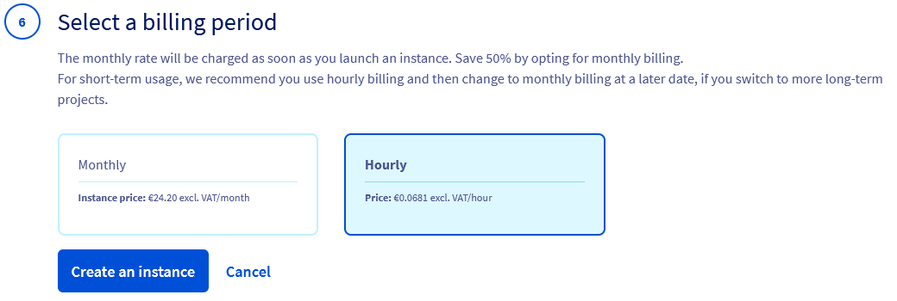
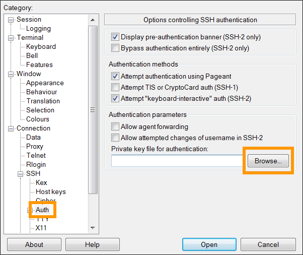
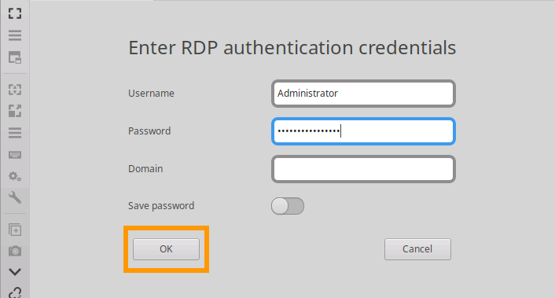

> [!primary]
> Tłumaczenie zostało wygenerowane automatycznie przez system naszego partnera SYSTRAN. W niektórych przypadkach mogą wystąpić nieprecyzyjne sformułowania, na przykład w tłumaczeniu nazw przycisków lub szczegółów technicznych. W przypadku jakichkolwiek wątpliwości zalecamy zapoznanie się z angielską/francuską wersją przewodnika. Jeśli chcesz przyczynić się do ulepszenia tłumaczenia, kliknij przycisk "Zgłóś propozycję modyfikacji" na tej stronie.
>

## Wprowadzenie

Z najlepszych praktyk wynika, że instancje chmury publicznej w ramach usługi Public Cloud OVHcloud wymagają innego podejścia niż rozwiązania prywatnych serwerów wirtualnych (VPS) czy serwerów dedykowanych.

**Dowiedz się, jak utworzyć instancję Public Cloud i połączyć się z nią.**

## Wymagania początkowe

- [projekt Public Cloud](https://www.ovhcloud.com/pl/public-cloud/) na koncie OVHcloud
- dostęp do [Panelu klienta OVHcloud](https://www.ovh.com/auth/?action=gotomanager&from=https://www.ovh.pl/&ovhSubsidiary=pl)

## W praktyce

### Krok 1: utworzenie kluczy SSH

Protokół SSH wymaga szyfrowania komunikacji między klientem a serwerem. Korzystanie z kluczy SSH dodatkowo poprawia bezpieczeństwo, ponieważ zapobiega połączeniom z urządzeń, które nie mają pasującego klucza. Utworzony zestaw kluczy SSH zawiera klucz publiczny i klucz prywatny.

- **Klucz publiczny** zostaje dodany do instancji Public Cloud przy instalacji.

- **Klucz prywatny**, przechowywany na urządzeniu klienckim, umożliwia dostęp do instancji bez podawania hasła użytkownika. 

> [!primary]
>
Logowanie przy użyciu kluczy SSH jest obowiązkowe w przypadku połączeń z instancjami Public Cloud z wyjątkiem tych, w których działają systemy operacyjne Windows. Publiczne klucze SSH dodane do Panelu klienta OVHcloud będą dostępne dla usług Public Cloud we wszystkich regionach i centrach danych. Przechowywać można tylko zaszyfrowane klucze **RSA** i **ECDSA**, klucze ED25519 obecnie nie są obsługiwane. 
>
Do uwierzytelnienia logowania w instancjach z systemem Windows są wymagane tylko nazwa użytkownika i hasło.
>

#### Tworzenie klucza SSH przy użyciu systemu operacyjnego Linux lub Mac

Na komputerze Mac lub urządzeniu z zainstalowanym systemem operacyjnym Linux najpierw otwórz aplikację wiersza polecenia (terminal). Sprawdź, czy w katalogu domowym $HOME masz folder “.ssh”. Jeśli taki folder nie istnieje, utwórz go:

```bash
$ mkdir ~/.ssh
$ chmod 700 ~/.ssh
```

Utwórz 4096-bitowy klucz RSA przy użyciu następującego polecenia:

```bash
$ ssh-keygen -b 4096
```
Aby określić inną metodę szyfrowania, użyj tego polecenia z opcją “-t”, na przykład:

```bash
$ ssh-keygen -t ecdsa -a 256
```

Zostanie wyświetlony monit o zapisanie nowo utworzonego klucza w standardowym pliku:

```console
Generating public/private rsa key pair.
Enter file in which to save the key (/home/user/.ssh/id_rsa):
```

Możesz zaakceptować plik domyślny, naciskając klawisz “↩” (Enter). Po potwierdzeniu możesz podać hasło, które będzie stanowić zabezpieczenie klucza SSH. Jest to zalecane w celu zwiększenia bezpieczeństwa. Ponieważ klucz prywatny będzie wymagany w celu uzyskania dostępu do instancji Public Cloud z działającego urządzenia, należy zastosować odpowiednie środki bezpieczeństwa. Hasło należy podać po nawiązaniu połączenia z instancją.

Klucze powinny zostać zapisane w katalogu “.ssh”. Klucz publiczny ma dodane “pub” do nazwy pliku.

```console
Your identification has been saved in /home/user/.ssh/id_rsa.
Your public key has been saved in /home/user/.ssh/id_rsa.pub.
The key fingerprint is:
SHA256:MRk+Y0zCOoOkferhkTvMpcMsYspj212lK7sEauNap user@hostname
The key's randomart image is:
+---[RSA 4096]----+
|     .. o        |
|    . .= o       |
|   o o  X        |
|. . . .          |
|. .=.o .S.       |
| =o.o.  .   .    |
|o +   .  . o ..  |
|.. .  .   oEoo . |
|o.        .o+oo  |
+----[SHA256]-----+
```

> [!warning]
>
> Klucz prywatny zawsze należy przechowywać w bezpiecznym miejscu, a dostęp do niego powinny mieć tylko uprawnione osoby.
> 

Aby wyświetlić i wyeksportować klucz publiczny, użyj polecenia “cat” względem pliku klucza z “pub” w nazwie i skopiuj dane wyjściowe:

```bash
$ cat ~/.ssh/id_rsa.pub
ssh-rsa AAAAB3NzaC1yc2EAAAADAQABAAABAQC8teh2NJ42qYZV98gTNhumO1b6rMYIkAfRVazl
k6dSS3xf2MXJ4YHsDacdjtJ+evXCFBy/IWgdkFtcvsGAMZ2N1RdvhDyQYcy6NDaJCBYw1K6Gv5fJ
SHCiFXvMF0MRRUSMneYlidxUJg9eDvdygny4xOdC6c1JrPrSgOc2nQuKeMpOoOWLINIswg1IIFVk
kFMPrFivP8Z6tidzVpAtbr1sXmJGZazYWrU3FoK2a1sF1zEWrmlMOzX81zEWrmlMOzX8CpZW8Rae
i4ANmLy7NULWK36yU0Rp9bFJ4o0/4PTkZiDCsK0QyHhAJXdLN7ZHpfJtHIPCnexmwIMLfIhCWhO5
 user@hostname
```

> [!primary]
>
>W terminalu systemu MacOS do obsługi ciągów kluczy można też użyć poleceń “pbcopy” i “pbpaste”. Aby na przykład skopiować klucz z pliku “id_rsa.pub” do schowka, użyj tego polecenia:
>

```bash
$ pbcopy < ~/.ssh/id_rsa.pub
```

#### Tworzenie klucza SSH przy użyciu systemu operacyjnego Windows

[PuTTY](https://putty.org/){.external} to oprogramowanie klienta SSH typu open source z graficznym interfejsem użytkownika, z którego można korzystać w systemie Windows oraz innych systemach operacyjnych. Umożliwia zdalne połączenie z serwerem systemu Linux. Jego oprogramowanie pomocnicze PuTTYgen (PuTTY Key Generator) służy do tworzenia kluczy SSH.

Jeśli jeszcze nie masz zainstalowanego oprogramowania PuTTY, najpierw pobierz je z [oficjalnej witryny internetowej](https://www.chiark.greenend.org.uk/~sgtatham/putty/latest.html). Zalecany standardowy pakiet instalacyjny zawiera program PuTTYgen, ale można go pobrać także jako niezależny plik. Aby dowiedzieć się, czy już masz ten program, sprawdź menu “Programy” lub użyj usługi Windows Search.

Otwórz program PuTTYgen i wybierz obsługiwany algorytm szyfrowania. W tym przykładzie jest używany algorytm RSA. Jako liczbę bitów wpisz 4096, a następnie kliknij przycisk `Generate`{.action} (Generuj).

{.thumbnail}

Następnie losowo przesuwaj kursorem myszy w obszarze pod paskiem postępu:

{.thumbnail}

Klucz jest gotowy po wypełnieniu paska postępu. 

{.thumbnail}

W tym oknie można wybrać i skopiować klucz publiczny, aby go zapisać w Panelu klienta OVHcloud — w [kroku 2](./#krok-2-przechowywanie-kluczy-publicznych-w-panelu-klienta-ovhcloud).

Zapisz oba klucze w plikach i wpisz hasło w odpowiednich polach. Ponieważ klucz prywatny będzie wymagany w celu uzyskania dostępu do instancji Public Cloud z działającego urządzenia, należy zastosować odpowiednie środki bezpieczeństwa. Hasło należy podać po nawiązaniu połączenia z instancją.

### Krok 2: przechowywanie kluczy publicznych w Panelu klienta OVHcloud

Niezależnie od wybranej metody tworzenia kluczy SSH teraz można dodać klucz publiczny do instancji Public Cloud. Klucze publiczne można przechowywać w sekcji Public Cloud Panelu klienta OVHcloud, aby były łatwo dostępne podczas tworzenia instancji.

> [!primary]
>
Zapisane klucze SSH umożliwiają szybsze tworzenie instancji. Aby zmienić pary kluczy i następnie dodać użytkowników, zapoznaj się z przewodnikiem [Konfiguracja dodatkowych kluczy SSH](/pages/public_cloud/compute/configuring_additional_ssh_keys).
>

Zaloguj się do [Panelu klienta OVHcloud](https://www.ovh.com/auth/?action=gotomanager&from=https://www.ovh.pl/&ovhSubsidiary=pl), przejdź do sekcji `Public Cloud`{.action} i wybierz odpowiedni projekt Public Cloud. Następnie kliknij pozycję `Klucze SSH`{.action} na lewym pasku nawigacyjnym w obszarze “Zarządzanie projektami”.

Kliknij przycisk `Dodaj klucz SSH`{.action}. W nowym oknie wpisz nazwę klucza i wklej ciąg klucza (skopiowany w [kroku 1](./#krok-1-utworzenie-kluczy-ssh) z pliku klucza publicznego lub okna PuTTYgen) w polu “Klucz”. Potwierdź, klikając przycisk `Dodaj`{.action}.

{.thumbnail}

### Krok 3: tworzenie instancji  <a name="create-instance"></a>

<iframe width="560" height="315" src="https://www.youtube-nocookie.com/embed/YP92y1rAVdQ" title="YouTube video player" frameborder="0" allow="accelerometer; autoplay; clipboard-write; encrypted-media; gyroscope; picture-in-picture" allowfullscreen></iframe>

Zaloguj się do [Panelu klienta OVHcloud](https://www.ovh.com/auth/?action=gotomanager&from=https://www.ovh.pl/&ovhSubsidiary=pl), przejdź do sekcji `Public Cloud`{.action} i wybierz odpowiedni projekt Public Cloud. Na stronie głównej kliknij pozycję `Utwórz instancję`{.action}. (To samo można uzyskać na stronie “Instancje”, klikając pozycję `Instancje`{.action} na lewym pasku nawigacyjnym w obszarze “Środowisko obliczeniowe”).

{.thumbnail}

Najpierw wybierz odpowiedni do swoich potrzeb szablon serwera. Narzędzie pomocy wyświetli opisy dotyczące różnych zastosowań i dostępności modeli serwera. Do wyboru są następujące dostosowane kategorie:

| Typ serwera | Gwarantowane zasoby | Uwagi dotyczące zastosowana |
| :---         |     :---:      |          :--- |
| General Purpose   | ✓     | Serwery programistyczne, aplikacje internetowe i biznesowe    |
| Compute Optimized (procesor)     | ✓       | Kodowanie wideo lub inne zastosowania wymagające dużej wydajności obliczeniowej      |
| Memory Optimized   | ✓     | Bazy danych, analiza i obliczenia w pamięci    |
| GPU     | ✓       | Masowe przetwarzanie równoległe na potrzeby aplikacji specjalistycznych (renderowanie, Big Data, zaawansowane uczenie maszynowe itd.)       |
| Discovery    | -       | Hostowane we współdzielonych zasobach na potrzeby środowisk testowych i programistycznych      |
| Storage Optimized   | ✓     | Zoptymalizowane pod kątem transferu danych na dyskach    |
| Metal | ✓ | Dedykowane zasoby z bezpośrednim dostępem do zasobów obliczeniowych, magazynowych i sieciowych|

> [!primary]
>
Łączne zasoby Twojej chmury publicznej w ramach Public Cloud będą początkowo ograniczone z powodów bezpieczeństwa. W Panelu klienta OVHcloud możesz sprawdzić limity i zażądać ich zwiększenia, klikając pozycję `Limity i lokalizacja`{.action} na lewym pasku nawigacyjnym w obszarze “Zarządzanie projektami”.
>
Później będzie możliwe zwiększenie zasobów instancji, ale nie przejście do mniejszego modelu, chyba że w czwartym kroku tworzenia wybierzesz opcję instancji elastycznej “Flex”. Poniżej znajduje się więcej informacji na ten temat.
>

W następnym kroku wybierz centrum danych instancji Public Cloud.

Trzecia opcja służy do wyboru systemu operacyjnego instancji. Obrazy dostępne w tym kroku zależą od wyborów dokonanych w poprzednich krokach, na przykład od zgodności z typem serwera i regionu. Dostępne są również systemy operacyjne z preinstalowanymi aplikacjami.

{.thumbnail}

> [!primary]
>
Jeśli wybierzesz system operacyjny, który wymaga płatnej licencji, jej koszty zostaną automatycznie uwzględnione w rozliczeniu miesięcznym lub godzinowym.
>

W tym kroku należy też dodać klucz SSH (poza instancjami z systemem Windows) przez wklejenie bezpośrednio za pomocą przycisku `Dodaj klucz`{.action} lub wybranie z listy, o ile klucz został zapisany w Panelu klienta w [kroku 2](./#krok-2-przechowywanie-kluczy-publicznych-w-panelu-klienta-ovhcloud).

{.thumbnail}

W czwartym kroku można skonfigurować dodatkowe opcje.

{.thumbnail}

- Możesz wdrożyć wiele instancji z wybraną konfiguracją (w ramach wspomnianego powyżej limitu początkowego).
- Możesz utworzyć instancję elastyczną, która umożliwia później przejście do mniejszego modelu (a nawet zmianę kategorii modelu serwera), ale zawsze ogranicza instancję do 50 GB **przestrzeni dyskowej**, niezależnie od tego, czy następuje przejście do wyższego, czy niższego modelu.
- Możesz zmienić nazwę wyświetlaną instancji.
- Możesz dodać skrypt uruchamiany po instalacji.
- Możesz włączyć automatyczne kopie zapasowe instancji. Zwróć uwagę na informacje o cenie i szczegóły dotyczące rotacji kopii zapasowych.

Po zakończeniu kliknij przycisk `Dalej`{.action}, aby skonfigurować Twoją sieć.

{.thumbnail}

W zależności od planowanego wykorzystania instancji możesz wybrać **Tryb publiczny** lub **Tryb prywatny**.

Tryb publiczny to klasyczny model sieci, który umożliwia przypisany publiczny port sieciowy Twoim instancjom. Każda instancja posiada publiczny adres IP i prywatny adres IP przypisany do usługi vrack.

Tryb prywatny daje możliwość przypisywania instancji tylko do sieci prywatnej. Instancje w tym trybie mogą być dostępne w sieci publicznej wyłącznie za pomocą usługi Gateway lub Load Balancer z Floating IP. Więcej informacji znajdziesz w ddokumentacją dotyczącą [rozwiązań sieciowych dla Public Cloud OVHcloud](/products/public-cloud-network).

Po wybraniu trybu wybierz prywatną sieć, do której chcesz przypisać instancję lub kliknij `Utwórz nową prywatną sieć`{.action}, aby stworzyć nową.

Po zastosowaniu wybranych opcji kliknij przycisk `Dalej`{.action}, aby przejść do ostatniego kroku i wybrać metodę rozliczania.

{.thumbnail}

Zalecamy wybór rozliczenia godzinowego w przypadku braku pewności co do okresu korzystania z usługi, ponieważ nie ma możliwości jego wyboru po jej wykonaniu. Będziesz miał możliwość przejścia na miesięczny abonament, gdy tylko instancja będzie dostępna na stronie "Instances".

> [!primary]
>
>Pamiętaj, że w przypadku wybrania jednej z aktualnych instancji *Compute*, opcja płatności **za godzinę** będzie dostępna wyłącznie ze względów technicznych.
>

> [!warning]
>
>W przypadku modelu godzinowego opłaty są naliczane aż do momentu usunięcia instancji. Nie ma znaczenia, czy instancja jest faktycznie używana, czy nie.
>

Po upewnieniu się, że wybrana konfiguracja jest prawidłowa kliknij przycisk `Utwórz instancję`{.action}, aby ukończyć tworzenie nowej instancji. Realizacja usługi może zająć kilka minut.

### Krok 4: połączenie z instancją <a name="connect-to-instance"></a>

Zaloguj się do [Panelu klienta OVHcloud](https://www.ovh.com/auth/?action=gotomanager&from=https://www.ovh.pl/&ovhSubsidiary=pl), przejdź do sekcji `Public Cloud`{.action} i wybierz odpowiedni projekt Public Cloud. Następnie kliknij pozycję `Instancje`{.action} na lewym pasku nawigacyjnym w obszarze “Środowisko obliczeniowe”. Instancja jest gotowa, gdy w kolumnie “Status” ma ustawienie “Aktywowano”. Aby to sprawdzić, możesz kliknąć przycisk “Odśwież” obok przycisku `Utwórz instancję`{.action}.

{.thumbnail}

W instancji zostaje utworzony automatycznie użytkownik z podwyższonymi uprawnieniami. Nazwa użytkownika odzwierciedla wybrany obraz, tj. “ubuntu”, “debian”, “fedora”, “arch” itd. Nazwę i inne elementy specyfikacji możesz sprawdzić na “Pulpicie nawigacyjnym” instancji, klikając ikonę `...`{.action}, a następnie pozycję `Szczegóły instancji`{.action}.

> [!primary]
>
W przypadku problemów z połączeniem, tj. błędów dotyczących kluczy SSH, zapoznaj się z przewodnikiem [Zmiana klucza SSH w przypadku utraty](/pages/public_cloud/compute/replacing_lost_ssh_key).
>

> [!primary]
>
Jeśli utworzyłeś instancję bez klucza SSH, przez API OVHcloud lub interfejs Openstack Horizon, możesz dodać klucz SSH do instancji tylko przez [tryb Rescue](/pages/public_cloud/compute/put_an_instance_in_rescue_mode), postępując zgodnie z instrukcjami podanymi w [tej sekcji odpowiedniego przewodnika](/pages/public_cloud/compute/replacing_lost_ssh_key#w-praktyce).
>

#### Połączenie z instancją z systemem operacyjnym Linux z systemu Linux/Mac

Instancja jest dostępna z poziomu interfejsu wiersza polecenia (terminala) przez SSH. Zastąp nazwę użytkownika (“username” w poniższych przykładach) swoją domyślną nazwą użytkownika, jak wyjaśniono powyżej. Możesz też po prostu skopiować całe polecenie logowania się z [Panelu klienta OVHcloud](https://www.ovh.com/auth/?action=gotomanager&from=https://www.ovh.pl/&ovhSubsidiary=pl), klikając je w “Panelu nawigacyjnym” instancji i wklejając w oknie terminala.

{.thumbnail}

Po wyświetleniu monitu wpisz hasło do klucza prywatnego. 

```bash
ssh username@IPv4_of_your_instance
Enter passphrase for key '/Users/username/.ssh/id_rsa':
```
Ponieważ logujesz się z uprawnieniami użytkownika root, czyli administratora (“sudo user”), możesz od razu wpisywać polecenia, aby wykonać zadania administracyjne. Zalecane jest, aby najpierw zmienić hasło:

```bash
$ sudo passwd username
New password:
Retype new password:
passwd: password updated successfully
```
Teraz możesz użyć tych poświadczeń do zalogowania się za pośrednictwem `Konsoli VNC`{.action} do [Panelu klienta OVHcloud](https://www.ovh.com/auth/?action=gotomanager&from=https://www.ovh.pl/&ovhSubsidiary=pl). Następnie przełącz się na użytkownika “root” i ustaw hasło bezpieczeństwa, a potem przełącz się z powrotem na poprzedniego użytkownika.

```bash
$ sudo su -
# passwd
New password:
Retype new password:
passwd: password updated successfully
# su - username
```
Przełączanie się na użytkownika “root” jest rzadko konieczne, ponieważ do dobrych praktyk zadań administracyjnych, które wymagają uprawnień administratora, należą logowanie się i wykonywanie poleceń jako użytkownik uwzględniony w grupie “sudo”.

#### Połączenie z instancją z systemem operacyjnym Linux z systemu Windows

Po utworzeniu i zapisaniu kluczy SSH (w [kroku 1](./#krok-1-utworzenie-kluczy-ssh)) i zainstalowaniu instancji z kluczem publicznym (w [kroku 3](./#krok-3-tworzenie-instancji)) możesz połączyć się z instancją przy użyciu oprogramowania [PuTTY](https://www.chiark.greenend.org.uk/~sgtatham/putty/latest.html) i swojego klucza prywatnego.

Otwórz aplikację PuTTY i rozwiń pozycję “SSH” w lewym menu. Następnie kliknij pozycję “Auth”, aby wyświetlić opcje uwierzytelniania.

{.thumbnail}

Kliknij przycisk `Browse`{.action} (Przeglądaj), aby przejść do folderu, w którym znajduje się plik klucza prywatnego (.ppk), i go otworzyć. Następnie za pomocą lewego menu przejdź do pozycji “Session” (Sesja) i wpisz swoje dane logowania (nazwa_użytkownika@adres_IPv4). Zastąp nazwę użytkownika “ubuntu” widoczną na przykładowych zrzutach ekranu swoją domyślną nazwą użytkownika — zgodnie z danymi w “Panelu nawigacyjnym” instancji w [Panelu klienta OVHcloud](https://www.ovh.com/auth/?action=gotomanager&from=https://www.ovh.pl/&ovhSubsidiary=pl). (Kliknij pozycję `Instancje`{.action} na lewym pasku nawigacyjnym, a następnie kliknij nazwę instancji).

Sesję możesz zapisać na potrzeby przyszłych połączeń, aby była dostępna na liście w tym interfejsie. Aby dodać sesję, podaj opisową nazwę w polu “Saved Sessions” (Zapisane sesje) i kliknij przycisk `Save`{.action} (Zapisz).

{.thumbnail}

Następnie kliknij przycisk `Open`{.action} (Otwórz). Pojawi się monit o podanie hasła do klucza.

{.thumbnail}

> [!primary]
>
Powyższe instrukcje przedstawiają najlepsze praktyki dotyczące bezpiecznego łączenia się z instancjami Public Cloud. Ze względu na wygodę i bezpieczeństwo warto też korzystać z menedżera haseł na urządzeniu, na przykład bezpłatnego rozwiązania open source **KeePass**.
>

#### Połączenie z instancją z systemem operacyjnym Windows

Po utworzeniu instancji należy przeprowadzić do końca instalację systemu Windows (proces przygotowania systemu — _sysprep_). W tym celu kliknij ikonę `...`{.action} i następnie pozycję `Szczegóły instancji`{.action}. Przejdź na kartę `Konsola VNC`{.action}. W konsoli powinien zostać wyświetlony interfejs zadań po instalacji.

{.thumbnail}

W pierwszym kroku zdefiniuj ustawienia lokalizacji, wybierając region, język i układ klawiatury. Kliknij przycisk `Dalej`{.action}, aby kontynuować.

{.thumbnail}

W kolejnym kroku trzeba skonfigurować domyślne konto “Administrator”. Dwukrotnie wpisz hasło i kliknij przycisk `Zakończ`{.action}, aby ukończyć proces instalacji. Klikając symbol oka sprawdź, czy wszystkie znaki wpisane w polu są zgodne z faktycznym układem klawiatury.

Instancja zostanie ponownie uruchomiona i będzie możliwe zalogowanie się za pomocą klienta pulpitu zdalnego przy użyciu ustawionych poświadczeń. 

##### **System Windows**

Otwórz natywną aplikację kliencką “Podłączanie pulpitu zdalnego” (w razie potrzeby znajdź ją przy użyciu usługi Windows Search).

{.thumbnail}

Podaj adres IPv4 swojej instancji i nazwę użytkownika “Administrator”, a następnie wpisz hasło. Zwykle jest wyświetlany komunikat ostrzegawczy z monitem o potwierdzenie połączenia, ponieważ certyfikat jest nieznany. Kliknij przycisk `Tak`{.action}, aby zalogować się do instancji.

> [!primary]
>
Jeśli wystąpią problemy z wykonaniem tej procedury, sprawdź, czy na urządzeniu są dozwolone połączenia zdalne (RDP). W tym celu przejrzyj ustawienia systemu, reguły zapory i ewentualne ograniczenia sieci.
>

##### **System Linux**

Instancje Public Cloud są dostępne za pośrednictwem wbudowanej konsoli VNC w [Panelu klienta OVHcloud](https://www.ovh.com/auth/?action=gotomanager&from=https://www.ovh.pl/&ovhSubsidiary=pl). Połączenia z urządzenia lokalnego należy nawiązywać z aplikacji klienckiej, która obsługuje protokół RDP (Remote Desktop Protocol).

Zgodną aplikacją jest na przykład klient pulpitu zdalnego Remmina, który powinien znajdować się w pakiecie instalacyjnym systemu Ubuntu. Jeśli nie znajdziesz aplikacji Remmina w swoim środowisku, możesz ją uzyskać z [oficjalnej witryny internetowej](https://remmina.org/).

{.thumbnail}

Otwórz aplikację Remmina i sprawdź, czy jest ustawiony protokół połączenia “RDP”. Wpisz adres IPv4 swojej instancji Public Cloud i naciśnij klawisz “↩” (Enter).

{.thumbnail}

Jeśli pojawi się komunikat dotyczący certyfikatu, kliknij przycisk `Tak`{.action}. Następnie wpisz nazwę użytkownika i hasło do instancji, a potem kliknij przycisk `OK`{.action}, aby nawiązać połączenie.

{.thumbnail}

## Sprawdź również

[Tworzenie kopii zapasowej instancji](/pages/public_cloud/compute/save_an_instance)

[Zwiększenie limitów Public Cloud](/pages/public_cloud/compute/increasing_public_cloud_quota)

[Zmiana typu rozliczenia z godzinowego na miesięczne](/pages/account_and_service_management/managing_billing_payments_and_services/changing_hourly_monthly_billing)

[Konfiguracja dodatkowych kluczy SSH](/pages/public_cloud/compute/configuring_additional_ssh_keys)

Dołącz do naszej społeczności użytkowników: <https://community.ovh.com/en/>.
