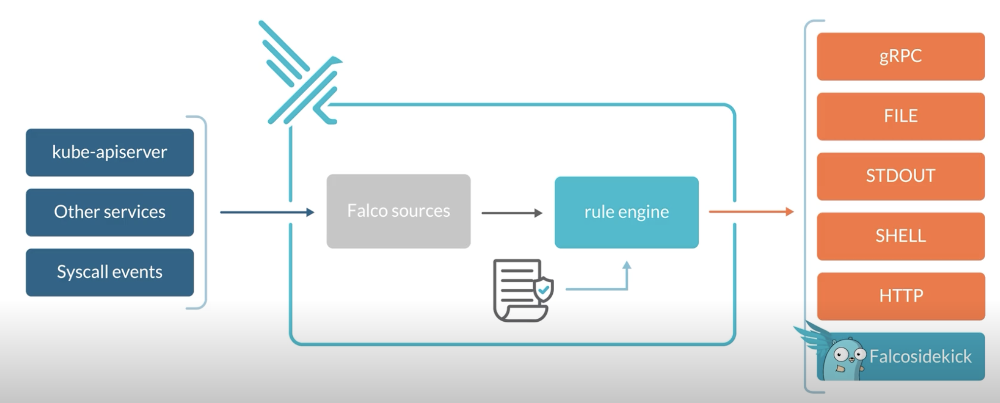
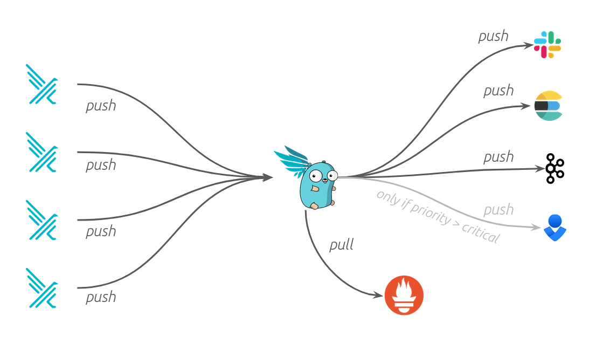
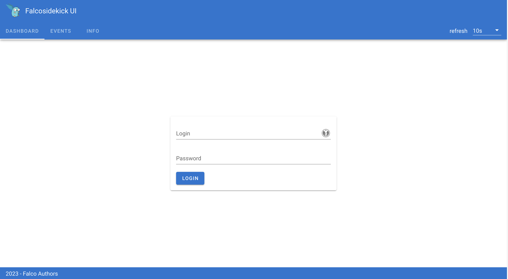
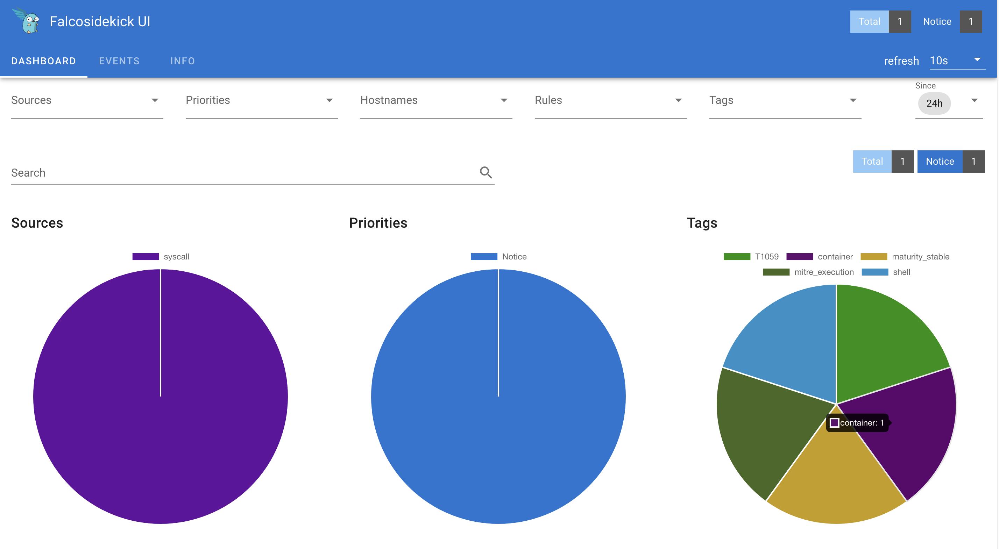

## Objective


[Falco](https://falco.org) is an Open Source cloud-native runtime security tool. It provides near real-time threat detection for cloud, container, and Kubernetes workloads by leveraging runtime insights. Falco can monitor events from various sources, including the Linux kernel, and enrich them with metadata from the Kubernetes API server, container runtime, and more.



Concretely, Falco:

* Receive **Events**
* Compare them to a set of **Rules** to determine the actions to perform
* Generate **Alerts**: forward the Falco events to different endpoints (syslog, stdout, https, graph...) or to different apps (slack, discord, elasticsearch, kafka...) through [falcosidekick](https://github.com/falcosecurity/falcosidekick)



As at OVHcloud, we like to provide you with the best products and services and for us security is important, that's why we wanted to help you discover Falco which will help you secure your OVHcloud Managed Kubernetes with a runtime security tool.

In this guide you will:

- Install Falco & Falcosidekick
- Test the behavior
- Visualize the events in UI

You can use the *Reset cluster* function in the Public Cloud section of the [OVHcloud Control Panel](https://www.ovh.com/auth/?action=gotomanager&from=https://www.ovh.de/&ovhSubsidiary=de){.external} to reinitialize your cluster before following this tutorial.

## Requirements

This tutorial presupposes that you already have a working OVHcloud Managed Kubernetes cluster, and some basic knowledge of how to operate it. If you want to know more on those topics, please look at the [deploying a Hello World application](/pages/public_cloud/containers_orchestration/managed_kubernetes/deploying-hello-world) documentation.

## Instructions

### Installing Falco

For this tutorial we are using the [Falco Helm chart](https://github.com/falcosecurity/charts).

Add the Falco Helm repository:

```bash
helm repo add falcosecurity https://falcosecurity.github.io/charts
helm repo update
```

These commands will add the Falco Helm repository to your local Helm chart repository and update the installed chart repositories:

```console
$ helm repo add falcosecurity https://falcosecurity.github.io/charts
helm repo update
"falcosecurity" has been added to your repositories
Hang tight while we grab the latest from your chart repositories...
...
...Successfully got an update from the "falcosecurity" chart repository
...
Update Complete. ⎈Happy Helming!⎈
```

Install the latest version of Falco with `helm install` command:

```bash
helm install falco \
    --version 4.0.0 \
    --create-namespace \
    --namespace falco \
    --set tty=true \
    --set falcosidekick.enabled=true \
    --set falcosidekick.webui.enabled=true \
    --set falcosidekick.webui.user=myuser:mypassword \
    --set falcosidekick.webui.service.type=LoadBalancer \
  falcosecurity/falco
```

This command will install the latest version of Falco, with falcosidekick UI and create a new `falco` namespace:

```console
$ helm install falco \
    --version 4.0.0 \
    --create-namespace \
    --namespace falco \
    --set tty=true \
    --set falcosidekick.enabled=true \
    --set falcosidekick.webui.enabled=true \
    --set falcosidekick.webui.user=myuser:mypassword \
    --set falcosidekick.webui.service.type=LoadBalancer \
  falcosecurity/falco
NAME: falco
LAST DEPLOYED: Wed Apr  3 11:48:42 2024
NAMESPACE: falco
STATUS: deployed
REVISION: 1
NOTES:
Falco agents are spinning up on each node in your cluster. After a few
seconds, they are going to start monitoring your containers looking for
security issues.


No further action should be required.
```

As you can see we install also Falcosidekick thaks to several flags:

* `--set falcosidekick.enabled=true` enables deployment of Falcosidekick aside Falco and configures Falco for sending its events to Falcosidekick
* `--set falcosidekick.webui.enabled=true` enables deployment of Falcosidekick-UI and configure Falcosidekick for using it as output
* `--set falcosidekick.webui.service.type=LoadBalancer` allows to access the UI through an OVHcloud Load Balancer (and an external IP)

> [!primary]
> Don't forget to change in the `helm install` command, and specifically in the `--set falcosidekick.webui.user` parameter, the login and the password to access to the UI. 

The Falco Helm chart installs a DaemonSet to add Falco Pods to all Nodes in the Kubernetes cluster to monitor abnormal behavior:

```console
$ kubectl get all -n falco
NAME                                        READY   STATUS    RESTARTS      AGE
pod/falco-42nrg                             2/2     Running   0             2m10s
pod/falco-falcosidekick-54bdbf6984-7pgcr    1/1     Running   0             2m10s
pod/falco-falcosidekick-54bdbf6984-cbc9w    1/1     Running   0             2m10s
pod/falco-falcosidekick-ui-6568c775-8d9hd   1/1     Running   2 (63s ago)   2m10s
pod/falco-falcosidekick-ui-6568c775-sn8xt   1/1     Running   3 (75s ago)   2m10s
pod/falco-falcosidekick-ui-redis-0          1/1     Running   0             2m9s
pod/falco-j5j2j                             2/2     Running   0             2m10s
pod/falco-vb5nb                             2/2     Running   0             2m10s

NAME                                   TYPE           CLUSTER-IP    EXTERNAL-IP     PORT(S)             AGE
service/falco-falcosidekick            ClusterIP      10.3.90.150   <none>          2801/TCP,2810/TCP   2m11s
service/falco-falcosidekick-ui         LoadBalancer   10.3.39.227   xx.xx.xx.xx     2802:30626/TCP      2m11s
service/falco-falcosidekick-ui-redis   ClusterIP      10.3.239.25   <none>          6379/TCP            2m11s

NAME                   DESIRED   CURRENT   READY   UP-TO-DATE   AVAILABLE   NODE SELECTOR   AGE
daemonset.apps/falco   3         3         3       3            3           <none>          2m11s

NAME                                     READY   UP-TO-DATE   AVAILABLE   AGE
deployment.apps/falco-falcosidekick      2/2     2            2           2m11s
deployment.apps/falco-falcosidekick-ui   2/2     2            2           2m11s

NAME                                              DESIRED   CURRENT   READY   AGE
replicaset.apps/falco-falcosidekick-54bdbf6984    2         2         2       2m11s
replicaset.apps/falco-falcosidekick-ui-6568c775   2         2         2       2m11s

NAME                                            READY   AGE
statefulset.apps/falco-falcosidekick-ui-redis   1/1     2m11s
```

You can check if the Falco and falcosidekick pods are correctly running:

```console
$ kubectl get pods -n falco
NAME                                    READY   STATUS    RESTARTS      AGE
falco-42nrg                             2/2     Running   0             2m18s
falco-falcosidekick-54bdbf6984-7pgcr    1/1     Running   0             2m18s
falco-falcosidekick-54bdbf6984-cbc9w    1/1     Running   0             2m18s
falco-falcosidekick-ui-6568c775-8d9hd   1/1     Running   2 (71s ago)   2m18s
falco-falcosidekick-ui-6568c775-sn8xt   1/1     Running   3 (83s ago)   2m18s
falco-falcosidekick-ui-redis-0          1/1     Running   0             2m17s
falco-j5j2j                             2/2     Running   0             2m18s
falco-vb5nb                             2/2     Running   0             2m18s
```

Wait and execute the command again if the pods are in "Init" or "ContainerCreating" state.

Once the falco pod is ready, run the following command to see the logs:

```bash
kubectl logs -l app.kubernetes.io/name=falco -n falco -c falco
```

You should see logs like that:

```console
$ kubectl logs -l app.kubernetes.io/name=falco -n falco -c falco

Wed Apr  3 12:22:26 2024: Falco version: 0.37.0 (x86_64)
Wed Apr  3 12:22:26 2024: Falco initialized with configuration file: /etc/falco/falco.yaml
Wed Apr  3 12:22:26 2024: System info: Linux version 5.15.0-101-generic (buildd@lcy02-amd64-032) (gcc (Ubuntu 11.4.0-1ubuntu1~22.04) 11.4.0, GNU ld (GNU Binutils for Ubuntu) 2.38) #111-Ubuntu SMP Tue Mar 5 20:16:58 UTC 2024
Wed Apr  3 12:22:26 2024: Loading rules from file /etc/falco/falco_rules.yaml
Wed Apr  3 12:22:26 2024: The chosen syscall buffer dimension is: 8388608 bytes (8 MBs)
Wed Apr  3 12:22:26 2024: Starting health webserver with threadiness 2, listening on 0.0.0.0:8765
Wed Apr  3 12:22:26 2024: Loaded event sources: syscall
Wed Apr  3 12:22:26 2024: Enabled event sources: syscall
Wed Apr  3 12:22:26 2024: Opening 'syscall' source with Kernel module
Wed Apr  3 12:21:51 2024: Falco version: 0.37.0 (x86_64)
Wed Apr  3 12:21:51 2024: Falco initialized with configuration file: /etc/falco/falco.yaml
Wed Apr  3 12:21:51 2024: System info: Linux version 5.15.0-101-generic (buildd@lcy02-amd64-032) (gcc (Ubuntu 11.4.0-1ubuntu1~22.04) 11.4.0, GNU ld (GNU Binutils for Ubuntu) 2.38) #111-Ubuntu SMP Tue Mar 5 20:16:58 UTC 2024
Wed Apr  3 12:21:51 2024: Loading rules from file /etc/falco/falco_rules.yaml
Wed Apr  3 12:21:51 2024: The chosen syscall buffer dimension is: 8388608 bytes (8 MBs)
Wed Apr  3 12:21:51 2024: Starting health webserver with threadiness 2, listening on 0.0.0.0:8765
Wed Apr  3 12:21:51 2024: Loaded event sources: syscall
Wed Apr  3 12:21:51 2024: Enabled event sources: syscall
Wed Apr  3 12:21:51 2024: Opening 'syscall' source with Kernel module
Wed Apr  3 12:21:57 2024: Falco version: 0.37.0 (x86_64)
Wed Apr  3 12:21:57 2024: Falco initialized with configuration file: /etc/falco/falco.yaml
Wed Apr  3 12:21:57 2024: System info: Linux version 5.15.0-101-generic (buildd@lcy02-amd64-032) (gcc (Ubuntu 11.4.0-1ubuntu1~22.04) 11.4.0, GNU ld (GNU Binutils for Ubuntu) 2.38) #111-Ubuntu SMP Tue Mar 5 20:16:58 UTC 2024
Wed Apr  3 12:21:57 2024: Loading rules from file /etc/falco/falco_rules.yaml
Wed Apr  3 12:21:57 2024: The chosen syscall buffer dimension is: 8388608 bytes (8 MBs)
Wed Apr  3 12:21:57 2024: Starting health webserver with threadiness 2, listening on 0.0.0.0:8765
Wed Apr  3 12:21:57 2024: Loaded event sources: syscall
Wed Apr  3 12:21:57 2024: Enabled event sources: syscall
Wed Apr  3 12:21:57 2024: Opening 'syscall' source with Kernel module
```

The logs confirm that Falco and its rules have been loaded correctly.

### Testig Falco

Even without [adding new rules](https://falco.org/docs/rules/), Falco contains existing default rules that we can use to test the behavior.
Follow the steps below to fire an alert if someone execute a shell into a running container.

Start an Alpine container:

```console
$ kubectl run demo-falco --image alpine -- sh -c "sleep infinity"
pod/demo-falco created
```

Execute a shell on the running container:

```console
$ kubectl exec -it demo-falco -- sh -c "ls -al"
total 64
drwxr-xr-x    1 root     root          4096 Apr  3 11:36 .
drwxr-xr-x    1 root     root          4096 Apr  3 11:36 ..
drwxr-xr-x    2 root     root          4096 Jan 26 17:53 bin
drwxr-xr-x    5 root     root           360 Apr  3 11:36 dev
drwxr-xr-x    1 root     root          4096 Apr  3 11:36 etc
drwxr-xr-x    2 root     root          4096 Jan 26 17:53 home
drwxr-xr-x    7 root     root          4096 Jan 26 17:53 lib
drwxr-xr-x    5 root     root          4096 Jan 26 17:53 media
drwxr-xr-x    2 root     root          4096 Jan 26 17:53 mnt
drwxr-xr-x    2 root     root          4096 Jan 26 17:53 opt
dr-xr-xr-x  310 root     root             0 Apr  3 11:36 proc
drwx------    2 root     root          4096 Jan 26 17:53 root
drwxr-xr-x    1 root     root          4096 Apr  3 11:36 run
drwxr-xr-x    2 root     root          4096 Jan 26 17:53 sbin
drwxr-xr-x    2 root     root          4096 Jan 26 17:53 srv
dr-xr-xr-x   13 root     root             0 Apr  3 11:36 sys
drwxrwxrwt    2 root     root          4096 Jan 26 17:53 tmp
drwxr-xr-x    7 root     root          4096 Jan 26 17:53 usr
drwxr-xr-x   12 root     root          4096 Jan 26 17:53 var
```

Now check the Falco logs to see the alert:

```console
$ kubectl logs -c falco -n falco -l app.kubernetes.io/name=falco |\
 grep "Notice"

{"hostname":"falco-fsvp8","output":"11:36:27.670410771: Notice A shell was spawned in a container with an attached terminal (evt_type=execve user=root user_uid=0 user_loginuid=-1 process=sh proc_exepath=/bin/busybox parent=runc command=sh -c ls -al terminal=34816 exe_flags=EXE_WRITABLE container_id=873807ba3669 container_image=docker.io/library/alpine container_image_tag=latest container_name=alpine k8s_ns=default k8s_pod_name=alpine)","priority":"Notice","rule":"Terminal shell in container","source":"syscall","tags":["T1059","container","maturity_stable","mitre_execution","shell"],"time":"2024-04-03T11:36:27.670410771Z", "output_fields": {"container.id":"873807ba3669","container.image.repository":"docker.io/library/alpine","container.image.tag":"latest","container.name":"alpine","evt.arg.flags":"EXE_WRITABLE","evt.time":1712144187670410771,"evt.type":"execve","k8s.ns.name":"default","k8s.pod.name":"alpine","proc.cmdline":"sh -c ls -al","proc.exepath":"/bin/busybox","proc.name":"sh","proc.pname":"runc","proc.tty":34816,"user.loginuid":-1,"user.name":"root","user.uid":0}}
```

You should see logs with "Notice A shell was spawned in a container with an attached terminal" message.


### Using the Falcosidekick UI

Now we have Falco installed and we test it, we can see the events visually in the Falcosidekick UI.

Display the external IP:

```console
$ kubectl get svc falco-falcosidekick-ui  -n falco
NAME                     TYPE           CLUSTER-IP     EXTERNAL-IP      PORT(S)          AGE
falco-falcosidekick-ui   LoadBalancer   10.3.198.190   xx.xx.xx.xx   2802:31222/TCP   130m
```

Open your browser and point to http://< EXTERNAL-IP >:2802 value using the credentials below:

* Login: my-user (or the login you defined in `helm install` command)
* Password: my-password (or the password you defined in `helm install` command)





Click on "EVENTS" tab:


You should see the previous events generated thanks to our tests.

### What's next?

We installed Falco and falcosidekick and discovered how to test it and visualize the events but we didn't see all the features. If you are interested, visit the [Falco official website](https://falco.org/).

After receving events we can, for example, forard the alerts to a multiples of apps thanks to Falcosidekick:

* Slack
* Discord
* Elasticsearch
* S3
* SMTP
* Opsgenie
* Webhook
* Prometheus
* Grafana
* Datadog
* ...

If you have any questions or troubles about Falco, you can also go to [Falco Slack community](https://kubernetes.slack.com/messages/falco).

## Cleanup

First, delete the `demo-falco` pod with the following command:

```bash
kubectl delete pod demo-falco
```

To uninstall Falco, as you installed it through Helm, you can use `helm uninstall` command in order to delete the Falco Helm installed chart:

```bash
helm uninstall falco -n falco
```

## Go further

- If you need training or technical assistance to implement our solutions, contact your sales representative or click on [this link](https://www.ovhcloud.com/de/professional-services/) to get a quote and ask our Professional Services experts for assisting you on your specific use case of your project.

- Join our community of users on <https://community.ovh.com/en/>.
