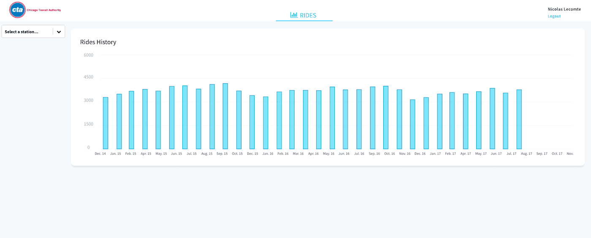

## Build your analytics app from scratch on Data Platform

The goal of this tutorial is to get you familiar with the Data Platform so that you can start creating your own applications as soon and as quickly as possible.

We'll walk you through the main steps to **build a data visualization app in less than 30 minutes**.

⛳️ The application to be built serves to visualize the rides in Chicago's railway stations. It will look like this by the end of this tutorial: 

<!-- MUST BE UPDATED -->

📥 You will use sample datasets, and all the features and pre-written code provided for you by the Data Platform.

### Six easy steps

   
   

      <h3 style="color: #2199e8 !important;">STEP 1 : Connect sources in the Data Manager</h3>
      
Define your data sources and build your data model

   

   

   
   

      <h3 style="color: #2199e8 !important;">STEP 2 : Organize your data in the Lakehouse Manager</h3>
      
Create and Build your data models

   

   

   
   

      <h3 style="color: #2199e8 !important;">STEP 3 : Prepare the data on the Data Processing Engine</h3>
      
Configure the data import and transformation processes

   

   

   
   

      <h3 style="color: #2199e8 !important;">STEP 4 : Make queries in the Analytics Manager</h3>
      
Create custom queries to retrieve data from your data model

   

   

   
   

      <h3 style="color: #2199e8 !important;">STEP 5 : Expose your data on the API Manager</h3>
      
Expose your data by deploying an API dedicated to your Project

   

   

   
   

      <h3 style="color: #2199e8 !important;">STEP 6 : Visualize it on the APP Manager</h3>
      
Create and deploy your front-end application

   

   

