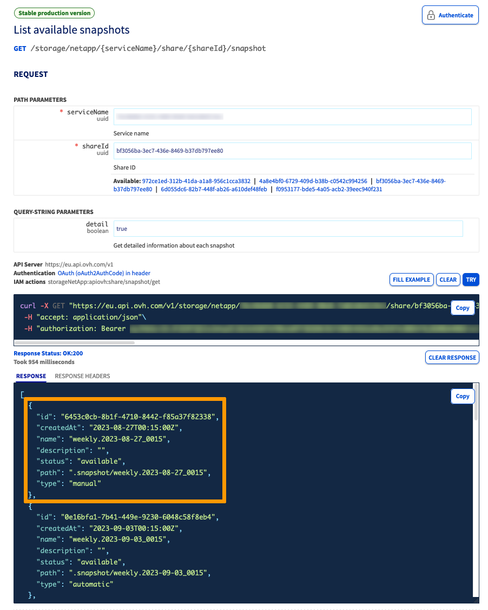
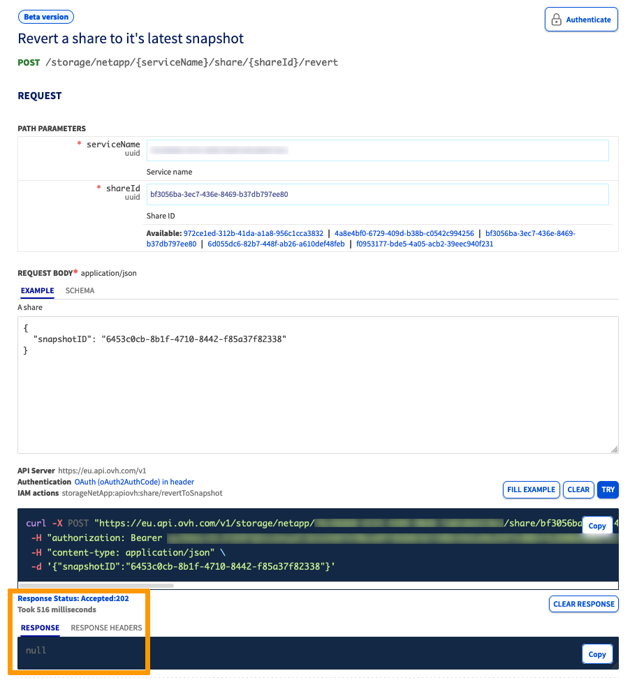

> [!primary]
> Diese Übersetzung wurde durch unseren Partner SYSTRAN automatisch erstellt. In manchen Fällen können ungenaue Formulierungen verwendet worden sein, z.B. bei der Beschriftung von Schaltflächen oder technischen Details. Bitte ziehen Sie im Zweifelsfall die englische oder französische Fassung der Anleitung zu Rate. Möchten Sie mithelfen, diese Übersetzung zu verbessern? Dann nutzen Sie dazu bitte den Button "Beitragen" auf dieser Seite.
>

## Ziel

Sie können ein Volume mithilfe der Funktion *snapshot revert* auf den Stand des letzten Snapshots zurücksetzen.

**Diese Anleitung erklärt, wie Sie die Volumes Ihres Enterprise File Storage mithilfe der Snapshot-Wiederherstellungsfunktion der OVHcloud API wiederherstellen.**

## Voraussetzungen

- Sie nutzen [OVHcloud Enterprise File Storage](https://www.ovhcloud.com/en-gb/storage-solutions/enterprise-file-storage/) und verfügen über ein Volume.
- Sie können sich in der [OVHcloud API-Konsole](https://api.ovh.com/console/) einloggen.

## Grundlagen

Ein Snapshot eines Volumes ist eine schreibgeschützte *Point-in-Time*-Kopie eines Volumes.
Die Snapshots werden auf Basis eines bestehenden, betriebsbereiten Volumes erstellt. Ein Snapshot kann nicht verwendet werden, wenn das Volume, zu dem er gehört, nicht mehr existiert.

> [!warning]
>
> Beachten Sie, dass alle später erstellten Dateien oder Snapshots verloren gehen, sobald ein Volume mit einem Snapshot wiederhergestellt wurde. Wenn ein Volume wiederhergestellt wird, werden alle darin enthaltenen Daten durch die Snapshot-Daten ersetzt. Diese Aktion kann nicht rückgängig gemacht werden.
>

In dieser Anleitung wird ein Volume - wie in der OVHcloud API - auch als „*share*“ bezeichnet.

## Limitierungen

Ein Volume kann nur auf seinen neuesten verfügbaren Snapshot wiederhergestellt werden. Wenn Sie jedoch ein Volume von einem früheren Snapshot wiederherstellen möchten, müssen Sie die Snapshots löschen, bis der für die Wiederherstellung zu verwendende Snapshot der aktuellste ist.

## In der praktischen Anwendung

### Szenario 1: Wiederherstellung eines Volumes von einem Snapshot vom Typ `manual`

In diesem Szenario setzen Sie Ihr Volume auf den neuesten Snapshot vom Typ `manual` zurück, der über die OVHcloud API oder das OVHcloud Kundencenter erstellt wurde.

> [!primary]
> **Voraussetzungen für dieses Szenario:**
>
> - Sie haben einen Snapshot vom Typ `manual` erstellt. Wenn dies nicht der Fall ist, können Sie über die OVHcloud API oder Ihr OVHcloud Kundencenter einen Snapshot vom Typ `manual` erstellen.
> - Der Snapshot vom Typ `manual` muss zu dem Volume gehören, das Sie wiederherstellen möchten.

1\. Identifizieren Sie den letzten Snapshot vom Typ `manual` mithilfe des folgenden API-Aufrufs:

> [!api]
>
> @api {GET} /storage/netapp/{serviceName}/share/{shareId}/snapshot
>

- `{serviceName}` ist die eindeutige Kennung des Dienstes.
- `{shareId}` ist das wiederherzustellende Volume.

{.thumbnail}

2\. Stellen Sie Ihr Volume mit dem API-Aufruf `/revert` auf den letzten Snapshot wieder her: 

> [!api]
>
> @api {POST} /storage/netapp/{serviceName}/share/{shareId}/revert
>

- `{serviceName}` ist die eindeutige Kennung des Dienstes.
- `{shareId}` ist das wiederherzustellende Volume.
- `{snapshotID}` ist der letzte Snapshot des Volumes.

Die OVHcloud API gibt nur einen HTTP 202-Code zurück (*Accepted*). 
Der Volume-Status ändert sich in `reverting` und kehrt nach Abschluss des Volume-Wiederherstellungsvorgangs zu `available` zurück. Gleichzeitig ändert sich der Status des Snapshots in `restoring` und kehrt nach Abschluss des Volume-Wiederherstellungsvorgangs zu `available` zurück.

{.thumbnail}

### Szenario 2: Wiederherstellung eines Volumes von einem Snapshot aus, der über die Snapshot-Regel erstellt wurde

In diesem Szenario werden regelmäßig (automatisch) Snapshots eines Volumes von einer Regel einer Snapshot-Regelung (*Snapshot Policy*) erstellt, und Sie möchten Ihr Volume auf den letzten Snapshot wiederherstellen, der von der *Snapshot Policy* erstellt wurde.

Sie müssen den letzten Snapshot, der von der einem Volume zugeordneten Snapshot-Regel erstellt wurde, beibehalten (`hold`), damit dieser Snapshot ein Snapshot `manual` wird. Sobald der Snapshot vom Typ `manual` ist, kann das zugehörige Volume wiederhergestellt werden.

> [!primary]
> **Voraussetzungen für dieses Szenario:**
>
> - Sie haben eine *Snapshot Policy* erstellt und dem wiederherzustellenden Volume zugewiesen.
> - Diese *Snapshot Policy* hat mindestens einen Snapshot erstellt.

> [!primary]
>
> Die von der *Snapshot Policy* erzeugten Snapshots sind vom Typ `automatic`. Sie müssen über die `/hold`-API-Route beibehalten werden, damit sie für den *Volume Restore* verwendet werden können. Dadurch wird verhindert, dass die *Snapshot Policy* die Rotation durchführt.
>

1\. Identifizieren Sie den letzten Snapshot vom Typ `automatic` mithilfe des folgenden API-Aufrufs:

> [!api]
>
> @api {GET} /storage/netapp/{serviceName}/share/{shareId}/snapshot
>

- `{serviceName}` ist die eindeutige Kennung des Dienstes.
- `{shareId}` ist das wiederherzustellende Volume.

{.thumbnail}

2\. Bewahren Sie den Snapshot mithilfe des folgenden API-Aufrufs auf: 

> [!api]
>
> @api {POST} /storage/netapp/{serviceName}/share/{shareId}/snapshot/{snapshotId}/hold

- `{serviceName}` ist die eindeutige Kennung des Dienstes.
- `{shareId}` ist das wiederherzustellende Volume.
- `{snapshotID}` ist der letzte automatische Snapshot.

> [!warning]
>
> Sobald der Speichervorgang (`hold`) abgeschlossen ist, werden die Kennung und der Typ des Snapshots geändert. Die Eigenschaften `name`, `createdAt` und `path` werden jedoch beibehalten. Notieren Sie sich die neue `id` für die folgenden Schritte.
>

{.thumbnail}

3\. Stellen Sie sicher, dass der neue Snapshot der letzte `manual` Snapshot des Volumes ist.

Wenn vor diesem Snapshot andere Snapshots vom Typ `manual` erstellt wurden, müssen diese gelöscht werden.

4\. Die API-Route, die zum Abrufen der Liste der Volume-Snapshots aus Schritt 1 verwendet wurde, kann hier wiederverwendet werden.

{.thumbnail}

5\. Stellen Sie das Volume auf seinen letzten Snapshot wieder her, indem Sie die API Route `/revert` aufrufen:

> [!api]
>
> @api {POST} /storage/netapp/{serviceName}/share/{shareId}/revert
>

- `{serviceName}` ist die eindeutige Kennung des Dienstes.
- `{shareId}` ist das wiederherzustellende Volume.
- `{snapshotID}` ist der letzte Snapshot des Volumes.

Die OVHcloud API gibt nur einen HTTP 202-Code zurück (*Accepted*). 
Der Volumestatus ändert sich in `reverting` und kehrt nach Abschluss des Volume-Wiederherstellungsvorgangs zu `available` zurück. Gleichzeitig ändert sich der Status des Snapshots in `restoring` und kehrt nach Abschluss des Volume-Wiederherstellungsvorgangs zu `available` zurück.

{.thumbnail}

Das Volume wird jetzt auf den ausgewählten Snapshot zurückgesetzt.

## Weiterführende Informationen 

Wenn Sie Schulungen oder technische Unterstützung bei der Implementierung unserer Lösungen benötigen, wenden Sie sich an Ihren Vertriebsmitarbeiter oder klicken Sie auf [diesen Link](https://www.ovhcloud.com/de/professional-services/), um einen Kostenvoranschlag zu erhalten und eine persönliche Analyse Ihres Projekts durch unsere Experten des Professional Services Teams anzufordern.

Für den Austausch mit unserer User Community gehen Sie auf <https://community.ovh.com/en/>.
