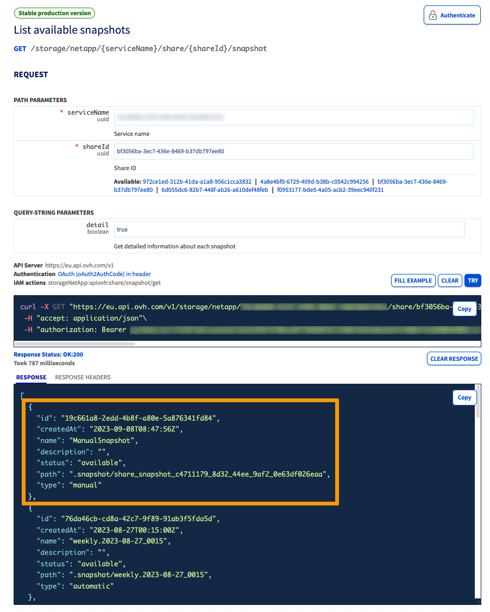

## Objectif

Dans ce guide, nous allons expliquer comment restaurer un volume à son dernier snapshot, à l'aide de la fonction de *snapshot revert*.

**Apprenez à restaurer les volumes de votre solution Enterprise File Storage à l'aide de la fonctionnalité de restauration de snapshots via l'API OVHcloud.**

## Prérequis

- Disposer d'une offre OVHcloud Enterprise File Storage avec un volume
- Être connecté à l’[API OVHcloud](https://api.ovh.com/)

## Principes de base

Un snapshot (ou instantané) d'un volume est une copie ponctuelle en lecture seule d'un volume.
Les snapshots sont crées à partir d'un volume existant et opérationnel. Un snapshot ne peut pas être utilisé si le volume auquel il appartient n'existe plus.

> [!warning]
>
> Veuillez noter qu'une fois qu'un volume est restauré à l'aide d'une copie de snapshot, tous les fichiers ou snapshots créés ultérieurement seront perdus. Lorsqu'un volume est restauré, toutes les données qu'il contient sont remplacées par les données du snapshot. Cette action est irréversible.
>

Dans ce guide, un volume est également appelé « *share* » comme dans l’API OVHcloud.

## Limites

Il est uniquement possible de restaurer un volume à son snapshot le plus récent disponible. Toutefois, si vous souhaitez restaurer un volume à partir d'un snapshot antérieur, vous devez supprimer les snapshots jusqu'à ce que le snapshot à utiliser pour la restauration soit le plus récent.

## En pratique

### Scénario 1 : restaurer un volume depuis un snapshot de type `manual`

Dans ce scénario, vous souhaitez restaurer votre volume à son dernier snapshot de type `manual`, créé via l'API OVHcloud ou l'espace client OVHcloud.

> [!primary]
> **Prérequis pour ce scénario :**
>
> - Vous avez déjà effectué un snapshot de type `manual`. Dans le cas contraire, vous pouvez créer un snapshot de type `manual` via l’API OVHcloud ou votre espace client OVHcloud.
> - Le snapshot de type `manual` doit appartenir au volume que vous souhaitez restaurer.

1\. Identifiez le dernier snapshot de volumed e type `manual` à l'aide de l'appel API suivant :

> [!api]
>
> @api {GET} /storage/netapp/{serviceName}/share/{shareId}/snapshot
>

- `{serviceName}` est l'identifiant unique du service
- `{shareId}` est le volume à restaurer 

{.thumbnail}

2\. Restaurez votre volume à son dernier snapshot en utilisant l'appel API `/revert` : 

> [!api]
>
> @api {POST} /storage/netapp/{serviceName}/share/{shareId}/revert
>

- `{serviceName}` est l'identifiant unique du service
- `{shareId}` est le volume à restaurer
- `{snapshotID}` est le dernier snapshot de volume

L’API OVHcloud retournera uniquement un code HTTP 202 (*Accepted*). 
L'état du volume passera à `reverting`, puis reviendra à `available` une fois le processus de restauration du volume terminé. De manière simultanée, l'état du snapshot passera à `restoring` puis reviendra à `available` une fois le processus de restauration du volume terminé.

{.thumbnail}

### Scénario 2 : Restaurer un volume depuis un snapshot effectué via la Snapshot policy

Dans ce scénario, une règle de snapshots (*Snapshot policy*) prend des snapshots réguliers (automatiques) d'un volume et vous souhaitez restaurer votre volume au dernier snapshot pris par la stratégie.

Vous devrez « conserver » (`hold`) le dernier snapshot pris par la Snapshot policy associée à un volume afin que ce snapshot devienne un snapshot `manual`. Une fois que le snapshot est de type `manual`, son volume associé peut y être restauré.

> [!primary]
> **Prérequis pour ce scénario :**
>
> - Vous avez créé une *snapshot policy* et vous l'avez associée au volume à restaurer.
> - Cette *snapshot policy*  a créé au moins un snapshot.

> [!primary]
>
> Les snapshots pris par la *snapshot policy*  sont de type `automatic`. Pour qu'ils puissent être utilisés pour la restauration de volume, ils doivent être conservés en utilisant la route API `/hold`. Cela empêchera leur rotation par la planification de la Snapshot Policy.
>

1\. Identifiez le dernier snapshot de volume de type `automatic` à l'aide de l'appel API suivant :

> [!api]
>
> @api {GET} /storage/netapp/{serviceName}/share/{shareId}/snapshot
>

- `{serviceName}` est l'identifiant unique du service
- `{shareId}` est le volume à restaurer

{.thumbnail}

2\. Conservez le Snapshot en utilisant l'appel API suivant : 

> [!api]
>
> @api {POST} /storage/netapp/{serviceName}/share/{shareId}/snapshot/{snapshotId}/hold

- `{serviceName}` est l'identifiant unique du service
- `{shareId}` est le volume à restaurer
- `{snapshotID}` est le dernier snapshot automatique en date

> [!warning]
>
> Une fois l'opération de conservation (`hold`) effectuée, l'identifiant et le type du snapshot seront modifiés. Toutefois, ses propriétés `name`, `createdAt` et `path` seront conservées. Veuillez prendre note du nouvel `id` pour les étapes suivantes.
>

{.thumbnail}

3\. Assurez-vous que le nouveau snapshot est le dernier snapshot de type `manual` du volume.

Si d'autres snapshots de type `manual` ont été pris avant ce snapshot, ils devront être supprimés.

4\. Le point de terminaison utilisé pour récupérer la liste des snapshots de volumes de l'étape 1 peut être réutilisé ici.

{.thumbnail}

5\. Restaurez le volume à son dernier snapshot en appelant la route API `/revert` :

> [!api]
>
> @api {POST} /storage/netapp/{serviceName}/share/{shareId}/revert
>

- `{serviceName}` est l'identifiant unique du service
- `{shareId}` est la volume à restaurer
- `{snapshotID}` est le dernier snapshot de volume en date

L’API OVHcloud retournera uniquement un code HTTP 202 (*Accepted*). 
L'état du volume passera à `reverting`, puis reviendra à `available` une fois le processus de restauration du volume terminé. De manière simultanée, l'état du snapshot passera à `restoring` puis reviendra à `available` une fois le processus de restauration du volume terminé.

{.thumbnail}

Le volume est maintenant restauré au snapshot sélectionné.

## Aller plus loin

Si vous avez besoin d'une formation ou d'une assistance technique pour la mise en oeuvre de nos solutions, contactez votre commercial ou cliquez sur [ce lien](https://www.ovhcloud.com/fr/professional-services/) pour obtenir un devis et demander une analyse personnalisée de votre projet à nos experts de l’équipe Professional Services.

Rejoignez notre communauté d'utilisateurs sur <https://community.ovh.com/>.
