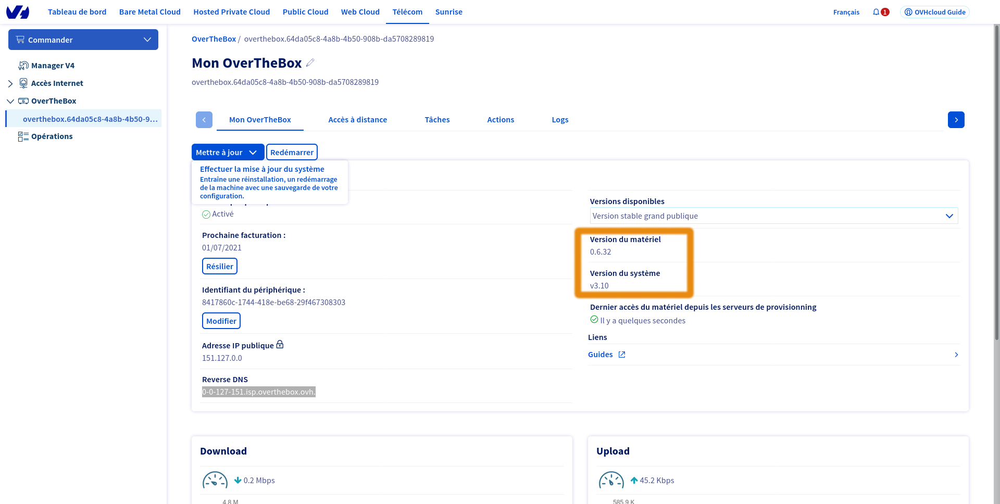
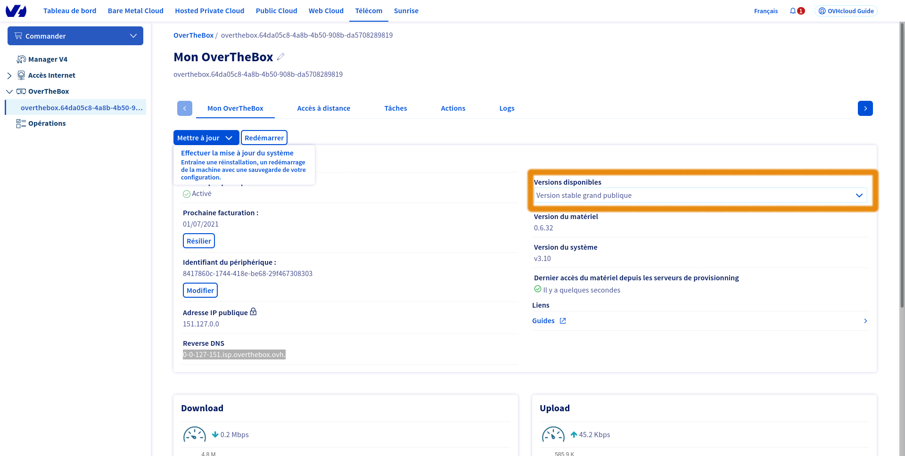

**Dernière mise à jour le 16/06/2021**

## Objectif

Découvrez comment mettre à jour votre équipement OverTheBox, afin de profiter des dernières améliortation.

## Prérequis

- Une **OverTheBox** fournie par OVHcloud.
- Être connecté à l'[espace client OVHcloud](https://www.ovhtelecom.fr/manager/#/){.external} dans la partie `Telecom`{.action}.

## En pratique

Il existe plusieurs méthodes pour mettre à jour votre équipement OverThebox.

### Méthode 1 : mise à jour par l'espace client

La méthode recommandé est de mettre à jour votre OverTheBox depuis l'espace client.

- Connectez-vous à votre [espace client OVHcloud](https://www.ovhtelecom.fr/manager/#/){.external}, partie « Télécom ».

- Cliquez sur `OverThebox`{.action} dans la barre de services à gauche, puis sélectionnez le service OverTheBox que vous souhaitez mettre à jour.

- Cliquez ensuite sur le bouton `Mettre à jour`, puis cliquez un seconde fois sur l'encart explicatif, la mise à jour va alors commencer.

{.thumbnail}

- Attendez quelques minutes afin qu'**OverTheBox** soit de nouveau opérationnelle.

> [!success]
>
> Votre  OvertheBox  est maintenant mise à jour, votre configuration a été réappliqué automatiquement.
>


### Méthode 2 : mise à jour par le CLI

Vous pouvez également mettre à jour votre équipement OverTheBox depuis le CLI, accessible depuis une connexion SSH.

- Connectez vous en SSH à votre **OverTheBox** :

```bash
ssh root@overthebox.ovh
```

- Une fois connecté, entrez la commande suivante :

```bash
otb-action-sysupgrade
```

- Attendez quelques minutes afin qu'**OverTheBox** soit de nouveau opérationnelle.

> [!success]
>
> Votre  OvertheBox  est maintenant mise à jour, votre configuration a été réappliqué automatiquement.
>

### Méthode 3 : réinstallation manuelle

> [!warning]
>
> Cette méthode n'est pas recommandée et utile uniquement pour certain usage avancé
>

Vous pouvez suivre le guide suivant pour installer manuellement la dernière image du système OverTheBox : [Installer l’image OverTheBox sur votre matériel](../installer-limage-overthebox-sur-votre-materiel/)

## Aller plus loin

### Voir les différence entre version

L'OverTheBox est un projet open-source, hébergé sur la plateforme github, le code est librement accessible et vous permet d'étudier concretement ce qui change entre chaque version.

Sur l'espace client, il y a deux informations de versions : **Version du matériel** et **Version du système**.

- La **version du matériel** est la version "principale" utiliser pour déterminer la version de votre équipement OverTheBox. Elle est basé sur le dépôt [overthebox-feeds](https://github.com/ovh/overthebox-feeds/tags){.external}, qui regroupe les différents logiciels utilisés par le système **OverTheBox**.

- La **version du système** est la version du système **OverTheBox** sur lequelle a été construite l'image. Elle est basé sur le dépot [overthebox](https://github.com/ovh/overthebox/tags){.external}

{.thumbnail}

### Passer sur une version Beta ou une version raspberry 3

> [!warning]
>
> Il n'est pas recommandé de modifier la version de votre image si vous n'êtes pas un utilisateur expert.
>

Sur l'espace client vous pouvez modifié le canal de votre version, ceci peut vous permettre d'utiliser des versions en cours de développement ou dans un status béta, ainsi que la version dédiée au raspberry si vous souhaitez utiliser ce type d'équipement.

{.thumbnail}

N'hésitez pas à échanger avec notre communauté d'utilisateurs sur vos produits Télécom sur notre site [OVHcloud Community](https://community.ovh.com/c/telecom)
