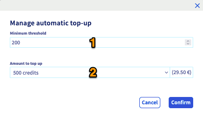

**Ostatnia aktualizacja z dnia 16-11-2021**

## Wprowadzenie

Z tego przewodnika dowiesz się, czym są zasilenia SMS, jak je automatycznie doładować i jak je przenosić między Twoimi kontami SMS.

## Wymagania początkowe

* Posiadanie aktywnego konta SMS OVHcloud
* Zalogowanie do [API OVHcloud](https://api.ovh.com/console/) (tylko na potrzeby przenoszenia zasileń).

## W praktyce

### Zasilenia SMS

0,35 zasilenie SMS odpowiada kosztowi wysłania 1 wiadomości SMS na numer we Polska, a opłata maleje w zależności od liczby zasileń SMS, które zamierzasz kupić za jednym razem. 

Listę pakietów zasileń SMS znajdziesz, klikając następujący link: [https://www.ovh.pl/sms/](https://www.ovh.pl/sms/).

**Przykładowy zakup pakietu 100 zasileń SMS, po 0,0945 PLN netto każde:**

Wysłanie 1 wiadomości SMS do Polska kosztuje 0,35 zasilenie. Dzięki temu pakietowi możesz wysłać 285 wiadomości SMS do Polska.
Wysłanie 1 wiadomości SMS do Indii kosztuje 0,4 zasilenia. Dzięki temu pakietowi możesz wysłać 250 wiadomości SMS do Indii.

Koszt wysyłki wiadomości SMS (w zasileniach) w zależności od ich miejsca przeznaczenia znajdziesz, klikając następujący link: [https://www.ovh.pl/sms/cennik/](https://www.ovh.pl/sms/cennik/).

> [!primary]
>
> Wiadomość SMS może zawierać ograniczoną liczbę znaków, zależną od rodzaju kodowania. Szczegóły dotyczące kodowania i dopuszczalnych znaków są dostępne w tym przewodniku:
> 
> [Wysyłanie wiadomości SMS z Panelu klienta OVHcloud](../wysylanie-wiadomosci-sms-z-panelu-klienta/#etap-2-tworzenie-wiadomosci-sms)
>

### Automatyczne doładowanie

Aby nigdy nie zabrakło Ci zasileń na koncie, możesz aktywować automatyczne doładowanie. Po osiągnięciu minimalnego progu zasileń nowa ilość zasileń zostanie automatycznie dodana do Twojego konta SMS.

> [!warning]
>
> Opcja automatycznego doładowania może zostać aktywowana tylko wtedy, gdy na Twoim koncie OVHcloud dostępny jest sposób płatności typu polecenie zapłaty SEPA.
>

Aby aktywować automatyczne doładowanie, zaloguj się do [Panelu klienta OVHcloud](https://www.ovh.com/auth/?action=gotomanager&from=https://www.ovh.pl/&ovhSubsidiary=pl){.external}, przejdź do karty `Telefonia`{.action}, a następnie na pasku usług po lewej stronie kliknij sekcję `SMS`{.action}. Wybierz konto SMS, dla którego chcesz aktywować automatyczne doładowanie.

Przejdź do menu `Opcje`{.action} (1), a następnie `Automatyczne ładowanie`{.action} (2).

{.thumbnail}

W rubryce „Zarządzaj opcjami” kliknij polecenie `Zmień`{.action}.

{.thumbnail}

Wypełnij wymagane pola:

* Minimalny próg (1): po osiągnięciu tego progu uruchomi się automatyczne doładowanie.
* Ilość kredytów do doładowania (2): określa liczbę zasileń, które mają zostać dodane do konta SMS. Można wybrać 100, 200, 250, 500, 1000, 5000 lub 10000.
* Kliknij przycisk `Zatwierdź`{.action}, aby zastosować konfigurację.

{.thumbnail}

### **Przenoszenie zasileń**

> [!primary]
>
> Zasilenia można przenosić wyłącznie między kontami SMS należącymi do jednego identyfikatora OVHcloud. Przenoszenie zasileń między dwoma identyfikatorami OVHcloud jest niemożliwe.
>

Przenoszenie zasileń SMS może się odbywać wyłącznie przez API.

Zaloguj się w konsoli [https://api.ovh.com/](https://api.ovh.com/console/), a następnie użyj następującego API:

> [!api]
>
> @api {post} /sms/{serviceName}/transferCredits
>

Uzupełnij trzy wymagane pola:

* serviceName: podaj nazwę konta SMS, z którego mają zostać przekazane zasilenia
* credits: podaj liczbę zasileń przeznaczonych do przeniesienia
* smsAccountTarget: podaj nazwę konta SMS, które ma otrzymać zasilenia

Kliknij polecenie `Wykonaj`{.action}, aby zatwierdzić przeniesienie. To działanie ma efekt natychmiastowy.

## Sprawdź również

Dołącz do społeczności naszych użytkowników na stronie <https://community.ovh.com/en/>.

