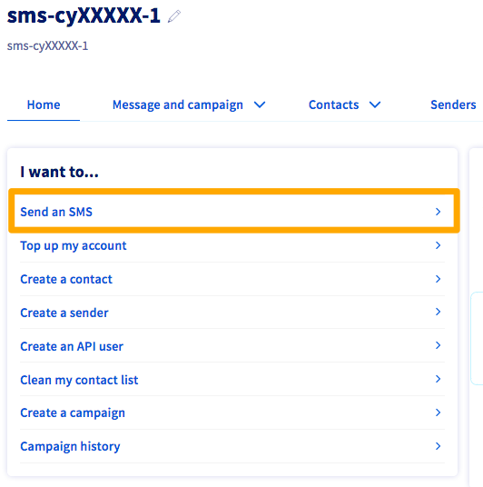
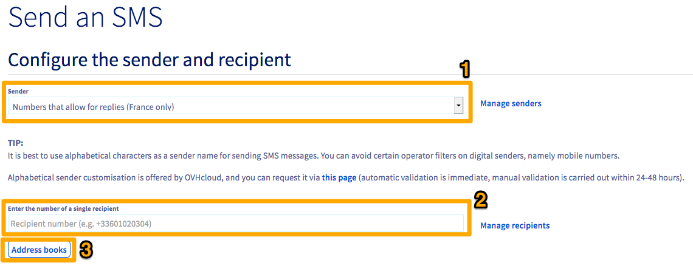
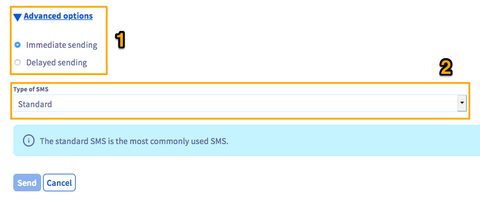
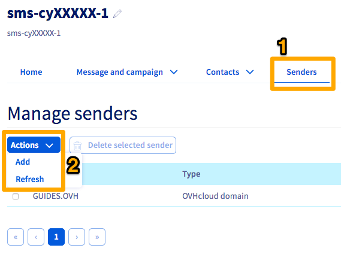
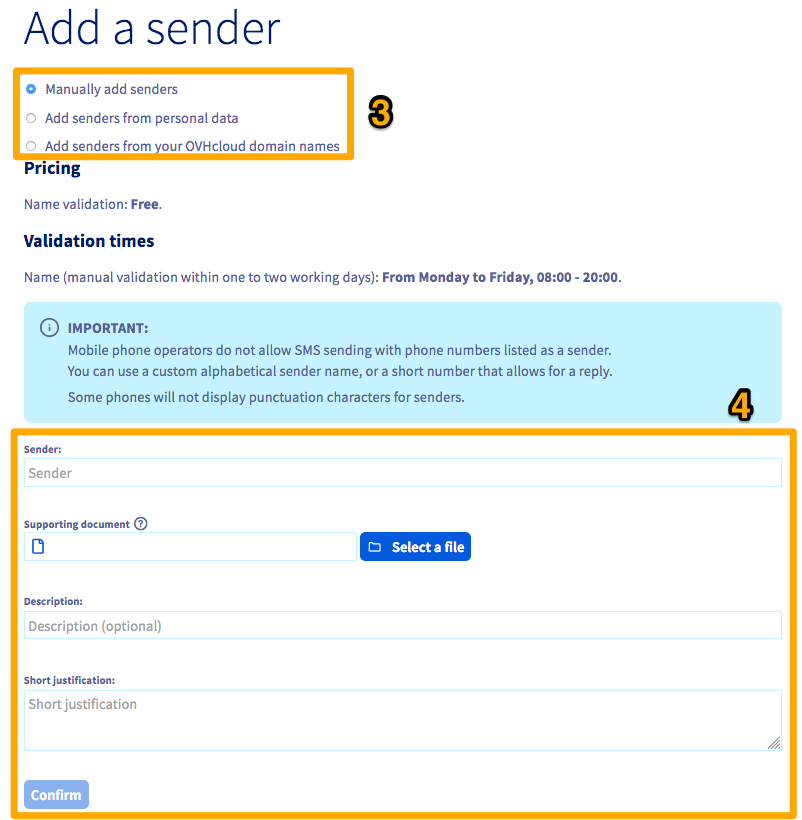

**Last updated 28th October 2020**

## Objective

You can send SMS messages directly via the OVHcloud Control Panel. This guide gives step-by-step instructions on how to send your first SMS messages.

## Requirements

- an OVHcloud SMS account with SMS credits
- access to the [OVHcloud Control Panel](https://www.ovh.com/auth/?action=gotomanager)

## Instructions

Log in to the [OVHcloud Control Panel](https://www.ovh.com/auth/?action=gotomanager), then select `Telecom`{.action}. Next, click `SMS`{.action} on the left, and your SMS account.

The “Send an SMS” field is the first item available in the list of actions.

{.thumbnail}

### Step 1: Configure the sender and recipient.

Once you have landed on the sending page for SMS messages, you will have different settings to enter, in order to adapt your SMS sending to suit your needs. 

{.thumbnail}

For the SMS sender (1), you can either select a short number that allows recipients to send back replies (available for OVHcloud accounts in France only), or you can set an alpha-numeric sender name.
Next, enter the recipient phone number (2) in international format (+353xxxxxxxxxx).
For further information on how to create a sender, please refer to [Step 3: Choose an SMS sender](./#step-3-choose-an-sms-sender_1).

You can also send SMS messages to multiple recipients. There are two methods for doing this:

- Via a list of recipients in .csv format, via the “Manage recipients” button.
For further information on this, you can refer to our [guide on SMS recipient lists](../list_of_sms_recipients/).

- By creating an address book (3). You can do this directly via the OVHcloud Control Panel, or import one as a .csv or .txt file.
Feel free to refer to our [guide on managing SMS address books](../manage-sms-address-books/) for further information.

### Step 2: Compose your SMS message.

Once you have selected a sender and entered your recipients, you can now start composing your message.

{.thumbnail}

Type your message in the box (1). You will see a counter showing the number of characters used, and the number of corresponding SMS messages (2).

The two tables below list the characters that are authorised in 7bit encoding. The characters in the “Extensions” table count as double. 

The maximum size of an SMS message is 160 characters in 7bit encoding (GSM 03.38 standard).

If you use characters that do not appear in these tables, the encoding with switch to Unicode, reducing the maximum size of an SMS message to 70 characters.

{.thumbnail}

#### Advanced options

{.thumbnail}

In this section, you can either send messages immediately, or set up delayed sending (1).

Three sending formats are also available (2).

- Standard: The most commonly-used SMS message.
- Flash: The SMS message appears directly on the phone screen.
- SIM: The SMS message is automatically saved on the phone’s SIM card.

### Step 3: Choose an SMS sender.

#### A short number enabling recipients to send replies (for OVHcloud accounts in France only)

Short numbers enable you to receive replies via the Received SMS tab.

#### Virtual mobile number (for OVHcloud accounts in France only)

If you have an SMS solution with a virtual mobile number, you can enter it as a sender. For further information, please refer to our French webpage on [virtual mobile numbers](https://www.ovhtelecom.fr/sms/reponse/numeros-virtuels.xml).

> [!primary]
>
>If you already have an SMS account, you cannot create a virtual mobile number for an existing account. You will need to order a new SMS account via the page for the virtual mobile number solution.
>

#### Alpha-numeric sender

You can customise your sender. This would mean you are no longer able to receive replies from the recipient of your SMS. To access SMS sender management, select `Senders`{.action} (1) when you are on the SMS account concerned.

{.thumbnail}

If you would like to add an additional SMS sender, click the `Actions`{.action} button in the middle, then `Add`{.action} (2).

{.thumbnail}

Once you are on the ‘Add’ page, you will see several options for configuring a new SMS sender (3).

- **Manually add senders**: You will need to enter the sender you want, their description, and a reason for using this sender (4). A supporting document is also required. 

> [!primary]
>
> As part of our security policy, we ask for a supporting document. By default, this is a company or trademark letterhead, including the authorisation of an official with signature and stamp of the same company, an identity paper, or a Kbis extract if it is not a trademark.
>

- **Add senders based on personal data**: You can request a sender based on the contact details saved on your OVHcloud account. A dropdown list of available senders will then appear.

- **Add senders based on OVHcloud domain names**: You can use a domain name available in the OVHcloud Control Panel as a sender. A dropdown list of available senders will then appear.

## Go further

Join our community of users on <https://community.ovh.com/en/>.
