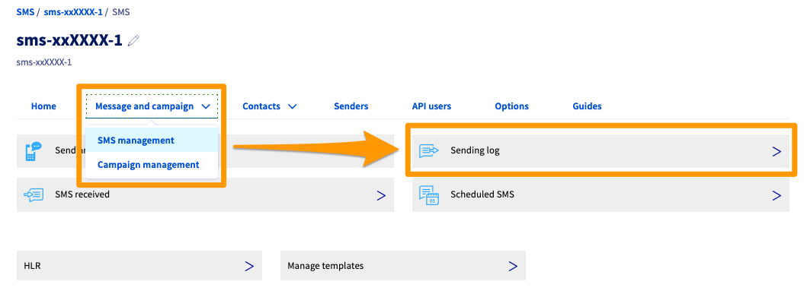

**Last updated 5th August 2022**

## Objective
You can view and download a log of your sent SMS messages from your OVHcloud Control Panel. This guide will explain how to do this.

## Requirements

- An OVHcloud SMS account with at least 1 sent SMS.
- You must be logged in to [OVHcloud Control Panel](https://www.ovh.com/auth/?action=gotomanager&from=https://www.ovh.ie/&ovhSubsidiary=ie){.external}, in the `Telecom`{.action} section, then `SMS`{.action}.

{.thumbnail}

## Instructions

The log records the date, time, sender, recipient and contents of the sent SMS.

> [!primary]
>
> The Control Panel can only display the last 6 months of your log. To view older messages, go to [Step 2: downloading the sending log as a CSV](#csv).
>

### Step 1: viewing the log in your Control Panel

Log in to the [OVHcloud Control Panel](https://www.ovh.com/auth/?action=gotomanager&from=https://www.ovh.co.uk/&ovhSubsidiary=GB), then select `Telecom`{.action}. Next, click `SMS`{.action} and select your SMS account.

In the tab bar, click `Message and campaign`{.action} then `SMS Management`{.action} to access your unit SMS history or `Campaign Management`{.action} to access your SMS campaign history.

Then click on `Sending log`{.action} or `Statistics and history`{.action}.

{.thumbnail}

You can click on the ‘Date’ column on the left to sort your log by send date.

{.thumbnail}

The Actions `...`{.action} heading at the end of each SMS allows you to view or delete the message.

{.thumbnail}

To delete several SMS messages at once, tick the boxes next to each message. The `Delete the SMS selected`{.action} button will appear above the log.

{.thumbnail}
 
The `Filter`{.action} button allows you to filter your search by sender (if you have several senders) or by recipient.

{.thumbnail}
 
### Step 2: downloading the sending log as a CSV 
 
Click on the `Actions`{.action} button above your log then on `Download`{.action} to download your SMS log in a .csv format. 
 
{.thumbnail}
 
You can then view the log using a spreadsheet program. The information will be able to be displayed such as in the example below.

{.thumbnail}

Here is a breakdown of the information included in the log:

|  Title  |  Description  |
|  :-----          |  :-----          |
|  id |  the unique id for the sent SMS used by our servers |
|  date | the date and time that the SMS was sent  |
|  sender |  the sender of the SMS message |
|  receiver |  the recipient’s phone number |
|  ptt |  the return code on the SMS status |
|  operatorCode |  the network ID of the mobile operator to which we sent the SMS |
|  descriptionDlr |  the description of the ptt code received and therefore the status of the SMS |
|  tag |  the tag attributed either manually via the APIs (to one or more SMS messages) or automatically by our servers to each sent SMS (or each SMS campaign) |
|  message |  the content of the SMS |

Further information about the ptt codes and various DLR IDs can be found in the final section of the guide [Everything you need to know about SMS users](../everything_you_need_to_know_about_sms_users/#step-5-specify-a-callback-url).
 
## Go further

Join our community of users on <https://community.ovh.com/en/>.
