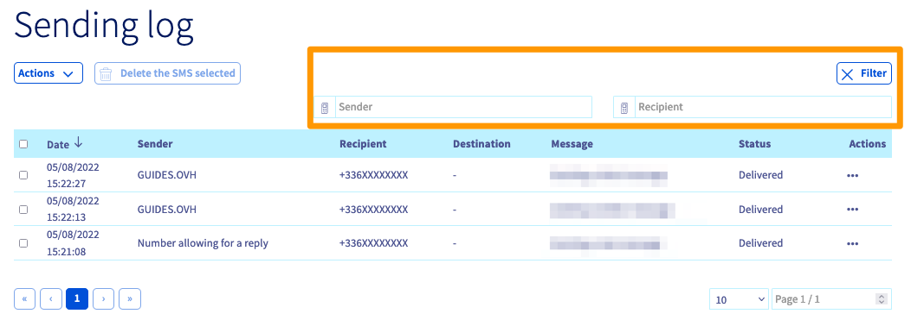

> [!primary]
> Tłumaczenie zostało wygenerowane automatycznie przez system naszego partnera SYSTRAN. W niektórych przypadkach mogą wystąpić nieprecyzyjne sformułowania, na przykład w tłumaczeniu nazw przycisków lub szczegółów technicznych. W przypadku jakichkolwiek wątpliwości zalecamy zapoznanie się z angielską/francuską wersją przewodnika. Jeśli chcesz przyczynić się do ulepszenia tłumaczenia, kliknij przycisk "Zgłóś propozycję modyfikacji" na tej stronie.
>

**Ostatnia aktualizacja z dnia 05-08-2022**

## Wprowadzenie

Historię wysłanych wiadomości SMS możesz sprawdzić i pobrać z poziomu Panelu klienta OVHcloud. Z tego przewodnika dowiesz się, jak to zrobić.

## Wymagania początkowe

- Posiadanie konta SMS OVHcloud, z którego wysłano co najmniej jedną wiadomość SMS
- Zalogowanie do[Panelu klienta OVHcloud](https://www.ovh.com/auth/?action=gotomanager&from=https://www.ovh.pl/&ovhSubsidiary=pl){.external}, część `Telefonia`{.action}, następnie `SMS`{.action}.

{.thumbnail}

## W praktyce

Historia zawiera informacje o dacie, godzinie, nadawcy, odbiorcy oraz treści wysłanej wiadomości SMS.

> [!primary]
>
> W Panelu klienta można wyświetlić historię tylko z 6 ostatnich miesięcy. Aby uzyskać dostęp do starszych wiadomości SMS, sprawdź [etap 2: pobieranie historii wiadomości SMS do pliku CSV](#csv).
>

### Etap 1: sprawdzanie historii w Panelu klienta

Zaloguj się do [Panelu klienta](https://www.ovh.com/auth/?action=gotomanager&from=https://www.ovh.pl/&ovhSubsidiary=pl) i wybierz `Telefonia`{.action}. Następnie kliknij `SMS`{.action} i wybierz Twoje konto SMS.

Na pasku kart kliknij `Wiadomość SMS i kampania`{.action}, a następnie `Zarządzanie SMS-ami`{.action}, aby uzyskać dostęp do historii Twoich pojedynczych wiadomości SMS lub `Zarządzanie kampaniami`{.action}.

Następnie kliknij `Historia wysyłki`{.action} lub `Statystyki i Historia`{.action}.

{.thumbnail}

Aby posortować historię według daty wysłania, kliknij datę po lewej stronie.

{.thumbnail}

Rubryka Działania `...`{.action} znajdująca się przy każdej wiadomości SMS umożliwia przeczytanie lub skasowanie wiadomości.

{.thumbnail}

Aby usunąć kilka wiadomości SMS jednocześnie, zaznacz pola znajdujące obok każdej z nich. Nad historią pojawi się przycisk `Usuń zaznaczone elementy`{.action}.

{.thumbnail}
 
Przycisk `Filtruj`{.action} umożliwia filtrowanie wyszukiwania według nadawcy (jeśli masz wielu nadawców) lub odbiorcy.

{.thumbnail}
 
### Etap 2: pobieranie historii wiadomości SMS do pliku CSV 
 
Kliknij przycisk `Działania`{.action} po lewej stronie, nad historią, a następnie kliknij polecenie `Pobierz`{.action}, aby pobrać historię wysłanych wiadomości SMS w formacie .csv. 
 
{.thumbnail}
 
Teraz możesz otworzyć historię w arkuszu kalkulacyjnym. Wyświetlane informacje mogą wyglądać jak na poniższym przykładzie.

{.thumbnail}

Oto szczegóły informacji zawartych w tej historii:

|  Tytuł  |  Opis  |
|  :-----          |  :-----          |
|  id |  unikalny identyfikator wysłanej wiadomości SMS na naszych serwerach |
|  date | data i godzina wysłania wiadomości SMS  |
|  sender |  nadawca, który wysłał wiadomość SMS |
|  receiver |  numer komórkowy odbiorcy wiadomości SMS |
|  ptt |  kod zwrotny dotyczący statusu wiadomości SMS |
|  operatorCode |  identyfikator sieci operatora komórkowego, do którego została przekazana wiadomość SMS |
|  descriptionDlr |  opis otrzymanego kodu ptt, czyli status wiadomości SMS |
|  tag |  znacznik przydzielony ręcznie przez API (jednej lub kilku wiadomościom SMS) lub automatycznie przez nasze serwery każdej wysłanej wiadomości SMS (lub każdej kampanii SMS) |
|  message |  treść wiadomości SMS |

Więcej szczegółów na temat kodów ptt i różnych identyfikatorów DLR znajdziesz w ostatniej sekcji przewodnika [Informacje o użytkownikach wiadomości SMS](../informacje-o-uzytkownikach-sms/#etap-5-okreslanie-adresu-url-wywolania-zwrotnego).
 
## Sprawdź również

Dołącz do społeczności naszych użytkowników na stronie <https://community.ovh.com/en/>.
