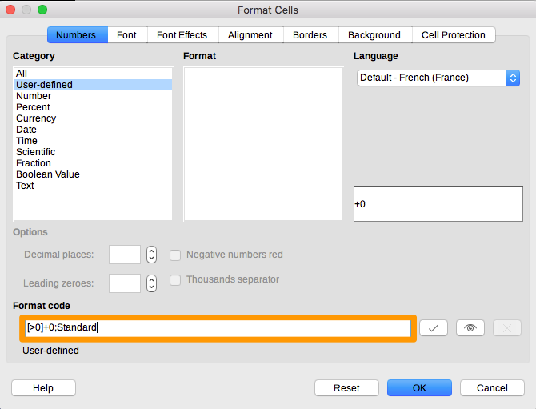
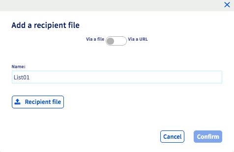

**Last updated 19th August 2021**

## Objective

To send an SMS campaign to multiple contacts, you can import one or more recipient lists into your OVHcloud Control Panel.

**Find out how to create a list of SMS recipients via a spreadsheet or text editor, and import it into the OVHcloud Control Panel.**

## Requirements

- an active OVHcloud SMS account
- a spreadsheet or text editor tool
- access to the [OVHcloud Control Panel](https://www.ovh.com/auth/?action=gotomanager&from=https://www.ovh.ie/&ovhSubsidiary=ie)

## Instructions

### Step 1: Creating your recipient list

#### Creating your list via a spreadsheet

You can create a recipient list via a spreadsheet, or use a list that already exists. This list must be in .csv format, and have the layout below in a spreadsheet:

{.thumbnail}

> [!warning]
> To ensure that the spreadsheet does not perform any automatic calculations on your numbers, you must customise the format of your `number` column.
>
> In Microsoft Excel, select your entire `number` column, right-click, and click `Format Cells`{.action}. Click `Custom`{.action} and enter the following value in the `Type` field: ```[>0]+0;Standard```.
>
> {.thumbnail}
>
> Under LibreOffice, select your entire `number` column, right-click, and click `Format Cells...`{.action}. Enter the following value in the Format `Format code`: ```[>0]+0;Standard```
>
> {.thumbnail}
>

If you open a .csv file with a notepad program, it should look similar to this:

{.thumbnail}

The following points are vital for your recipient list to be processed properly on the OVHcloud Control Panel:

- All of your contacts must be on the same sheet in your spreadsheet file, in a number column.
- Special characters, such as accents, must be deleted because they will not be accepted when you import the .csv file to the OVHcloud Control Panel.
- Phone numbers must be entered in international format (e.g. for a UK phone number: +44712345678).
- Save your spreadsheet file in .csv format (separator: semi-colon).

#### Creating your list with a text editor

An alternative method involves simply creating a .txt file via a text editor or notepad program.

- Enter `number` into the first line.
- Enter your phone numbers in international format (+44712345678), with one number per line.

You should end up with the result below:

{.thumbnail}

### Step 2: Importing your list into the OVHcloud Control Panel

Log in to the [OVHcloud Control Panel](https://www.ovh.com/auth/?action=gotomanager&from=https://www.ovh.ie/&ovhSubsidiary=ie), then select `Telecom`{.action}. Next, select `SMS`{.action} in the left-hand menu.

Select your SMS account, then click on the `Contacts`{.action} tab and `Create a contact`{.action} list.

{.thumbnail}

You can create up to 9 contact lists.

To do this, simply click `Actions`{.action}, then `Add`{.action}.

{.thumbnail}

Name your recipient list, and import your local file on to the OVHcloud Control Panel.

{.thumbnail}

### Step 3: Sending an SMS to your recipient list

Now that your list has been imported, you can follow the instructions in our guide on [Sending SMS messages via the OVHcloud Control Panel](https://docs.ovh.com/ie/en/sms/send_sms_messages_via_control_panel/) in order to send an SMS to the recipients of this list.

## Go further

[Sending SMS messages via the OVHcloud Control Panel](https://docs.ovh.com/ie/en/sms/send_sms_messages_via_control_panel/)

[Managing SMS address books](https://docs.ovh.com/ie/en/sms/manage-sms-address-books/)

Join our community of users on <https://community.ovh.com/en/>.
