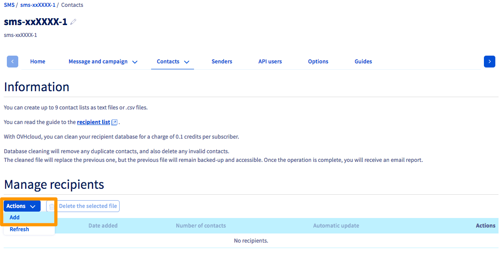

**Dernière mise à jour le 19/08/2021**

## Objectif

Afin d'envoyer une campagne de SMS à de multiples contacts, vous pouvez importer une ou plusieurs listes de destinataires dans votre espace client OVHcloud.

**Découvrez comment créer une liste de destinataires SMS, via un tableur ou un éditeur de texte, et l'importer dans votre espace client OVHcloud.**

## Prérequis

- Disposer d’un compte SMS OVHcloud
- Disposer d'un outil de type tableur ou éditeur de texte
- Être connecté à votre [espace client OVHcloud](https://www.ovh.com/auth/?action=gotomanager&from=https://www.ovh.com/fr/&ovhSubsidiary=fr)

## En pratique

### Étape 1 : créer votre votre liste de destinataires

#### Créer votre liste via un tableur

Vous pouvez créer une liste de destinataires via un tableur ou réutiliser une liste déjà existante. Celle-ci doit alors être au format .csv et doit avoir la forme ci-dessous dans un tableur :

{.thumbnail}

> [!warning]
> Afin que le tableur n’effectue aucun calcul automatique sur vos numéros, vous devez personnaliser le format de votre colonne `number`.
>
> Sous Microsoft Excel, sélectionnez votre colonne `number` entière, faites un clic-droit et cliquez sur `Format de cellule`{.action}. Cliquez sur `Personnalisée`{.action} et renseignez la valeur suivante dans le champ `Type` : ```[>0]+0;Standard```.
>
> {.thumbnail}
>
> Sous LibreOffice, sélectionnez votre colonne `number` entière, faites un clic-droit et cliquez sur `Formater les cellules`{.action}. Renseignez la valeur suivante dans le champ `Description de format` : ```[>0]+0;Standard```
>
> {.thumbnail}
>

Une fois votre fichier sauvegardé au format .csv, si vous l'ouvrez avec un bloc-notes, il devrait être similaire à ceci :

{.thumbnail}

Les points suivants sont indispensables pour que votre liste de destinataires soit prise en compte sur votre espace client OVHcloud:

- Tous vos contacts devront être sur la même feuille de votre tableur dans une colonne number.
- Les caractères spéciaux comme les accents doivent être supprimés car ils ne seront pas acceptés lors de l’import du fichier .csv sur l'espace client.
- Respectez le format international pour vos numéros (exemple pour un numéro français : +33612345678).
- Enregistrez votre fichier au format .csv (séparateur : point-virgule).

#### Créer votre liste via un éditeur de texte

Une méthode alternative consiste à créer simplement un fichier .txt depuis un éditeur de texte ou ou bloc-notes.

- Saisissez `number` en première ligne.
- Renseignez vos numéros au format international (+33612345678) avec un seul numéro par ligne.

Vous devriez obtenir le résultat ci-dessous :

{.thumbnail}

### Étape 2 : importer votre liste dans l'espace client OVHcloud

Connectez-vous à votre [espace client OVHcloud](https://www.ovh.com/auth/?action=gotomanager&from=https://www.ovh.com/fr/&ovhSubsidiary=fr) puis sélectionnez `Telecom`{.action}. Sélectionnez ensuite `SMS`{.action} dans les menus de gauche.

Sélectionnez votre compte SMS puis cliquez sur l'onglet `Contacts`{.action} et sur `Créer une liste de contacts`{.action}.

{.thumbnail}

Vous avez la possibilité de créer jusqu’à 9 listes de contacts.

Il vous suffit pour cela de cliquer sur `Actions`{.action} puis de cliquer sur `Ajouter`{.action}.

{.thumbnail}

Nommez votre liste de destinataires et importez votre fichier local dans l'espace client.

{.thumbnail}

### Étape 3 : envoyer un SMS à votre liste de destinataires

Maintenant que votre liste est importée, vous pouvez suivre les instructions de notre guide « [Envoyer des SMS depuis mon espace client](https://docs.ovh.com/fr/sms/envoyer_des_sms_depuis_mon_espace_client/) » afin d'envoyer un SMS aux destinataires de cette liste.

## Aller plus loin

[Envoyer des SMS depuis mon espace client](https://docs.ovh.com/fr/sms/envoyer_des_sms_depuis_mon_espace_client/)

[Gérer mes carnets d’adresses SMS](https://docs.ovh.com/fr/sms/gerer_mes_carnets_dadresses_sms/)

Échangez avec notre communauté d'utilisateurs sur <https://community.ovh.com>
