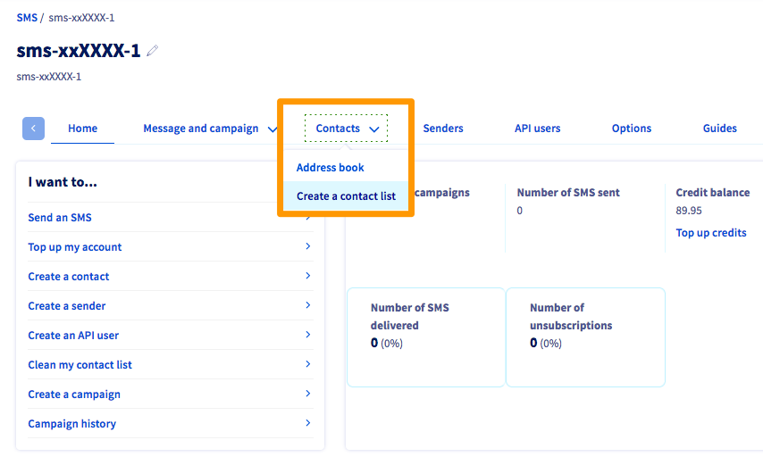

> [!primary]
> Questa traduzione è stata generata automaticamente dal nostro partner SYSTRAN. I contenuti potrebbero presentare imprecisioni, ad esempio la nomenclatura dei pulsanti o alcuni dettagli tecnici. In caso di dubbi consigliamo di fare riferimento alla versione inglese o francese della guida. Per aiutarci a migliorare questa traduzione, utilizza il pulsante "Contribuisci" di questa pagina.
>

**Ultimo aggiornamento: 05/08/2022**

## Obiettivo

Per inviare una campagna SMS a contatti multipli, è possibile importare una o più liste di destinatari nel tuo Spazio Cliente OVHcloud.

**Questa guida ti mostra come creare una lista di destinatari SMS tramite un foglio di calcolo o un editor di testo e importarla nel tuo Spazio Cliente OVHcloud.**

## Prerequisiti

- Disporre di un account SMS OVHcloud attivo
- Disporre di un programma di fogli di calcolo o un editor di testo
- Avere accesso allo [Spazio Cliente OVHcloud](https://www.ovh.com/auth/?action=gotomanager&from=https://www.ovh.it/&ovhSubsidiary=it){.external}, sezione `Télécom`{.action} > `SMS`{.action}

{.thumbnail}

## Procedura

### Step 1: crea una lista di destinatari

#### Crea la tua lista tramite un foglio di calcolo

È possibile creare una lista di destinatari tramite un foglio di calcolo oppure riutilizzare una lista già esistente. La lista deve essere in formato .csv e avere il seguente layout:

{.thumbnail}

> [!warning]
> Per evitare che il foglio di calcolo effettui un calcolo automatico sui tuoi numeri, devi personalizzare il formato della tua colonna `number`.
>
> Con Microsoft Excel, seleziona la colonna `number` intero, clicca con il tasto destro e clicca su `Formato della cella`{.action}. Clicca su `Personalizzata`{.action} e inserisci questo valore nel campo `Tipo`: ```[>0]+0;Standard```.
>
> {.thumbnail}
>
> Con LibreOffice, seleziona la colonna `number` intero, clicca con il tasto destro e clicca su `Formatare le cellule`{.action}. Inserisci questo valore nel campo `Descrizione del formato`: ```[>0]+0;Standard```
>
> {.thumbnail}
>

Se apri il file .csv con un blocco note dovrebbe apparire così:

{.thumbnail}

Per essere riconosciuta dallo Spazio Cliente OVHcloud, la lista di destinatari deve soddisfare i seguenti requisiti: 

- Tutti i contatti dovranno essere sullo stesso foglio di calcolo in una colonna `number`.
- È necessario eliminare i caratteri speciali, come gli accenti, poiché non saranno accettati durante l’importazione del file .csv nello Spazio Cliente.
- I numeri devono rispettare il formato internazionale. Ad esempio, un numero italiano avrà questo formato: +39212345678.
- Salva il file nel formato .csv (separatore: punto e virgola).

#### Crea la tua lista tramite un editor di testo

Un metodo alternativo consiste nel creare semplicemente un file .txt da un editor di testo o un blocco note.

- Digita “number” nella prima riga.
- Inserisci un numero nel formato internazionale (+39212345678) in ogni riga.

Il risultato ottenuto dovrebbe essere di questo tipo:

{.thumbnail}

### Step 2: importare la tua lista dallo Spazio Cliente OVHcloud

Accedi allo [Spazio Cliente OVHcloud](https://www.ovh.com/auth/?action=gotomanager&from=https://www.ovh.it/&ovhSubsidiary=it) e seleziona `Telecom`. Quindi seleziona `SMS`{.action}.

Seleziona il tuo account SMS e clicca sulla scheda `Contatti`{.action} e su `Crea una lista di contatti`{.action}.

{.thumbnail}

Hai la possibilità di creare fino a 9 liste di contatti tramite file di testo.

Per farlo, è necessario cliccare su `Azioni`{.action}, quindi su `Aggiungi`{.action}.

{.thumbnail}

Attribuisci un nome alla lista di destinatari e importa il file locale nello Spazio Cliente.

{.thumbnail}

### Step 3: inviare un SMS alla tua lista di destinatari

Adesso che hai importato la tua lista, segui la guida [Inviara SMS dal tuo Spazio Cliente](https://docs.ovh.com/it/sms/inviare_sms_dallo_spazio_cliente/) per inviare un SMS ai destinatari della lista.

## Per saperne di più

[Inviara SMS dal tuo Spazio Cliente](https://docs.ovh.com/it/sms/inviare_sms_dallo_spazio_cliente/)

[Gestire le rubriche indirizzi SMS](https://docs.ovh.com/it/sms/gestire_rubriche_sms/)

Contatta la nostra Community di utenti all’indirizzo <https://community.ovh.com/en/>
