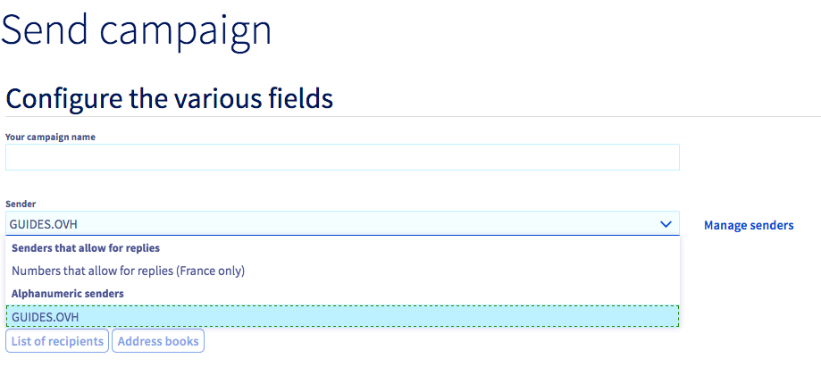
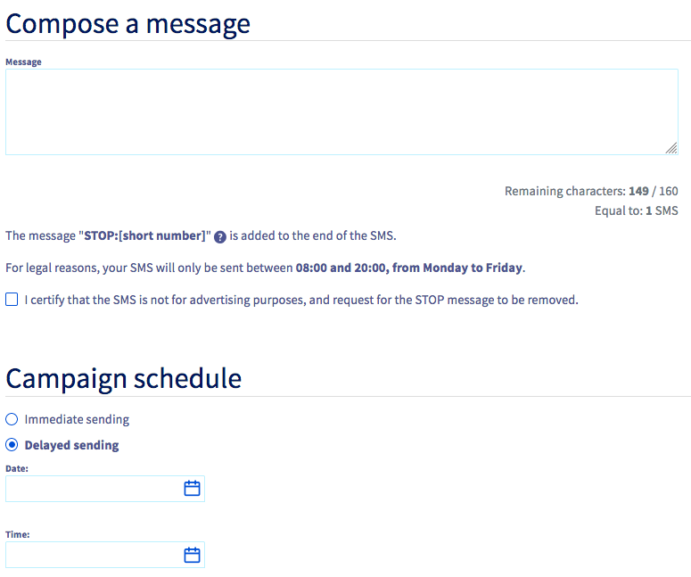

> [!primary]
> Esta traducción ha sido generada de forma automática por nuestro partner SYSTRAN. En algunos casos puede contener términos imprecisos, como en las etiquetas de los botones o los detalles técnicos. En caso de duda, le recomendamos que consulte la versión inglesa o francesa de la guía. Si quiere ayudarnos a mejorar esta traducción, por favor, utilice el botón «Contribuir» de esta página.
> 

**Última actualización: 28/10/2020**

## Objetivo

OVHcloud ofrece una serie de herramientas, disponibles en el área de cliente, que permiten enviar SMS. Esta guía explica cómo utilizar esas herramientas para crear una campaña de envío de SMS.

## Requisitos

- Disponer de una cuenta de SMS en OVHcloud con saldo de SMS.

## Procedimiento

Conéctese al [área de cliente de OVHcloud](https://www.ovh.com/auth/?action=gotomanager) y seleccione `Telecom`{.action}. Haga clic en `SMS`{.action} en la columna izquierda y seleccione su cuenta de SMS.

La barra de herramientas y los accesos rápidos le permitirán acceder a las principales funcionalidades para enviar su campaña de SMS.

{.thumbnail}

### 1. Añadir contactos

#### Añadir una lista de contactos

Puede importar una lista de contactos a través de un archivo .csv o .txt.

Para añadir una lista de contactos, abra la pestaña `Contactos`{.action} y haga clic en `Crear una lista de contactos`{.action}. 

{.thumbnail}

En [esta guía](../lista-de-destinatarios-sms/) se explica cómo hacerlo.

#### Añadir una agenda de contactos

A diferencia de las listas de contactos, las agendas de contactos contienen contactos que puede nombrar y, por tanto, identificar más fácilmente para campañas específicas.

Para añadir una agenda de contactos, abra la pestaña `Contactos`{.action} y haga clic en la `Agenda de contactos`{.action}.

{.thumbnail}

Para más información sobre las agendas de contactos, consulte [esta guía](../agenda-de-contactos-de-sms/).

### 2. Crear un remitente

Por defecto, el envío de SMS desde una cuenta de OVHcloud se realiza desde un número que permite responder (funcionalidad solo disponible en Francia). 

Sin embargo, en algunos casos puede ser más apropiado utilizar un remitente alfanumérico (que se crea desde la pestaña `Remitentes`{.action}) para que el SMS se envíe a nombre de su empresa u organización.

{.thumbnail}

Para ello, consulte el apartado de la guía «[Enviar SMS desde el área de cliente](../enviar-sms-desde-el-area-de-cliente/#3-elegir-el-remitente-del-sms)» relativo a la elección de remitentes.

### 3. El envío de una campaña de SMS

La pestaña `Mensaje y campaña`{.action} le permitirá acceder a las opciones de envío, al historial de sus SMS enviados y recibidos, así como a sus envíos de SMS planificados como parte de los envíos aplazados.

{.thumbnail}

Para enviar un SMS unitario desde el área de cliente, consulte [la guía correspondiente](../enviar-sms-desde-el-area-de-cliente/).

Para enviar una campaña de SMS, haga clic en `Gestión de campañas`{.action} y seleccione `Crear una campaña`{.action}.

{.thumbnail}

En primer lugar, indique un nombre para la campaña en el campo correspondiente.

Seleccione el remitente entre los disponibles.

{.thumbnail}

Componga su mensaje y elija entre un envío inmediato o planificado. En caso de envío planificado, deberá definir la fecha y la hora del envío.

{.thumbnail}

Haga clic en el botón `Enviar`{.action} para enviar o planificar la campaña.

## Más información

Consulte [nuestra guía relativa a la gestión del historial de SMS](../historial-de-envios/).

Interactúe con nuestra comunidad de usuarios en <https://community.ovh.com/en/>
